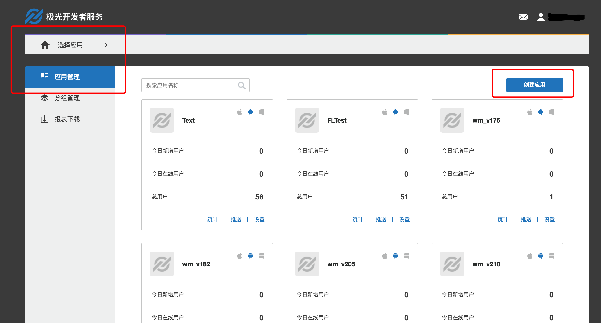

# Integration Guide of JAnalytics Android SDK

## Use Suggestions

This article is an integration guide document of the JAnalytics Android SDK.

The matching SDK version is v1.0.0 and later.

+ If you want to test quickly, please refer to this article to run the Demo in minutes.
+ All documents, including all guides, APIs, and tutorials, are available on the JPush website. In addition, updated versions of this document will be posted to the website in a timely manner.


## Product Manual

Event templates are used to count App users' activity events and report them to Jiguang servers. Jiguang provides processed data to developers through Web Portal, allowing developers to better understand the use of their applications in users' hands.

### Main Scenes

    1. Statistics page flow
    2. Statistics custom count events
    3. Statistics custom calculation event

### Content of Janalytics-android-release-1.x.y.zip Integrated Package 

+ AndroidManifest.xml
    + Configuration file of client embedded SDK
+ libs/jcore-android_v1.x.x.jar
    + sdk core package
+ libs/xxx/xx.so
    + so file needed by sdk
+ libs/janalytics-android-sdk_v1.x.x.jar
    + SDK analysis development package
+ example
    + It is a complete Android project that demonstrates the basic usage of the JAnalysis SDK and can be used as a reference.

### Android SDK Version

Currently the SDK only supports Android 2.3 or above mobile phone systems.

## Create an Application

### Create Jiguang Developer Account

Please visit [the JPush official](https://www.jiguang.cn/push)  website to register your Jiguang account.


### Create an Application on Portal

Log in and enter the Jiguang console, click on the "Create Application" button to enter the interface to create applications. Fill in the name of your application and the name of the application package. Then click the "Create My Application" button at the bottom to create an application.





### View Application Information

After creating the application, return to the user home page to see the application list. Click the application you just created to view the application information.


## JCenter Automatic Integration

***Description***: Developers using jcenter auto-integration do not need to add jars to the project. jcenter will automatically complete the dependencies; jcenter will also automatically import JAnalytics required permissions and meta-data nodes into your project's AndroidManifest.

+ Verify that jcenter support is configured in the main gradle of the android studio's Project root directory. (Default configuration of the added project will support)
```
buildscript {
    repositories {
        jcenter()
    }
    ......
}

allprojects {
    repositories {
        jcenter()
    }
}
```

+ Add dependency and substitution variables of AndroidManifest in gradle of module

```
android {
    ......
    defaultConfig {
        applicationId "com.xxx.xxx" // 你应用的包名.
        ......

        manifestPlaceholders = [
            JPUSH_APPKEY : "你的appkey", //JPush上注册的包名对应的appkey.
            JPUSH_CHANNEL : "developer-default", //暂时填写默认值即可.
        ]
        ......
    }
    ......
}

dependencies {
    ......

    compile 'cn.jiguang.sdk:janalytics:1.1.1' // 此处以JAnalytics 1.1.1 版本为例。
    compile 'cn.jiguang.sdk:jcore:1.1.2' // 此处以JCore 1.1.2 版本为例。
    ......
}
```

## Local Engineering Configuration

+ Unzip the package and copy all the files under libs to the project's libs.
    + jcore and janalytics, two jar files.
    + so file of all CPU platforms.
+ Configure AndroidManifest
    + Configure permissions: Add the necessary permissions for the SDK to run normally

```
 <!-- Required  一些系统要求的权限，如访问网络等-->
<uses-permission android:name="android.permission.INTERNET" />
<uses-permission android:name="android.permission.WAKE_LOCK" />
<uses-permission android:name="android.permission.READ_PHONE_STATE" />
<uses-permission android:name="android.permission.WRITE_EXTERNAL_STORAGE" />
<uses-permission android:name="android.permission.READ_EXTERNAL_STORAGE" />
<uses-permission android:name="android.permission.ACCESS_NETWORK_STATE" />
<uses-permission android:name="android.permission.ACCESS_WIFI_STATE" />

<!-- Optional for location -->
<uses-permission android:name="android.permission.VIBRATE" />
<uses-permission android:name="android.permission.MOUNT_UNMOUNT_FILESYSTEMS" />
<uses-permission android:name="android.permission.WRITE_SETTINGS" />
<uses-permission android:name="android.permission.RECEIVE_USER_PRESENT" />
<uses-permission android:name="android.permission.SYSTEM_ALERT_WINDOW" />
<uses-permission android:name="android.permission.ACCESS_COARSE_LOCATION" />
<uses-permission android:name="android.permission.CHANGE_WIFI_STATE" />
<uses-permission android:name="android.permission.ACCESS_FINE_LOCATION" />
<uses-permission android:name="android.permission.ACCESS_LOCATION_EXTRA_COMMANDS" />
<uses-permission android:name="android.permission.CHANGE_NETWORK_STATE" />
<uses-permission android:name="android.permission.GET_TASKS" />
```

    + Configure appkey: Get the AppKey from the application information on the portal and fill in your Channel.

```
<meta-data android:name="JPUSH_APPKEY" android:value="Your AppKey"/>
<meta-data android:name="JPUSH_CHANNEL" android:value="Your Channel"/>
```

+ Obfuscation related: Add the following configuration to the obfuscated file to prevent the sdk's interface from being confused.

```
 -keep public class cn.jiguang.analytics.android.api.** {
     *;
 }
```

## Add Code

### Basic API

+ Initialize sdk: Initialize sdk by context passed in the application

        JAnalyticsInterface.init(Context context);

+ Set the debug mode: The parameter is true means that turn on debug mode, then you can see the log of sdk.

        JAnalyticsInterface.setDebugMode(boolean isDebugMode);

### More APIs

For the usage of other APIs, please refer to the interface document: [Android SDK API](http://docs-test.jiguang.cn/janalytics/client/android_api/)

### Run the demo

The example provided with the package is an API demo example. You can import it into your project, fill in your AppKey into the example's AndroidManifest and run it directly to test it.


## Technical Support

Email Contact: [support&#64;jpush.cn](mailto:support&#64;jpush.cn)
