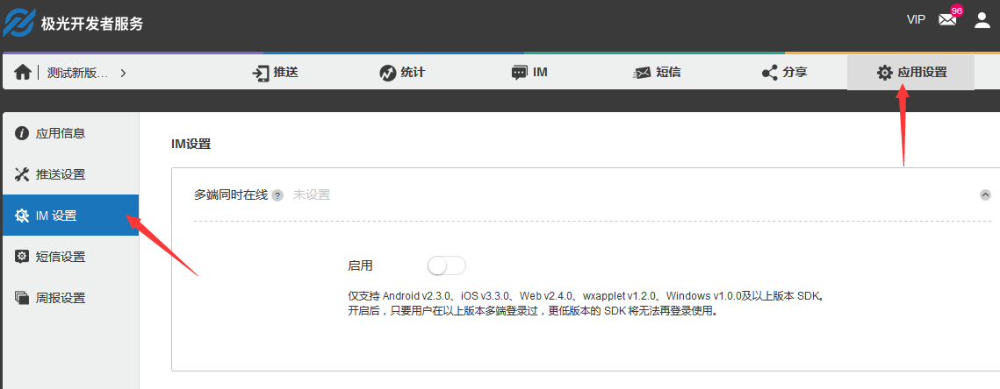

# Frequently Asked Questions

## What is the time and number of offline message saves?

Free version: Save 100 offline messages per session and save for 15 days.
Paid version: Save 300 offline messages per session and save for 30 days.

## What is the limit on the frequency of API use?

Free version: The maximum call frequency for each Appkey is 600 beats/minute.
Paid version: It can enjoy a higher call frequency, and the maximum call frequency is 200,000 times/minute.

## Is there a limit to the number of users per appkey?

There is no limit to the total number of users

## What is the maximum number of group members and groups?

The default is 500 members per group. There is no upper limit for the total number of groups per appkey. A single user can join up to 500 groups. For special needs, we currently support a maximum of 2,000 people per group.

## How long can the history message be saved? How to get it?

Jiguang Server can save your history for nearly 60 days. The SDK will save a message history locally and save it permanently. It also provides an interface for deleting and querying, which you can manage yourself.

You can use the free IM REST Report to pull historical messages saved on the server. If you need to save the chat history in real time on the APP's own server, you can contact the customer service to activate the real-time message routing function.

## How to enable simultaneous multi-end online function? What are the specific rules?

The simultaneous multi-end online function can be enabled on the [Jiguang console]((https://www.jiguang.cn/accounts/login/form)): Select "IM settings" in "Application settings" and click the Enable button to open it. It should be noted that this function does not support shutdown after it is turned on.

Function description: Support to kick each other among mobile (Android, iOS), PC, Web (JS, WeChat applet), simultaneous multi-end online, and platforms within the same end.

Release note: Only supports Android v2.3.0, iOS v3.3.0, Web v2.4.0, wxapplet v1.2.0, Windows v1.0.0 and above SDK. After it is turned on, as long as the user logs on multiple ends in the above version, all lower versions of the SDK will no longer be able to log in.

For example: If user A logged in to both the Android and Web by the above SDK, then he will fail to log in to the Android, iOS, WeChat applet, or Web side with an lower version of SDK.

## Can I have cross-application chat?

As long as the applications are created under the same developer account, they can chat with each other to meet the developer's need for applications to communicate with each other under different appKeys.

## Can I integrate JMessage after integrating JPush?

Based on JPush technology, JMessage shares JPush's long network connection and is compatible with all JPush functions. It can also integrate JPush SDK and JMessage SDK.

## Is there a relevant statistical report?

Yes, the developer console provides new users, active users, new groups, active groups, and statistical charts such as message delivery statistics and message type statistics.

## What platforms are currently supported?

Android, iOS, web

## Can I send expressions?

The JMessage SDK supports emoji expression sending.

## Can the Demo UI be modified?

It can be modified. JMessage provides functions of SDK and interface layer and the interface can be freely implemented. Demo UI is only for reference and supports modification and redesign.