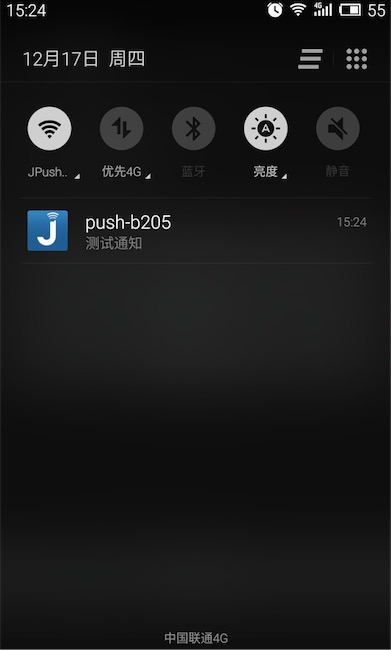
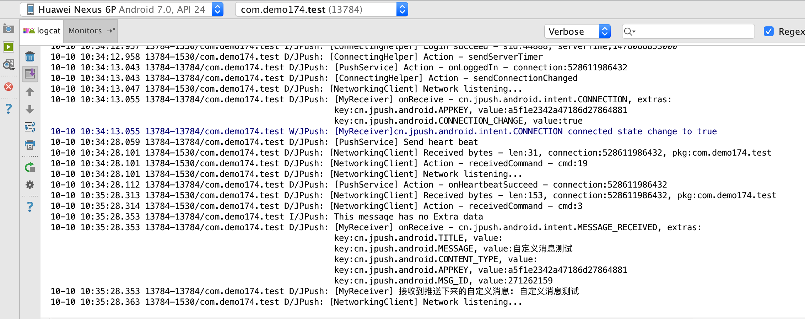

# 3 minutes JPush Android Demo

The purpose of this article is to guide developers who are new to JPush to run JPush in just a few minutes:

+ Install Demo Client to Mobile Phone

+ Push Notifications on Portal

+ Client receives push and shows in status bar pi

### Create JPush Developer Account

To create an JPush developer account, visit [the JPush official website https://www.jiguang.cn/push](https://www.jiguang.cn/push)

### Application on Portal

Login with a registered account, enter the Jiguang console, and click the "Create Application" button. After creating an account to enter JPush, the first screen to display is to create an application. Fill in the name of your application and the Android package name.

### Download Application Example

Click "Download Application Example"

You will download a .zip archive. After decompression, you will see a directory of the same name. This directory is all the files in an Android project.

### Import Example into Android Studio

In Android Studio, create a new project. Import JPush Example with import module.

### Run Example

Import the module and run it in Android studio to the specified device.

If your Android phone is connected to your computer, this JPush Example application can be installed and run.
Before doing the next step, make sure the network on your phone is available.

### Push Notification on Portal

### Receive notifications on your phone
On the mobile phone where JPush Example was installed in the above steps, you will be notified of the push.

### Push messages on Portal

Specific details please see [the Use of the Console](../../console/Instructions)

### View Custom Messages Received in LogCat
Custom messages can be viewed in the LogCat log. Developers can perform presentation processing according to their needs without the intervention of JPush.

