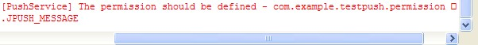

# Android SDK FAQ


## Why can't the app receive a Push message (Android)?

+ Confirm that the appKey (generated on the Portal) is correctly written in Androidmanifest.xml
+ Confirm that the test handset (or emulator) has successfully connected to the network
+ Confirm that there is a client "Login succeed" log

## Log: Java.lang.UnsatisfiedLinkError


    
<br />

This error is due to the incorrect loading of the libjpush.so file. Check if libjpush.so is in the correct location (libs–>armeabi–>libjpush.so)

The JPush SDK to Android Studio needs to add the .SO file to the APK lib folder. You can edit the build.gradle script and customize the *.so directory. See Demo:


    
<br />

## Log: The permission should be defined



This error is due to not correctly defined permision, please add permissions:

```
<permission android:name="您应用的包名.permission.JPUSH_MESSAGE" android:protectionLevel="signature" />
<uses-permission android:name="您应用的包名.permission.JPUSH_MESSAGE" />
```
    
<br />

## How to obfuscate and ignore jpush-sdk-release.jar in code？

+ Please download 4.x and later versions of [proguard.jar](http://sourceforge.net/projects/proguard/files/proguard/) and replace your Android Sdk "tools\proguard\lib\proguard.jar"
+ Using Eclipse or Android Studio as Development tools. Please configure proguard-android.txt in project's project.properties and configure it in proguard-android.txt:


        -dontoptimize
        -dontpreverify
        
        -dontwarn cn.jpush.**
        -keep class cn.jpush.** { *; }


+ Please use SDK1.3.X and later versions
+ v2.0.5 and above have introduced protobuf and added more configuration to eliminate confusion based on the above

        #==================gson==========================
        -dontwarn com.google.**
        -keep class com.google.gson.** {*;}
        
        #==================protobuf======================
        -dontwarn com.google.**
        -keep class com.google.protobuf.** {*;}
    
<br />

## Why are some clients not receiving pushes when the push was successful?

Please check the phone that does not receive the notification:

+ Please check the log in logcat to determine whether the client's jpush integration is successful and whether the network has a problem
+ Look at the logs or use the interface isPushStopped to check if stoppush is called
+ Check whether the "allowed push time" is set in the JPush advanced settings of the phone.
+ Check whether the "Show notification" is chosen in mobile app
    
<br />

## The third-Party system does not receive pushed messages

Since third-party ROM management software requires the user to manually operate

+ Xiaomi [MIUI]
    + Self-initiated management: need to add the application to the [Self-initiated Management] list, otherwise the process cannot be started after killing the process or rebooting
    + Notification bar settings: The application defaults to display notification bar notifications. If the application is closed, notifications will not be prompted
    + Network assistant: You can manually disable installed third-party programs from accessing 2G/3G and WIFI networks and set up a new installation program to allow access to 2G/3G and WIFI networks.
    + MIUI 7 hidden mode: Allows the application to customize the configuration mode. The application remains available in the backend, otherwise the application will fail to receive messages when the application enters the backend. 【Settings】 Power and performance under the [Hidden Mode]
+ Huawei [Emotion]
    + Self-initiated management: The application needs to be added to the [Self-initiated Management] list. Otherwise, the process will not be started after killing the process or restarting the system. You can only open the application manually.
    + Back-end application protection: Manually add the application to this list, otherwise the device will automatically kill the application process after going to sleep. Then you can only manually start the application to resume operation.
    + Notification management: There are three kinds of application status: prompt, allow, and prohibit. Prohibiting apps will have no notification in the notification bar
+ Meizu [Flyme]
    + Self-initiated management: need to add the application to the [Self-initiated Management] list, otherwise the process cannot be started after killing the process or rebooting
    + Notification bar push: When you close the app notification, you will receive a message without any display
    + Power-saving management: The power-saving mode is set in the security center, and when the application standby is allowed in the [Standby Power Consumption Management], permission is allowed. Otherwise, messages cannot be received normally after the mobile phone sleeps or the application is idle for some time.
+ VIVO [Funtouch OS]
    + One-click cleaning of memory: you need to add the application to the list of [Whitelist], otherwise the "one-click acceleration" of the system will kill the process.
    + Self-initiated management: The application needs to be added to the [Self-initiated management] list in “i housekeeper”, otherwise the process will not start automatically after restarting the mobile phone. However, if the process is forced to kill the process manually, even if this list is added, subsequent processes cannot start automatically.
+ OPPO【ColorOS】
    + Frozen application management: The application needs to be added to the pure backend, otherwise the message cannot be received in time in the lock screen state
    + Self-initiated management: When the application is added to the [Self-initiated Management] list, it also needs to lock the application process in settings-applications-running. Otherwise, the process will not be started after killing the process or rebooting and you can only open the application manually.
+ Samsung
    + One-click optimization of memory: you need to add the application to the [Whitelist] list. Otherwise, the system memory will kill the application process after optimization.
    
<br />

## Android 5.0 System Error: INSTALL_FAILED_DUPLICATE_PERMISSION

It relates to the 5.0 multi-account system: one account installs an application, and other accounts also automatically install the application; if one of the accounts uninstalls the application, the other accounts are unaffected (other accounts still have this application). So if you uninstall the application under an account and install a package with the same package name but inconsistent signature, the installation will fail.

Solution: Uninstall the application that installed on each account and then reinstall it to resolve the issue.
    
<br />

## AsyncTask has no way to execute to onPostExecute() method

This is a problem with the old Android system. The solution is as follows:

Add below in the onCreate method of application:

```
try {
            Class.forName("android.os.AsyncTask");
        } catch (ClassNotFoundException e) {
            e.printStackTrace();
        }
```

For details, please see the link: [https://code.google.com/p/android/issues/detail?id=20915](https://code.google.com/p/android/issues/detail?id=20915)
    
<br />

## Do Tag, Alias, Registrationid need to be reset every time you initialize? Will it change?

+ Tag, alias can be set with reference to [the Alias and Tag API](./android_api/#api_1). Each setting is an override setting, not an incremental setting. Once Tag and Alias ​​are set successfully, they will not change unless cancelled or overwritten. The corresponding relationship between the tag, alias, and client is stored on the JPush server. Currently, there is no interface for querying the correspondence from the JPush server. Therefore, the client needs to store the corresponding relationship in the APP application server.

+ Registrationid is assigned by the JPush server when the client SDK first successfully connects to the JPush server. You can get the Registrationid for pushing by getting [the RegistrationID API](./android_api/#registrationid-api) . Registrationid corresponds to a client of an application.

## How to test without Sandbox API?

Use the JPush API test directly.
    
<br />

## Can other countries use JPush (Can LAN use JPush)?

As long as you can connect to the JPush server. How to determine whether it is able to connect to the Jpush server: ping通 api.jpush.cn 8800
    
<br />

## Why there is no devices or calling API to return 1011 after sending a Push prompt?


There are two possible situations for this:

+ The SDK does not integrate successfully. The client has a "Login succeed" log to indicates that the SDK has been successfully integrated.
+ Failed to set the alias or label. Please call the function [Method - setAliasAndTags (with Callback)](android_api) with the return value to set the label or alias, and refer to [the Error Code Definition](android_api) to modify until the setting succeeds.
    
<br />

## You can open www.jiguang.cn, but cannot open docs, suggesting that you cannot find docs.jiguang.cn

+ Prompt customers to try another browser
+ If it still doesn't work, execute the following command to check the results to troubleshoot the problem
    + ping docs.jiguang.cn
    + nslookup docs.jiguang.cn
    + telnet docs.jiguang.cn
    + Check whether your own machine cuold access other websites on the external network

<br />

## How does appkey correspond?

The package name of android and appkey need to correspond.

<br />

## How to use the JPush in the intranet?

The use of JPush on the intranet requires the server to open the following port restrictions for JPush login, registration and maintaining of push long links:

+ 19000
+ 3000-3020
+ 7000-7020
+ 8000-8020

<br />