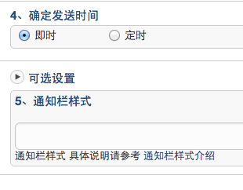

# Android SDK Advanced Tutorial

## Using Tutorials of Aliases and Labels

### Why do I need aliases and labels?

When pushing a message, you must specify the object to be pushed: All, an individual, or a group of people.

It's all very well done. Just use "mass" for an application. Both the Portal and the API support sending messages to the specified appKey.

Assigning to a specific person, or a specific group of people, is relatively complicated. Because for JPush, a person is a registration ID and this registration ID has nothing to do with the developer App, or there is no meaning to the developer App.

If you want to push a message to a specific user that is meaningful to the developer app, you need to: bind the JPush registered user to the developer App user.

There are two basic ideas for this binding:：

+ Save the binding relationship to the JPush server
+ Save the binding relationship to the developer application server

For the former, what we have to say here: the function of aliases and labels. This mechanism is easy to use and works for most developers.

The latter is another set of RegistrationID mechanisms provided by JPush. For developers, this set of mechanism needs an application server to maintain the binding relationship and it does not apply to ordinary developers. Android SDK 1.6.0 version begins to support the mechanism.

### How to use

Working methods of alias ​​and tag mechanism are：

+ The client developer app calls the setAlias ​​or setTags API to set the relationship
+ JPush SDK saves the relationship settings to JPush Server
+ When pushing messages on the server side, specify to push to aliases or labels previously set

For the Alias ​​and Tags interfaces supported by the SDK, please refer to the corresponding document: [Aliases and Tags API](android_api/#api_1)

There are several points to make special notes in the use process:：

+ The legacy tag and alias setting interfaces provided in version 1.5.0 are no longer maintained. It is recommended that developers use the new tag and alias interfaces provided by version 3.0.7.
    + If 6002 (timeout) or 6014 (busy service) is returned in the result of the callback, it is recommended to retry. For the definition of the specific error code, please refer to the definition of the error code..
+ When pushing on the Portal or pushing an API call to an alias or tag, an error may be reported: There is no push target user. The error indicates that there is no user binding relationship for the alias or tag you pushed on JPush Server, so there is no push target. The developer need to check if the developer app has correctly called the alias and tags APIs, and if the network is not good at the time of the call, thereby the JPush SDK failed to save successfully.

### Use an alias

Used to push messages to a specific user. Aliases can be considered approximately as nicknames in user accounts.

### Use labels

Used to push messages to a group of people.

The tag is similar to tagging an article in a blog, that is, classifying a resource.

#### Dynamic tag

The APIs provided by JPush for setting labels are on the client's side. How do developers do dynamic grouping on their own server side? For example, an enterprise OA system often needs to change departmental personnel groups. The following is a rough idea：

+ Design a custom message format (business protocol). After the app parses, you can call the JPush SDK setAliasAndTags API to reset the label (grouping)
    + Example: {"action":"resetTags", "newTags":["dep_level_1":"Company A", "dep_level_2":"Technology Department", "dep_level_3":"Android Development Team", "address":" Shenzhen", "lang":"zh"]}
+ To dynamically set the group, push this custom message to the specified user
    + Use the alias mechanism to push to the specified user.
+ The client app calls the JPush SDK API to set a new label

##Exception Handling of Aliases and Tag Settings

Due to the unstable network connection, there is a certain probability that the JPush SDK will fail to set aliases and tags. If App developers properly handle the setup failures, the impact of occasional failures to normal use of the application is limited.

The following uses the Android SDK as an example. For more details, see example.

The basic idea：

+ When the setting is successful, write the status to the SharePreference and do not need to set later
+ If encounters a 6002 timeout, please retry a little later.

```
// 这是来自 JPush Example 的设置别名的 Activity 里的代码,更详细的示例请参考JPush Example。一般 App 的设置的调用入口，在任何方便的地方调用都可以。
private void handleAction(int sequence,TagAliasBean tagAliasBean) {
    if(tagAliasBean == null){
        Log.w(TAG,"tagAliasBean was null");
        return;
    }
    if(tagAliasBean.isAliasAction){
        switch (tagAliasBean.action){
            case ACTION_GET:
                JPushInterface.getAlias(getApplicationContext(),sequence);
                break;
            case ACTION_DELETE:
                JPushInterface.deleteAlias(getApplicationContext(),sequence);
                break;
            case ACTION_SET:
                JPushInterface.setAlias(getApplicationContext(),sequence,tagAliasBean.alias);
                break;
            default:
                Log.w(TAG,"unsupport alias action type");
                return;
        }
    }else {
    //tag operation
    }
}
```

## Tutorial of Custom Notification Bar Style 

### About custom notification bar styles

When the JPush notification is pushed to the client, the default settings of the mobile phone are used to display the notification bar, including ringtones, vibrations, and the like.

If the developer wants to achieve the following results, he need to use the "Customize Notification Bar Style" function:

+ The notification bar style uses different settings than the default, for example you want to control:
    + Ringing, shaking
    + Icon
    + Replace the default notification bar style

### Push message specifies the notification bar style number

The notification bar style is only represented by a number (number) when it is pushed down on the server side.

<div style="font-size:13px;background: #E0EFFE;border: 1px solid #ACBFD7;border-radius: 3px;padding: 8px 16px; padding-bottom: 0;margin-bottom: 0;">
<p> The style number of the push notification should be set on the client side with a custom notification bar style.
<br>
<p>If the style number on the notification does not exist in the client side, please use the default style of the notification bar.
</div>

<br>
When you do not use a custom notification bar style, this number defaults to 0. To use a custom notification bar style, the number should be greater than 0 and less than 1000.

When sending a notification on the portal, the bottom "optional" section expands and the developer can specify the style number of the notification that is currently being pushed. As shown below:



### Client setting notification bar style

The custom notification bar style is set on the client. Please refer to the Notification Bar Style Customization API to see the supported features.

#### Design of custom notification bar style 

+ There is a PushNotificationBuilder concept. Developers use the setPushNotificationBuilder method to specify a number for some type of PushNotificationBuilder.
+ setPushNotificationBuilder can be called anywhere after JPushInterface.init() . It can be triggered to call by the logic of developer apps, or it can be called at initialization time.
+ Only need to set once, JPush SDK will remember this setting. The next time a push notification is received, the PushNotificationBuilder is found and executed based on the number specified in the notification.

#### API - setDefaultPushNotificationBuilder sets Default

This API changes the default notification bar style with the number 0.

#### API - setPushNotificationBuilder Specify Number

This API is a developer-assigned number and sets up a custom PushNotificationBuilder.

#### Example - Basic PushNotificationBuilder

Customize notification styles such as sound, vibration, and flash.

```
BasicPushNotificationBuilder builder = new BasicPushNotificationBuilder(MainActivity.this);
builder.statusBarDrawable = R.drawable.jpush_notification_icon;
builder.notificationFlags = Notification.FLAG_AUTO_CANCEL
        | Notification.FLAG_SHOW_LIGHTS;  //设置为自动消失和呼吸灯闪烁
builder.notificationDefaults = Notification.DEFAULT_SOUND
        | Notification.DEFAULT_VIBRATE
        | Notification.DEFAULT_LIGHTS;  // 设置为铃声、震动、呼吸灯闪烁都要
JPushInterface.setPushNotificationBuilder(1, builder);
```

Customize notification styles with buttons (3.0.0 and later versions of sdk only support this style, and this style does not display properly on some models that differ from the Android native system).

```
MultiActionsNotificationBuilder builder = new MultiActionsNotificationBuilder(PushSetActivity.this);
//添加按钮，参数(按钮图片、按钮文字、扩展数据)
builder.addJPushAction(R.drawable.jpush_ic_richpush_actionbar_back, "first", "my_extra1");
builder.addJPushAction(R.drawable.jpush_ic_richpush_actionbar_back, "second", "my_extra2");
builder.addJPushAction(R.drawable.jpush_ic_richpush_actionbar_back, "third", "my_extra3");
JPushInterface.setPushNotificationBuilder(2, builder);
```

#### Example - Advanced Custom PushNotificationBuilder

Based on the underlying PushNotificationBuilder, the Layout of the Notification can be further customized.

<div style="font-size:13px;background: #E0EFFE;border: 1px solid #ACBFD7;border-radius: 3px;padding: 8px 16px; padding-bottom: 0;margin-bottom: 0;">
<p>Customer_notitfication_layout as an example here can be found under /res/layout/ of our example project. You can use your own layout.</p>
</div>
<br>

```
    CustomPushNotificationBuilder builder = new
    CustomPushNotificationBuilder(MainActivity.this,
                              R.layout.customer_notitfication_layout,
                              R.id.icon,
                              R.id.title,
                              R.id.text); 
                             // 指定定制的 Notification Layout
    builder.statusBarDrawable = R.drawable.your_notification_icon;     
    // 指定最顶层状态栏小图标
    builder.layoutIconDrawable = R.drawable.your_2_notification_icon;  
    // 指定下拉状态栏时显示的通知图标
    JPushInterface.setPushNotificationBuilder(2, builder);
```
#### Notification bar style definition does not meet the requirements?

The functionality of the custom notification bar style provided above is limited. For example: Android SDK 4.0 and later [Notification](http://developer.android.com/reference/android/app/Notification.html) supports the specified Style, and there is no JPush SDK could support this complex notification style definition.

Or you want to customize the complex notification style, but are reluctant to use the advanced customization features of custom notification bar described above.

It is recommended not to use the notification function provided by JPush but to use the custom message function.

That is, after the custom message is pushed to the client, the App retrieves the entire content of the custom message, and then the App itself writes a code to display the notification. Please refer to the document: Notifications vs. Custom Messages.

<a name="vs"></a>
Notification vs Custom Messages


JPush includes two types of push notifications and custom messages. This article describes their differences and suggested application scenarios.

### The difference between the two - functional perspective

#### Notice

Notification refers to a notification message that will appear on the notification bar (status bar) of the mobile phone. This is the basic function of Android/iOS.

The notification is mainly used to prompt the user. A notice can be a plain text simply filled in.

Application plus notifications help increase the activity of the application.

#### Custom message

The custom message is not a notification. By default, the SDK will not be displayed on the notification bar. JPush is only responsible for the transparent transmission to the SDK. Its content and presentation form are completely defined by the developers themselves.

Custom messages are mainly used for the application's internal business logic and special display requirements.

### The difference between the two - developer use perspective

#### Notice

In simple scenarios, the user can write no code, and the SDK is responsible for the default display of the effect and the main interface for opening the application when the default user clicks.

The JPush Android SDK provides APIs for developers to customize the effect of notification bar. Please refer to: Customize Notification Bar Style Tutorials. It also provides Receiver to allow you to customize the behaviors when receiving a notification and when the user clicks notification. 

#### Custom message

The SDK will not display custom messages to the notification bar. So when debugging, you need to go to the log to see the custom message pushed by the server.

[The received message](android_api/#receiver)  of custom message must be processed by the Receiver written by developers.

<div style="font-size:13px;background: #E0EFFE;border: 1px solid #ACBFD7;border-radius: 3px;padding: 8px 16px; padding-bottom: 0;margin-bottom: 0;">
<p>Note：
	<p>When the custom message content msg_content is empty, the SDK does not broadcast the message, so that the app cannot receive the pushed message. Thereby, it is recommended to add content when using custom message push.
</div>

### Use notice

Please refer to the following sample code.
```
public class MyReceiver extends BroadcastReceiver {
    private static final String TAG = "MyReceiver";
     
    private NotificationManager nm;
     
    @Override
    public void onReceive(Context context, Intent intent) {
        if (null == nm) {
            nm = (NotificationManager) context.getSystemService(Context.NOTIFICATION_SERVICE);
        }
         
        Bundle bundle = intent.getExtras();
        Logger.d(TAG, "onReceive - " + intent.getAction() + ", extras: " + AndroidUtil.printBundle(bundle));
         
        if (JPushInterface.ACTION_REGISTRATION_ID.equals(intent.getAction())) {
            Logger.d(TAG, "JPush用户注册成功");
             
        } else if (JPushInterface.ACTION_MESSAGE_RECEIVED.equals(intent.getAction())) {
            Logger.d(TAG, "接受到推送下来的自定义消息");
                     
        } else if (JPushInterface.ACTION_NOTIFICATION_RECEIVED.equals(intent.getAction())) {
            Logger.d(TAG, "接受到推送下来的通知");
     
            receivingNotification(context,bundle);
 
        } else if (JPushInterface.ACTION_NOTIFICATION_OPENED.equals(intent.getAction())) {
            Logger.d(TAG, "用户点击打开了通知");
        
           openNotification(context,bundle);
 
        } else {
            Logger.d(TAG, "Unhandled intent - " + intent.getAction());
        }
    }
 
   private void receivingNotification(Context context, Bundle bundle){
        String title = bundle.getString(JPushInterface.EXTRA_NOTIFICATION_TITLE);
        Logger.d(TAG, " title : " + title);
        String message = bundle.getString(JPushInterface.EXTRA_ALERT);
        Logger.d(TAG, "message : " + message);
        String extras = bundle.getString(JPushInterface.EXTRA_EXTRA);
        Logger.d(TAG, "extras : " + extras);
    }
 
   private void openNotification(Context context, Bundle bundle){
        String extras = bundle.getString(JPushInterface.EXTRA_EXTRA);
        String myValue = "";
        try {
            JSONObject extrasJson = new JSONObject(extras);
            myValue = extrasJson.optString("myKey");
        } catch (Exception e) {
            Logger.w(TAG, "Unexpected: extras is not a valid json", e);
            return;
        }
        if (TYPE_THIS.equals(myValue)) {
            Intent mIntent = new Intent(context, ThisActivity.class);
            mIntent.putExtras(bundle);
            mIntent.setFlags(Intent.FLAG_ACTIVITY_NEW_TASK);
            context.startActivity(mIntent);
        } else if (TYPE_ANOTHER.equals(myValue)){
            Intent mIntent = new Intent(context, AnotherActivity.class);
            mIntent.putExtras(bundle);
            mIntent.setFlags(Intent.FLAG_ACTIVITY_NEW_TASK);
            context.startActivity(mIntent);
        }
    }
}
```

### Use custom messages

To use custom messages, you must write code in the client app to receive the broadcast of the JPush SDK, to obtain the pushed message content. For details, please refer to the document: Receiver.

The following code is from chat. 

```
public class TalkReceiver extends BroadcastReceiver {
    private static final String TAG = "TalkReceiver";
     
    private NotificationManager nm;
     
    @Override
    public void onReceive(Context context, Intent intent) {
        if (null == nm) {
            nm = (NotificationManager) context.getSystemService(Context.NOTIFICATION_SERVICE);
        }
         
        Bundle bundle = intent.getExtras();
        Logger.d(TAG, "onReceive - " + intent.getAction() + ", extras: " + AndroidUtil.printBundle(bundle));
         
        if (JPushInterface.ACTION_REGISTRATION_ID.equals(intent.getAction())) {
            Logger.d(TAG, "JPush用户注册成功");
             
        } else if (JPushInterface.ACTION_MESSAGE_RECEIVED.equals(intent.getAction())) {
            Logger.d(TAG, "接受到推送下来的自定义消息");
             
            // Push Talk messages are push down by custom message format
            processCustomMessage(context, bundle);
         
        } else if (JPushInterface.ACTION_NOTIFICATION_RECEIVED.equals(intent.getAction())) {
            Logger.d(TAG, "接受到推送下来的通知");
     
            receivingNotification(context,bundle);
 
        } else if (JPushInterface.ACTION_NOTIFICATION_OPENED.equals(intent.getAction())) {
            Logger.d(TAG, "用户点击打开了通知");
        
           openNotification(context,bundle);
 
        } else {
            Logger.d(TAG, "Unhandled intent - " + intent.getAction());
        }
    }
     
    private void processCustomMessage(Context context, Bundle bundle) {
        String title = bundle.getString(JPushInterface.EXTRA_TITLE);
        String message = bundle.getString(JPushInterface.EXTRA_MESSAGE);
        if (StringUtils.isEmpty(title)) {
            Logger.w(TAG, "Unexpected: empty title (friend). Give up");
            return;
        }
         
        boolean needIncreaseUnread = true;
         
        if (title.equalsIgnoreCase(Config.myName)) {
            Logger.d(TAG, "Message from myself. Give up");
            needIncreaseUnread = false;
            if (!Config.IS_TEST_MODE) {
                return;
            }
        }
         
        String channel = null;
        String extras = bundle.getString(JPushInterface.EXTRA_EXTRA);
        try {
            JSONObject extrasJson = new JSONObject(extras);
            channel = extrasJson.optString(Constants.KEY_CHANNEL);
        } catch (Exception e) {
            Logger.w(TAG, "Unexpected: extras is not a valid json", e);
        }
         
        // Send message to UI (Webview) only when UI is up
        if (!Config.isBackground) {
            Intent msgIntent = new Intent(MainActivity.MESSAGE_RECEIVED_ACTION);
            msgIntent.putExtra(Constants.KEY_MESSAGE, message);
            msgIntent.putExtra(Constants.KEY_TITLE, title);
            if (null != channel) {
                msgIntent.putExtra(Constants.KEY_CHANNEL, channel);
            }
             
            JSONObject all = new JSONObject();
            try {
                all.put(Constants.KEY_TITLE, title);
                all.put(Constants.KEY_MESSAGE, message);
                all.put(Constants.KEY_EXTRAS, new JSONObject(extras));
            } catch (JSONException e) {
            }
            msgIntent.putExtra("all", all.toString());
             
            context.sendBroadcast(msgIntent);
        }
         
        String chatting = title;
        if (!StringUtils.isEmpty(channel)) {
            chatting = channel;
        }
         
        String currentChatting = MyPreferenceManager.getString(Constants.PREF_CURRENT_CHATTING, null);
        if (chatting.equalsIgnoreCase(currentChatting)) {
            Logger.d(TAG, "Is now chatting with - " + chatting + ". Dont show notificaiton.");
            needIncreaseUnread = false;
            if (!Config.IS_TEST_MODE) {
                return;
            }
        }
         
        if (needIncreaseUnread) {
            unreadMessage(title, channel);
        }
         
        NotificationHelper.showMessageNotification(context, nm, title, message, channel);
    }
     
    // When received message, increase unread number for Recent Chat
    private void unreadMessage(final String friend, final String channel) {
        new Thread() {
            public void run() {
                String chattingFriend = null;
                if (StringUtils.isEmpty(channel)) {
                    chattingFriend = friend;
                }
                 
                Map<String, String> params = new HashMap<String, String>();
                params.put("udid", Config.udid);
                params.put("friend", chattingFriend);
                params.put("channel_name", channel);
                 
                try {
                    HttpHelper.post(Constants.PATH_UNREAD, params);
                } catch (Exception e) {
                    Logger.e(TAG, "Call pushtalk api to report unread error", e);
                }
            }
        }.start();
    }
}
```

+ 19000
+ 3000-3020
+ 7000-7020
+ 8000-8020

<br />