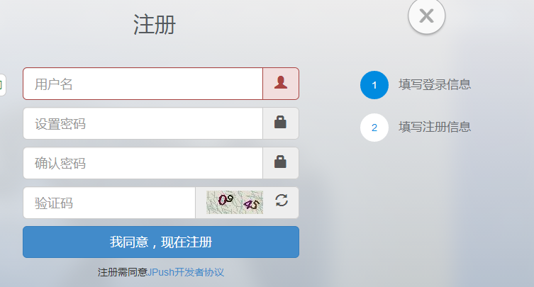
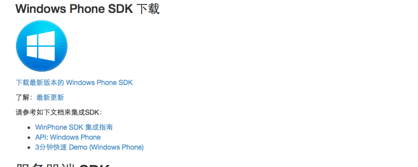
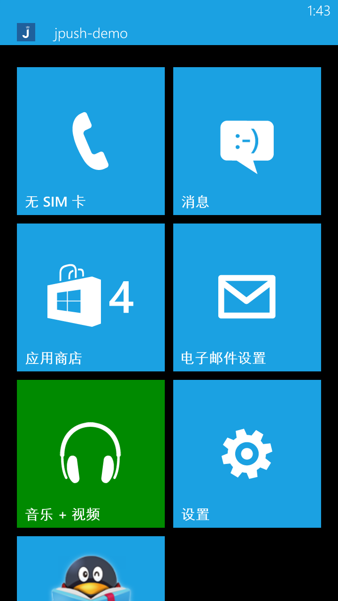

# 3 Minutes Fast Demo of Windows Phone

The purpose of this paper is to guide developers who are new to JPush to run JPush in a few minutes.
- Install Demo client to mobile phone
- Push notifications on Portal

### Create JPush Developer Account
To create an JPush developer account, please visit the JPush official website [(http://www.jiguang.cn)](http://www.jiguang.cn)
First, fill in the login information, click "I agree, and register now"

Then fill in the registration information and click "Finish Registration"

### Create an Application on the Portal
After creating an account and entering JPush, the first screen displayed is the interface of application creation. Fill in the name of your application, pull the scroll bar to the bottom and select the radio button of the windows phone

### Download Application Example
First of all, download [windows phone sdk](../../resources)

Click "Download the latest version of Windows Phone SDK" and you will download a .zip archive. After decompression, you will see a directory of the same name. The "example" folder of this directory is all files in a Windows phone project。

### Modify Example (Windows Phone Project) app_key and channel
Open the example project

Shown as below after opening

Open the App.xaml.cs file. In the Application_Launching function, modify the "app_key" of the JPushSDK.JServer.Setup function to the app_key of the application created in the Portal, and modify "channel" to the desired channel.

### Run Example
After importing the Windows phone project, you can press F5 immediately to run the Windows phone application.

If your Windows phone is connected to your computer, this JPush Example application can be installed and run.
Make sure the network on your phone is available before doing the next step.

###Push Notification on Portal

Select the required platform (Windows phone) when sending the message

On the mobile phone where JPush Example was installed in the above steps, you can receive the notification of the push.

