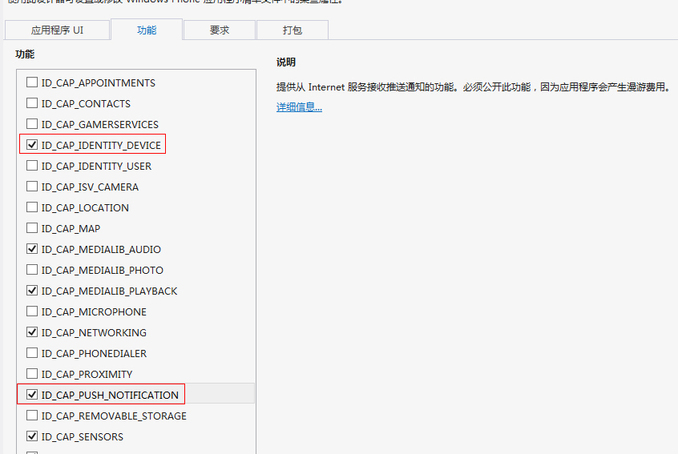

# Integration Guide of Windows Phone SDK 
## Use Tips
This article matches the SDK version: after r1.0.0.

## Description of Product Function 
JPush is an end-to-end push service that enables the server's messages to be pushed to the end-user's mobile phone in a timely manner, allowing developers to actively maintain connection with users, thereby increasing user activity and improving application retention. JPush client supports Android, iOS and Windows Phone.

The Windows Phone SDK makes it convenient for developers to quickly add push functions for the Windows Phone SDK based on JPush and reduce the workload and development complexity required for integrating WPNs.

### Main Function
- Report ChannelUri for JPush Server, eliminating the need for developers to manage ChannelUri

### Main Feature
- Easy to integrate
- After the Windows Phone SDK is integrated, it is easier for the server to push messages to the Windows Phone.

### Content of Integrated Archive
- JPushSDK-v1.0.0.dll: The supported version of Windows Phone is 8.0 and above
- pdf file: Integration Guide of WinPhone SDK 
- example folder: development example

## SDK Integration Steps
### Create an App on JPush Portal

- Create an application on [JPush's Management Portal](https://www.jiguang.cn)
- AppKey is automatically generated to identify the application after successful creation

### Import API Development Kit to Application Project
Unzip the SDK package， right-click Reference in the vs2012 project directory, select Browse in the lower-right corner of the pop-up menu, and select JPushSDK-v1.0.0.dll of the SDK directory in the Explorer folder.

### Configure WMAppManifest.xml
In the project directory, click on the right triangle block of Properties and double-click WMAppManifest.xml on the displayed content
Select the two items in the red rectangle below

### Add Code
#### Call Interface
The file App.xaml.cs monitors system events and calls the API provided by the JPush SDK to implement the function.
The following three events are required to monitor and invoke the JPush SDK API. Please copy the line marked "Required" directly into the corresponding listener method in your application proxy class.
Please note: due to the needs of the Microsoft store shelves, please popup a prompt for the user to confirm whether to push before calling the RegisterNotification function for the first time. For details, please refer to the sample code in the example
	private void Application_Launching(object sender, LaunchingEventArgs e)
	{
		//Required
		//setup第一个参数替换成您在JPush Portal中的app_key
		//setup第二个参数替换成您定义的渠道名称
		//setup第二个参数是一个获取RegisrtationID的委托，不需要时可以填null
		JPushSDK.JServer.Setup("your app_key", "your channel",null);
		JPushSDK.JServer.RegisterNotification();
	}
	private void Application_Activated(object sender, ActivatedEventArgs e)
	{
		//Required
		JPushSDK.JServer.Activated();

	}
	private void Application_Deactivated(object sender, DeactivatedEventArgs e)
	{
		//Required
		JPushSDK.JServer.Deactivated();
	}

#### Add Statistics Code

Toast notifys to click hint

Add the code to the page you want to launch. If you did not add this option in the push notification, you need to add it to the MainPage page.

    protected override void OnNavigatedTo(NavigationEventArgs e)
    {
        JPushSDK.JServer.HandleToastNotification(NavigationContext.QueryString);
        base.OnNavigatedFrom(e);
    }

#### Add Statistics Page

    protected override void OnNavigatedTo(NavigationEventArgs e)
    {
        JPushSDK.JServer.TrackPageInto("your page name");
        base.OnNavigatedFrom(e);
    }
    protected override void OnNavigatedFrom(NavigationEventArgs e)
    {
        JPushSDK.JServer.TrackPageOut("your page name");
        base.OnNavigatedTo(e);
    }

#### Print Log
Check if the message was sent to the JPush server and the reason for the error in the integration process
Please note: Make sure to turn off the JPush SDK debug mode before publishing to the store
    
    JPushSDK.JServer.IsDebug = true;

Advanced Features
Please refer to: [winphone API](winphone_api)

## Technical Support
Email Contact: [support&#64;jpush.cn](mailto:support&#64;jpush.cn)