# iOS Certificate Setup Guide

## Create an Application ID

-   Login to the [Apple Developer Website](https://developer.apple.com/) to enter the developer account.

-   Go to the "Certificates, IDs & Profiles" page from the left entry on the Developer Account page

-   Create an App ID, and fill in the NAME and Bundle ID of the App ID (you can skip this step if the ID already exists).

~~~
    Note: Here you need to specify a specific Bundle ID to not use wildcards
~~~

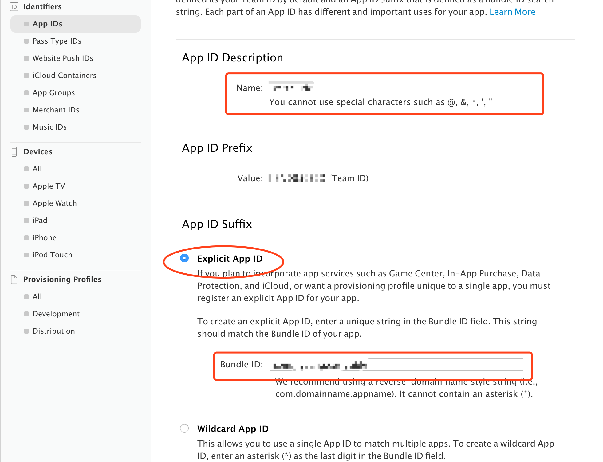

-   Turn on the Push Notification feature for the App. If you have already created an App ID, you can also turn on the Push Notification feature

## Configuration of Two Authentication Modes

### Method One: Authentication via .p12 Certificate

- If you have not previously created a Push certificate or want to create a new one, create a new one under the list of certificates。

-   Creating a new certificate requires careful selection of the APNs certificate type. As shown in Figure APNs, there are two types: Development and Production.

~~~
    Note: The development certificate is used for development and debugging; the production certificate can be used for development and debugging as well as for product release. Here we choose the production certificate as an example.
~~~

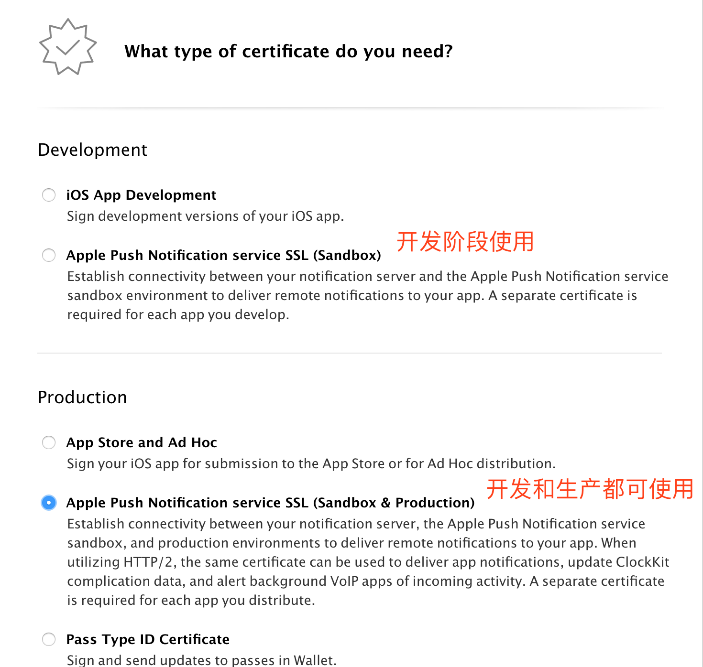

-   Click "Continue", then select the AppID that this certificate is ready to bind

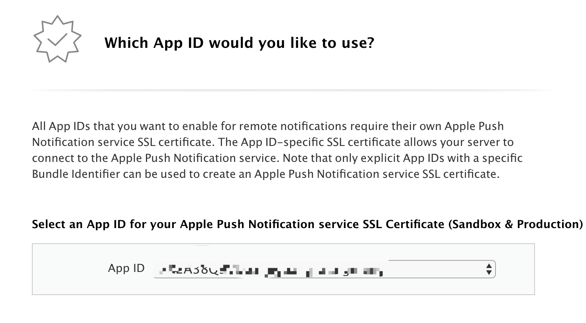

-   Click "Continue" to enter the CSR interface

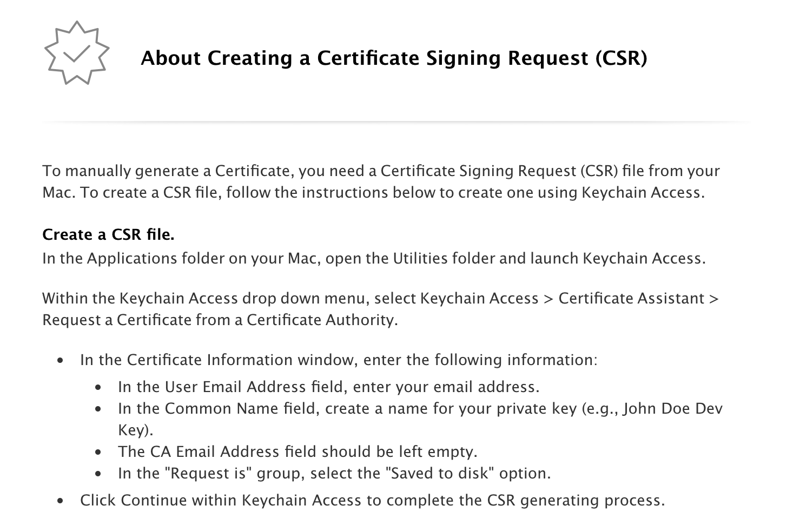

-   Click “Continue” again to upload the CSR file. (CSR file will be created in the next step)

-   Open the system's own KeychainAccess to create a Certificate Signing Request. The following operation：

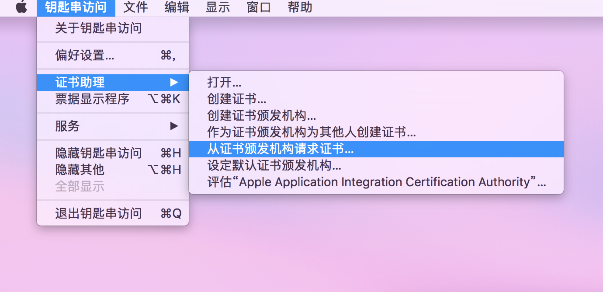

-   Fill in the "User Mailbox" and "Common Name", and select "Save to Disk". The suffix of certificate file is .certSigningRequest

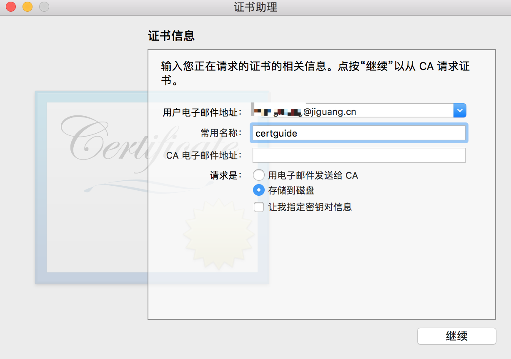

-   Go back to your browser's CSR upload page and upload the file you just created with the suffix as .certSigningRequest.

-   After the certificate is successfully generated, click the “Download” button to download the certificate, which is a file with the suffix .cer.。

-   After double-clicking a certificate, it opens in "KeychainAccess". Then select "Login" in the "Keychain" list on the left, and "My Certificate" in the "Category" list, find the certificate you just downloaded, and exports it as .p12 file . As shown below：

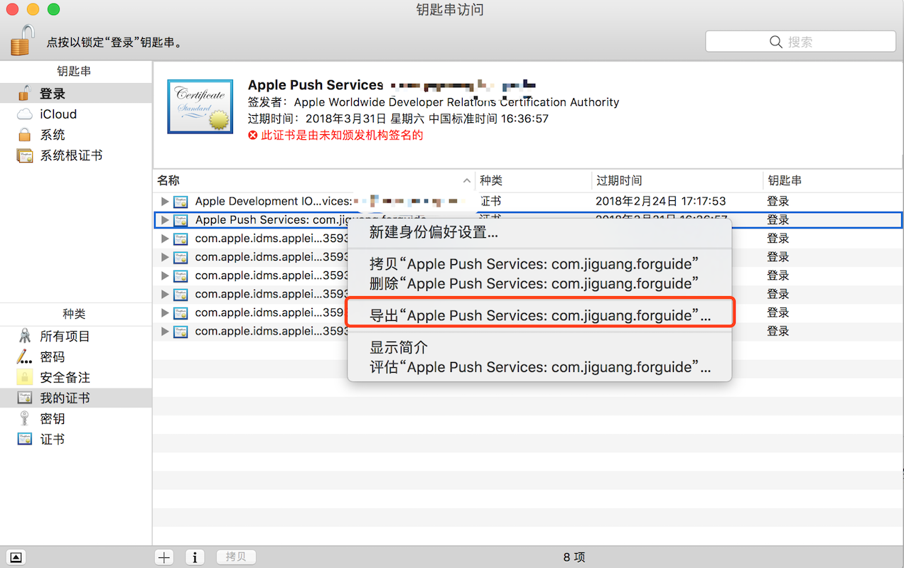

-   On the Jiguang console, go to your app's app settings and select "Certificate" for the iOS authentication method, and then upload the .p12 certificate you just exported. Jiguang will authenticate your application in the back-end.

### Method 2: Authenticate through APNs Auth Key

-   Click “All” in the “Keys” to see if there is auth key in the account. If there is no, then click “+” to create a new key.

<!-- -->

-   Fill in the description of the key and select the service, as shown below. (Note: Can be used in both development and production environments and will not expire.)

-   Click “Continue” to confirm the information and click “confirm” to download the key. (Note: Make a note of the key id and it can only be downloaded once. Please save it properly.)

-   Get the Bundle ID of your previously created app

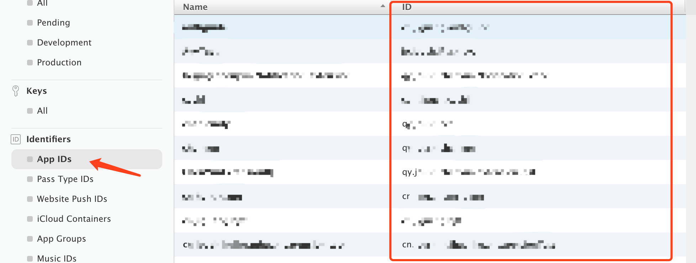

-   Team ID Get the Team ID in the "Membership" page of the developer account

-   On the Jiguang console, go to your application's application settings and select “Token Authentication” for the iOS authentication method, upload the auth key file, and fill in your KEY ID, TeamID, and the BundleID of the specified application. Jiguang will authenticate your application in the back-end.

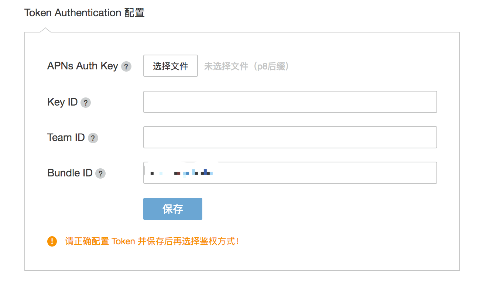

## Creation of Provisioning Profile

-   Before creating the Provisioning Profile, the App ID of the Bundle ID used by the application to be published is created on the Apple Developer website, and an iOS Development certificate is created for this App ID.
-   Click the button below to create a Provisioning Profile on the [Provisioning Profile page of the Apple developer account](https://developer.apple.com/account/ios/profile/).

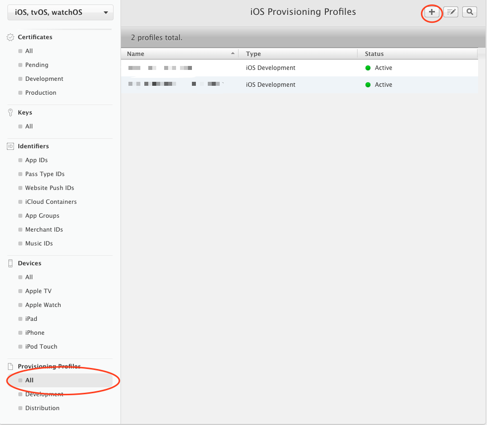

-   After selecting the environment of Provisioning Profile, click [Continue]:：

-   Click [Continue] after selecting the App ID which is used to create the Provisioning Profile:

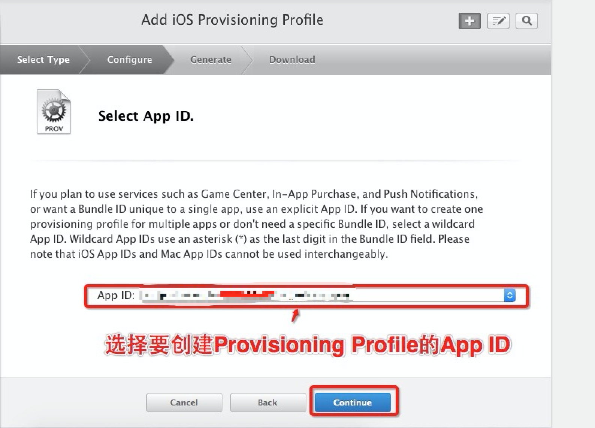

-   Choose your own developer certificate. (created multiple developer certificates here, it is recommended to create only one for easy management) For convenience, select [Select All], then click [Continue] to enter the next step：

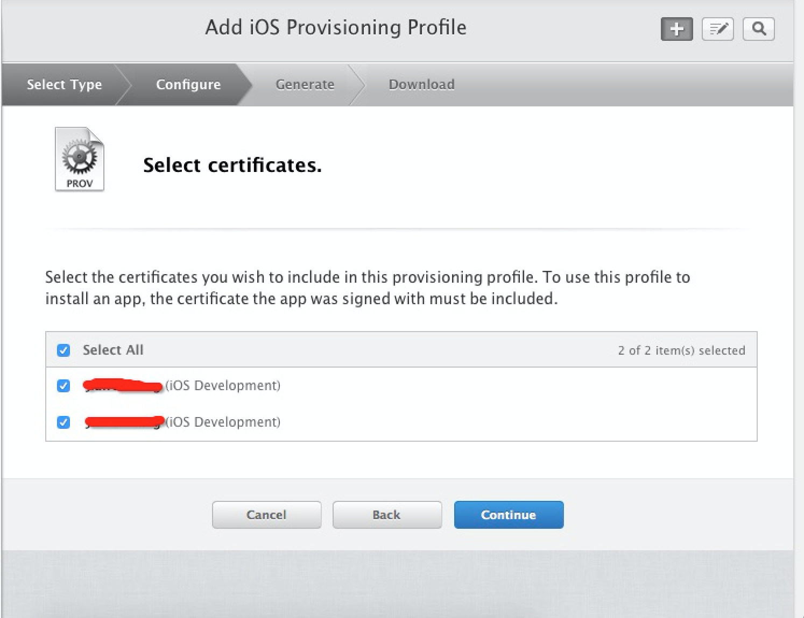

-   Select the device to be installed for the Provisioning Profile (select [Select All]) and click [Continue]:

-   Fill in the Profile Name for the Provisioning Profile and click [generate] to create it

-   Fill in the Profile Name and click [generate] to create it. Then click [DownLoad] to download the Provisioning Profile.

-   Double-click on the Provisioning Profile downloaded and add it to xcode.

## XCode Certificate Configuration Tutorial

Refer to the [iOS SDK Integration Guide](https://docs.jiguang.cn/jpush/client/iOS/ios_guide_new/) to integrate the JPush SDK and upload the p12 certificate used for the push. You need to configure the certificate before compiling and running. The steps are as follows:

-   Open the Bundle identifier of xxx-info.plist and fill in the bundle id uploaded to the JPush console:

<!-- -->

-   Click on the item, select the target TARGETS, enter the Build Setting interface, search for “Code signing”, and configure it as shown below