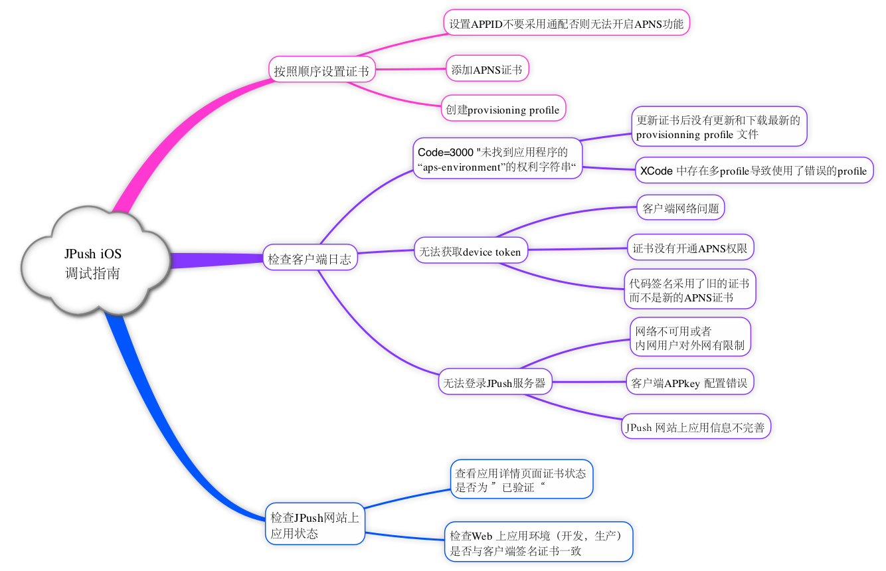

# iOS SDK Debugging Guide

## iOS Debug Mind Map

## Confirm Certificate

Please confirm the availability of the certificate on the "Application Details Page"：

## Development Environment Test

Before testing the JPush iOS development environment, make sure that 3 are unified:：

-   App is a package of development environment (development certificate Development)

-   Upload the development certificate and verify it

## Release Environmental Test

Before testing the JPush iOS production environment, make sure that 3 are unified：

-   App is an ad-hoc package or App Store version (issued certificate Production)

-   Upload the certificate and verify it

## Other Issues that may Exist

The message received is not stable enough

JPush iOS is a supplement to the push of the original official APNs, and it is encapsulated to help developers use APNs more easily.

Because the APNs themselves do not promise to guarantee the arrival of messages, the connectivity between the client network and the server side has a great influence on whether the APNs could receive the message in a timely manner.
