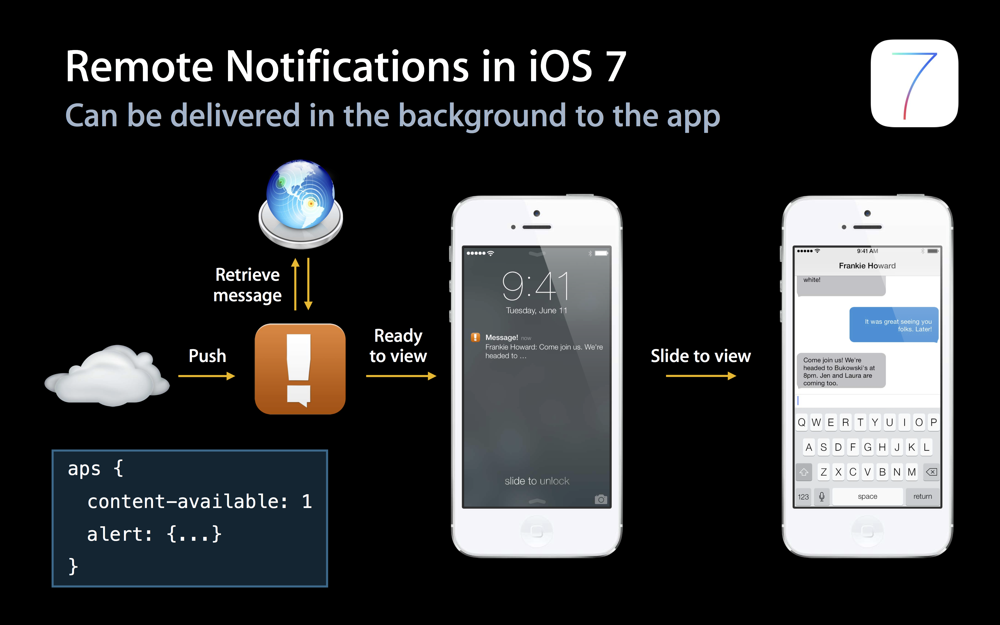
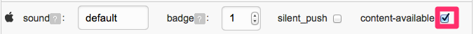

# iOS 10 New Features

## iOS 10 New Features

### Instructions

iOS 10 has added a number of new features for notifications. See the Jiguang official blog for details.

Please jump to: [iOS 10 New Features](http://blog.jiguang.cn/newfeture_notification_ios10/)

## iOS 10 Service Extension

### Instructions

iOS 10 adds Service Extension

The official explanation chart is as follows

This means that before the APNs arrive at our device, they will also be processed through an extension service that allows users to set up their own, adding diversity to APNs.

### Instructions


Service Extension is very easy to use. First of all, we need to create a Service Extension service, as shown below

Then there are a few points here need to be pay attention to

-   The Service Extension's Bundle Identifier cannot be the same as the Bundle Identifier of the Main Target (that is, your own App Target), otherwise BundeID duplicate errors will be reported.

-   The Service Extension Bundle Identifier needs to be in the namespace of the Main Target. For example, if the BundleID of the Main Target is io.jpush.xxx, then the BundleID of the Service Extension should be similar to the format of io.jpush.xxx.yyy. If you do not do this, you may encounter an error.

Now that your Service Extension service has been created successfully, you have successfully used the Service Extension. But it seems that we haven't done anything about it yet. Look at your project, and you’ve got a class that contains two methods.

+ didReceiveNotificationRequest:(UNNotificationRequest \*)request withContentHandler:(void (^)(UNNotificationContent *contentToDeliver))contentHandler
+ serviceExtensionTimeWillExpire

Let's take a look at the official explanation of the first method: Call contentHandler with the modified notification content to deliver. If the handler is not called before the service's time expires then the unmodified notification will be delivered. To explain briefly, APNs will call this method when it arrives. At this point, you can process the contents of the push, and then use the contentHandler to complete this process. However, if the time is too long, APNs will be displayed as they are. In other words, we can process our notifications in this method and personalize it to users. The second method is the remedy to the first method. The second method will callback before it expires, at which point you can urgently process your APNs.

## iOS 9 Integration

### Changes of iOS 9 affect the SDK section:

-   Added bitCode encoding format. When the SDK does not support bitCode, the bitCode option cannot be enabled when the user is integrated

    -   Phenomenon: After the user integrates the SDK, it cannot compile. The error log contains bitCode related error information

-   By default, the https connection is used. If the request is http, the plist needs to be manually configured to support the http service. Currently, all our server requests go through HTTP services

    -   Phenomenon: After the user integrates the SDK, all JPush-related http services will prompt connection errors or connection timeouts, which may be the problem

### bitCode Solution

-   JPush SDK for iOS SDK v1.8.7 and above has added support for iOS9's new feature bitCode. The JMessage iOS SDK v2.0.0 and above supports bitCode

### Https Solution

JPush 2.1.9 and above do not need to configure this step

-   Require users to actively add an NSAppTransportSecurity type Dictionary to the Info.plist of the current project.

-   Add NSAllowsArbitraryLoads type Boolean under NSAppTransportSecurity with value set to YES

## iOS 9 UIUserNotificationActionBehaviorTextInput

### Support Version

From V1.8.0 version

1.  The biggest change in the iOS 9 push is to modify the type of the push Category. Based on the original push categories, a text Action type is added. The purpose of this parameter is to register the item inputted by shortcut text.

2.  This category consists of a series of UIUserNotificationCategory. Each UIUserNotificationCategory object allows adding a set of UIMutableUserNotificationAction-type parameters to add items on the notification bar. iOS9 now adds the Text input type (UIUserNotificationActionBehaviorTextInput) to the original UIMutableUserNotificationAction type, and is set by behavior (properties only owned by iOS9).

3.  The callback method: iOS9 uses two new callback methods to handle click button events:

```
- (void)application:(UIApplication *)application handleActionWithIdentifier:(nullableNSString *)identifier forLocalNotification:(UILocalNotification *)notification withResponseInfo:(NSDictionary *)responseInfo completionHandler:(void(^)())completionHandler NS_AVAILABLE_IOS(9_0)

- (void)application:(UIApplication *)application handleActionWithIdentifier:(nullableNSString *)identifier forRemoteNotification:(NSDictionary *)userInfo withResponseInfo:(NSDictionary *)responseInfo completionHandler:(void(^)())completionHandler NS_AVAILABLE_IOS(9_0)

```

**Explanation**:

-   When the Action is UIUserNotificationActionBehaviorTextInput, the text content of the input needs to be obtained through the UIUserNotificationActionResponseTypedTextKey of the responseInfo. UIUserNotificationTextInputActionButtonTitleKey obtains the type of the clicked button.

-   When the Action is UIUserNotificationActionBehaviorDefault, and the responseInfo is nil, the identifier is used to distinguish what the click button is to handle.

### Client Settings

**Set up notifications with quick reply content**

```
#ifdef __IPHONE_9_0 
 UIMutableUserNotificationAction *replyAction = [[UIMutableUserNotificationAction alloc]init];
 replyAction.title = @"Reply";
 replyAction.identifier = @"comment-reply";
 replyAction.activationMode = UIUserNotificationActivationModeBackground;
 replyAction.behavior = UIUserNotificationActionBehaviorTextInput;
  
 UIMutableUserNotificationCategory *category = [[UIMutableUserNotificationCategory alloc]init];
 category.identifier = @"reply";
 [category setActions:@[replyAction] forContext:UIUserNotificationActionContextDefault];
#endif
```

**Use a callback function**

```
- (void)application:(UIApplication *)application handleActionWithIdentifier:(nullable NSString *)identifier forRemoteNotification:(NSDictionary *)userInfo withResponseInfo:(NSDictionary *)responseInfo completionHandler:(void(^)())completionHandler NS_AVAILABLE_IOS(9_0) {
 if ([identifier isEqualToString:@"comment-reply"]) {
 NSString *response = responseInfo[UIUserNotificationActionResponseTypedTextKey];
 //对输入的文字作处理
 }
 completionHandler();
 }
```

### Server Settings

Server payload format: aps increase category field. When the field matches the UIMutableUserNotificationCategory identifier of the client, trigger the set action and button display.

```
payload example:
{"aps":{"alert":"example", "sound":"default", "badge": 1, "category":"reply"}}
```

## iOS 8 UILocalNotification

This iOS 8 UILocalNotification adds three parameters: region, regionTriggersOnce, category.

-   region: Used to control when a user enters or leaves a geographic location. With this feature, the user needs to have the "when-in-use" permission of the CoreLocation.

-   regionTriggersOnce(BOOL): When YES, the notification will only trigger once. When NO, the notification will trigger every time it enters or leaves.

-   category: If localNotification is registered via +\[UIUserNotificationSettings settingsForUserNotificationTypes:userNotificationActionSettings:\], you can get the notification's registration category through this category.

### Client Settings

#### Use UILocalNotification

```
// set localNotification
  CLLocationCoordinate2D coordinate2D;
  coordinate2D.latitude = 100.0;
  coordinate2D.longitude = 100.0;
  CLRegion *currentRegion =
      [[CLCircularRegion alloc] initWithCenter:coordinate2D
                                        radius:CLLocationDistanceMax
                                    identifier:@"test"];
 
  [APService setLocalNotification:[NSDate dateWithTimeIntervalSinceNow:120]
                        alertBody:@"test ios8 notification"
                            badge:0
                      alertAction:@"取消"
                    identifierKey:@"1"
                         userInfo:nil
                        soundName:nil
                           region:currentRegion
               regionTriggersOnce:YES
                         category:@"test"];
```
</br>

## iOS 8 UIUserNotificationSettings

### Support Version

From The v1.8.0 version

-   The biggest change in the iOS 8 push is to modify the registration interface of push. Based on the original push type, a category parameter was added. The purpose of this parameter is to register a group of buttons associated with the notification event.

-   This category consists of a series of UIUserNotificationCategory. Each UIUserNotificationCategory object contains information that your app uses to respond to local or remote notifications. The title of each object is displayed to the user as the title of each button on the notification. When the user clicks a button, the system will call the callback function in the application: [application:handleActionWithIdentifier:forRemoteNotification:completionHandler](https://developer.apple.com/documentation/uikit/uiapplicationdelegate#//apple_ref/occ/intfm/UIApplicationDelegate/application:handleActionWithIdentifier:forRemoteNotification:completionHandler:): or [<span class="underline">application:handleActionWithIdentifier:forLocalNotification:completionHandler</span>](https://developer.apple.com/documentation/uikit/uiapplicationdelegate#//apple_ref/occ/intfm/UIApplicationDelegate/application:handleActionWithIdentifier:forLocalNotification:completionHandler:):.
-   This category consists of a series of UIUserNotificationCategory. Each UIUserNotificationCategory object contains information that your app uses to respond to local or remote notifications. The title of each object is displayed to the user as the title of each button on the notification. When the user clicks a button, the system will call the callback function in the application: [application:handleActionWithIdentifier:forRemoteNotification:completionHandler](https://developer.apple.com/documentation/uikit/uiapplicationdelegate#//apple_ref/occ/intfm/UIApplicationDelegate/application:handleActionWithIdentifier:forRemoteNotification:completionHandler:): or [application:handleActionWithIdentifier:forLocalNotification:completionHandler](https://developer.apple.com/documentation/uikit/uiapplicationdelegate#//apple_ref/occ/intfm/UIApplicationDelegate/application:handleActionWithIdentifier:forLocalNotification:completionHandler:):.

### Client Settings

#### Use UIUserNotificationCategory

```
if ([[UIDevice currentDevice].systemVersion floatValue] >= 8.0) {
 
 NSMutableSet *categories = [NSMutableSet set];
 
 UIMutableUserNotificationCategory *category = [[UIMutableUserNotificationCategory alloc] init];
 
 category.identifier = @"identifier";
 
 UIMutableUserNotificationAction *action = [[UIMutableUserNotificationAction alloc] init];
 
 action.identifier = @"test2";
 
 action.title = @"test";
 
 action.activationMode = UIUserNotificationActivationModeBackground;
 
 action.authenticationRequired = YES;
 
 //YES显示为红色，NO显示为蓝色
 action.destructive = NO;
 
 NSArray *actions = @[ action ];
 
 [category setActions:actions forContext:UIUserNotificationActionContextMinimal];
 
 [categories addObject:category];
}
```

#### Use UIUserNotificationType

```
if ([[UIDevice currentDevice].systemVersion floatValue] >= 8.0) {
[APService registerForRemoteNotificationTypes:(UIUserNotificationTypeBadge | UIUserNotificationTypeSound | UIUserNotificationTypeAlert)                      categories:categories];
}else{
[APService registerForRemoteNotificationTypes:(UIUserNotificationTypeBadge | UIUserNotificationTypeSound | UIUserNotificationTypeAlert)                      categories:nil];
}
```

#### Use a Callback Function

```
// Called when your app has been activated by the user selecting an action from
// a remote notification.
// A nil action identifier indicates the default action.
// You should call the completion handler as soon as you've finished handling
// the action.
- (void)application:(UIApplication *)application handleActionWithIdentifier:(NSString *)identifier forRemoteNotification:(NSDictionary *)userInfo
  completionHandler:(void (^)())completionHandler {
}
```

### Server Settings

Server payload format: aps increase category field. When the field matches the UIMutableUserNotificationCategory identifier of the client, trigger the set action and button display.

```
payload example:
{"aps":{"alert":"example", "sound":"default", "badge": 1, "category":"identifier"}}

```


## iOS 7 Background Remote Notification

The biggest change in this iOS 7 push is permission. After the app receives the notification, it runs a piece of code in the background state, which can be used to get content updates from the server. Functional usage scenarios: (multi-media) chat, email updates, notification-based subscription content synchronization, and other functions that enhance the end-user experience.

The comparison between Remote Notifications and previous versions can be seen at the following two official Apple images.




If only carrying content-available: 1 does not carry any parameters such as badge, sound and message content, the operation of updating the content without disturbing the user is "Silent Remote Notifications"


### Client Settings

#### Turn on Remote Notifications


Need to modify the Capabilities of the application in Xcode Open Remote notifications, please refer to the following figure：

#### Modify the Notification Handler

After registering Backgroud Modes -> Remote notifications, the notification handler always switches to the following function, and the background push code is also called in this function.

- (void)application:(UIApplication *)application didReceiveRemoteNotification:(NSDictionary *)userInfo fetchCompletionHandler:(void (^)(UIBackgroundFetchResult))completionHandler；

### Server Push Settings

The push message carries content-available: 1 is the required parameter for the Background operation, and if it is not carried, it is the same as the previous version of iOS7.

#### Use Web Portal Push


Select the corresponding parameter in "Optional Settings"

#### Push by Using API

Just attach the content-available":true field to the ios of the [Push API v3](../../server/push/rest_api_v3_push/#notification).

### Limitations and Attention

-   “Silent Remote Notifications” has certain frequency controls under Apple's restrictions, but the exact frequency is unknown. So not all "Silent Remote Notifications" can reach the client to trigger function as expected.

-   There is a limit to the running time window provided to the application under “Background”. If you need to download a larger file, please refer to the introduction of Apple's NSURLSession.

-   The “Background Remote Notification” requires the client to be in the Background or Suspended state. If the user kills the app from the background via the App Switcher, the app will not wake up the application to handle the background code.

For more detailed instructions, check out iOS development documentation on Apple’s official website.
