# Web Push

## Create an Application

### Step of creating an application:

#### Create an application:

Click the [Create Application] button;


#### Configure application information：

Step 1: Basic information: enter the application name (required), and upload an icon;
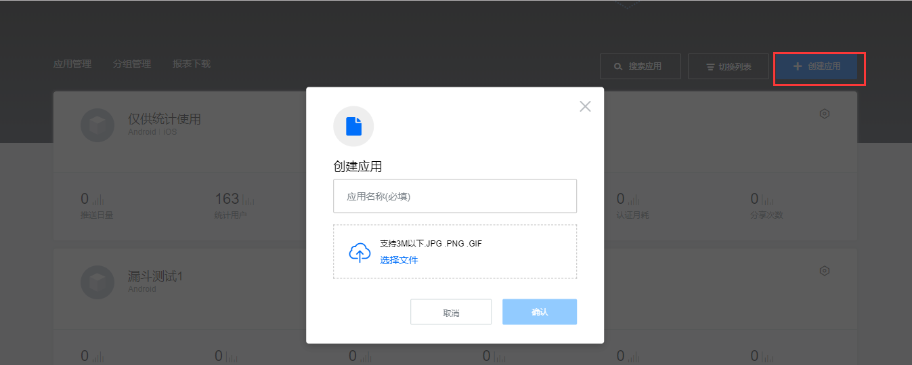

Step 2: Configure android platform information: after filling in the application package name, JPush system will generate the pushed Android application Demo in the background according to the package name you entered. The Demo will contain the configuration information.


Step 3: Configure iOS platform information: upload the push certificate of relevant environment and fill in the password matching the certificate；
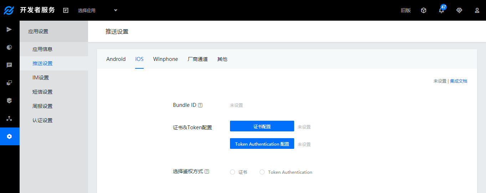

Step 4: Configure WinPhone platform information: select whether to open it
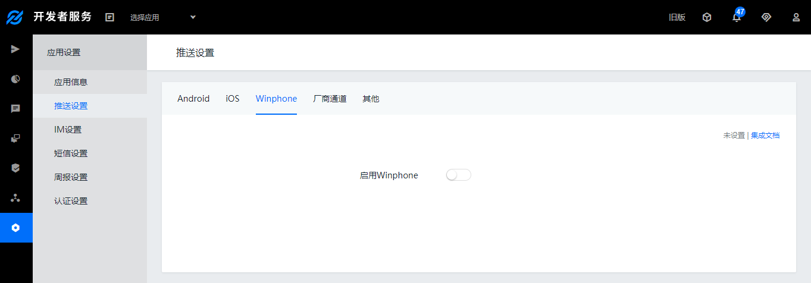

Step 5:  After the information is configured, check the application information as follows


## Application Management

Click [home] to return to the home page, you can browse all the application information. Click on the application name or settings to view the application details, click on the push to go to the send notification page, edit and push the notification. Click on the statistics, you can view all the statistics of the application ;
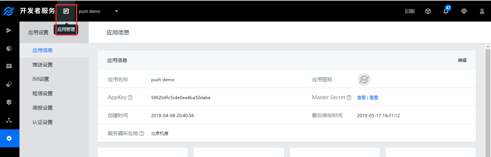  

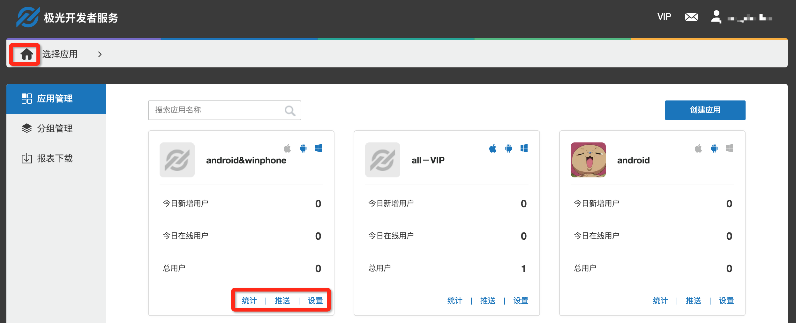  

Application details are as follows
 

Application settings are as follows：
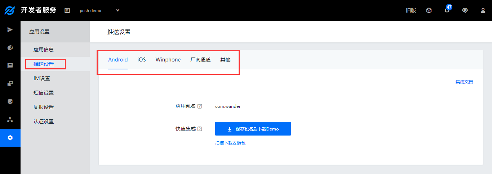

## Group Management

After clicking [home] to return to the home page, click [Group Management] in the left navigation to browse the application's group management information and create a new group;
  
 


## Report Download
After clicking [home] to return to the home page, click [Report download] at the left navigation center to download the report according to the time.
  
 
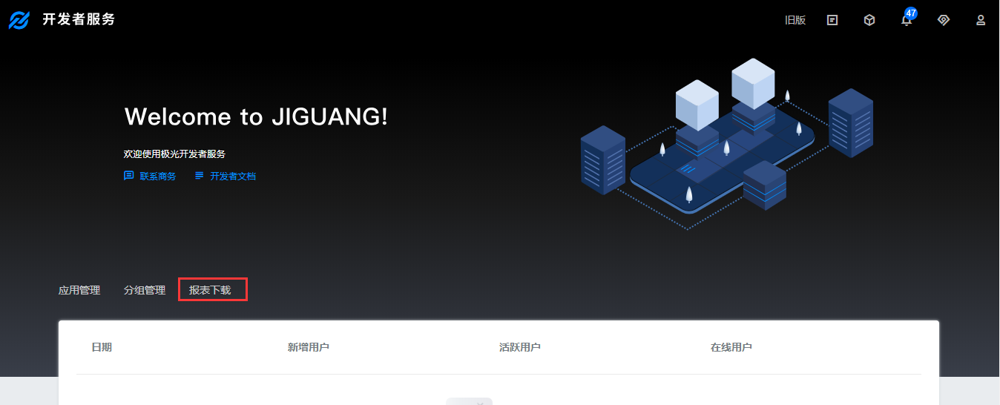

## Send Notification
Path: Select Application -> Push -> Send Notification
After filling in the push content, click on the [Send Now] button at the bottom of the page


The web interface will pop up a dialog box to prompt whether to send it or not. Select [Send it].
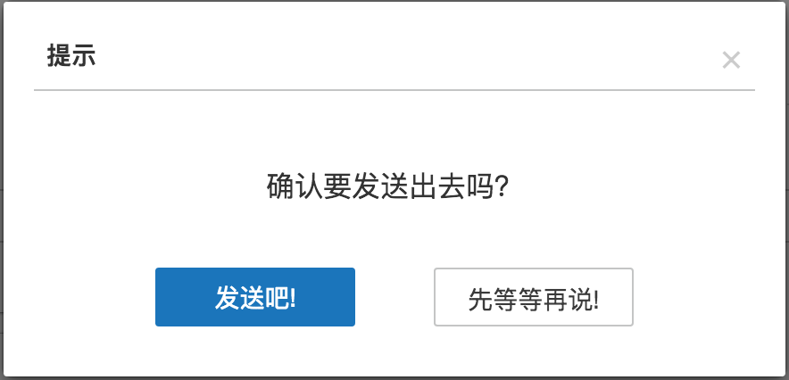

After pushing the result, a dialog box will pop up and please click [go to see] to see the result
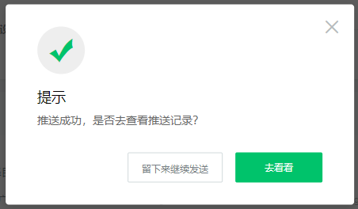

## Custom Message

Path: Select Application -> Push -> Custom Message After filling in the push content, click on the [Send Now] button at the bottom of the page


## Rich Media News

Path: Select Applications -> Push -> Rich Media Messages
A rich media message in the form of a landing page, a pop window, a message flow, or the like may be sent through a template, or a pre-edited page may be directly transmitted through a URL

##Send via landing page template

Step1: Path: Select Application -> Push -> Rich Media Messages -> Templates -> landing page. Currently the landing page only provides a generic template


Step2: Enter the editing page of template content, fill in all the contents, preview the display effect of on the left, then click [Next]
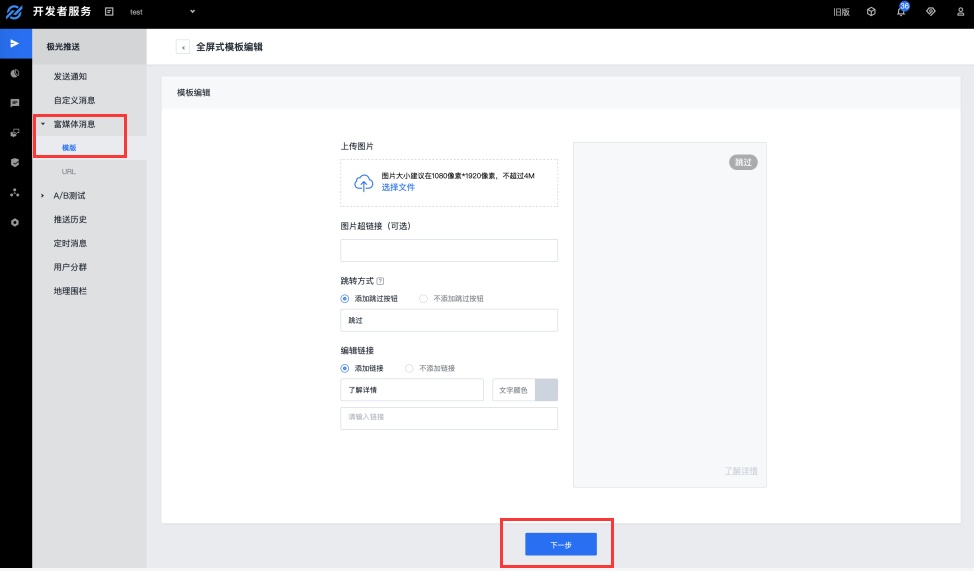

Step3: Click [Preview Rich Media Page] to preview the landing page template that has just been edited; click the [Send Now] button at the bottom of the page to complete the pushing of the landing page.


## Send via popup template

Step1: Select Application -> Push -> Rich Media Messages -> Template -> Popup Window, to select the appropriate template
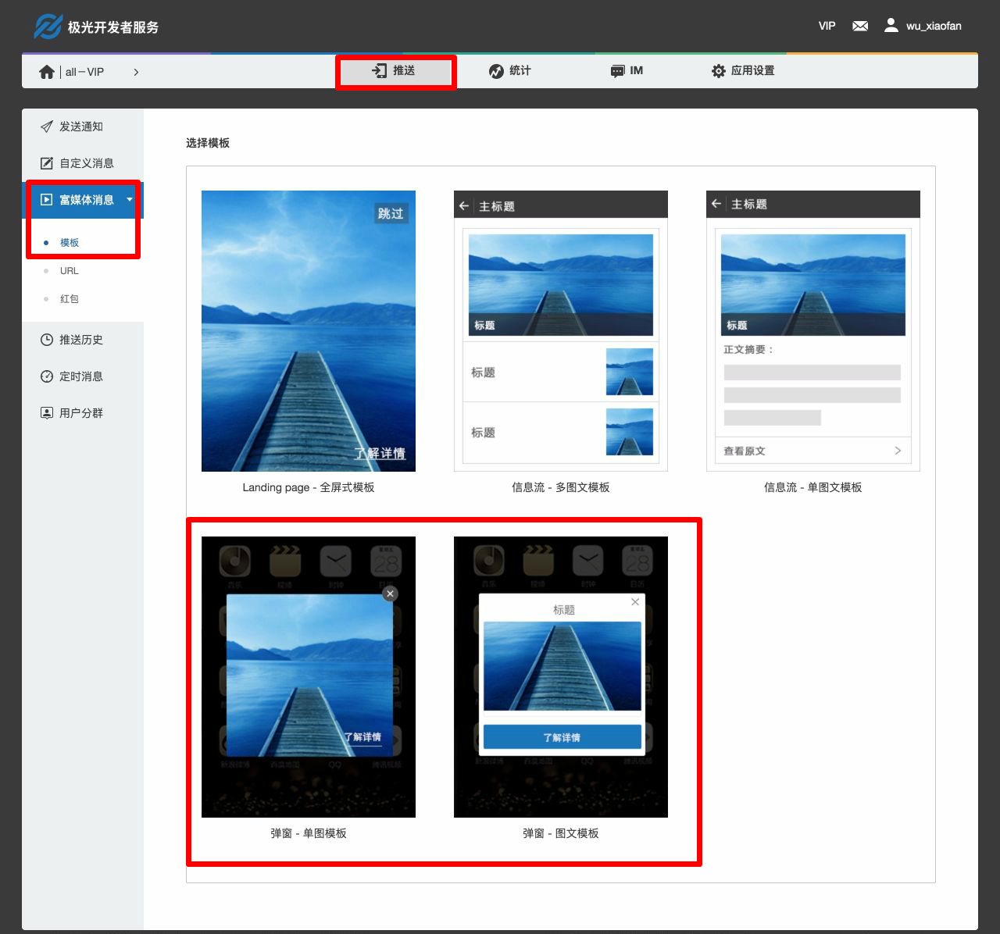

Step2: Enter the editing page of template content, fill in all the contents, preview the display effect of on the left, then click [Next]


Step3: Click [Preview Rich Media Page] to preview the popup template just edited. Click the [Send Now] button at the bottom of the page to complete the popup window's push.
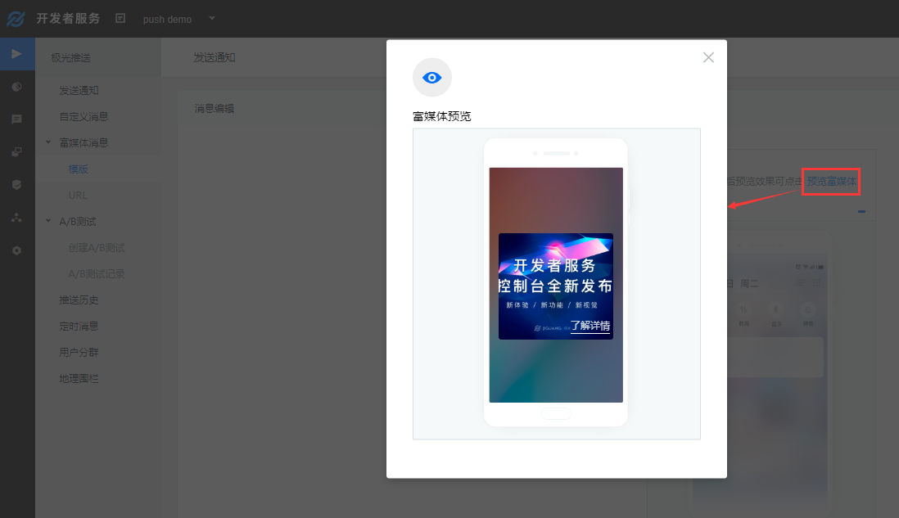

## Send via stream template

Step1: Path: Select Application -> Push -> Rich Media Messages -> Templates -> Information Flow, to select the appropriate template；
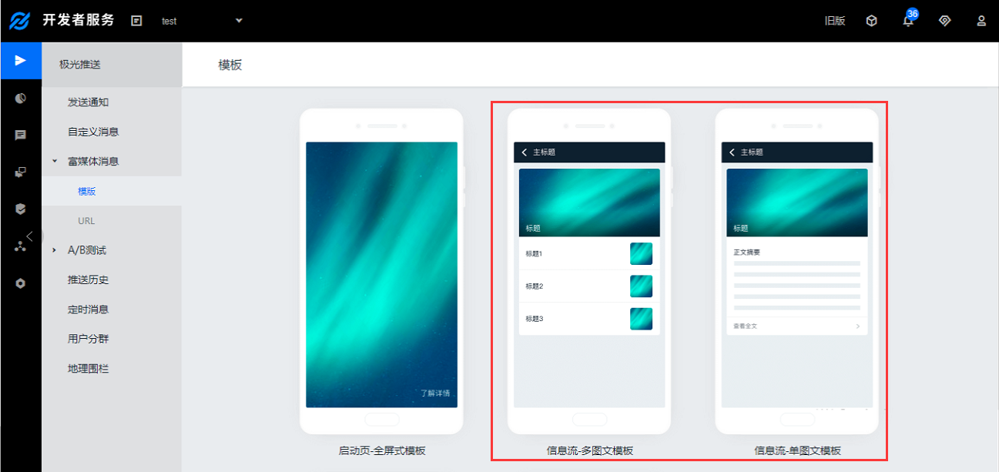

Step2: Enter the editing page of template content, fill in all the contents, preview the display effect of on the left, then click [Next]
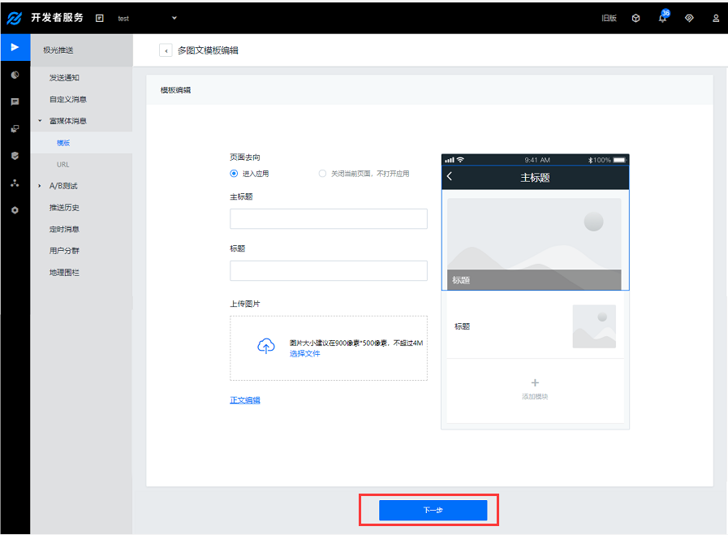

Step3：Click [Preview Rich Media Page] to preview the popup template that has just been edited. Click the [Send Now] button at the bottom of the page to complete the push of this information flow
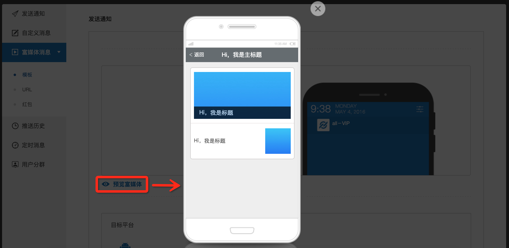

## Send notifications via URL
Step1: Path: Select Application -> Push -> Rich Media Message -> URL, and click the [Next] button. Since the size of the notification is limited, the URL cannot be too long. If the URL exceeds the limit length, please convert it into a short address and enter it again;
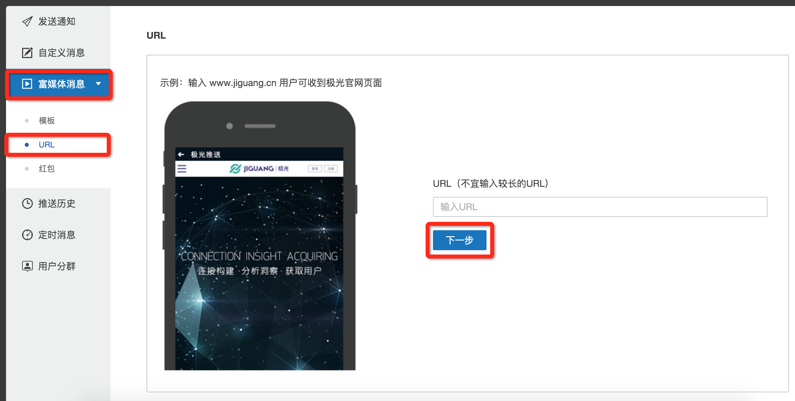

Step2: URL does not provide page preview function. Please make sure to enter the correct URL. Click the [Send Now] button at the bottom of the page to complete the URL push
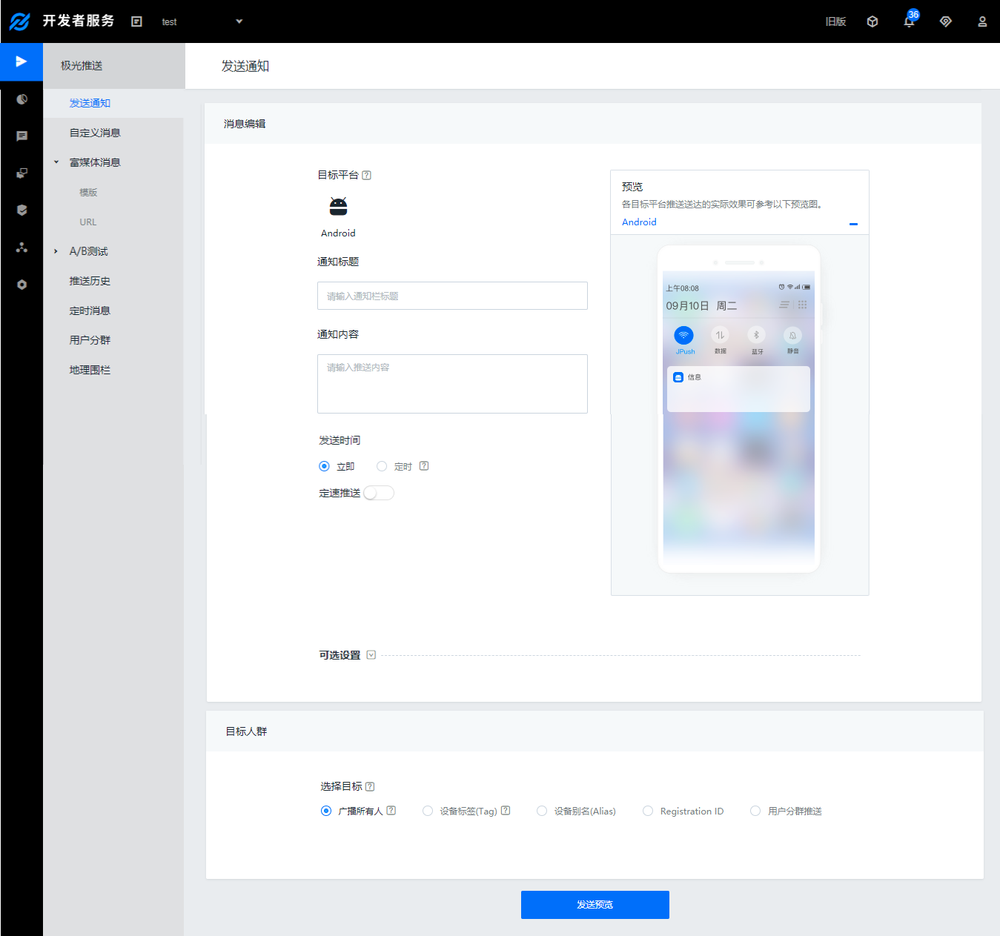

## Push History

Path: Select Application -> Push -> Push History
On the right, you can view the history of the push, including push time, content, type, IOS target | success, Android target | success, Winphone target | success, operation.
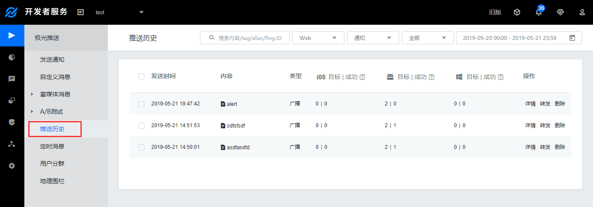

**Instructions**

+ Types include: broadcast, tag, alias, Registration ID
+ Operations include: forwarding, details, delete

**Note**

Push historical data only retains statistics for one month.

Details are as follows


Statistics example：
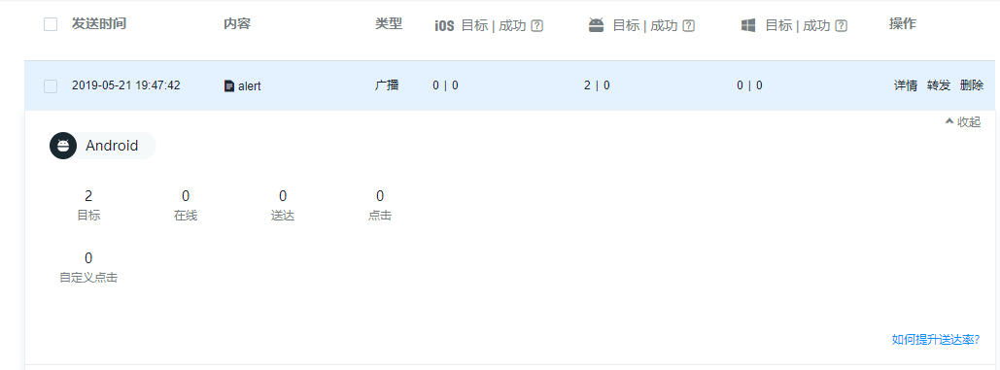

## Timed Push

Path: Select Applications -> Push -> Scheduled Messages
In the pull-down menu on the right, you can choose whether to send messages for [Notification] or [Custom Message]
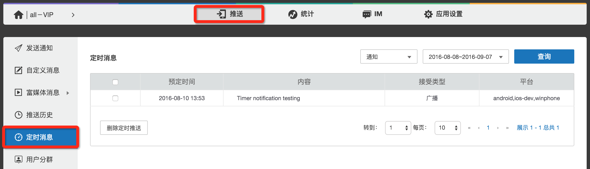

## Fixed-Speed Push

Fixed speed (minutes), in the application's "Push" module, click [Fixed-Speed Push].
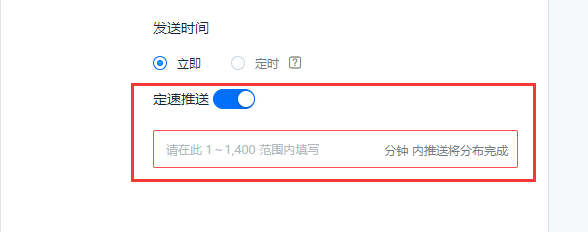

## User Group

Path: Select Application -> Push -> User Group -> Create User Group
User group can set one or more conditions of: label, geographical location, active user, system version, online user, and registered user
The name of the user group is required, and the name is used when the console sends groups to users.
The ID of the user group is generated after creation, and can be specified when the API is called

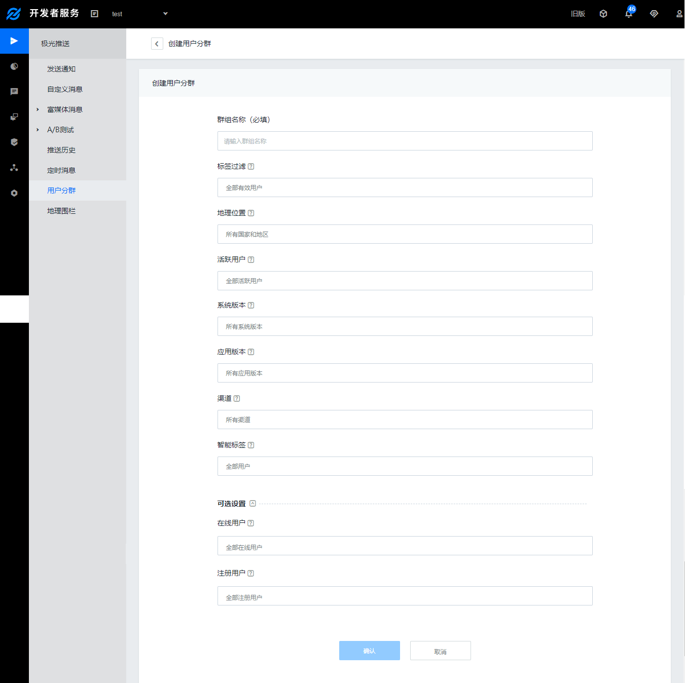

## Statistics and Report Description

### View Report

JPush's Web provides a variety of application-level statistics. As shown in the following figure, after the user logs in to the JPush account and selects a specific application, he can select “Statistics” in the top navigation bar.

####  Select report type
JPush statistics include: push statistics, user statistics, API statistics, active analysis, online retention rate, user group statistics, device information statistics, ranking statistics, region distribution, error list, loss analysis, return visit analysis.
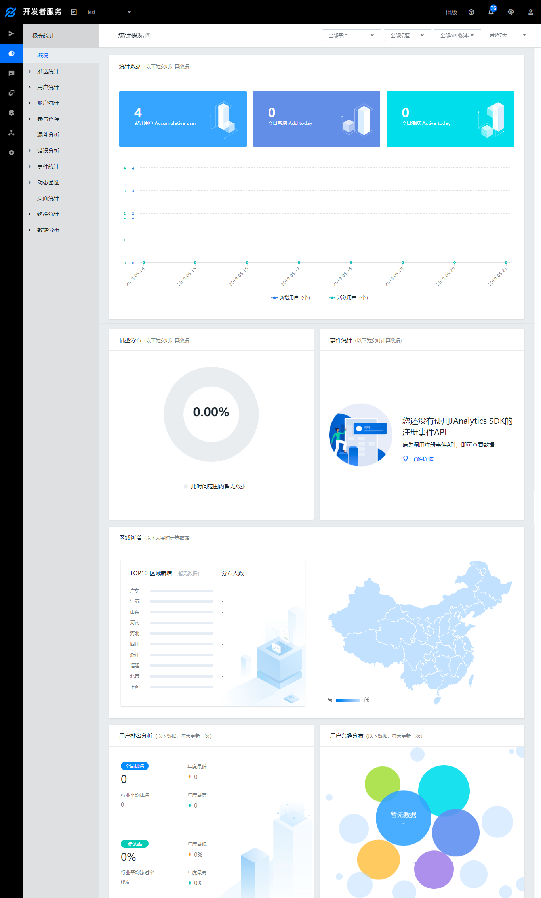

#### Select statistical time

You can select the statistical time range in the upper right corner of the report, or you can customize the query range. The specific statistics period is shown in the figure below. The unit size is: hour, day, month.
Example: If you select "yesterday",
The data presented in the report is in units of hours; if you select “Last 7 days”, the data presented in the report is in days.
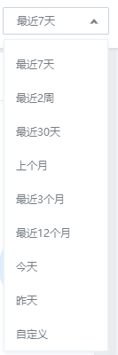

## Statistical Description

### Push statistics

The push report presents the status of "push quantity" and "user click". Some statistical effects need to implement the [Push Effect Feedback API](../client/Android/android_api/#api_2).

**Delivery quantity**

The total number of pushes received by Android users, including the number sent through the portal and sent via the API. Including notifications, also includes custom messages.

```
Because iOS and Window Phone systems have different principles, this curve shows the correct delivery of APNS and MPNS statistics.
```

**User clicks**

The number of times the user entered the application by clicking on the notification bar message.

```
For Android apps, you need to implement the statistical analysis API to have this statistic.
```

### User Statistics

**New Users**

"New user" refers to the newly added JPush registered user. When the application starts for the first time, the JPush SDK initiates an internal registration with JPush. iOS system does not take into account new user statistics if the user chooses to disable push on first use.

**Online Users**

“Online users” refers to the total number of users who have established a network connection with the JPush Server during the statistical period. If the statistical time is connected once, it is counted in the statistical item, and the same user does not repeat the calculation for multiple connections.

**Active Users**

"Active user" refers to the total number of users that have opened the application at least once within the statistical time. The difference between an active user and an online user is that the active user must have opened the application and the online user has a network on the user side to maintain connection with JPush.

```
Android systems need to implement the push effect feedback API to count active users.
```

### API statistics

**API statistics**

The total number of times the Push API was called within the statistics duration. Note: The number of APIs is different from the number of messages. One broadcast push and one alias push are both 1 API call.

### Active Analysis

**Push Quantity**

The definition is the same as above, which is mainly used as a comparison curve to measure the user's active effect after the push.

**User Opening Times**

The total number of times all users open the app. This indicator can be used to observe whether the user opens more applications as the number of pushes increases.

```
Android systems need to implement the push effect feedback API to have this statistic.
```

**User Usage Time (minutes)**

Total time spent by all users on using the app. This indicator can be used to observe whether users use the application for a longer time depending on the content of the push.

```
Android systems need to implement the push effect feedback API to have this statistic.
```

#### Online Retention Rate

Users added during a certain period of time and still connected to the JPush server after a period of time are called retained users. The ratio of retained users to new users at the time is called retention rate. "Online retention rate" can reflect the user's user retention more realistically.

```
Note: The definition of JPush's retention user is an online user, which refers to a user who still has a connection to the server (this can be done without opening the application but being online at the backend). This definition is different from other "active retention rate" based on user activity statistics. Since the user of iOS platform mechanism can be online only when opening the application, the retention is approximately equal to "active retention."
```

For example: Daily retention. The number of users added on some day is 100. After 3 days, the number of users who are still online among the 100 users is 50. Then, the 3-day retention rate for new users on this day is 50%

[0]: image/report_functions.png
[1]: image/report_functions2.png

## SMS Verification Code

### Data Overview

Path: Select Application -> SMS Verification Code -> Data Overview
SMS margin: the number of remaining text messages that can be sent, where the balance is the sum of the number of text messages that can be sent by all applications under the account.
SMS volume: the amount of text messages sent during today, the amount of text messages sent in this month, and the amount of text messages sent in last month. The amount of traffic generated here is the usage of the app;

### Sending Records
Path: Select Applications -> SMS Verification Code -> Send Record;
All SMS verification codes sent by the current application support the inquiry by mobile number and time;