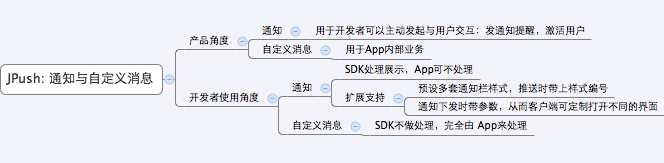

# FAQ

## What is the limit on the number of pushes and the frequency of pushes?

#### Push quantity

No limit!
Pushing notifications or messages through the console or API does not limit the number of pushes.

#### Push frequency

The maximum pushing frequency for each Appkey in the free version is 600 beats/minute.
The paid version can enjoy a higher frequency of delivery. Please contact business team for details.

## What is the limit on the number of pushes and the frequency of pushes?

The JPush system currently supports concurrent access by 1 billion users.
In the overall architecture design, any failure of single point will not affect the overall system operation. And it can be upgraded online.

## What technology does JPush backstage use? Is the XMPP protocol?

The backend is mainly implemented in pure C language.
Use custom binary protocols to save traffic as much as possible.

## How to ensure the security of push messages?

We recommend that developers do not push confidential information, just as QQ advises you not to send confidential information while chatting.
If the developer does have confidential information that needs to be delivered to the user, please consider doing so:
First push a message through JPush, this message will trigger the client App to interact with the developer server to exchange confidential information.

## How about the power consumption and consumption of JPush?

As mentioned below, the content of the push is not considered. The amount of push content is determined by the developer.
In addition, the measured electricity consumption and traffic consumption are relatively related to the network conditions.
So here's the data is the theoretical average: flow consumption as 20K/day, power consumption as 30mAh/day.

## Why cannot the Target User be found on the console or when calling API push messages?

Its meaning is: When the message is pushed to the client, it is found that the target user in this mode cannot be found under the specified push mode.

+ If the push mode is mass, it means that the application has not yet successfully integrated the JPush SDK and connected to the JPush server. If you do indeed work on the client App integration JPush SDK, check the client logs to see if the registration fails.
+ If the push mode is an alias or a tag, it means that the alias or tag was not successfully set on the client without calling setAliasAndTags successfully. Please refer to: Aliases and Tags Using Tutorial Android Documentation iOS Documentation.

## What is the difference between a notification and a custom message?

The following figure is a simple distinction. For details, please refer to the document: [Notifications vs. Custom Messages](../client/Android/android_senior/#vs)

## Can I push multimedia files to the client?

The push message itself is a limited-length text.
Do not directly support file push, but it can be implemented by pushing url.
That is, first push the file and download url, then trigger logic on the client to download the file via url.

## How to push messages to specific users?

Specify an alias for the user by useing the setAliasAndTags API on the client, so that the server could push message to this alias.
How clients set up aliases and tags: Android Tags and Aliases iOS Tags and Aliases
Use aliases and tags to push, please refer to the documentation: Tags and aliases API

## How to push messages to a specified group of users?

The client uses the setAliasAndTags API to set the label for this user. This allows the server to send messages to all users with this tag.
In addition, users can be grouped at the console (filtering users based on conditions such as labels and geographic locations). When the console pushes the information, the name of the group is specified or the API is used to call the id of the group. It is also possible to push messages to a group of users.
How clients set up aliases and tags: Android Tags and Aliases iOS Tags and Aliases
Use aliases and tags to push, Please refer to the documentation: Tags and Aliases API

## Can other countries use JPush (Can LAN use JPush)?

JPush has no restrictions on visiting countries. Theoretically there is no problem with foreign use, but specific regions still require developers to evaluate it.
The server can determine whether to access the JPush server by pinging api.jpush.cn or by performing a curl test.
The client can determine whether it is normal or not by observing the log to see if it can register and connect successfully.

## What are the differences between JPush free users and VIP users?

Provide basic push services to free users, with no restrictions on the number of messages and users, and provide data statistics services and reports to them. The content of "JPush" will not be added to the free push content, and all push content is defined by the developer himself.
VIP users could push faster and push more frequently on this basis. VIP users can also enjoy more features, see Product Price Page of JPush.
