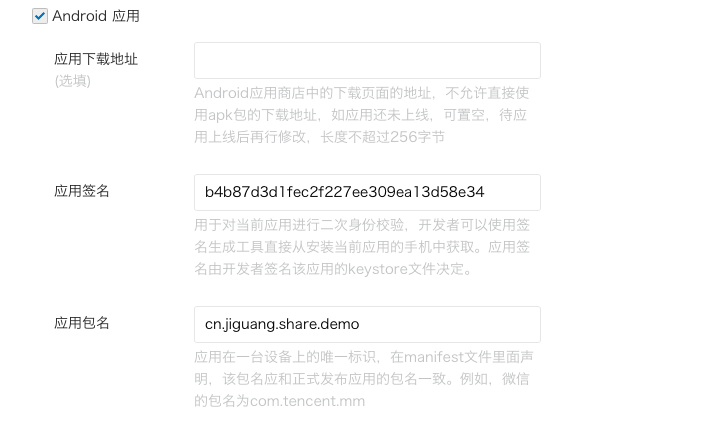
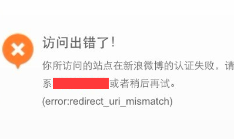
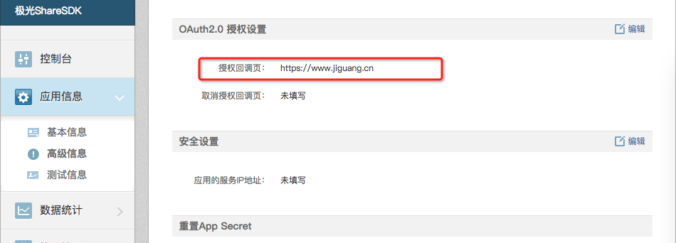

#Android SDK FAQ

##How appkey of the third-party platform corresponds to signature and package name?


When applying for appkey and secret on Sina Weibo and WeChat, you need to fill in the application's signature and package name, as follows:<br>
Fill in signature and package name on Sina Weibo： 
<br>
Fill in signature and package name on WeChat
<br>
The appkey of Sina Weibo and WeChat correspond to the package name and signature. Therefore, the signature file configured in the program's build.gradle must correspond to the package name of the third-party platform appkey and program configured in JGShareSDK.xml. <br/>

## Why no callback after sharing to Wechat?

Check the package name and WeChat callback configuration configured in the AndroidMmanifest.xml file
```
<!-- Optional 微信分享回调-->
    < activity
        android:name=".wxapi.WXEntryActivity"
        android:exported="true" />
```

The wxapi pointed to by the name field of WeChat callback must be in the package directory; if the path where the wxapi is located is not in the package directory, there is no callback.

## Report an error when Weibo is sharing or authorizing: redirect\_uri\_mismatch


Report an error when sharing or authorizing<br>
<br>
This error indicates that the callback address you configured in the JGShareSDK.xml file is inconsistent with the callback address of the Weibo open platform. Log in to the Sina Weibo open platform.
<br>
Set the RedirectUrl of Weibo in JGShareSDK.xml to be the same as the authorized callback page address of Weibo open platform.
