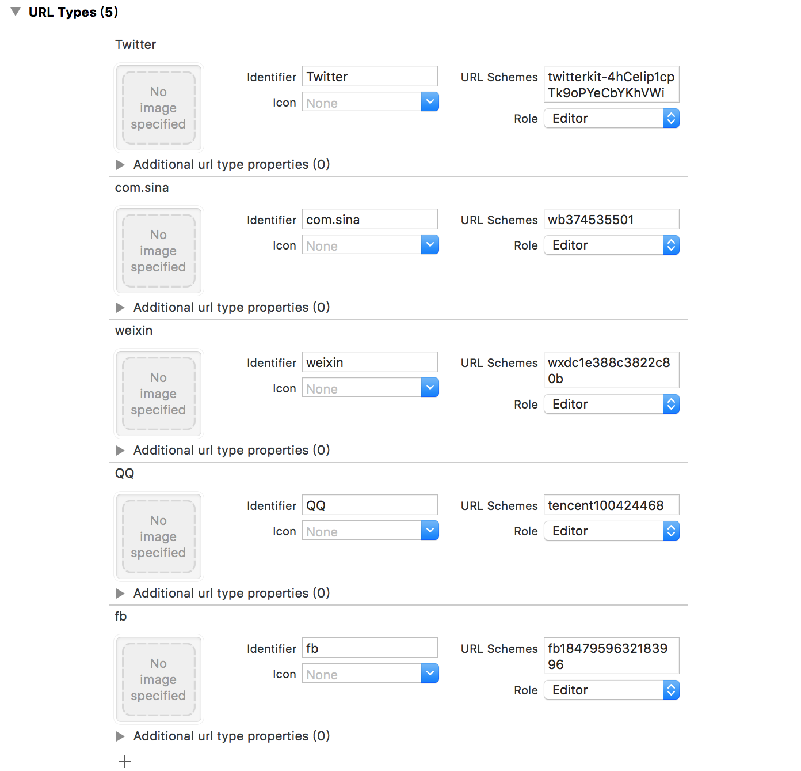

# iOS JShare Integration Guide

## Use Suggestions

This article is a standard integration guide document for the JShare iOS SDK. The matching SDK version is V1.5.0 and later.

-   If you want a quick test, please refer to this article to run through the Demo within minutes.

-   All documents, including all guides, APIs, and tutorials, are available on the Jiguang Doc website. Updated versions of this document will be posted to the site in a timely manner.

## Description of Product Function

JShare SDK allows your application to support multi-platform sharing. It does not take time to understand and integrate the SDK of each social sharing platform, which can effectively reduce the package size.

### Main Scenes：

-   Share content to three major social platforms including QQ, WeChat and Sina Weibo.

-   Access to personal information on QQ, WeChat, Sina Weibo for third-party login.

-   Share content to Facebook and Messenger, and access to personal information of Facebook users for third-party logins.

-   Share content to twitter and get personal information of twitter users for third-party login.

### Content of Integrated Package

-   jshare-ios-x.x.x.a static library

-   jcore-ios-x.x.x.a static library

-   header file of JSHARE SDK entrance JSHAREService.h

-   A complete iOS Demo project that demonstrates the basic usage of the JSHARE SDK. Refer to this Demo when configuring the SDK.

### Versions Supported by iOS SDK

Currently JSHARE only supports iOS 7 and above iOS versions.

## Quick Experience

-   Double-click on JShareDemo.xcodeproj in the archive to open Demo;

-   Modify the value of appKey in AppDelegate.m;

-   Fill in the Bundle id of the certificate you uploaded in application created by Jiguang, in the \[General\] page -\> \[Identity\] -\> \[Bundle Identifier\]

-   Run to Install Demo to Real Machine.

## 

## JSHARE SDK Integration Steps

**Option 1: Import by Cocoapods**

-   Download address through Cocoapods：
```
pod 'JShare'
```

-   If you need to install a specific version, use the following method (take the 1.3.0 version as an example)：
```
pod 'JShare', '1.3.0'
```

**Option 2: Import Manually**

-   Unzip the package and copy all the files under Lib into the project to start using the SDK.

-   Add related framework dependencies：

    -   UIKit

    -   SystemConfiguration

    -   CoreTelephony

    -   CoreGraphics

    -   Security

    -   Foundation

    -   CoreLocation

    -   CoreFoundation

    -   CFNetwork

    -   libz.tbd

    -   libresolv.tbd

-   The location where AppDelegate.m refers header file

```
// 引入 JSHARE 功能所需头文件
#import "JSHAREService.h"
// 如果需要使用 idfa 功能所需要引入的头文件（可选）
#import <AdSupport/AdSupport.h>
```

## Description of SDK Main Interfaces

JSHARELaunchConfig class: The JSHARE SDK launches the configuration model.

JSHAREService class contains all interfaces of share SDK.

### method - setupWithConfig

#### Interface Definition：

+(void)setupWithConfig:(JSHARELaunchConfig \*)config

#### Interface Description：

Initialize the interface. It is recommended to call in application:didFinishLaunchingWithOptions:.

#### Parameter Description：

-   config：Instance of the JSHARELaunchConfig class

#### Call Example：

```
    JSHARELaunchConfig *config = [[JSHARELaunchConfig alloc] init];
    config.appKey = @"AppKey copied from JiGuang Portal application";
    config.SinaWeiboAppKey = @"374535501";
    config.SinaWeiboAppSecret = @"baccd12c166f1df96736b51ffbf600a2";
    config.SinaRedirectUri = @"https://www.jiguang.cn";
    config.QQAppId = @"1105864531";
    config.QQAppKey = @"glFYjkHQGSOCJHMC";
    config.WeChatAppId = @"wxa2ea563906227379";
    config.WeChatAppSecret = @"bb63c0a06bf0ee7f633a5bc44304d110";
    config.FacebookAppID = @"1847959632183996";
    config.FacebookDisplayName = @"JShareDemo";
    config.TwitterConsumerKey = @"4hCeIip1cpTk9oPYeCbYKhVWi";
    config.TwitterConsumerSecret = @"DuIontT8KPSmO2Y1oAvby7tpbWHJimuakpbiAUHEKncbffekmC";
    [JSHAREService setupWithConfig:config];
    [JSHAREService setDebug:YES];

```

### method - share

#### Interface Definition：

+(void)share:(JSHAREMessage *)message
      handler:(JSHAREStateHandler)handler

#### Parameter Description：

-   message：Instance of the JSHAREMessage class

-   handler：Callback after JSHAREStateHandler is shared

#### Call Example：

```
JSHAREMessage *message = [JSHAREMessage message];
    message.text = @"JShare SDK 支持主流社交平台、帮助开发者轻松实现社会化功能！";
    message.platform = JSHAREPlatformQQ;
    message.mediaType = JSHAREText;
    [JSHAREService share:message handler:^(JSHAREState state, NSError *error) {
          NSLog(@"分享回调");
        }
    }];
```

### method - handleOpenUrl

#### Interface Definition：

+(BOOL)handleOpenUrl:(NSURL \*)url

#### Interface Description：

Callback interface of sharing, required!

Below iOS 9, call application:handleOpenURL: of Appdelegate ; above iOS 9, call application of Appdelegate: openURL: options.

#### Parameter Description：

-   url：url of the callback.

#### Call Example：

```
//目前适用所有 iOS 系统
- (BOOL)application:(UIApplication *)application handleOpenURL:(NSURL *)url{
    [JSHAREService handleOpenUrl:url];
    return YES;
}

//仅支持 iOS9 以上系统，iOS8 及以下系统不会回调
- (BOOL)application:(UIApplication *)app openURL:(NSURL *)url options:(NSDictionary<UIApplicationOpenURLOptionsKey, id> *)options {
    [JSHAREService handleOpenUrl:url];
    return YES;
}

```

### method - getSocialUserInfo

#### Interface Definition：

+(void) getSocialUserInfo:(JSHAREPlatform)platform handler:(JSHARESocialHandler)handler

#### Interface Description：

By invoking interface for user information acquiring, obtain the user ID, avatar, and other data on the third-party platform to complete the construction of account system

#### Parameter Description：

-   platform: JSHAREPlatform enumeration type.

-   handler: JSHARESocialHandler gets callbacks of user information

#### Call Example：

```
[JSHAREService getSocialUserInfo:platfrom handler:^(JSHARESocialUserInfo *userInfo, NSError *error) {
        NSString *alertMessage;
        NSString *title;
        if (error) {
            title = @"失败";
            alertMessage = @"无法获取到用户信息";
        }else{
            title = userInfo.name;
            alertMessage = [NSString stringWithFormat:@"昵称: %@\n 头像链接: %@\n 性别: %@\n",userInfo.name,userInfo.iconurl,userInfo.gender == 1? @"男" : @"女"];
        }
        UIAlertView *Alert = [[UIAlertView alloc] initWithTitle:title message:alertMessage delegate:nil cancelButtonTitle:@"OK" otherButtonTitles:nil];
        dispatch_async(dispatch_get_main_queue(), ^{
            [Alert show];
        });


    }];
```

For other interfaces, please see JSHAREService.h.

## Configuration in Xcode 

### Configure ApplicationQueriesSchemes

Under iOS9/10, you need to add a whitelist for applications to jump to, that is, LSApplicationQueriesSchemes, otherwise you will return NO when the SDK determine whether to use canOpenURL to jump, and then only share/failed to share with webview.

Add the application whitelist to the info.plist of the project：

-   Right click info.plist

-   Select source code

-   Add the following content

```
<key>LSApplicationQueriesSchemes</key>
<array>
    <!-- 微信 URL Scheme 白名单-->
    <string>wechat</string>
    <string>weixin</string>

    <!-- 新浪微博 URL Scheme 白名单-->
    <string>sinaweibohd</string>
    <string>sinaweibo</string>
    <string>sinaweibosso</string>
    <string>weibosdk</string>
    <string>weibosdk2.5</string>

    <!-- QQ、Qzone URL Scheme 白名单-->
    <string>mqqapi</string>
    <string>mqq</string>
    <string>mqqOpensdkSSoLogin</string>
    <string>mqqconnect</string>
    <string>mqqopensdkdataline</string>
    <string>mqqopensdkgrouptribeshare</string>
    <string>mqqopensdkfriend</string>
    <string>mqqopensdkapi</string>
    <string>mqqopensdkapiV2</string>
    <string>mqqopensdkapiV3</string>
    <string>mqqopensdkapiV4</string>
    <string>mqzoneopensdk</string>
    <string>wtloginmqq</string>
    <string>wtloginmqq2</string>
    <string>mqqwpa</string>
    <string>mqzone</string>
    <string>mqzonev2</string>
    <string>mqzoneshare</string>
    <string>wtloginqzone</string>
    <string>mqzonewx</string>
    <string>mqzoneopensdkapiV2</string>
    <string>mqzoneopensdkapi19</string>
    <string>mqzoneopensdkapi</string>
    <string>mqqbrowser</string>
    <string>mttbrowser</string>
    
    <!-- Facebook URL Scheme 白名单-->
    <string>fbapi</string>
    <string>fb-messenger-api</string>
    <string>fbauth2</string>
    <string>fbshareextension</string>
    
    <!-- Twitter URL Scheme 白名单-->
    <string>twitter</string>
    <string>twitterauth</string>
</array>
```

### 

### Add URL Types

#### Format description of URL Schemes for each platform：

| **Platform** | **Format**                                             | **Example**                                                                                                                    |
|--------------|--------------------------------------------------------|--------------------------------------------------------------------------------------------------------------------------------|
| WeChat       | WeChat appKey                                          | wxa2ea563906227379                                                                                                             |
| QQ           | Need to add: "tencent" + Tencent QQ Internet app appID | If appID is 1105864531, then the value fo URL Schemes will be tencent1105864531                                                |
| Sina Weibo   | “wb”+Sina appKey                                       | If appKey is 727232518, then the value fo URL Schemes will be wb727232518                                                      |
| Facebook     | “fb”+FacebookAppID                                     | If appID is 1847959632183996, then the value of URL Schemes will be fb1847959632183996                                         |
| Twitter      | “twitterkit-”+TwitterConsumerKey                       | If TwitterConsumerKey is 4hCeIip1cpTk9oPYeCbYKhVWi, then the value of URL Schemes will be twitterkit-4hCeIip1cpTk9oPYeCbYKhVWi |

#### 

#### URL Types Settings

Set in \[TARGETS\] -\> \[Info\] in the Xcode project directory:



### HTTPS Settings

> Apple will implement ATS (App Transport Security) starting from 2017. All network applications under review will support HTTPS. The following configurations will be invalidated. Please prepare in advance.

At present, JShare supports webpage sharing in the absence of a Sina Weibo client. However, because Sina Weibo's api has not yet been optimized for https, it needs a corresponding https setting for Sina. In JShare, the webpage sharing of Sina Weibo is turned off by default. To use this function, you need to set the isSupportWebSina attribute to YES in the instance of the **JSHARELaunchConfig** class.

A project compiled with iOS10 SDK will use the SSL security protocol to perform network transmission by default, that is, HTTPS. If you still use the HTTP protocol to request the network, a system exception will be reported and interrupt the request. Currently, you can use HTTP to keep your network connection in this way:

```
<key>NSAppTransportSecurity</key>
<dict>
    <!-- 配置允许 http 的任意网络 End-->
   <key>NSExceptionDomains</key>
   <dict>
       <!-- 集成新浪微博对应的 HTTP 白名单-->
       <key>sina.com.cn</key>
       <dict>
           <key>NSIncludesSubdomains</key>
           <true/>
           <key>NSThirdPartyExceptionAllowsInsecureHTTPLoads</key>
           <true/>
           <key>NSThirdPartyExceptionRequiresForwardSecrecy</key>
           <false/>
       </dict>
       <key>sinaimg.cn</key>
       <dict>
           <key>NSIncludesSubdomains</key>
           <true/>
           <key>NSThirdPartyExceptionAllowsInsecureHTTPLoads</key>
           <true/>
           <key>NSThirdPartyExceptionRequiresForwardSecrecy</key>
           <false/>
       </dict>
       <key>sinajs.cn</key>
       <dict>
           <key>NSIncludesSubdomains</key>
           <true/>
           <key>NSThirdPartyExceptionAllowsInsecureHTTPLoads</key>
           <true/>
           <key>NSThirdPartyExceptionRequiresForwardSecrecy</key>
           <false/>
       </dict>
       <key>sina.cn</key>
       <dict>
           <!-- 适配 iOS10 -->
           <key>NSExceptionMinimumTLSVersion</key>
           <string>TLSv1.0</string>
           <key>NSIncludesSubdomains</key>
           <true/>
           <key>NSThirdPartyExceptionRequiresForwardSecrecy</key>
           <false/>
       </dict>
       <key>weibo.cn</key>
       <dict>
           <!-- 适配 iOS10 -->
           <key>NSExceptionMinimumTLSVersion</key>
           <string>TLSv1.0</string>
           <key>NSIncludesSubdomains</key>
           <true/>
           <key>NSThirdPartyExceptionRequiresForwardSecrecy</key>
           <false/>
       </dict>
       <key>weibo.com</key>
       <dict>
           <!-- 适配 iOS10 -->
           <key>NSExceptionMinimumTLSVersion</key>
           <string>TLSv1.0</string>
           <key>NSIncludesSubdomains</key>
           <true/>
           <key>NSThirdPartyExceptionAllowsInsecureHTTPLoads</key>
           <true/>
           <key>NSThirdPartyExceptionRequiresForwardSecrecy</key>
           <false/>
       </dict>
       <!-- 新浪微博-->
   </dict>
</dict>
```
# end
