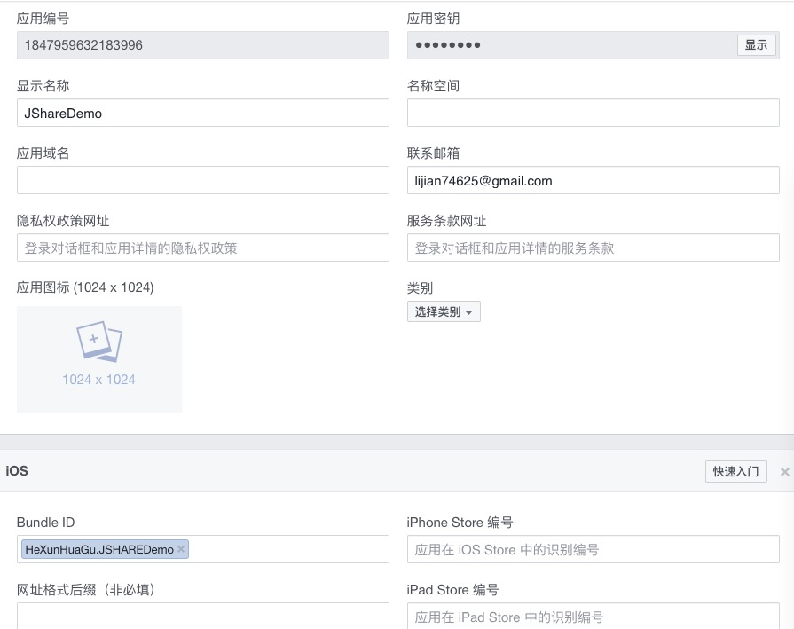

# Third-party Platform Application

## Why do I need to apply for a third-party platform account?

The information such as application information, application name, and application icon displayed after the application is successfully shared with QQ, WeChat and Sina Weibo is related to the settings of third-party open platforms. Therefore, the application needs to be created and approved through a third-party open platform.

## Apply for appID of QQ

Log in to Tencent open platform, access the application (<a href="http://op.open.qq.com/appregv2/">click the link</a>), and select Android application or iOS application according to your needs.

Click Create Application, fill in the relevant application information and submit it for review.

Fill in the application information according to the prompt. You can only use the test account before the application passes the audit.

## Apply for appID of WeChat

Log in to the <a href="https://open.weixin.qq.com/">WeChat Developer Platform</a>, enter the management center, click to create a mobile application, and then fill in the basic information of the application and platform information according to the prompts

The appID and appsecret can be obtained after the audit is passed. At this point, the app already has the ability to share. If you still need to use the WeChat log-in function, the developer also needs to apply for the developer qualification certification of the WeChat platform. 

It is important to note that the package name and signature entered during the application must correspond to the apk file.

## Apply for appkey of Sina Weibo

Log in to <a href="http://open.weibo.com"/>Sina Weibo Open Platform</a>, enter the micro link－》mobile application, click to create an application immediately

Fill in the application information according to the prompt to create a new application

Submit for approval and get appkey and appsecret after the approval 
It is important to note that the package name and signature entered during the application must correspond to the apk file.

## Apply for appID of Facebook

Log in to the Facebook Developer Platform, click to add new application (<a href="https://developers.facebook.com/apps/">click the link</a>), and select Android App or iOS App as needed.

Fill in the relevant application information and submit it for review

Fill in the application information as prompted

## Apply for appID of Twitter

Log in to the <a href="https://apps.twitter.com/">Twitter Developer Platform</a> and click Create New APP to create the application as shown below:

Fill in the information for creating the application according to the prompts. Do not forget to fill in the callback address. After the creation is successful, you can see the ConsumerKey and consumerSecret information.
