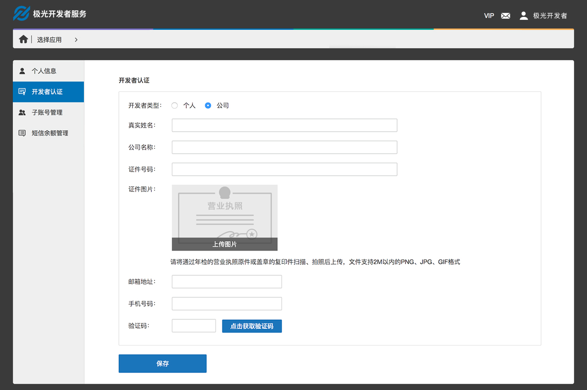
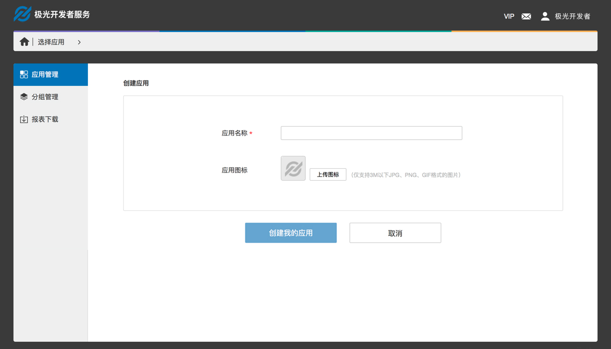
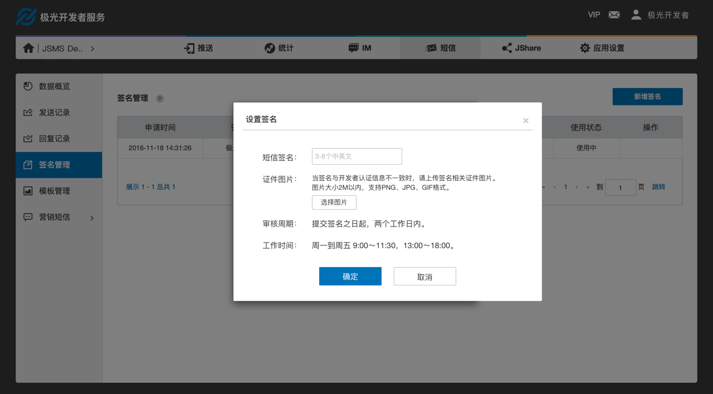
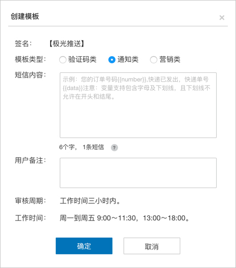
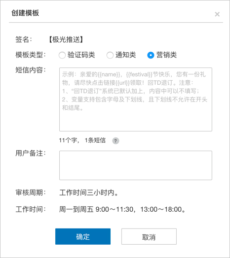

# Console Operation Guide

## Developer Certification

Due to operator’s requirements, SMS business is available after personal real name certification or enterprise qualification certification.

### Personal Authentication

Support personal developer certification. The content of certification is required and cannot be modified after the certification is passed. Please fill in the personal certification information carefully to avoid affecting the use of the SMS service in the future.

#### Operation Path

Step1: Log in to the console
Step2: Enter your account
Step3: Select [Developer Certification] in the right menu
Step4: Select [Personal] in the Developer Type

### Enterprise Certification

Support enterprise developer certification. The content of the certification is required and cannot be modified after the certification is passed. Please fill in the enterprise certification information carefully to avoid affecting the future use of SMS services.

#### Operation Path

Step1: Log in to the console
Step2: Enter your account
Step3: Select [Developer Certification] in the right menu
Step4: Select [Enterprise] in the Developer Type

## Create an Application

#### Steps

Step1: Log in to the console
Step2: Click the [Create Application] button

Step3: Fill in [Application Name] and [Application Icon]. [Application Name] is required.

## Signature Settings

The signature is shown at the top of the text message, indicating which company, which product, or which software the message came from. Due to the operator's request, the signature needs to be used after the audit. Under normal circumstances, the audit cycle is two working days.

#### Operation Path

Step1: Log in to the console
Step2: Enter the SMS service template
Step3: Select [Signature Management] in the right menu
Step4: Click the [New Signature] button

#### Create a Signature

+ The signature supports the upload of 2 to 10 Chinese and English or numbers. Spaces or special symbols are not allowed.
+ When the signature is inconsistent with the developer certification information, please upload the signature related certificate picture;
+ If there is an in-use signature, the new signature created will directly replace the old signature after auditing

## Template Settings

The template is the content of the short message with parameters, and template ID and the corresponding parameter content can be directly filled in when invoking API. Due to the operator's request, the template must be audited before use. Under normal circumstances, the audit cycle is within three hours of the working time.

#### Operation Path

Step1: Log in to the console
Step2: Enter the SMS service template
Step3: Select [Template Management] in the right menu
Step4: Click the [New Template] button

### Create a Template

+ Template type: Support for creating SMS templates of text verification code, notification SMS templates, and marketing SMS templates;
+ Template format: The format of the parameter in the template is {{key-name}}, where the separator uses two braces;
+ Template of verification code: The parameter name must be code. When multiple parameters are set, the parameter name must be code. Validation period is supported in the verification code template. The valid period must be between 0 and 24 hours, and the unit is second.
 

+ Notification template: The template must contain at least one parameter and the parameter name is specified by the developer. Only letters and underscores are supported, and underscores are not allowed at the beginning and end;

+ Marketing template: The template must contain at least one parameter and the parameter name is specified by the developer. Only the letters and underscores are supported, and the underscore is not allowed at the beginning and end. According to the operator's regulations, the marketing message must contain unsubscribe related information. If the system has added "Send TD to unsubscribe" by default, could not fill in the template.

+ Default template: At present, only the verification code SMS template has a default template. When the signature is not set, the default template uses the signature of [JPush].

## Marketing SMS

In addition to sending by API, marketing messages can also be sent in the website, and supports for scheduled delivery.

### Create Marketing SMS

#### Operation Path

Step1: Log in to the console
Step2: Enter the SMS service template
Step3: Select [Pre-Send List] of [Marketing SMS] in the right menu
Step4: Click the [Create Marketing SMS] button

#### Create Marketing SMS

+ The in-use signature will be automatically written. If the signature is not set, set the signature first to create a marketing message;
+ SMS content: Enter the content of the SMS. According to the regulations of the operator, the content of the marketing message must contain unsubscribe related information. If the system has added "Send TD to unsubscribe" by default, could not fill in the template
+ Sending time: Support for instant sending or timing sending. Marketing messages will be sent according to the scheduled time after the audition;
+ Target audience: Upload txt file with a mobile phone in a line;
+ After completing all the contents, click Next and confirm that the information is correct. Click OK and freeze the corresponding balance.

View the pre-sending list to check out the review results of the marketing message, and the marketing messages which are not sent yet.

## View Data

+ Data overview to view the application data, including SMS margin, delivery volume and consumption volume;
+ All types of text messages, including: recordings of verification code, notifications, marketing and push supplements, can be viewed in the history record;
+ All uplink SMS messages received can be viewed in the reply log;
+ Sending records of marketing messages can also be viewed in the sending history of marketing messages.