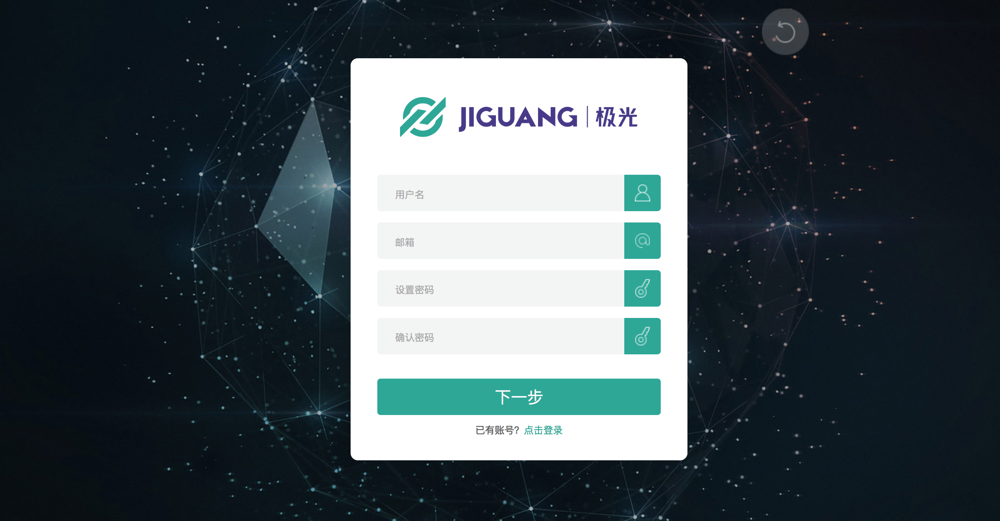
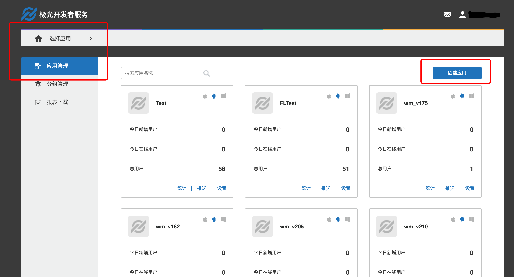
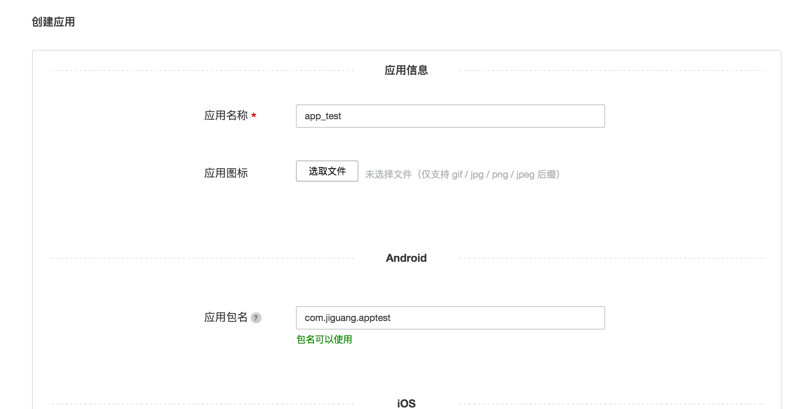
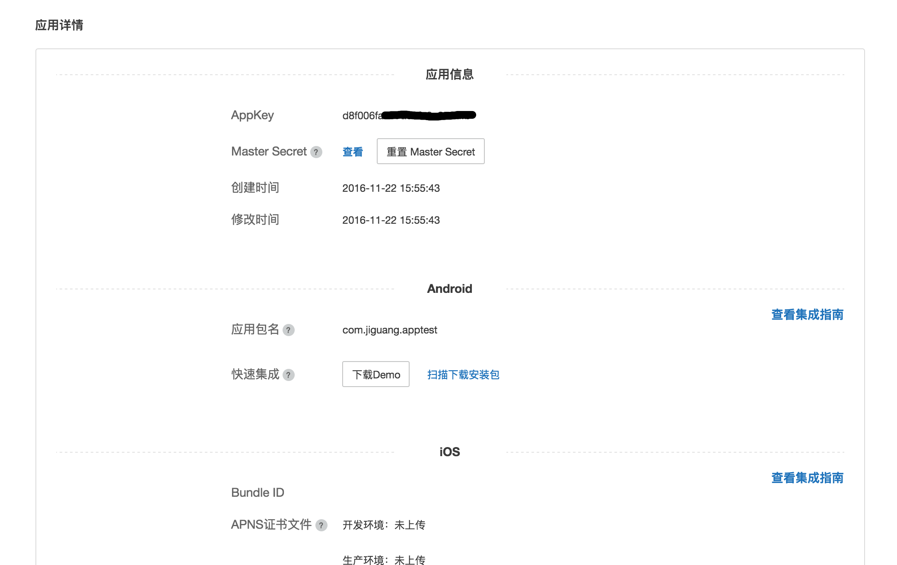

# 极光统计 Android SDK 集成指南

##使用提示

本文是JAnalytics Android SDK 标准的集成指南文档。

匹配的 SDK 版本为：v1.0.0及以后版本。

+ 如果您想要快速地测试、请参考本文在几分钟内跑通Demo。
+ 极光推送文档网站上，有相关的所有指南、API、教程等全部的文档。包括本文档的更新版本，都会及时地发布到该网站上。
+ [极光社区](http://community.jiguang.cn/)网站：大家除了文档之外，还有问题与疑问，会到这里来提问题，以及时地得到解答。

##产品说明
利用事件模板统计App用户的行为事件并上报给极光服务器，极光提供加工过的数据通过WebPortal展示给开发者，让开发者更加了解自己的应用在用户手中的使用情况。
###主要场景：

	1.统计页面流
	2.统计自定义计数事件
	3.统计自定义计算事件
	
###janalytics-android-release-1.x.y.zip 集成压缩包内容

+ AndroidManifest.xml
	+ 客户端嵌入SDK参考的配置文件
+ libs/jcore-android_v1.x.x.jar
	+ sdk 核心包
+ libs/xxx/xx.so
	+ sdk需要用的so文件
+ libs/janalytics-android-sdk_v1.x.x.jar
	+ SDK analysis 开发包
+ example
	+ 是一个完整的 Android 项目，通过这个演示了 JAnalysis SDK 的基本用法，可以用来做参考。
	
###Android SDK 版本
目前SDK只支持Android 2.3或以上版本的手机系统.

##创建应用

###创建极光开发者帐号

请访问[极光推送官方网站](https://www.jiguang.cn/push) 注册您的极光账号。

 
###Portal上创建应用

使用注册账号登陆，进入极光控制台后，点击“创建应用”按钮，进入创建应用的界面。填上你的应用程序的名称以及应用包名这二项就可以了，最后点击最下方的 “创建我的应用”按钮，创建应用完毕。

###查看应用信息

创建应用之后返回用户主页面可以看到应用清单，点选你刚才创建的应用来查看应用信息。

## JCenter 自动集成方式

***说明*** ： 使用jcenter自动集成的开发者，不需要在项目中添加jar，jcenter会自动完成依赖；jcenter 也会自动导入 JAnalytics 所需的权限和 meta-data 节点进你项目的 AndroidManifest 中。

+ 确认android studio的 Project 根目录的主 gradle 中配置了jcenter支持。（新建project默认配置就支持）
        
        buildscript {
            repositories {
                jcenter()
            }
            ......
        }
        
        allprojets {
            repositories {
                jcenter()
            }
        }
              
     
+ 在 module 的 gradle 中添加依赖和AndroidManifest的替换变量。

        
        android {
            ......
            defaultConfig {
                applicationId "com.xxx.xxx" // 你应用的包名.
                ......
      
                manifestPlaceholders = [
                    JPUSH_APPKEY : "你的appkey", //JPush上注册的包名对应的appkey.
                    JPUSH_CHANNEL : "developer-default", //暂时填写默认值即可.
                ]
                ......
            }
            ......
        }
        
        
       
        dependencies {
            ......
            
            compile 'cn.jiguang.sdk:janalytics:1.1.0' // 此处以JAnalytics 1.1.0 版本为例。
            compile 'cn.jiguang.sdk:jcore:1.1.0' // 此处以JCore 1.1.0 版本为例。
            ......
        }

##本地工程配置

+ 解压压缩包，将libs下的所有文件复制到工程的libs下面.
	+ jcore 和 janalytics 两个 jar 文件。
	+ 所有 CPU 平台的 so 文件。
+ 配置 AndroidManifest:
	+ 配置权限：添加 SDK 正常运行所必需的权限。

		   <!-- Required  一些系统要求的权限，如访问网络等-->
            <uses-permission android:name="android.permission.INTERNET" />
            <uses-permission android:name="android.permission.WAKE_LOCK" />
            <uses-permission android:name="android.permission.READ_PHONE_STATE" />
            <uses-permission android:name="android.permission.WRITE_EXTERNAL_STORAGE" />
            <uses-permission android:name="android.permission.READ_EXTERNAL_STORAGE" />
            <uses-permission android:name="android.permission.ACCESS_NETWORK_STATE" />
            <uses-permission android:name="android.permission.ACCESS_WIFI_STATE" />

           <!-- Optional for location -->
            <uses-permission android:name="android.permission.VIBRATE" />
            <uses-permission android:name="android.permission.MOUNT_UNMOUNT_FILESYSTEMS" />
            <uses-permission android:name="android.permission.WRITE_SETTINGS" />
            <uses-permission android:name="android.permission.RECEIVE_USER_PRESENT" />
            <uses-permission android:name="android.permission.SYSTEM_ALERT_WINDOW" />
            <uses-permission android:name="android.permission.ACCESS_COARSE_LOCATION" />
            <uses-permission android:name="android.permission.CHANGE_WIFI_STATE" />
            <uses-permission android:name="android.permission.ACCESS_FINE_LOCATION" />
            <uses-permission android:name="android.permission.ACCESS_LOCATION_EXTRA_COMMANDS" />
            <uses-permission android:name="android.permission.CHANGE_NETWORK_STATE" />
            <uses-permission android:name="android.permission.GET_TASKS" />
 
	+ 配置appkey：从 portal 上应用信息中获取 AppKey，并填写你的 Channel。

			<meta-data android:name="JPUSH_APPKEY" android:value="Your AppKey"/>
			<meta-data android:name="JPUSH_CHANNEL" android:value="Your Channel"/>

+ 混淆相关：在混淆文件中添加以下配置，防止 sdk 的接口被混淆。

			-keep public class cn.jiguang.analytics.android.api.** {
    			*;
			}

##添加代码

### 基础 API

+ 初始化 sdk ： 传入 application 的 context 来初始化 sdk 。

		JAnalyticsInterface.init(Context context);

+ 设置调试模式：参数为 true 表示打开调试模式，可看到 sdk 的日志。

		JAnalyticsInterface.setDebugMode(boolean isDebugMode); 
		
### 更多 API

其他 API 的使用方法请参考接口文档：[Android SDK API](http://docs-test.jiguang.cn/janalytics/client/android_api/)
    
### 运行 demo

压缩包附带的 example 是一个 API 演示例子。你可以将它导入到你的工程，并将你的 AppKey 填入到 example 的 AndroidManifest 中，然后直接运行起来测试。

    
## 技术支持

邮件联系：<support@jpush.cn>

问答社区：[极光社区](http://community.jiguang.cn/)