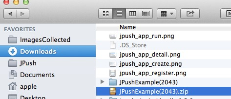

# 3 分钟快速使用 JPush Android Demo

本文目的在于，指导新接触极光推送的开发者，在短短几分钟时间内把极光推送跑起来：

+ 安装Demo客户端到手机
 
+ 在Portal上推送通知

+ 客户端收到推送并显示在状态栏pi

### 创建极光推送开发者帐号
要创建极光推送开发者帐号，请访问[极光推送官方网站https://www.jiguang.cn/push](https://www.jiguang.cn/push)

 
### Portal上创建应用
使用注册账号登陆，进入极光控制台后，点击“创建应用”按钮。创建帐号进入极光推送后，首先显示的是创建应用的界面。填上你的应用程序的名称，以及 Android包名这二项就可以了。

### 下载应用Example
点击 ”下载应用Example “

你将下载到一个 .zip 压缩文件。解压后，即看到一个同名目录。这个目录下，是一个 Android 项目里的所有文件。

### 把Example（Android项目）导入 Eclipse 里

在你的 Eclipse 里，新建一个项目，把项目目录位置指向上步骤解压缩开的 Example目录。

### 运行 Example 这个应用
上步骤导入这个 Android 项目后，你就马上可以点击鼠标右键，把这个 Android 应用跑起来了。（如果你的Eclipse设置的是自动编译的话）

如果你的 Android 手机接在电脑上了，则这个 JPush Example 应用就可以安装上，并运行起来了。

做下一步动作之前，请确保你的手机上的网络是可用的。

### Portal上推送通知

### 手机上收到通知
在上述步骤安装 JPush Example 的手机上，你就可以收到推送的通知了。

### Portal上推送消息

具体详情请查看[控制台使用](../../console/Instructions)

### 在LogCat中查看收到的自定义消息
自定义消息可以在LogCat日志中查看，开发者根据自己需要做展现处理，JPush不做干预.

