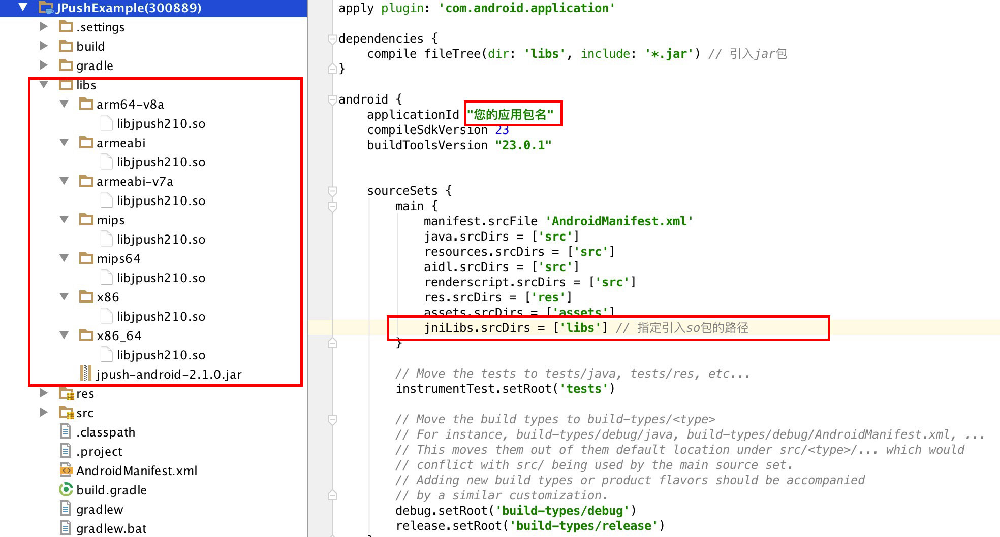

# Android SDK FAQ


## 为什么应用程序无法收到 Push 消息（Android）？

+ 确认 appKey（在Portal上生成的）已经正确的写入 Androidmanifest.xml
+ 确认测试手机（或者模拟器）已成功连入网络
+ 确认有客户端 "Login succeed" 日志


## 日志：Java.lang.UnsatisfiedLinkError


<br />
此错误是由于没有正确的加载libjpush.so文件，请检查libjpush.so是否在正确的位置(libs–>armeabi–>libjpush.so)

JPush SDK 迁移到 Android Studio 需要添加.SO文件打包到APK的lib文件夹中,可以编辑 build.gradle 脚本，自定义 *.so 目录，参考Demo：



<br />

## 日志：The permission should be defined


此错误是没有正确的定义permision，请添加权限：

```
<permission android:name="您应用的包名.permission.JPUSH_MESSAGE" android:protectionLevel="signature" />
<uses-permission android:name="您应用的包名.permission.JPUSH_MESSAGE" />
```

<br />

## 如何在代码时混淆忽略 jpush-sdk-release.jar

+ 请下载4.x及以上版本的[proguard.jar](http://sourceforge.net/projects/proguard/files/proguard/)， 并替换你Android Sdk "tools\proguard\lib\proguard.jar"

+ 开发工具使用Eclipse或者Android Studio,请在工程的project.properties中配置好proguard-android.txt，并且在proguard-android.txt配置：

		-dontoptimize
		-dontpreverify

		-dontwarn cn.jpush.**
		-keep class cn.jpush.** { *; }
		
+ 请使用 SDK1.3.X 及以后的版本

+ v2.0.5 及以上的版本由于引入了protobuf ，在上面基础之上增加排出混淆的配置。


		#==================gson==========================
		-dontwarn com.google.**
		-keep class com.google.gson.** {*;}

		#==================protobuf======================
		-dontwarn com.google.**
		-keep class com.google.protobuf.** {*;}

<br />

## 推送成功了，为什么有部分客户端收不到推送？

请检查收不到通知的手机：

+ 请在logcat查看日志，确定客户端的jpush是否集成成功，网络是否有问题
+ 请看日志或使用接口 isPushStopped来检查是否调用了stoppush
+ 检查手机的JPush高级设置中是否设置了“允许推送时间”
+ 手机的应用中是否勾选了“显示通知”

<br />

## 第三方系统收不到推送的消息

由于第三方 ROM 的管理软件需要用户手动操作

+ 小米【MIUI】
	+ 自启动管理：需要把应用加到【自启动管理】列表，否则杀进程或重新开机后进程无法开启
	+ 通知栏设置：应用默认都是显示通知栏通知，如果关闭，则收到通知也不会提示
	+ 网络助手：可以手动禁止已安装的第三方程序访问2G/3G和WIFI的网络和设置以后新安装程序是否允许访问2G/3G和WIFI的网络
	+ MIUI 7 神隐模式： 允许应用进行自定义配置模式，应用在后台保持联网可用，否则应用进入后台时，应用无法正常接收消息。【设置】下电量和性能中【神隐模式】

+ 华为【Emotion】
	+ 自启动管理：需要把应用加到【自启动管理】列表，否则杀进程或重新开机后进程不会开启，只能手动开启应用
	+ 后台应用保护：需要手动把应用加到此列表，否则设备进入睡眠后会自动杀掉应用进程，只有手动开启应用才能恢复运行
	+ 通知管理：应用状态有三种：提示、允许、禁止。禁止应用则通知栏不会有任何提醒

+ 魅族【Flyme】
	+ 自启动管理：需要把应用加到【自启动管理】列表，否则杀进程或重新开机后进程无法开启
	+ 通知栏推送：关闭应用通知则收到消息不会有任何展示
	+ 省电管理： 安全中心里设置省电模式，在【待机耗电管理】中允许应用待机时，保持允许，否则手机休眠或者应用闲置一段时间，无法正常接收消息。

+ VIVO【Funtouch OS】
	+ 内存一键清理：需要将应用加入【白名单】列表，否则系统自带的“一键加速”，会杀掉进程
	+ 自启动管理：需要将应用加入“i管家”中的【自启动管理】列表，否则重启手机后进程不会自启。但强制手动杀进程，即使加了这个列表中，后续进程也无法自启动。

+ OPPO【ColorOS】
	+ 冻结应用管理：需要将应用加入纯净后台，否则锁屏状态下无法及时收到消息
	+ 自启动管理：将应用加入【自启动管理】列表的同时，还需要到设置-应用程序-正在运行里锁定应用进程，否则杀进程或者开机后进程不会开启，只能手动开启应用


<br />

## Android 5.0 系统报错:INSTALL_FAILED_DUPLICATE_PERMISSION

与 5.0的多账户系统有关，其中一个账号安装一个应用，其他账号也会自动安装了这个应用；如果其中一个账号卸载了这个应用，那其他账号是不受影响的（其他账号仍有这个应用），所以如果在某个账号下卸载了应用，安装一个同包名但是签名不一致的包，就会安装失败了。

解决办法：在各个账户上的安装这个程序的应用卸载，然后重新安装即可解决这个问题。

<br />

## AsyncTask就没办法执行到onPostExecute()方法

这是Android 旧系统带有的问题，解决办法如下：

在application里onCreate方法加上：

```
try {
            Class.forName("android.os.AsyncTask");
        } catch (ClassNotFoundException e) {
            e.printStackTrace();
        }
```

详情请看链接：[https://code.google.com/p/android/issues/detail?id=20915](https://code.google.com/p/android/issues/detail?id=20915)


<br />

## Tag、Alias、Registrationid需要每次初始化时都重新设置吗，会变化吗？

+ tag、alias可以参考[别名与标签 API](android_api)进行设置，每次设置是覆盖设置，而不是增量设置。Tag和alias一经设置成功，除非取消或覆盖，是不会变化的。设置好的tag、alias与客户端的对应关系保存在JPush服务器，目前没有从JPush服务器查询这个对应关系的接口，所以需要客户将对应关系保存在APP应用服务器。

+ Registrationid是客户端SDK第一次成功连接到Jpush服务器时，Jpush服务器给分配的。可以通过[获取 RegistrationID](android_api) API来获取Registrationid进行推送。Registrationid对应一个应用的一个客户端。

<br />

## 没有沙箱API怎么测试？

 直接用 JPush 的 API 测试就行。
 
<br />

## 其他国家能否使用极光推送（局域网能否使用极光推送）？

只要能连网到Jpush服务器都可以。判断能否联网到Jpush服务器的方法：ping通 api.jpush.cn 8800

<br />

## 为什么发送推送提示没有任何设备或调用API返回1011


这可能有两种情况：

+ SDK没有集成成功，客户端有 "Login succeed" 日志才表示SDK集成成功。
+ 设置别名或标签失败，请调用带返回值的函数[Method - setAliasAndTags (with Callback)](android_api)来设置标签或别名，同时参考[错误码定义](android_api)来修改直到设置成功返回0.

<br />

## 可以打开 www.jiguang.cn，但打不开docs，提示无法找到docs.jiguang.cn

+ 提示客户换个浏览器试试
+ 如果还是不行，执行下面的命令反馈结果排查一下问题
	+ ping docs.jiguang.cn
	+ nslookup docs.jiguang.cn
	+ telnet docs.jiguang.cn
	+ 提供一下自己机器访问外网其他网站是否正常

<br />

## appkey是怎么对应的？

android 的包名和 appkey 需对应。

<br />

## 内网使用极光推送应该怎么设置？

内网使用极光推送需要服务器开放下列端口限制，用于JPush的登录注册及保持推送长链接：   

+ 19000
+ 3000-3020
+ 7000-7020
+ 8000-8020

<br />


