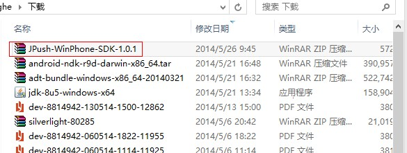
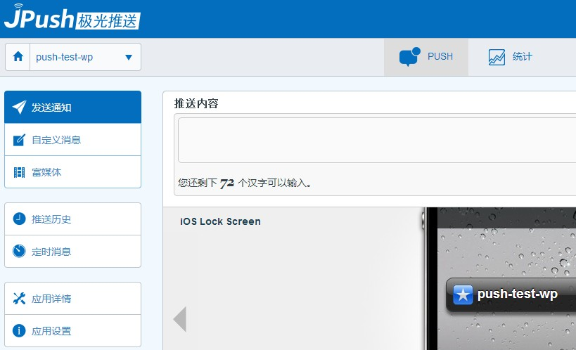

#Windows Phone 3分钟快速demo

本文的目的在于，指导新接触极光推送的开发者，在短短几分钟内把极光推送跑起来

+ 安装Demo客户端到手机
+ 在Portal上推送通知

### 创建极光推送开发者账号
要创建极光推送开发者帐号，请访问[极光推送官方网站（http://www.jiguang.cn）](http://www.jiguang.cn)

首先填写登陆信息后，点击“我同意，现在注册”

然后填写注册信息，点击“完成注册”

### Portal上创建应用
创建帐号进入极光推送后，首先显示的是创建应用的界面。填上你的应用程序的名称，拉动滚动条到底部以及选中windows phone项的单选按钮

### 下载应用Example

首先下载[windows phone sdk](../../resources)

点击 ”下载最新版本的Windows Phone SDK “后，你将下载到一个 .zip 压缩文件。解压后，即看到一个同名目录。这个目录的“example”文件夹下，是一个Windows phone 项目里的所有文件。

### 修改Example（Windows Phone项目）app_key和channel
打开example项目

打开后如下图

打开App.xaml.cs文件，在Application_Launching函数中，将 JPushSDK.JServer.Setup函数的“app_key”修改为Portal中创建的应用的app_key,“channel”修改为需要的渠道

### 运行 Example 这个应用

上步骤导入这个 Windows phone项目后，你就马上可以按F5, 运行把这个Windows phone 应用跑起来了

如果你的 Windows phone 手机接在电脑上了，则这个 JPush Example 应用就可以安装上，并运行起来了。

做下一步动作之前，请确保你的手机上的网络是可用的。

### Portal上推送通知

发送消息时，选中需要的平台（Windows phone）

在上述步骤安装 JPush Example 的手机上，你就可以收到推送的通知了

