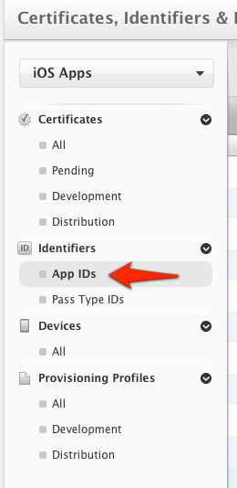
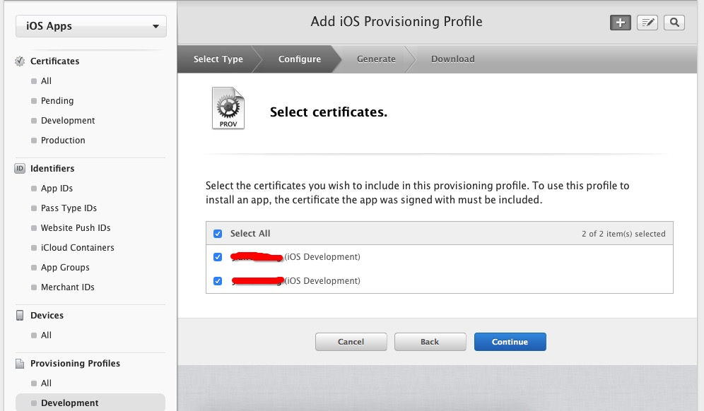

# iOS 证书 设置指南

## 创建应用程序ID

+ 登陆 [iOS Dev Center](https://developer.apple.com/devcenter/ios/index.action) 选择进入iOS Provisioning Portal。


+ 在 [iOS Provisioning Portal](https://daw.apple.com/cgi-bin/WebObjects/DSAuthWeb.woa/wa/login?&appIdKey=891bd3417a7776362562d2197f89480a8547b108fd934911bcbea0110d07f757&path=%2F%2Faccount%2Findex.action)中，点击App IDs进入App ID列表。



+ 创建 App ID，如果 ID 已经存在可以直接跳过此步骤


+ 为 App 开启 Push Notification 功能。如果是已经创建的 App ID 也可以通过设置开启 Push Notification 功能。


根据实际情况完善 App ID 信息并提交,注意此处需要指定具体的 Bundle ID 不要使用通配符。


## 配置和下载证书

+ 如果你之前没有创建过 Push 证书或者是要重新创建一个新的，请在证书列表下面新建。


+ 新建证书需要注意选择证书种类（开发证书用于开发和调试使用，生产证书用于 App Store 发布）


+ 点击 Continue 后选择证书对应的应用ID，然后继续会出现“About Creating a Certificate Signing Request (CSR)”。


+ 根据它的说明创建打开KeychainAccess 创建 Certificate Signing Request。


+ 填写“User Email Address”和“Common Name” 后选择 Saved to disk 进行保存 。


+ 继续返回Apple developer 网站点击 Continue ，上传刚刚生成的 .certSigningRequest 文件生成 APNs Push  Certificate。
+ 下载并双击打开证书，证书打开时会启动“钥匙串访问”工具。
+ 在“钥匙串访问”中你的证书会显示在“我的证书”中，注意选择“My Certificates” 和"login"


## 导出 .p12 证书文件

```
注意要选“login”和“My Certificates” 导出证书时要选中证书文件，不要展开private key。
```


+ 将文件保存为Personal Information Exchange (.p12)格式。


+ 将文件保存为Personal Information Exchange (.p12)格式。

## 上传证书

在 [JPush 管理 Portal 上](https://www.jiguang.cn/apps/)，针对某应用程序，上传上面步骤得到 .p12 证书文件。这是 iOS SDK 能够接收到 JPush 推送消息的必要步骤。


## Provisioning Profile的创建

+ 创建Provisioning Profile的前提，已在Apple Developer网站创建待发布应用所使用的Bundle ID的App ID，且为该App ID创建了APNs证书，如下图:


+ 创建App ID、APN证书和p12证书的导出的具体步骤请看 :[iOS 证书 设置指南](ios_faq/#ios_1)

+ 在[苹果开发者账号的Provisioning Profile](https://developer.apple.com/account/ios/profile/profileList.action)页面点击下图按钮，创建Provisioning Profile


+ 选择此Provisioning Profile的环境后点击[Continue]：


+ 选择要创建Provisioning Profile的App ID后点击[Continue]：


+ 选择所属的开发者证书，（这里创建了多个开发者证书，建议只创建一个，方便管理）为了方便，选择了[Select All]，再点击[Continue]进入下一步：



+ 为该Provisioning Profile选择将要安装的设备（一般选择[Select All]），点击[Continue]:


+ 给该Provisioning Profile填写Profile Name，点击[generate]完成创建。


+ 填写完Profile Name后点击[generate]完成创建，之后点击[DownLoad]下载Provisioning Profile


+ 双击下载下来的Provisioning Profile，添加到xcode。

## XCode的证书配置教程

参照[iOS SDK 集成指南](ios_guide_new/)集成JPush SDK 和上传了推送用到的p12证书后在编译运行前需要先配置一下证书，步骤如下：

+ 打开xxx-info.plist的Bundle identifier项把上传到JPush 控制台的bundle id填写进去：


+ 点击项目，选择目标TARGETS后进入Build Setting 界面，搜索“Code signing”，按照下图配置


