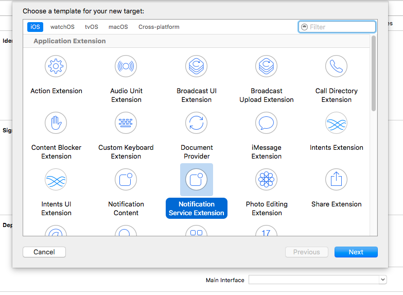
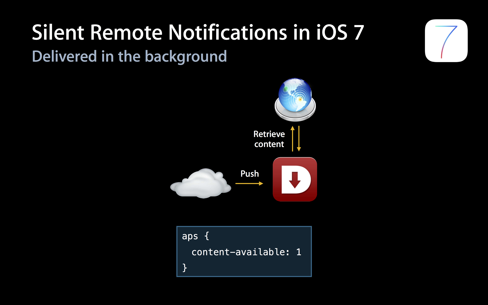

# iOS 新特性更新汇总

## iOS 10 New Features

### 说明
iOS 10 新增了大量关于通知的新特性，详情参照极光官方的Blog。  
请跳转至：[iOS 10 新特性](http://blog.jiguang.cn/newfeture_notification_ios10/)

## iOS 10 Service Extension

### 说明
iOS 10新增了Service Extension  
官方给出的说明图如下  
  
这意味着在APNs到达我们的设备之前，还会经过一层允许用户自主设置的Extension服务进行处理，为APNs增加了多样性。

### 使用方法
Service Extension使用起来很容易上手，首先我们需要创建一个Service Extension服务,如下图  
  
然后这里需要注意几个点

+ Service Extension的Bundle Identifier不能和Main Target（也就是你自己的App Target）的Bundle Identifier相同，否则会报BundeID重复的错误。
+ Service Extension的Bundle Identifier需要在Main Target的命名空间下，比如说Main Target的BundleID为com.jpush.xxx，那么Service Extension的BundleID应该类似与io.jpush.xxx.yyy这样的格式。如果不这么做，你可能会遇到一个错误。

那么现在你的Service Extension服务已经创建成功了，此时你已经成功的使用了Service Extension，但是好像我们还没有对它做什么操作，看看你的项目，你得到了一个类，这个类中包含两个方法。

+ didReceiveNotificationRequest:(UNNotificationRequest *)request withContentHandler:(void (\^)(UNNotificationContent *contentToDeliver))contentHandler
+ serviceExtensionTimeWillExpire

我们来看一下第一个方法的官方解释：Call contentHandler with the modified notification content to deliver. If the handler is not called before the service's time expires then the unmodified notification will be delivered。
简单解释一下，APNs到来的时候会调用这个方法，此时你可以对推送过来的内容进行处理，然后使用contentHandler完成这次处理。但是如果时间太长了，APNs就会原样显示出来。
也就是说，我们可以在这个方法中处理我们的通知，个性化展示给用户。
而第二个方法，是对第一个方法的补救。第二个方法会在过期之前进行回调，此时你可以对你的APNs消息进行一下紧急处理。


## iOS 9集成

### iOS 9变动影响SDK部分:

+ 增加了bitCode编码格式,当SDK不支持bitCode时，用户集成时无法开启bitCode选项.
	+ 现象:用户集成SDK后无法编译通过，错误日志里包含了bitCode的相关错误信息
+ 默认使用https连接,如果请求为http,需要手动配置plist来支持http服务，当前我们的服务器请求都走http服务。
	+ 现象:用户集成SDK后，所有JPush相关的http服务都提示连接错误或者连接超时,可能是此问题。

### bitCode解决方式

+ JPush iOS SDK v1.8.7 及以上版本的SDK,已经增加对 iOS 9 新特性 bitCode 的支持.JMessage iOS SDK v2.0.0 及以上版本支持bitCode。

### Https解决方式

JPush 2.1.9以后的版本则不需要配置此步骤 

+ 需要用户主动在当前项目的Info.plist中添加NSAppTransportSecurity类型Dictionary。
+ 在NSAppTransportSecurity下添加NSAllowsArbitraryLoads类型Boolean,值设为YES


## iOS 9 UIUserNotificationActionBehaviorTextInput

### 支持版本
v1.8.0 版本开始

1. 本次iOS 9在推送方面最大的变化就是修改了推送Category的类型，在原本的推送categories的基础上，增加了一个text Action类型，这个参数的目的是用来注册通过通知快捷文字输入的事项。
2. 这个categories由一系列的 UIUserNotificationCategory组成。每个UIUserNotificationCategory对象允许添加一组UIMutableUserNotificationAction类型的参数来增加通知栏上的项目。如今iOS9在原有的UIMutableUserNotificationAction类型增加了Text输入类型(UIUserNotificationActionBehaviorTextInput),通过behavior来设置(只有iOS9才拥有的属性)。
3. 回调的方法iOS9使用了两个新的回调方法来处理点击按钮的事件:

```
- (void)application:(UIApplication *)application handleActionWithIdentifier:(nullableNSString *)identifier forLocalNotification:(UILocalNotification *)notification withResponseInfo:(NSDictionary *)responseInfo completionHandler:(void(^)())completionHandler NS_AVAILABLE_IOS(9_0)

- (void)application:(UIApplication *)application handleActionWithIdentifier:(nullableNSString *)identifier forRemoteNotification:(NSDictionary *)userInfo withResponseInfo:(NSDictionary *)responseInfo completionHandler:(void(^)())completionHandler NS_AVAILABLE_IOS(9_0)

```

**说明**:

+ 当Action为UIUserNotificationActionBehaviorTextInput时,需要通过responseInfo的UIUserNotificationActionResponseTypedTextKey来获取输入的文字内容,UIUserNotificationTextInputActionButtonTitleKey获取点击的按钮类型.

+ 当Action为UIUserNotificationActionBehaviorDefault时,responseInfo为nil,通过identifier来区分点击按钮分别是什么来做处理. 

### 客户端设置

**设置带有快速回复内容的通知**

```
#ifdef __IPHONE_9_0 
 UIMutableUserNotificationAction *replyAction = [[UIMutableUserNotificationAction alloc]init];
 replyAction.title = @"Reply";
 replyAction.identifier = @"comment-reply";
 replyAction.activationMode = UIUserNotificationActivationModeBackground;
 replyAction.behavior = UIUserNotificationActionBehaviorTextInput;
  
 UIMutableUserNotificationCategory *category = [[UIMutableUserNotificationCategory alloc]init];
 category.identifier = @"reply";
 [category setActions:@[replyAction] forContext:UIUserNotificationActionContextDefault];
#endif
```

**使用回调函数**

```
- (void)application:(UIApplication *)application handleActionWithIdentifier:(nullable NSString *)identifier forRemoteNotification:(NSDictionary *)userInfo withResponseInfo:(NSDictionary *)responseInfo completionHandler:(void(^)())completionHandler NS_AVAILABLE_IOS(9_0) {
 if ([identifier isEqualToString:@"comment-reply"]) {
 NSString *response = responseInfo[UIUserNotificationActionResponseTypedTextKey];
 //对输入的文字作处理
 }
 completionHandler();
 }
```

### 服务端设置

服务端payload格式:aps增加category字段，当该字段与客户端UIMutableUserNotificationCategory的identifier匹配时，触发设定的action和button显示。

```
payload example:
{"aps":{"alert":"example", "sound":"default", "badge": 1, "category":"reply"}}
```

## iOS 8 UILocalNotification


本次iOS 8 UILocalNotification增加了三个参数: region、regionTriggersOnce、category。

+ region: 用于控制当用户进入或者离开某一个地理位置时候，触发通知。使用此功能，用户需要拥有CoreLocation的"when-in-use"权限。
+ regionTriggersOnce(BOOL)：当为YES时，通知只会触发一次，当为NO时，通知将会在每一次进入或者离开时都触发。
+ category:如果localNotification通过+[UIUserNotificationSettings settingsForUserNotificationTypes:userNotificationActionSettings:]注册了，通过该category可以获取该通知的注册category.

### 客户端设置

#### 使用UILocalNotification

```
// set localNotification
  CLLocationCoordinate2D coordinate2D;
  coordinate2D.latitude = 100.0;
  coordinate2D.longitude = 100.0;
  CLRegion *currentRegion =
      [[CLCircularRegion alloc] initWithCenter:coordinate2D
                                        radius:CLLocationDistanceMax
                                    identifier:@"test"];
 
  [APService setLocalNotification:[NSDate dateWithTimeIntervalSinceNow:120]
                        alertBody:@"test ios8 notification"
                            badge:0
                      alertAction:@"取消"
                    identifierKey:@"1"
                         userInfo:nil
                        soundName:nil
                           region:currentRegion
               regionTriggersOnce:YES
                         category:@"test"];
```
</br>


## iOS 8 UIUserNotificationSettings

### 支持版本
v1.8.0 版本开始。

+ 本次iOS 8在推送方面最大的变化就是修改了推送的注册接口，在原本的推送type的基础上，增加了一个categories参数，这个参数的目的是用来注册一组和通知关联起来的button的事件。
+ 这个categories由一系列的 UIUserNotificationCategory组成。每个UIUserNotificationCategory对象包含你的app用来响应本地或者远程通知的信息。每一个对象的title作为通知上每一个button的title展示给用户。当用户点击了某一个button，系统将会调用应用内的回调函数[application:handleActionWithIdentifier:forRemoteNotification:completionHandler:](https://developer.apple.com/library/prerelease/ios/documentation/UIKit/Reference/UIApplicationDelegate_Protocol/index.html#//apple_ref/occ/intfm/UIApplicationDelegate/application:handleActionWithIdentifier:forRemoteNotification:completionHandler:)或者[application:handleActionWithIdentifier:forLocalNotification:completionHandler:](https://developer.apple.com/library/prerelease/ios/documentation/UIKit/Reference/UIApplicationDelegate_Protocol/index.html#//apple_ref/occ/intfm/UIApplicationDelegate/application:handleActionWithIdentifier:forLocalNotification:completionHandler:)。

### 客户端设置

#### 使用UIUserNotificationCategory

```
if ([[UIDevice currentDevice].systemVersion floatValue] >= 8.0) {
 
 NSMutableSet *categories = [NSMutableSet set];
 
 UIMutableUserNotificationCategory *category = [[UIMutableUserNotificationCategory alloc] init];
 
 category.identifier = @"identifier";
 
 UIMutableUserNotificationAction *action = [[UIMutableUserNotificationAction alloc] init];
 
 action.identifier = @"test2";
 
 action.title = @"test";
 
 action.activationMode = UIUserNotificationActivationModeBackground;
 
 action.authenticationRequired = YES;
 
 //YES显示为红色，NO显示为蓝色
 action.destructive = NO;
 
 NSArray *actions = @[ action ];
 
 [category setActions:actions forContext:UIUserNotificationActionContextMinimal];
 
 [categories addObject:category];
}
```

#### 使用UIUserNotificationType

```
if ([[UIDevice currentDevice].systemVersion floatValue] >= 8.0) {
[APService registerForRemoteNotificationTypes:(UIUserNotificationTypeBadge | UIUserNotificationTypeSound | UIUserNotificationTypeAlert)                      categories:categories];
}else{
[APService registerForRemoteNotificationTypes:(UIUserNotificationTypeBadge | UIUserNotificationTypeSound | UIUserNotificationTypeAlert)                      categories:nil];
}
```

#### 使用回调函数

```
// Called when your app has been activated by the user selecting an action from
// a remote notification.
// A nil action identifier indicates the default action.
// You should call the completion handler as soon as you've finished handling
// the action.
- (void)application:(UIApplication *)application handleActionWithIdentifier:(NSString *)identifier forRemoteNotification:(NSDictionary *)userInfo
  completionHandler:(void (^)())completionHandler {
}
```

### 服务端设置

服务端payload格式:aps增加category字段，当该字段与客户端UIMutableUserNotificationCategory的identifier匹配时，触发设定的action和button显示。

```
payload example:
{"aps":{"alert":"example", "sound":"default", "badge": 1, "category":"identifier"}}

```


## iOS 7 Background Remote Notification


本次iOS 7在推送方面最大的变化就是允许，应用收到通知后在后台（background）状态下运行一段代码，可用于从服务器获取内容更新。功能使用场景：（多媒体）聊天，Email更新，基于通知的订阅内容同步等功能，提升了终端用户的体验。

Remote Notifications 与之前版本的对比可以参考下面两张 Apple 官方的图片便可一目了然。


如果只携带content-available: 1 不携带任何badge，sound 和消息内容等参数，则可以不打扰用户的情况下进行内容更新等操作即为“Silent Remote Notifications”。




### 客户端设置

#### 开启Remote notifications

需要在Xcode 中修改应用的 Capabilities 开启Remote notifications，请参考下图：


#### 修改通知处理函数

当注册了Backgroud Modes -> Remote notifications 后，notification 处理函数一律切换到下面函数，后台推送代码也在此函数中调用。

	- (void)application:(UIApplication *)application didReceiveRemoteNotification:(NSDictionary *)userInfo fetchCompletionHandler:(void (^)(UIBackgroundFetchResult))completionHandler；

### 服务端推送设置

推送消息携带 content-available: 1 是Background 运行的必须参数，如果不携带此字段则与iOS7 之前版本的普通推送一样。

#### 使用Web Portal 推送

在“可选设置内”选择对应的参数。


#### 使用 API 推送

只需在[Push API v3](../../server/push/rest_api_v3_push/#notification) 的 ios 内附加content-available":true 字段即可

### 限制与注意

+ “Silent Remote Notifications”是在 Apple 的限制下有一定的频率控制，但具体频率不详。所以并不是所有的 “Silent Remote Notifications” 都能按照预期到达客户端触发函数。
+ “Background”下提供给应用的运行时间窗是有限制的，如果需要下载较大的文件请参考 Apple 的 NSURLSession 的介绍。
+ “Background  Remote Notification”  的前提是要求客户端处于Background 或 Suspended 状态，如果用户通过 App Switcher 将应用从后台 Kill 掉应用将不会唤醒应用处理 background 代码。

更详细的说明资料请查阅 Apple 官方的 iOS 开发文档。


