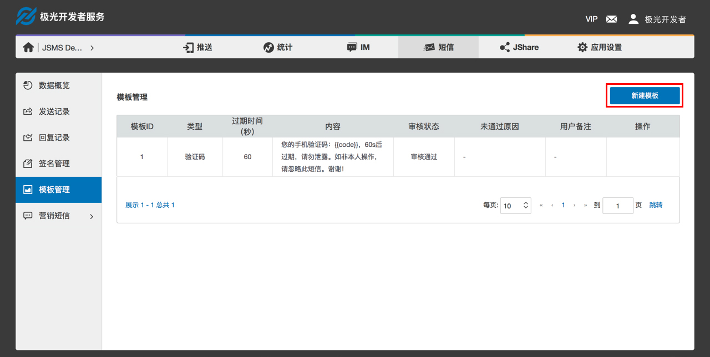
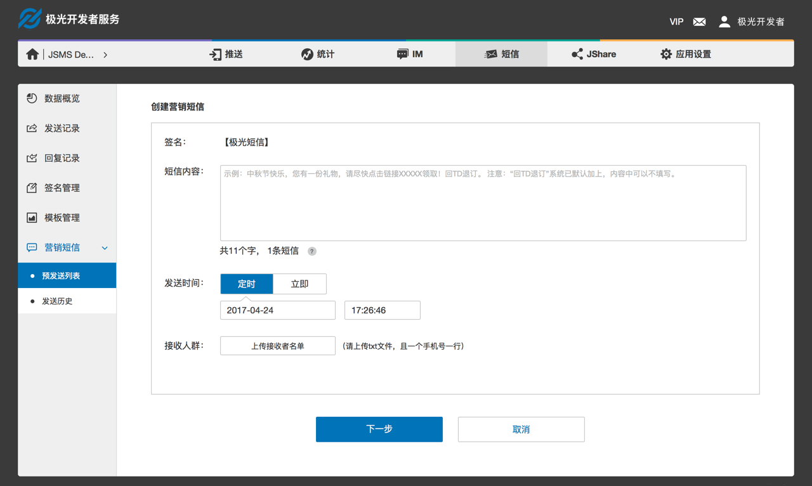
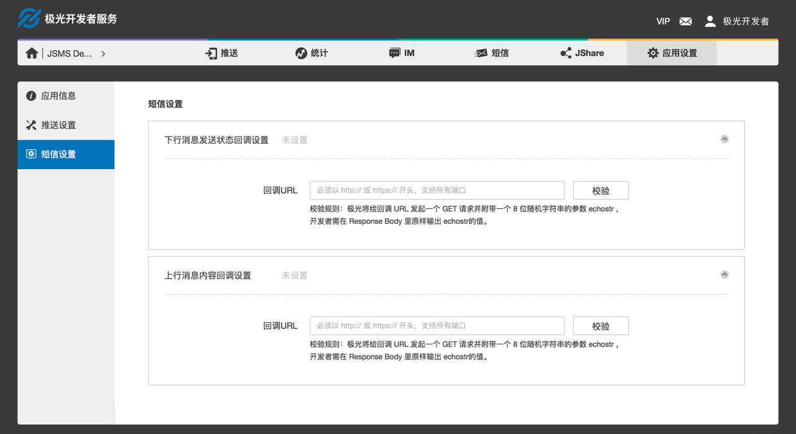

#控制台操作指南
##开发者认证
因运营商要求，短信业务需完成个人实名认证或企业资质认证后使用。
###个人认证
支持个人开发者认证，认证内容均必填，且认证通过后不允许修改，请认真填写个人认证资料，避免影响日后使用短信业务。
####操作路径
Step1：登入控制台  
Step2：进入账号  
Step3：右侧菜单中选择［开发者认证］  
Step4：开发者类型选择［个人］  


###企业认证
支持企业开发者认证，认证内容均必填，且认证通过后不允许修改，请认真填写企业认证资料，避免影响日后使用短信业务。
####操作路径
Step1：登入控制台  
Step2：进入账号  
Step3：右侧菜单中选择［开发者认证］  
Step4：开发者类型选择［企业］ 


##创建应用
####操作步骤
Step1：登入控制台  
Step2：点击［创建应用］按钮  
  

Step3：填写［应用名称］和［应用图标］，其中［应用名称］为必填。  


##签名设置
签名显示在短信内容的最前面，示意这条短信来自哪家公司，哪款产品或哪个软件。因运营商要求，签名需通过审核后使用，正常情况下审核周期为两个工作日。
####操作路径
Step1：登入控制台  
Step2：进入短信业务模版  
Step3：右侧菜单中选择［签名管理］  
Step4：点击［新建签名］按钮  


####创建签名
* 签名支持上传 2～10 个中英文或数字，不允许输入空格或特殊符号;  
* 当签名签名与开发者认证信息不一致时，请上传签名相关证件图片;
* 若已有使用中签名，创建的新签名通过审核后将直接替换老签名。  


##模板设置
模板为带参数的短信内容，API 调用时直接填写模板 ID 和对应的参数内容即可。因运营商要求，模板需通过审核后才可使用，正常情况下审核周期为工作时间三小时内。
###操作路径
Step1：登入控制台  
Step2：进入短信业务模板  
Step3：右侧菜单中选择［模板管理］  
Step4：点击［新建模板］按钮  


###创建模板
* 模板类型：支持创建文本验证码类短信模板、通知类短信模板和营销类短信模板；
* 模版格式：模板中参数格式为  {{key-name}}，其中分隔符采用两个大括号；
* 验证码类模板：参数名必须为code，当设置多个参数，参数名必须全为code，验证码类模版中支持设置验证码有效期，有效期必须在0～24小时之间，单位为秒；  
 
 
* 通知类模板：模板中必须至少包含一个参数，参数名由开发者指定，仅支持字母及下划线，且下划线不允许在开头和结尾；  


* 营销类模板：模板中必须至少包含一个参数，参数名由开发者指定，仅支持字母及下划线，且下划线不允许在开头和结尾，根据运营商规定，营销短信内容中必须包含退订相关信息，系统已默认添加“回TD退订”，模板中可不填写；  


* 默认模版：目前仅验证码类短信模版有默认模版，当未设置签名时，默认模版使用［极光推送］的签名。

##营销短信
营销短信除了可以通过调用 API 发送，还可以在网站发送，并且支持定时发送。
###创建营销短信
####操作路径
Step1：登入控制台  
Step2：进入短信业务模版  
Step3：右侧菜单中选择［营销短信］中的［预发送列表］  
Step4：点击［创建营销短信］按钮  

     
####创建营销短信
 
* 签名将自动写入使用中的签名，若未设置签名，请先设置签名在创建营销短信；
* 短信内容：输入短信内容，根据运营商规定，营销短信内容中必须包含退订相关信息，系统已默认添加“回TD退订”，内容中可不填写；
* 发送时间：支持即使发送或定时发送，营销短信通过审核后将按照预定时间发送；
* 接受人群：上传txt文件，一个手机号一行；
* 全部填写完，点击下一步，确认信息无误后，点击确认，创建成功并冻结对应余量。  



查看预发送列表 
可查看营销短信审核结果，和未到发送时间｀的营销短信。
##查看数据
* 数据概览可查看该应用数据，包括短信余量，发送量和消耗量；
* 所有类型的短信，包括：验证码类、通知类、营销类和推送补充类的发送记录可在发送记录中查看；
* 收到的所有上行短信记录可在回复记录中查看；
* 营销短信发送记录也可以在营销短信的发送历史中查看。  

##回调设置
下行消息发送状态和上行消息内容支持以回调的形式传给开发者，若需要使用回调接口，需先在控制台填写回调地址并通过校验。
###设置回调地址
####操作路径
Step1：登入控制台  
Step2：进入应用模版  
Step3：右侧菜单中选择［短信设置］  
Step4：点击选择需要使用的回调接口  


####设置回调地址
在控制台填写回调地址，回调地址必须以 http:// 或 https:// 开头，支持所有端口。填写回调地址后需校验通过后才可以使用，校验规则：极光将给回调 URL 发起一个 GET 请求并附带一个 8 位随机字符串的参数 echostr，开发者需要在 Response Body 里原样输出 echostr 的值。   

###回调消息格式
####回调方式说明
当有回调消息时，将采用HTTP POST的方式向开发者填写的回调URL提交通知消息。需要注意的是，如果回调失败，那么极光将会在一定的时间间隔后重试，最多重试三次。重试回调的时间间隔分别是3分钟、1小时、12小时。
####回调的基础参数如下
|KEY|REQUIRE|DESCRIPTION|
|----|----|----|
|nonce|Long|随机长整数|    
|signature|  String|签名，结合appKey、appMasterSecret、nonce、timestamp生成|
|timestamp|  Long|  当前时间戳，毫秒值|
|type|  String|  通知类型（SMS_REPORT/SMS_REPLY）|
|data|  String|  通知内容，json字符串，开发者可以根据type反序列化data|

####signature生成校验规则
* 将appKey、appMasterSecret、nonce、timestamp的值代入生成字符串appKey={appKey}&appMasterSecret={appMasterSecret}&nonce={nonce}&timestamp={timestamp}；
* 对生成的字符串进行sha1加密；
* 开发者把接收到的signature和自己本地代码按照同样规则生成的签名作对比，如果一致，则可以认定此回调来自极光。

####下行消息送达状态回调参数

|CODE| TYPE| DESCRIPTION|
|----|----|----|
|msgId|	String| api 调用的时候返回的 msg_id|
|status| Integer| 发送状态返回码|
|receiveTime| Date| 短信送达时间|
|phone|	String| 短信送达手机号|

####发送状态返回码

|CODE|DESCRIPTION|
|----|----|
|4001|发送成功|
|4002|被叫手机号为运营商黑名单，需联系运营商处理|
|4003|手机终端问题，手机关机、停机等，请确认手机状态是否正常|
|4004|被叫手机号为空号，请核实手机号是否合规|
|4100|其他错误|

####上行消息内容回调参数 

|CODE| TYPE| DESCRIPTION|
|---| ----| ----|
|phon| String| 主叫号码（用户手机号）|
|replyTim| Date| 消息送达到极光业务的时间|
|conten| String| 用户回复的消息内容|

###回调测试

####控制台回调设置页面测试
开发者点击回调设置页面中的测试按钮，极光将发起一次回调，将固定的测试数据回调到开发者提供的回调地址上。开发者可以通过检查是否收到回调请求，且接收到的数据是否与下面表格中一致以判断回调请求是否成功。  


#####上行短信发送内容回调测试数据
|KEY| VALUE|
|----|----|
|content|	TD|
|phone|	13000000000|
|replyTime|	1492150740292|

#####下行短信发送状态回调测试数据
|KEY| VALUE|
|----|----|
|msgId|	1857496|
|phone|	13000000000|
|receiveTime|	1492150740292|
|status|	4001|

####curl模拟POST回调请求
在linux上可以很方便的使用curl命令发起HTTP POST请求，在windows下需要安装curl工具软件。以下是curl模拟回调的示例

#####上行消息内容回调

 ```
curl -d "nonce=7659972084945889195&timestamp=1492150740274&signature=007eff6a105503211b472802eecc42465582ba70&type=SMS_REPLY&data＝{\"content\":\"TD\",\"phone\":\"13720481024\",\"replyTime\":1492150740292}" "http://localhost:8088/callback"
```

#####下行消息发送状态回调

``` 
curl -d "nonce=7659972084945889195&timestamp=1492150740274&signature=007eff6a105503211b472802eecc42465582ba70&type=SMS_REPORT&data={\"msgId\":\"1652496\",\"phone\":\"15822889320\",\"receiveTime\":1492150741392,\"status\":4001}" "http://localhost:8088/callback"
```

####HttpClient模拟POST回调请求

以下是Java语言使用apache HttpClient组件模拟回调的示例： 
 
CallbackTest.java  

```

package cn.jiguang.sms.dev.sample;  
 
import cn.jiguang.sms.dev.sample.model.SendStateMessage;  
import cn.jiguang.sms.dev.sample.util.SHA1Utils;  
import com.alibaba.fastjson.JSON;  
import org.apache.http.HttpResponse;  
import org.apache.http.NameValuePair;  
import org.apache.http.client.HttpClient;  
import org.apache.http.client.entity.UrlEncodedFormEntity;  
import org.apache.http.client.methods.HttpPost;  
import org.apache.http.impl.client.HttpClients;  
import org.apache.http.message.BasicNameValuePair;  
 
import java.io.IOException;  
import java.security.MessageDigest;  
import java.security.NoSuchAlgorithmException;  
import java.util.*;  
 
/**  
 * Created by jiguang on 2017/4/14.  
 */  
public class CallbackTest {  
    private final static String URL = "http://localhost:8088/callback"; // 开发者将自己的回调URL写入  
    private final static String APPKEY = "dev_sample_appKey";       // 开发者将自己的appKey写入  
    private final static String APPMASTERSECRET = "dev_sample_appMasterSecret"; // 开发者将自己的appMasterSecret写入  
    public static void main(String[] args) throws IOException {
        long nonce = new Random().nextLong();
        long timestamp = System.currentTimeMillis();
        String str = String.format("appKey=%s&appMasterSecret=%s&nonce=%s&timestamp=%s",
                APPKEY, APPMASTERSECRET, nonce, timestamp);  
        String signature = encrypt(str);  
        Map<String, Object> params = new HashMap<>();  
        params.put("nonce", nonce);  
        params.put("timestamp", timestamp);  
        params.put("signature", signature);  
 
        // 测试用户回复消息回调
        ReplyMessage replyMessage = new ReplyMessage();
        replyMessage.setPhone("13720481024");
        replyMessage.setReplyTime(new Date());
        replyMessage.setContent("TD");
        params.put("data", JSON.toJSONString(replyMessage));
        params.put("type", "SMS_REPLY");
        System.out.println("post params: " + JSON.toJSONString(params));
        sendPost(URL, params);
 
        // 测试短信送达状态回调
        SendStateMessage sendStateMessage = new SendStateMessage();
        sendStateMessage.setMsgId("1652496");
        sendStateMessage.setStatus(4001);
        sendStateMessage.setPhone("15822889320");
        sendStateMessage.setReceiveTime(new Date());
        params.put("data", JSON.toJSONString(sendStateMessage));
        params.put("type", "SMS_STATE");
        System.out.println("post params: " + JSON.toJSONString(params));
        sendPost(URL, params);
    }
 
    private static void sendPost(String url, Map<String, Object> params) throws IOException {
        HttpClient httpClient = HttpClients.custom().build();
        HttpPost httpPost = new HttpPost(url);
        List<NameValuePair> formParams = new ArrayList<>();
        for (Map.Entry<String, Object> entry : params.entrySet()) {
            formParams.add(new BasicNameValuePair(entry.getKey(), entry.getValue().toString()));
        }
        UrlEncodedFormEntity uefEntity = new UrlEncodedFormEntity(formParams, "UTF-8");
        httpPost.setEntity(uefEntity);
        HttpResponse response = httpClient.execute(httpPost);
        System.out.println("response: " + JSON.toJSONString(response));
    }
 
    private static class ReplyMessage {
        private String phone;
        private Date replyTime;
        private String content;
        public String getPhone() {
            return phone;
        }
        public void setPhone(String phone) {
            this.phone = phone;
        }
        public String getContent() {
            return content;
        }
        public void setContent(String content) {
            this.content = content;
        }
        public Date getReplyTime() {
            return replyTime;
        }
        public void setReplyTime(Date replayTime) {
            this.replyTime = replayTime;
        }
    }
 
    private static class SendStateMessage {
        private String msgId;
        private Integer status;
        private String phone;
        private Date receiveTime;
        public String getMsgId() {
            return msgId;
        }
        public void setMsgId(String msgId) {
            this.msgId = msgId;
        }
        public Integer getStatus() {
            return status;
        }
        public void setStatus(Integer status) {
            this.status = status;
        }
        public String getPhone() {
            return phone;
        }
        public void setPhone(String phone) {
            this.phone = phone;
        }
        public Date getReceiveTime() {
            return receiveTime;
        }
        public void setReceiveTime(Date receiveTime) {
            this.receiveTime = receiveTime;
        }
    }
 
    /**
     * SHA1加密
     *
     * @param strSrc 明文
     * @return 加密之后的密文
     */
    public static String encrypt(String strSrc) {
        MessageDigest md = null;
        String strDes = null;
        byte[] bt = strSrc.getBytes();
        try {
            md = MessageDigest.getInstance("SHA-1");// 将此换成SHA-1、SHA-512、SHA-384等参数
            md.update(bt);
            strDes = bytes2Hex(md.digest()); // to HexString
        } catch (NoSuchAlgorithmException e) {
            return null;
        }
        return strDes;
    }
 
    /**
     * byte数组转换为16进制字符串
     *
     * @param bts 数据源
     * @return 16进制字符串
     */
    private static String bytes2Hex(byte[] bts) {
        String des = "";
        String tmp = null;
        for (int i = 0; i < bts.length; i++) {
            tmp = (Integer.toHexString(bts[i] & 0xFF));
            if (tmp.length() == 1) {
                des += "0";
            }
            des += tmp;
        }
        return des;
    }
}

```  


