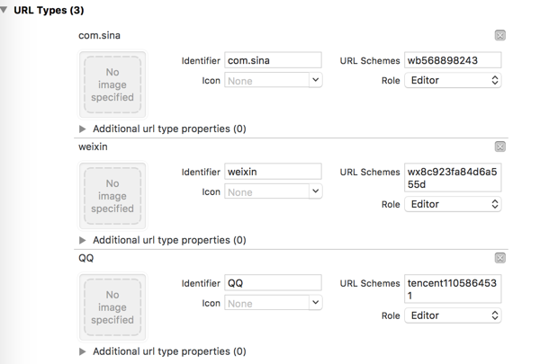

# JSHARE 对外集成文档
##使用提示
本文是 JSHARE iOS SDK 的标准集成指南文档。
匹配的 SDK 版本为：V1.0.0及以后版本。

* 如果你想要快速测试、请参考本文在几分钟内跑通 Demo。
* 极光文档官网上有相关的所有指南、API、教程等全部的文档。包括本文档的更新版本，都会及时地发布到该网站上。
* [极光社区](https://community.jiguang.cn/)网站：大家对文档有疑惑，以及产品出现问题，可以到极光社区来提问题，可以即时得到回应。

##产品功能说明
JSHARE SDK 可以让用户不用额外集成第三方平台的 SDK 实现平台间的分享功能，可以有效的降低包体积。

###主要场景：

* 将分享内容分享到 QQ、微信、新浪微博三个主要的社交平台。

###集成压缩包内容

* jshare-ios-1.0.0.a静态库
* jcore-ios-x.x.x.a静态库
* JSHARE SDK 入口 JSHAREService.h 头文件
* 一个完整的 iOS Demo 项目工程，这个工程演示了 JSHARE SDK 的基本用法，配置 SDK 时建议参考这个 Demo。

###iOS SDK 支持版本
目前 JSHARE 只支持 iOS 7 及以上 iOS 版本。

## 快速体验
* 双击压缩包里面的JShareDemo.xcodeproj 打开 Demo；
* 修改 AppDelegate.m 里面的appKey的值;
* 在项目的【General】页面 -> 【Identity】->【Bundle Identifier】 选项填写你在极光创建应用所上传的证书的Bundle id;
* 配置【General】页面 的【Siging】；
* 运行安装Demo到真机，即可。

##JSHARE SDK 集成步骤

* 解压压缩包，将 Lib 下的所有文件复制到工程中，即可开始使用 SDK。
* 增加相关的 framework 依赖：UIKit,SystemConfiguration,CoreTelephony,CoreGraphics,Security,Foundation,CoreLocation,CoreFoundation,CFNetwork,libz.tbd,libresolv.tbd

* 添加以下代码到 AppDelegate.m 引用头文件的位置


```
// 引入JSHARE功能所需头文件
#import "JSHAREService.h"
// 如果需要使用idfa功能所需要引入的头文件（可选）
#import <AdSupport/AdSupport.h>
```

##SDK 主要接口说明
JSHARELaunchConfig类，JSHARE SDK 启动配置模型。
JSHAREService类，包含 JSHARE SDK 的所有接口。

 
**1.+ (void)setupWithConfig:(JSHARELaunchConfig *)config**
接口说明：初始化接口。建议在 application:didFinishLaunchingWithOptions: 中调用。
参数说明：

* config：JSHARELaunchConfig类的实例。
调用示例：

```
    
    JSHARELaunchConfig *config = [[JSHARELaunchConfig alloc] init];
    config.appKey = @"AppKey copied from JiGuang Portal application";
    config.SinaWeiboAppKey = @"374535501";
    config.SinaWeiboAppSecret = @"baccd12c166f1df96736b51ffbf600a2";
    config.SinaRedirectUri = @"https://www.jiguang.cn";
    config.QQAppId = @"1105864531";
    config.QQAppKey = @"glFYjkHQGSOCJHMC";
    config.WeChatAppId = @"wxa2ea563906227379";
    config.WeChatAppSecret = @"bb63c0a06bf0ee7f633a5bc44304d110";

    [JSHAREService setupWithConfig:config];


```

**2.+ (void)share:(JSHAREMessage *)message
      handler:(JSHAREStateHandler)handler**
参数说明：

* message：JSHAREMessage 类的实例
* handler：JSHAREStateHandler 分享后的回调      

调用示例：

```
JSHAREMessage *message = [JSHAREMessage message];
    message.text = @"http://jira.jpushoa.com/browse/JPUSH-14881";
    message.platform = JSHAREPlatformQQ;
    message.mediaType = JSHAREText;
    [JSHAREService share:message handler:^(JSHAREState state, NSError *error) {
          NSLog(@"分享回调");
        }
    }];
```

**3.+ (BOOL)handleOpenUrl:(NSURL *)url**
接口说明：回调接口，必要！在 Appdelegate 的 application:handleOpenURL: 中调用。
参数说明：

* url：回调的 url

调用示例：

```
- (BOOL)application:(UIApplication *)application handleOpenURL:(NSURL *)url{
    [JSHAREService handleOpenUrl:url];
    return YES;
}

```
其他接口作用详见 JSHAREService.h 文件中的接口注释。


##Xcode 中的设置

### 配置ApplicationQueriesSchemes
在iOS9/10下就需要增加一个应用可跳转的白名单，即LSApplicationQueriesSchemes，否则将在SDK判断是否跳转时用到的canOpenURL时返回NO，进而只进行webview分享/分享失败。 在项目中的info.plist中加入应用白名单，右键info.plist选择source code打开(具体设置在Build Setting -> Packaging -> Info.plist File可获取plist路径)

```
<key>LSApplicationQueriesSchemes</key>
<array>
    <!-- 微信 URL Scheme 白名单-->
    <string>wechat</string>
    <string>weixin</string>

    <!-- 新浪微博 URL Scheme 白名单-->
    <string>sinaweibohd</string>
    <string>sinaweibo</string>
    <string>sinaweibosso</string>
    <string>weibosdk</string>
    <string>weibosdk2.5</string>

    <!-- QQ、Qzone URL Scheme 白名单-->
    <string>mqqapi</string>
    <string>mqq</string>
    <string>mqqOpensdkSSoLogin</string>
    <string>mqqconnect</string>
    <string>mqqopensdkdataline</string>
    <string>mqqopensdkgrouptribeshare</string>
    <string>mqqopensdkfriend</string>
    <string>mqqopensdkapi</string>
    <string>mqqopensdkapiV2</string>
    <string>mqqopensdkapiV3</string>
    <string>mqqopensdkapiV4</string>
    <string>mqzoneopensdk</string>
    <string>wtloginmqq</string>
    <string>wtloginmqq2</string>
    <string>mqqwpa</string>
    <string>mqzone</string>
    <string>mqzonev2</string>
    <string>mqzoneshare</string>
    <string>wtloginqzone</string>
    <string>mqzonewx</string>
    <string>mqzoneopensdkapiV2</string>
    <string>mqzoneopensdkapi19</string>
    <string>mqzoneopensdkapi</string>
    <string>mqqbrowser</string>
    <string>mttbrowser</string>
</array>
```

###添加 URL Types
下面是各个平台的URL Schemes 格式：

|平台 | 格式 | 举例 |
|------------ | ------------- | ------------- |
|微信 | 微信appKey | wxa2ea563906227379|
|QQ | 需添加：“tencent” + 腾讯 QQ 互联应用appID | appID：1105864531: <br> tencent1105864531|
|新浪微博 | “wb”+新浪appKey | wb727232518 |

在 Xcode 工程目录中的Info中设置：<br>



#end

