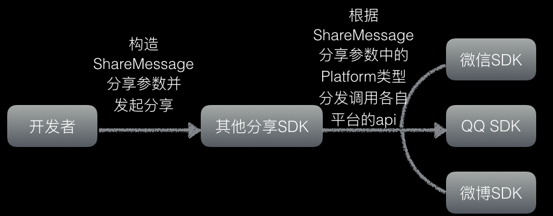

#JShare产品介绍
极光Share致力于帮助应用快速具备国内主流社交平台分享功能，提供了接入新浪微博，QQ，微信等第三方社会化分享服务；SDK包体积最小，集成成本低，提供iOS和android的SDK，并且还提供了统计功能，方便开发者了解应用的分享效果，提高产品推广效率，助力产品获得更多用户。

##JShare技术原理
目前市面上的依赖平台原生sdk的分享sdk皆为这种形式

但是，极光Share技术上不依赖原生SDK的方式，分享的原理实际上就是两个app之间的相互跳转及通信，使用极光Share代替平台SDK实现分享，其原理如下图：

JShare SDK分享遵循以下步骤。

1.注册AppKey。 
2.配置分享参数。 
3.发起分享。 
4.等待回调。 

##功能与特性
1.集成简单 
	&emsp;&emsp;只需几分钟即可集成JShare组件，让您的应用轻松拥有强大的社会化功能。 
2.稳定，安装包小 
	&emsp;&emsp;不依赖第三方平台的库包，极大的减少SDK的体积，让分享更稳定。 
3.社会化统计分析 
	&emsp;&emsp;完整的统计和分析后台，帮助开发者了解各项统计指标。 
4.一键分享 
	&emsp;&emsp;通过组件对新浪微博、QQ、微信等社会化平台一键分享；分享内容包括文字、图片、链接、音视频、文件表情等。 
	
##集成流程
在 Web 控制台上创建应用，得到 AppKey。如果之前已经使用了 JPush，可以直接延用老的 AppKey。

集成客户端 SDK。 
集成 JShare SDK 到 App 里. 
Android 开发者请参考文档：[JShare Android SDK 集成指南](../client/Android/android_sdk.md) 
iOS 开发者请参考文档：[JShare iOS SDK 集成指南](../client/iOS/ios_sdk.md) 

###相关文档
[JShare Android SDK 接口文档](../client/Android/android_api.md) 
[JShare iOS SDK 接口文档](../client/iOS/ios_api.md)

	
