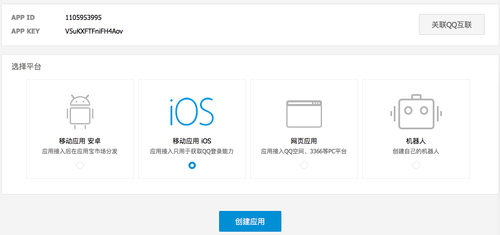
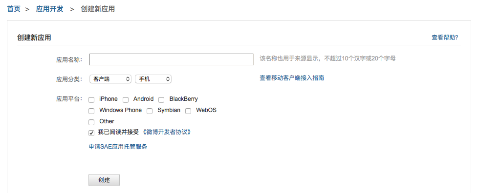

#为什么需要申请第三方平台帐号？
第三方平台在进行分享时需要在第三方平台创建应用并审核通过；创建应用后，分享成功后显示的应用图标、应用信息等跟对第三方平台有关

##申请QQ的appID

QQ和QQ空间使用的是同一个AppID，Appkey; 登录腾讯开放平台,应用接入(<a href="http://op.open.qq.com/appregv2/">点击链接</a>) ，根据需要选择Android应用或者iOS应用，

点击创建应用，填写相关应用信息并提交审核，

根据提示填写应用信息，应用未通过审核前只能使用测试账号。

##申请微信appID
微信，微信收藏，微信朋友圈用的是同一个appID，appsecret；登陆<a href="https://open.weixin.qq.com/">微信开发者平台</a>，进入管理中心,点击创建移动应用，根据提示填写应用的基本信息以及平台信息

提交审核，审核通过后即可获得appID和appsecret。 
需要特别注意的是在申请时填写的包名和签名必须与apk文件相对应。

##申请新浪微博appkey
登陆<a href="http://open.weibo.com"/>新浪微博开放平台</a>,进入微链接－》移动应用，点击立即接入创建应用

根据提示填写应用信息创建新应用

提交审核，审核通过后即可获得appkey和appsecret。 
需要特别注意的是在申请时填写的包名和签名必须与apk文件相对应。
