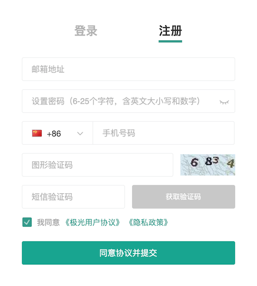
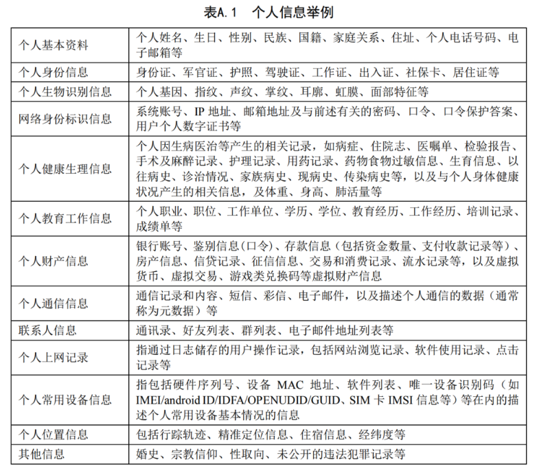
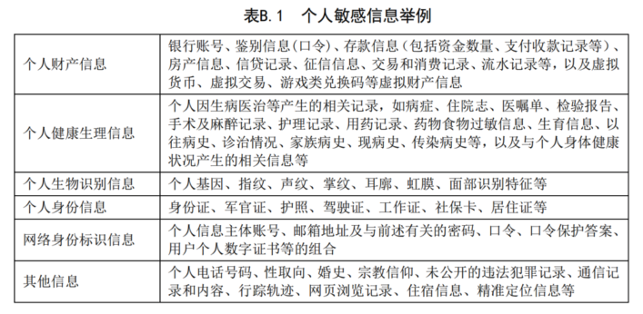

#极光开发者应用合规指南

##引言

近年来，随着信息技术的快速发展和移动互联网应用的普及，越来越多的应用大量收集、使用个人信息，给人们生活带来便利的同时，也出现了对个人信息的非法收集、滥用、泄漏等问题，个人信息安全面临严重威胁。

2019年1月，中央网信办、工信部、公安部、市场监管总局四部门联合发布《关于开展App违法违规收集使用个人信息专项治理的公告》(以下简称《公告》)。为落实《公告》相关部署，受四部门委托，全国信息安全标准化技术委员会、中国消费者协会、中国互联网协会、中国网络空间安全协会成立App违法违规收集使用个人信息专项治理工作组(以下简称“App专项治理工作组”)，具体推动App违法违规收集使用个人信息评估工作。

日前，App专项治理工作组依据《网络安全法》、《消费者权益保护法》、《信息安全技术 个人信息安全规范》等法律法规和国家标准，编制了《App违法违规收集使用个人信息自评估指南》（以下简称为“指南”），App运营者可参照指南对其收集使用个人信息的情况进行自查自纠，提升个人信息保护水平。

一直以来，极光始终高度重视用户的个人信息保护，并致力于不断规范和提升自身产品线的信息保护策略。同时为了给App开发者和运营者在用户个人信息保护方面的积极行动提供规则和参考，极光特编写《极光开发者应用合规指南》，避免开发者因违反相关法律法规而遭受损失。

##APP上线需要哪些合规配套文件

+ 用户协议
 
+ 隐私政策

##隐私政策应如何展示

+ 在页面“设置/通用”-“隐私”-“隐私政策”

+ 展示在注册入口处

##合规配套文件应如何主动展示

+ 用户初次注册时，弹出框形式可下拉形式，界面至少停留10秒，以用户勾选、点击“同意”或“下一步”等取得用户同意

+ 用户协议、隐私政策修订后，重新弹出获得用户同意，弹出框形式可下拉形式，以用户主动“点击”“同意”等形式呈现

+ 用户协议、隐私政策应方便用户再次访问及更改其同意的范围

##哪些情况需要单独获得授权

###区分基本业务功能和扩展业务功能

保障个人信息主体选择同意权，首先需划分产品或服务的基本业务功能和扩展业务功能，划分的方法如下:

+ 应根据个人信息主体选择、使用所提供产品或服务的根本期待和最主要的需求， 划定产品或服务的基本业务功能;

+ 不应将改善服务质量、提升用户体验、研发新产品单独作为基本业务功能;

+ 将产品或服务所提供的基本业务功能之外的其他功能，划定为扩展业务功能。

###扩展业务功能需单独获得授权

在扩展业务功能首次使用前，应通过交互界面或设计（如弹窗、文字说明、填写框、提示条、提示音等方式），向用户注意告知所提供扩展业务功能及所必要手机的个人信息，并允许用户对扩展业务功能逐项选择同意。

##如何草拟合规的隐私政策

###App包含哪些基本业务功能，可以收集哪些信息

依据个人信息收集最少够用的原则，针对地图导航、网络约车、网上购物等 16 类基本业务功能，给出了每类业务功能相关的必要信息范围。必要信息主要包括基本业务功能相关必要信息和通用功能相关必要信息:基本业务功能相关必要信息，是与基本业务功能直接关联，一旦缺少会导致基本业务功能无法实现或无法正常运行的个人信息;通用功能相关必要信息，是相关法律法规要求、保障移动 互联网应用安全风险管控所必需的个人信息。

开发者可以根据应用包含某一项、或某几项基本业务功能，向用户申请收集必要信息。

+ 基本业务功能及必要信息

|基本业务功能|必要信息|
|:-----|:----|
|地图导航|位置信息|
|网络约车|手机号码、账号信息、位置信息、交易信息、第三方支付信息|
|即时通讯社交|手机号码、账号信息、好友列表、好友信息、群列表|
|社区社交|手机号码、账号信息、用户关注的内容、关注用户列表、公共账号用户信息|
|网络支付|手机号码、账号信息、身份信息、银行账户信息、交易信息、交易身份验证信息|
|新闻资讯|关注的账号、自媒体用户信息|
|短视频|关注的账号、自媒体用户信息|
|网上购物|手机号码、账号信息、收货人信息、交易信息、第三方支付信息|
|快递配送|寄件人基本信息、收件人基本信息、快递运单号码|
|即时通讯社交|手机号码、账号信息、好友列表、好友信息、群列表|
|餐饮外卖|手机号码、账号信息、位置信息、联系人信息、交易信息、第三方支付信息|
|交通票务|账号信息、旅客和联系人基本信息、行程信息、旅客身份信息、交易信息|
|婚恋相亲|手机号码、账号信息、个人基本资料|
|求职招聘|手机号码、账号信息、求职者基本信息、求职者教育信息、求职者工作经历信息、招聘者身份证件号码|
|金融借贷|手机号码、账号信息、身份信息、银行账户信息、个人征信信息、紧急联系人信息、借贷交易信息|
|房产交易|手机号码、账号信息、租户身份信息、交易信息、业主身份信息、个人房产信息、第三方支付信息|
|汽车交易|手机号码、账号信息、车辆审核地址、购买方信息、出售方信息、交易信息、第三方支付信息|

+ 通用功能相关必要信息

|通用功能需求|收集信息|适用的业务功能|
|:-----|:----|:----|
|网络访问|网络访问的日志信息：IP地址、用户登录时间、用户退出时间|各类业务功能|
|安全风控|设备信息：唯一设备识别码、硬件序列号|具有安全风控需求的业务功能|
|客户服务|客服场景下的通话记录和内容：电话号码（仅电话客服）、通话内容和录音（仅在线客服）、聊天消息（在线客服）|具有客服场景的业务功能|

###什么是个人信息

个人信息是指以电子或者其他方式记录的能够单独或者与其他信息结合识别特定 自然人身份或者反映特定自然人活动情况的各种信息，如姓名、出生日期、身份证件号 码、个人生物识别信息、住址、通信通讯联系方式、通信记录和内容、账号密码、财产 信息、征信信息、行踪轨迹、住宿信息、健康生理信息、交易信息等。

个人敏感信息是指一旦泄露、非法提供或滥用可能危害人身和财产安全，极易导致 个人名誉、身心健康受到损害或歧视性待遇等的个人信息。通常情况下，14岁以下(含) 儿童的个人信息和自然人的隐私信息属于个人敏感信息。

+ 个人信息举例

+ 个人敏感信息举例

###隐私政策包含哪些内容

+ 隐私政策模版

	请参考[隐私政策模版](https://sdkfiledl.jiguang.cn/src/%E9%9A%90%E7%A7%81%E6%94%BF%E7%AD%96%E6%A8%A1%E6%9D%BF.docx)

##参考资料

[《信息安全技术个人信息安全规范》（征求意见稿）](https://www.tc260.org.cn/front/bzzqyjDetail.html?id=20190625175932390453&norm_id=20190104153824&recode_id=34879&from=groupmessage&isappinstalled=0)

[《网络安全实践指南—移动互联网应用基本业务功能必要信息规范》](http://pip.tc260.org.cn/jbxt/privacy/detail/20190702143616836520)

[《App违法违规收集使用个人信息自评估指南》](http://pip.tc260.org.cn/jbxt/privacy/detail/20190302114600934277)

[《App违法违规收集使用个人信息行为认定方法（征求意见稿）》》](http://pip.tc260.org.cn/jbxt/privacy/detail/2019050519520713219)

