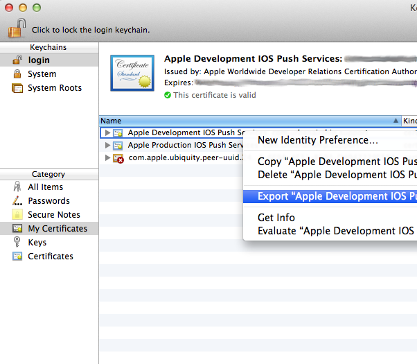
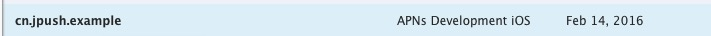
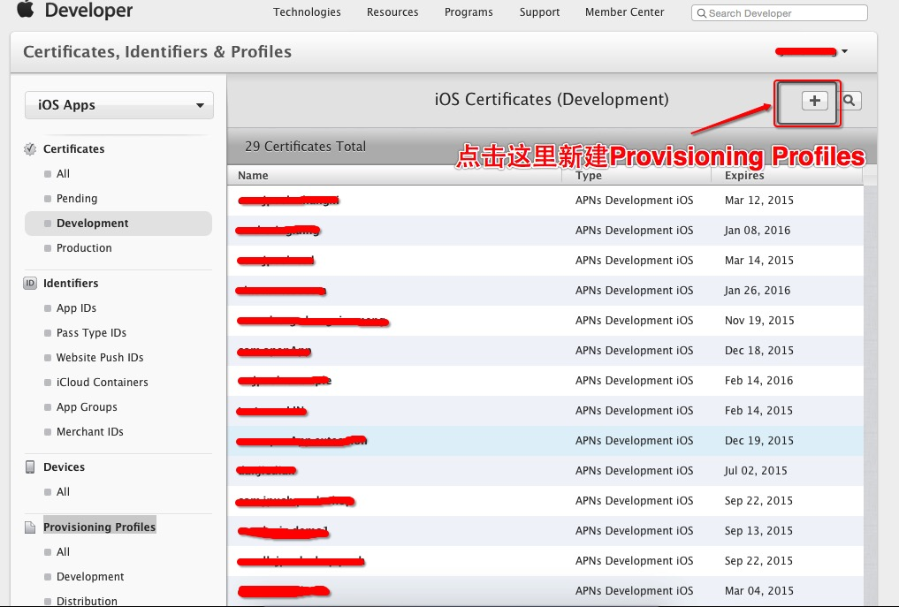
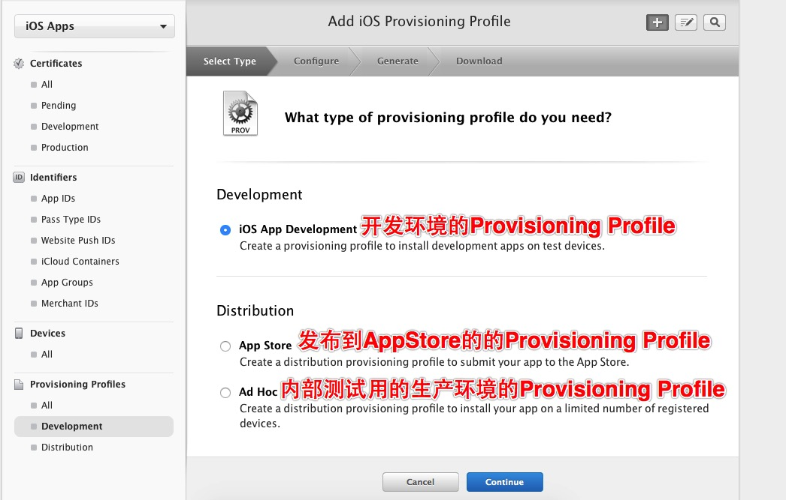
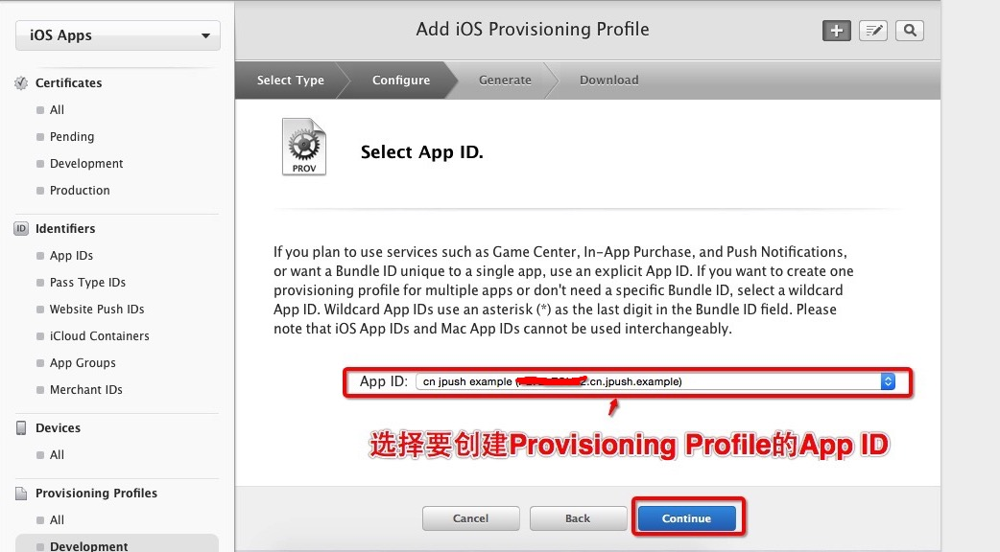
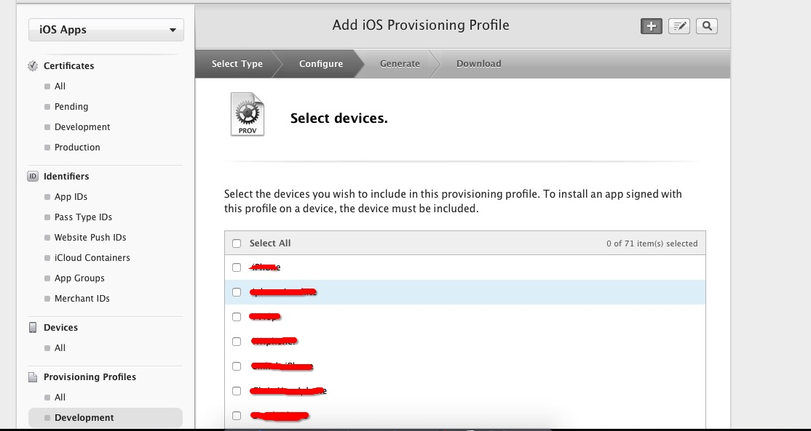
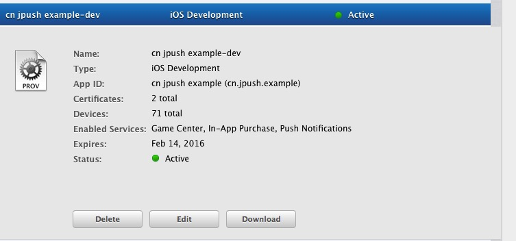
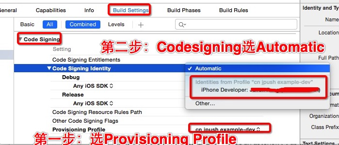

<h1>iOS SDK 教程</h1>

<style>
img[alt=jpush_ios] { width: 800px; }
img[alt=jpush_ios_5] { width: 500px; }
</style>

### iOS SDK 调试指南

#### iOS 调试思维导图


#### 确认证书

请到“应用详情页面”确认证书可用性：


#### 开发环境测试

在对  JPush iOS 开发环境进行测试前，请确保 3 个统一：

+ App 是开发环境打包（开发证书 Development）
+ 上传了开发证书并验证通过
+ Portal 上的应用设置为开发环境

#### 发布环境测试

在对  JPush iOS 生产环境进行测试前，请确保 3 个统一：

+ App 是 ad-hoc 打包或者App Store 版本（发布证书 Production）
+ 上传了发布证书并验证通过
+ Portal 上的应用设置为生产环境

#### 可能存在的其他问题

##### 收到消息不够稳定

JPush iOS 是对原生官方 APNs 推送的一个补充，是对其的封装，以帮助开发人员更轻松地使用 APNs 。

由于APNs 本身不承诺保证消息到达，客户端网络与服务器端的连通性，对 APNs 是否及时接收到消息具有很大的影响。


### iOS 证书 设置指南

#### 创建应用程序ID

+ 登陆 [iOS Dev Center](https://developer.apple.com/devcenter/ios/index.action) 选择进入iOS Provisioning Portal。


+ 在 [iOS Provisioning Portal](https://daw.apple.com/cgi-bin/WebObjects/DSAuthWeb.woa/wa/login?&appIdKey=891bd3417a7776362562d2197f89480a8547b108fd934911bcbea0110d07f757&path=%2F%2Faccount%2Findex.action)中，点击App IDs进入App ID列表。


+ 创建 App ID，如果 ID 已经存在可以直接跳过此步骤


+ 为 App 开启 Push Notification 功能。如果是已经创建的 App ID 也可以通过设置开启 Push Notification 功能。


根据实际情况完善 App ID 信息并提交,注意此处需要指定具体的 Bundle ID 不要使用通配符。


#### 配置和下载证书

+ 如果你之前没有创建过 Push 证书或者是要重新创建一个新的，请在证书列表下面新建。


+ 新建证书需要注意选择证书种类（开发证书用于开发和调试使用，生产证书用于 App Store 发布）


+ 点击 Continue 后选择证书对应的应用ID，然后继续会出现“About Creating a Certificate Signing Request (CSR)”。


+ 根据它的说明创建打开KeychainAccess 创建 Certificate Signing Request。


+ 填写“User Email Address”和“Common Name” 后选择 Saved to disk 进行保存 。


+ 继续返回Apple developer 网站点击 Continue ，上传刚刚生成的 .certSigningRequest 文件生成 APNs Push  Certificate。
+ 下载并双击打开证书，证书打开时会启动“钥匙串访问”工具。
+ 在“钥匙串访问”中你的证书会显示在“我的证书”中，注意选择“My Certificates” 和"login"


#### 导出 .p12 证书文件

```
注意要选“login”和“My Certificates” 导出证书时要选中证书文件，不要展开private key。
```



+ 将文件保存为Personal Information Exchange (.p12)格式。


+ 将文件保存为Personal Information Exchange (.p12)格式。

#### 上传证书

在 [JPush 管理 Portal 上](https://www.jpush.cn/apps/)，针对某应用程序，上传上面步骤得到 .p12 证书文件。这是 iOS SDK 能够接收到 JPush 推送消息的必要步骤。


#### Provisioning Profile的创建

+ 创建Provisioning Profile的前提，已在Apple Developer网站创建待发布应用所使用的Bundle ID的App ID，且为该App ID创建了APNs证书，如下图:




+ 创建App ID、APNs证书和p12证书的导出的具体步骤请看 :[iOS 证书 设置指南](../client/ios_tutorials/#ios_1)

+ 在[苹果开发者账号的Provisioning Profile](https://developer.apple.com/account/ios/profile/profileList.action)页面点击下图按钮，创建Provisioning Profile



+ 选择此Provisioning Profile的环境后点击[Continue]：



+ 选择要创建Provisioning Profile的App ID后点击[Continue]：



+ 选择所属的开发者证书，（这里创建了多个开发者证书，建议只创建一个，方便管理）为了方便，选择了[Select All]，再点击[Continue]进入下一步：


+ 为该Provisioning Profile选择将要安装的设备（一般选择[Select All]），点击[Continue]:



+ 给该Provisioning Profile填写Profile Name，点击[generate]完成创建。


+ 填写完Profile Name后点击[generate]完成创建，之后点击[DownLoad]下载Provisioning Profile



+ 双击下载下来的Provisioning Profile，添加到xcode。

#### XCode的证书配置教程

参照[iOS SDK 集成指南](../../guideline/ios_guide/)集成JPush SDK 和上传了推送用到的p12证书后在编译运行前需要先配置一下证书，步骤如下：

+ 打开xxx-info.plist的Bundle identifier项把上传到JPush 控制台的bundle id填写进去：


+ 点击项目，选择目标TARGETS后进入Build Setting 界面，搜索“Code signing”，按照下图配置




### iOS 7 Background Remote Notification


本次iOS 7在推送方面最大的变化就是允许，应用收到通知后在后台（background）状态下运行一段代码，可用于从服务器获取内容更新。功能使用场景：（多媒体）聊天，Email更新，基于通知的订阅内容同步等功能，提升了终端用户的体验。

Remote Notifications 与之前版本的对比可以参考下面两张 Apple 官方的图片便可一目了然。


如果只携带content-available: 1 不携带任何badge，sound 和消息内容等参数，则可以不打扰用户的情况下进行内容更新等操作即为“Silent Remote Notifications”。


#### 客户端设置

##### 开启Remote notifications

需要在Xcode 中修改应用的 Capabilities 开启Remote notifications，请参考下图：


##### 修改通知处理函数

当注册了Backgroud Modes -> Remote notifications 后，notification 处理函数一律切换到下面函数，后台推送代码也在此函数中调用。

	- (void)application:(UIApplication *)application didReceiveRemoteNotification:(NSDictionary *)userInfo fetchCompletionHandler:(void (^)(UIBackgroundFetchResult))completionHandler；

#### 服务端推送设置

推送消息携带 content-available: 1 是Background 运行的必须参数，如果不携带此字段则与iOS7 之前版本的普通推送一样。

##### 使用Web Portal 推送

在“可选设置内”选择对应的参数。


##### 使用 API 推送

只需在[Push API v3](../../server/rest_api_v3_push/#notification) 的 ios 内附加content-available":true 字段即可

#### 限制与注意

+ “Silent Remote Notifications”是在 Apple 的限制下有一定的频率控制，但具体频率不详。所以并不是所有的 “Silent Remote Notifications” 都能按照预期到达客户端触发函数。
+ “Background”下提供给应用的运行时间窗是有限制的，如果需要下载较大的文件请参考 Apple 的 NSURLSession 的介绍。
+ “Background  Remote Notification”  的前提是要求客户端处于Background 或 Suspended 状态，如果用户通过 App Switcher 将应用从后台 Kill 掉应用将不会唤醒应用处理 background 代码。

更详细的说明资料请查阅 Apple 官方的 iOS 开发文档。


###iOS 8 UIUserNotificationSettings

#### 支持版本
v1.8.0 版本开始。

+ 本次iOS 8在推送方面最大的变化就是修改了推送的注册接口，在原本的推送type的基础上，增加了一个categories参数，这个参数的目的是用来注册一组和通知关联起来的button的事件。
+ 这个categories由一系列的 UIUserNotificationCategory组成。每个UIUserNotificationCategory对象包含你的app用来响应本地或者远程通知的信息。每一个对象的title作为通知上每一个button的title展示给用户。当用户点击了某一个button，系统将会调用应用内的回调函数[application:handleActionWithIdentifier:forRemoteNotification:completionHandler:](https://developer.apple.com/library/prerelease/ios/documentation/UIKit/Reference/UIApplicationDelegate_Protocol/index.html#//apple_ref/occ/intfm/UIApplicationDelegate/application:handleActionWithIdentifier:forRemoteNotification:completionHandler:)或者[application:handleActionWithIdentifier:forLocalNotification:completionHandler:](https://developer.apple.com/library/prerelease/ios/documentation/UIKit/Reference/UIApplicationDelegate_Protocol/index.html#//apple_ref/occ/intfm/UIApplicationDelegate/application:handleActionWithIdentifier:forLocalNotification:completionHandler:)。

#### 客户端设置

##### 使用UIUserNotificationCategory

```
if ([[UIDevice currentDevice].systemVersion floatValue] >= 8.0) {
 
 NSMutableSet *categories = [NSMutableSet set];
 
 UIMutableUserNotificationCategory *category = [[UIMutableUserNotificationCategory alloc] init];
 
 category.identifier = @"identifier";
 
 UIMutableUserNotificationAction *action = [[UIMutableUserNotificationAction alloc] init];
 
 action.identifier = @"test2";
 
 action.title = @"test";
 
 action.activationMode = UIUserNotificationActivationModeBackground;
 
 action.authenticationRequired = YES;
 
 //YES显示为红色，NO显示为蓝色
 action.destructive = NO;
 
 NSArray *actions = @[ action ];
 
 [category setActions:actions forContext:UIUserNotificationActionContextMinimal];
 
 [categories addObject:category];
}
```

##### 使用UIUserNotificationType

```
if ([[UIDevice currentDevice].systemVersion floatValue] >= 8.0) {
[JPUSHService registerForRemoteNotificationTypes:(UIUserNotificationTypeBadge | UIUserNotificationTypeSound | UIUserNotificationTypeAlert)                      categories:categories];
}else{
[JPUSHService registerForRemoteNotificationTypes:(UIUserNotificationTypeBadge | UIUserNotificationTypeSound | UIUserNotificationTypeAlert)                      categories:nil];
}
```

##### 使用回调函数

```
// Called when your app has been activated by the user selecting an action from
// a remote notification.
// A nil action identifier indicates the default action.
// You should call the completion handler as soon as you've finished handling
// the action.
- (void)application:(UIApplication *)application handleActionWithIdentifier:(NSString *)identifier forRemoteNotification:(NSDictionary *)userInfo
  completionHandler:(void (^)())completionHandler {
}
```

#### 服务端设置

服务端payload格式:aps增加category字段，当该字段与客户端UIMutableUserNotificationCategory的identifier匹配时，触发设定的action和button显示。

```
payload example:
{"aps":{"alert":"example", "sound":"default", "badge": 1, "category":"identifier"}}

```


###iOS 9 UIUserNotificationActionBehaviorTextInput

#### 支持版本
v1.8.0 版本开始

1. 本次iOS 9在推送方面最大的变化就是修改了推送Category的类型，在原本的推送categories的基础上，增加了一个text Action类型，这个参数的目的是用来注册通过通知快捷文字输入的事项。
2. 这个categories由一系列的 UIUserNotificationCategory组成。每个UIUserNotificationCategory对象允许添加一组UIMutableUserNotificationAction类型的参数来增加通知栏上的项目。如今iOS9在原有的UIMutableUserNotificationAction类型增加了Text输入类型(UIUserNotificationActionBehaviorTextInput),通过behavior来设置(只有iOS9才拥有的属性)。
3. 回调的方法iOS9使用了两个新的回调方法来处理点击按钮的事件:

```
- (void)application:(UIApplication *)application handleActionWithIdentifier:(nullableNSString *)identifier forLocalNotification:(UILocalNotification *)notification withResponseInfo:(NSDictionary *)responseInfo completionHandler:(void(^)())completionHandler NS_AVAILABLE_IOS(9_0)

- (void)application:(UIApplication *)application handleActionWithIdentifier:(nullableNSString *)identifier forRemoteNotification:(NSDictionary *)userInfo withResponseInfo:(NSDictionary *)responseInfo completionHandler:(void(^)())completionHandler NS_AVAILABLE_IOS(9_0)

```

**说明**:

+ 当Action为UIUserNotificationActionBehaviorTextInput时,需要通过responseInfo的UIUserNotificationActionResponseTypedTextKey来获取输入的文字内容,UIUserNotificationTextInputActionButtonTitleKey获取点击的按钮类型.

+ 当Action为UIUserNotificationActionBehaviorDefault时,responseInfo为nil,通过identifier来区分点击按钮分别是什么来做处理. 

#### 客户端设置

**设置带有快速回复内容的通知**

```
#ifdef __IPHONE_9_0 
 UIMutableUserNotificationAction *replyAction = [[UIMutableUserNotificationAction alloc]init];
 replyAction.title = @"Reply";
 replyAction.identifier = @"comment-reply";
 replyAction.activationMode = UIUserNotificationActivationModeBackground;
 replyAction.behavior = UIUserNotificationActionBehaviorTextInput;
  
 UIMutableUserNotificationCategory *category = [[UIMutableUserNotificationCategory alloc]init];
 category.identifier = @"reply";
 [category setActions:@[replyAction] forContext:UIUserNotificationActionContextDefault];
#endif
```

**使用回调函数**

```
- (void)application:(UIApplication *)application handleActionWithIdentifier:(nullable NSString *)identifier forRemoteNotification:(NSDictionary *)userInfo withResponseInfo:(NSDictionary *)responseInfo completionHandler:(void(^)())completionHandler NS_AVAILABLE_IOS(9_0) {
 if ([identifier isEqualToString:@"comment-reply"]) {
 NSString *response = responseInfo[UIUserNotificationActionResponseTypedTextKey];
 //对输入的文字作处理
 }
 completionHandler();
 }
```

#### 服务端设置

服务端payload格式:aps增加category字段，当该字段与客户端UIMutableUserNotificationCategory的identifier匹配时，触发设定的action和button显示。

```
payload example:
{"aps":{"alert":"example", "sound":"default", "badge": 1, "category":"reply"}}
```

### iOS 8 UILocalNotification


本次iOS 8 UILocalNotification增加了三个参数: region、regionTriggersOnce、category。

+ region: 用于控制当用户进入或者离开某一个地理位置时候，触发通知。使用此功能，用户需要拥有CoreLocation的"when-in-use"权限。
+ regionTriggersOnce(BOOL)：当为YES时，通知只会触发一次，当为NO时，通知将会在每一次进入或者离开时都触发。
+ category:如果localNotification通过+[UIUserNotificationSettings settingsForUserNotificationTypes:userNotificationActionSettings:]注册了，通过该category可以获取该通知的注册category.

#### 客户端设置

##### 使用UILocalNotification

```
// set localNotification
  CLLocationCoordinate2D coordinate2D;
  coordinate2D.latitude = 100.0;
  coordinate2D.longitude = 100.0;
  CLRegion *currentRegion =
      [[CLCircularRegion alloc] initWithCenter:coordinate2D
                                        radius:CLLocationDistanceMax
                                    identifier:@"test"];
 
  [JPUSHService setLocalNotification:[NSDate dateWithTimeIntervalSinceNow:120]
                        alertBody:@"test ios8 notification"
                            badge:0
                      alertAction:@"取消"
                    identifierKey:@"1"
                         userInfo:nil
                        soundName:nil
                           region:currentRegion
               regionTriggersOnce:YES
                         category:@"test"];
```

### iOS 10 UserNotifications framework

#### 客户端设置
本次iOS10引入新的UserNotifications framework支持本地及远程推送的注册及回调。主要加入UNUserNotificationCenter、UNNotification、UNNotificationRequest、UNNotificationContent、UNNotificationTrigger等类型，以及UNUserNotificationCenterDelegate协议，详见苹果官方说明。为了支持iOS10新的变化，客户端新增以下内容：
##### 新增Model实体类
##### 支持版本
v2.1.9版开始
##### 1.JPUSHRegisterEntity

```
/*!
 * 通知注册实体类
 */
@interface JPUSHRegisterEntity : NSObject

/*!
 * 支持的类型
 * badge,sound,alert
 */
@property (nonatomic, assign) NSInteger types;
/*!
 * 注入的类别
 * iOS10 UNNotificationCategory
 * iOS8-iOS9 UIUserNotificationCategory
 */
@property (nonatomic, strong) NSSet * categories;
@end
```

**说明**:

新注册APNs时用到的实体，包含types、categories两个属性，可通过types设置badge、sound、alert等类型；categories设置推送类型（iOS10支持UNNoticationCategory类型元素，iOS8-9支持UIUserNotificationCategory类型元素）
	
**参考代码**:

```
- (BOOL)application:(UIApplication *)application
didFinishLaunchingWithOptions:(NSDictionary *)launchOptions {
	// your code
	
  	 NSString *advertisingId = [[[ASIdentifierManager sharedManager] advertisingIdentifier] UUIDString];
   	//Required
   	if ([[UIDevice currentDevice].systemVersion floatValue] >= 10.0) {
     	JPUSHRegisterEntity * entity = [[JPUSHRegisterEntity alloc] init];
     	entity.types = UNAuthorizationOptionAlert|UNAuthorizationOptionBadge|UNAuthorizationOptionSound;
     	[JPUSHService registerForRemoteNotificationConfig:entity delegate:self];
   	} 
   	else if([[UIDevice currentDevice].systemVersion floatValue] >= 8.0) {
     	//可以添加自定义categories
     	[JPUSHService registerForRemoteNotificationTypes:(UIUserNotificationTypeBadge | UIUserNotificationTypeSound |
     UIUserNotificationTypeAlert) categories:nil];
   	}else {
     	//categories 必须为nil
     	[JPUSHService registerForRemoteNotificationTypes:(UIRemoteNotificationTypeBadge | UIRemoteNotificationTypeSound | UIRemoteNotificationTypeAlert) categories:nil];
   	}
   	//Required
   	// 如需继续使用pushConfig.plist文件声明appKey等配置内容，请依旧使用[JPUSHService setupWithOption:launchOptions]方式初始化。
   	[JPUSHService setupWithOption:launchOptions appKey:appKey channel:channel apsForProduction:isProduction advertisingIdentifier:advertisingId];
  
   	return YES;
}
```
	
##### 2.JPushNotificationIdentifier
	
```
/*!
 * 进行删除、查找推送实体类
 */
@interface JPushNotificationIdentifier : NSObject<NSCopying, NSCoding>

@property (nonatomic, copy) NSArray<NSString *> *identifiers; // 推送的标识数组
@property (nonatomic, copy) UILocalNotification *notificationObj NS_DEPRECATED_IOS(4_0, 10_0);  // iOS10以下可以传UILocalNotification对象数据，iOS10以上无效
@property (nonatomic, assign) BOOL delivered NS_AVAILABLE_IOS(10_0); // 在通知中心显示的或待推送的标志，默认为NO，YES表示在通知中心显示的，NO表示待推送的
@property (nonatomic, copy) void (^findCompletionHandler)(NSArray *results); // 用于查询回调，调用[findNotification:]方法前必须设置，results为返回相应对象数组，iOS10以下返回UILocalNotification对象数组；iOS10以上根据delivered传入值返回UNNotification或UNNotificationRequest对象数组（delivered传入YES，则返回UNNotification对象数组，否则返回UNNotificationRequest对象数组）

@end
```

**说明**:

查找、删除推送时用到的实体，包含identifiers、notificationObj、delivered、findCompletionHandler等属性，在进行删除或查找推送时，需要通过identifiers传入推送的标识，或通过notificationObj传入推送对象来执行（此方式只对iOS10以下有效），identifiers传入空或空数组即代表删除或查找所有推送；iOS10以上需要传入待推送或已在通知中心显示的delivered标志，传入值为BOOL类型，YES即为已在通知中心显示的，NO即为待推送的；在进行查找推送方法时还须要通过findCompletionHandler传入回调才可以得到查找结果，调用[findNotification:]方法前必须设置，results为返回相应对象数组，iOS10以下返回UILocalNotification对象数组；iOS10以上根据delivered传入值返回UNNotification或UNNotificationRequest对象数组。
	
**参考代码**:
	
```
- (void)testRemoveNotification {
  JPushNotificationIdentifier *identifier = [[JPushNotificationIdentifier alloc] init];
  identifier.identifiers = @[@"sampleRequest"];
  identifier.delivered = YES;  //iOS10以上有效，等于YES则在通知中心显示的里面移除，等于NO则为在待推送的里面移除；iOS10以下无效
  [JPUSHService removeNotification:identifier];
}

- (void)testFindNotification {
  JPushNotificationIdentifier *identifier = [[JPushNotificationIdentifier alloc] init];
  identifier.identifiers = @[@"sampleRequest"];
  identifier.delivered = YES;  //iOS10以上有效，等于YES则在通知中心显示的里面查找，等于NO则在待推送的里面查找；iOS10以下无效
  identifier.findCompletionHandler = ^(NSArray *results) {
    NSLog(@"返回结果为：%@", results); // iOS10以下返回UILocalNotification对象数组，iOS10以上根据delivered传入值返回UNNotification或UNNotificationRequest对象数组
  };
  [JPUSHService findNotification:identifier];
}
	
```

##### 3.JPushNotificationContent
	
```
/*!
 * 推送内容实体类
 */
@interface JPushNotificationContent : NSObject<NSCopying, NSCoding>

@property (nonatomic, copy) NSString *title;                // 推送标题
@property (nonatomic, copy) NSString *subtitle;             // 推送副标题
@property (nonatomic, copy) NSString *body;                 // 推送内容
@property (nonatomic, copy) NSNumber *badge;                // 角标的数字。如果不需要改变角标传@(-1)
@property (nonatomic, copy) NSString *action NS_DEPRECATED_IOS(8_0, 10_0); // 弹框的按钮显示的内容（IOS 8默认为"打开", 其他默认为"启动",iOS10以上无效）
@property (nonatomic, copy) NSString *categoryIdentifier;   // 行为分类标识
@property (nonatomic, copy) NSDictionary *userInfo;         // 本地推送时可以设置userInfo来增加附加信息，远程推送时设置的payload推送内容作为此userInfo
@property (nonatomic, copy) NSString *sound;                // 声音名称，不设置则为默认声音
@property (nonatomic, copy) NSArray *attachments NS_AVAILABLE_IOS(10_0);                 // 附件，iOS10以上有效，需要传入UNNotificationAttachment对象数组类型
@property (nonatomic, copy) NSString *threadIdentifier NS_AVAILABLE_IOS(10_0); // 线程或与推送请求相关对话的标识，iOS10以上有效，可用来对推送进行分组
@property (nonatomic, copy) NSString *launchImageName NS_AVAILABLE_IOS(10_0);  // 启动图片名，iOS10以上有效，从推送启动时将会用到

@end
```

**说明**:

定义推送内容用到的实体，包含title、subtitle、body、badge、action、categoryIdentifier、userInfo、sound、attachments、threadIdentifier、launchImageName等属性，如有自定义推送行为分类需要通过categoryIdentifier传入分类标识才生效；iOS10以上可添加多媒体等附件内容，通过attachments传入UNNotificationAttachment对象数组类型数据。
	
**参考代码**:
	
```
JPushNotificationContent *content = [[JPushNotificationContent alloc] init];
content.title = @"Test Notifications";
content.subtitle = @"2016";
content.body = @"This is a test code";
content.badge = @1;
content.categoryIdentifier = @"Custom Category Name";
	
```

##### 4.JPushNotificationTrigger
	
```
/*!
 * 推送触发方式实体类
 * 注：dateComponents、timeInterval、region在iOS10以上可选择其中一个参数传入有效值，如果同时传入值会根据优先级I、II、III使其中一种触发方式生效，fireDate为iOS10以下根据时间触发时须传入的参数
 */
@interface JPushNotificationTrigger : NSObject<NSCopying, NSCoding>

@property (nonatomic, assign) BOOL repeat;                  // 设置是否重复，默认为NO
@property (nonatomic, copy) NSDate *fireDate NS_DEPRECATED_IOS(2_0, 10_0);           // 用来设置触发推送的时间，iOS10以上无效
@property (nonatomic, copy) CLRegion *region NS_AVAILABLE_IOS(8_0);                  // 用来设置触发推送的位置，iOS8以上有效，iOS10以上优先级为I，应用需要有允许使用定位的授权
@property (nonatomic, copy) NSDateComponents *dateComponents NS_AVAILABLE_IOS(10_0); // 用来设置触发推送的日期时间，iOS10以上有效，优先级为II
@property (nonatomic, assign) NSTimeInterval timeInterval NS_AVAILABLE_IOS(10_0);    // 用来设置触发推送的时间，iOS10以上有效，优先级为III

@end
```

**说明**:

定义推送触发方式用到的实体，包含repeat、fireDate、region、dateComponents、timeInterval等属性，iOS10以下可通过fireDate设置触发时间，iOS8以上可通过region设置触发位置，iOS10以上可通过region、dateComponents、timeInterval三个参数设置触发位置、触发日期、触发时间，可选择其中一个参数传入有效值，如果同时传入值会根据优先级I、II、III使其中一种触发方式生效。
	
**参考代码**:

```
//5s后提醒，iOS10以上支持
JPushNotificationTrigger *trigger1 = [[JPushNotificationTrigger alloc] init];
trigger1.timeInterval = 5;
//每小时重复1次，iOS10以上支持
JPushNotificationTrigger *trigger2 = [[JPushNotificationTrigger alloc] init]; trigger2.timeInterval = 3600;
trigger2.repeat = YES;
  
//每周一早上8：00提醒，iOS10以上支持
NSDateComponents *components = [[NSDateComponents alloc] init];
components.weekday = 2;
components.hour = 8;
JPushNotificationTrigger *trigger3 = [[JPushNotificationTrigger alloc] init];
trigger3.dateComponents = components;
trigger3.repeat = YES;
  
//#import <CoreLocation/CoreLocation.h>
//一到某地点提醒，iOS8以上支持
CLRegion *region = [[CLRegion alloc] initCircularRegionWithCenter:CLLocationCoordinate2DMake(0, 0) radius:0 identifier:@"test"];
JPushNotificationTrigger *trigger4 = [[JPushNotificationTrigger alloc] init];
trigger4.region = region;
  
//5s后提醒，iOS10以下支持
JPushNotificationTrigger *trigger5 = [[JPushNotificationTrigger alloc] init];
trigger5.fireDate = [NSDate dateWithTimeIntervalSinceNow:5];

```
	
##### 5.JPushNotificationRequest
	
```
/*!
 * 注册或更新推送实体类
 */
@interface JPushNotificationRequest : NSObject<NSCopying, NSCoding>

@property (nonatomic, copy) NSString *requestIdentifier;    // 推送请求标识
@property (nonatomic, copy) JPushNotificationContent *content; // 设置推送的具体内容
@property (nonatomic, copy) JPushNotificationTrigger *trigger; // 设置推送的触发方式
@property (nonatomic, copy) void (^completionHandler)(id result); // 注册或更新推送成功回调，iOS10以上成功则result为UNNotificationRequest对象，失败则result为nil;iOS10以下成功result为UILocalNotification对象，失败则result为nil

@end
```
	
**说明**:

注册本地推送时用到的实体，包含requestIdentifier、content、trigger、completionHandler等属性，需要进行后续删除、更新、查找管理推送时须通过requestIdentifier传入推送标识，通过content传入推送内容实体，通过trigger传入触发推送方式实体，可以通过completionHandler获取注册成功回调。
	
**参考代码**:

```
JPushNotificationRequest *request = [[JPushNotificationRequest alloc] init];
request.requestIdentifier = @"sampleRequest";
request.content = content;
request.trigger = trigger1;//trigger2;//trigger3;//trigger4;//trigger5;
request.completionHandler = ^(id result) {
  NSLog(@"结果返回：%@", result);
};
[JPUSHService addNotification:request];

```
	
##### 新增Protocol协议

##### 支持版本
v2.1.9版开始

##### JPUSHRegisterDelegate
	
```
@protocol JPUSHRegisterDelegate <NSObject>

/*
 * @brief handle UserNotifications.framework [willPresentNotification:withCompletionHandler:]
 * @param center [UNUserNotificationCenter currentNotificationCenter] 新特性用户通知中心
 * @param notification 前台得到的的通知对象
 * @param completionHandler 该callback中的options 请使用UNNotificationPresentationOptions
 */
- (void)jpushNotificationCenter:(UNUserNotificationCenter *)center willPresentNotification:(UNNotification *)notification withCompletionHandler:(void (^)(NSInteger options))completionHandler;

/*
 * @brief handle UserNotifications.framework [didReceiveNotificationResponse:withCompletionHandler:]
 * @param center [UNUserNotificationCenter currentNotificationCenter] 新特性用户通知中心
 * @param response 通知响应对象
 * @param completionHandler
 */
- (void)jpushNotificationCenter:(UNUserNotificationCenter *)center didReceiveNotificationResponse:(UNNotificationResponse *)response withCompletionHandler:(void(^)())completionHandler;

@end

```

**说明**:

为了处理iOS10新推送回调而封装的协议，设置delegate对象以后，实现以下两个方法，即可在前台或后台运行接收到推送消息时，系统会回调相应协议方法。
	
**参考代码**:
	
```
- (void)jpushNotificationCenter:(UNUserNotificationCenter *)center 	willPresentNotification:(UNNotification *)notification withCompletionHandler:(void (^)	(NSInteger))completionHandler {
  NSDictionary * userInfo = notification.request.content.userInfo;
  NSLog(@"收到通知的userInfo:%@", [self logDic:userInfo]);
  if([notification.request.trigger isKindOfClass:[UNPushNotificationTrigger class]]) {
    [JPUSHService handleRemoteNotification:userInfo];
  }
  else {
    // 判断为本地通知
  }
  NSDate *date = notification.date; // 收到推送的时间
  UNNotificationRequest *request = notification.request; // 收到推送的请求
  NSString *requestIdentifier = request.identifier; // 收到推送的请求标识
  UNNotificationContent *content = request.content; // 收到推送的消息内容
  UNNotificationTrigger *trigger = request.trigger; // 收到推送的触发方式,UNPushNotificationTrigger\UNTimeIntervalNotificationTrigger\UNCalendarNotificationTrigger\UNLocationNotificationTrigger中的一种
  NSArray <UNNotificationAttachment *> *attachments = content.attachments;  // 推送消息的附件
  NSNumber *badge = content.badge;  // 推送消息的角标
  NSString *body = content.body;    // 推送消息体
  NSString *categoryIdentifier = content.categoryIdentifier;  // 推送消息的行为分类标识
  NSString *launchImageName = content.launchImageName;  // 推送消息的启动页面
  UNNotificationSound *sound = content.sound;  // 推送消息的声音
  NSString *subtitle = content.subtitle;  // 推送消息的副标题
  NSString *threadIdentifier = content.threadIdentifier;  // 推送消息的线程标识
  NSString *title = content.title;  // 推送消息的标题
  completionHandler(UNNotificationPresentationOptionBadge|UNNotificationPresentationOptionSound|UNNotificationPresentationOptionAlert); // 需要执行这个方法，选择是否提醒用户，有Badge、Sound、Alert三种类型可以设置
}

- (void)jpushNotificationCenter:(UNUserNotificationCenter *)center didReceiveNotificationResponse:(UNNotificationResponse *)response withCompletionHandler:	(void (^)())completionHandler {
  NSDictionary * userInfo = response.notification.request.content.userInfo;
  NSLog(@"收到通知的userInfo:%@", [self logDic:userInfo]);
  if([response.notification.request.trigger isKindOfClass:[UNPushNotificationTrigger class]]) {
    [JPUSHService handleRemoteNotification:userInfo];
  }
  else {
    // 判断为本地通知
  }
  NSDate *date = response.notification.date; // 收到推送的时间
  UNNotificationRequest *request = response.notification.request; // 收到推送的请求
  NSString *requestIdentifier = request.identifier; // 收到推送的请求标识
  UNNotificationContent *content = request.content; // 收到推送的消息内容
  UNNotificationTrigger *trigger = request.trigger; // 收到推送的触发方式,UNPushNotificationTrigger\UNTimeIntervalNotificationTrigger\UNCalendarNotificationTrigger\UNLocationNotificationTrigger中的一种
  NSArray <UNNotificationAttachment *> *attachments = content.attachments;  // 推送消息的附件
  NSNumber *badge = content.badge;  // 推送消息的角标
  NSString *body = content.body;    // 推送消息体
  NSString *categoryIdentifier = content.categoryIdentifier;  // 推送消息的行为分类标识
  NSString *launchImageName = content.launchImageName;  // 推送消息的启动页面
  UNNotificationSound *sound = content.sound;  // 推送消息的声音
  NSString *subtitle = content.subtitle;  // 推送消息的副标题
  NSString *threadIdentifier = content.threadIdentifier;  // 推送消息的线程标识
  NSString *title = content.title;  // 推送消息的标题
  completionHandler();	// 系统要求执行这个方法
}
 
```
