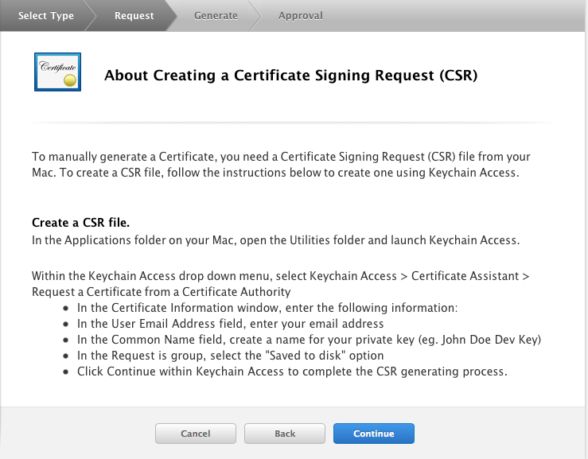
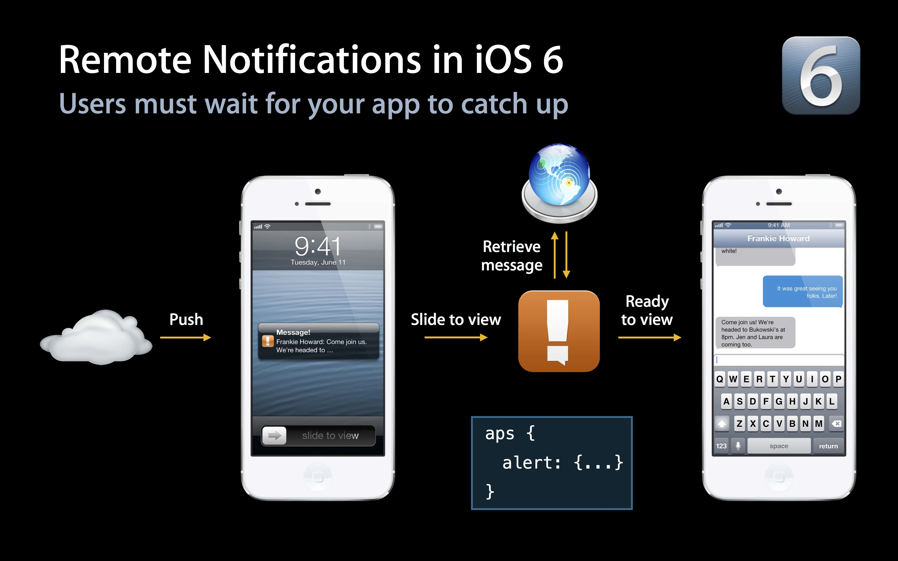

# iOS SDK 教程
## iOS SDK 集成指南
### 使用提示

本文匹配的 SDK版本：r1.2.5 以后。

查看最近更新了解最新的SDK更新情况。

### 产品功能说明

极光推送（JPush）是一个端到端的推送服务，使得服务器端消息能够及时地推送到终端用户手机上，让开发者积极地保持与用户的连接，从而提高用户活跃度、提高应用的留存率。极光推送客户端支持 Android, iOS 两个平台。

本 iOS SDK 方便开发者基于 JPush 来快捷地为 iOS App 增加推送功能，减少集成 APNs 需要的工作量、开发复杂度。

#### 主要功能

+ 为 JPush Server 上报 Device Token，免除开发者管理 Device Token 的麻烦
+ 应用运行时，应用内 JPush 长连接可以持续地收到推送消息

#### 主要特点

+ 集成简单
+ iOS SDK 集成后，服务器端向 iOS 设备推送简单方便

####集成压缩包内容

包名为JPush-iOS-SDK-[版本号]

+ lib文件夹：包含头文件 APService.h，静态库文件 libPushSDK.a ，支持的iOS版本为 5.0 及以上版本。（请注意：模拟器不能实现APNS）
+ pdf文件：开发指南
+ demo文件夹：示例

####开发环境

+ 建议使用 XCode 4.5 或以上版本

###SDK集成步骤

#### 1、在JPush Portal上创建应用
+ [在JPush的管理Portal上](在JPush的管理Portal上) 上传证书并创建应用。如果对APNs证书不太了解 请参考 [iOS 证书设置指南]()

+ 创建成功后自动生成 AppKey 用以标识该应用。

#### 2、导入API开发包到应用程序项目

+ 将SDK包解压，在XCode中选择“Add files to 'Your project name'...”，将解压后的lib子文件夹（包含APService.h、libPushSDK.a）添加到你的工程目录中。

### 3、必要的框架

+ CFNetwork.framework
+ CoreFoundation.framework
+ CoreTelephony.framework
+ SystemConfiguration.framework
+ CoreGraphics.framework
+ Foundation.framework
+ UIKit.framework
+ Security.framework
+ libz.dylib

### 4、Build Settings

+ 设置 Search Paths 下的 User Header Search Paths 和 Library Search Paths，比如SDK文件夹（默认为lib）与工程文件在同一级目录下，则都设置为"$(SRCROOT)/[文件夹名称]"即可。

### 5、创建并配置PushConfig.plist文件

在你的工程中创建一个新的Property List文件，并将其命名为PushConfig.plist，填入Portal为你的应用提供的APP_KEY等参数。

	{
	    "APS_FOR_PRODUCTION = "0";
	    "CHANNEL" = "Publish channel";
	    "APP_KEY" = "AppKey copied from JPush Portal application";

	}
	
+ CHANNEL
	+ 指明应用程序包的下载渠道，为方便分渠道统计。根据你的需求自行定义即可。

+ APP_KEY
	+ 在管理Portal上创建应用时自动生成的（AppKey）用以标识该应用。请确保应用内配置的 AppKey 与第1步在 Portal 上创建应用时生成的 AppKey 一致，AppKey 可以在应用详情中查询。

+ APS_FOR_PRODUCTION
	+ 1.3.1版本新增，表示应用是否采用生产证书发布( Ad_Hoc 或 APP Store )，0 (默认值)表示采用的是开发者证书，1 表示采用生产证书发布应用。请注意此处配置与 Web Portal 应用环境设置匹配。
+ 在1.2.2或之前版本的配置文件中，有 TEST_MODE 这个键，新版的SDK不再使用，可以将它删除。

### 6、添加代码

#### API

APIs 主要集中在 APService 接口类里。

	@interface APService : NSObject
	 
	// init Push
	+ (void)setupWithOption:(NSDictionary *)launchingOption;
	 
	// register notification type
	+ (void)registerForRemoteNotificationTypes:	(UIRemoteNotificationType)types;
	 
	// upload device token
	+ (void)registerDeviceToken:(NSData *)deviceToken;
		 
	// handle notification recieved
	+ (void)handleRemoteNotification:(NSDictionary 	*)remoteInfo;
	 
	@end

#### 调用代码

监听系统事件，相应地调用 JPush SDK 提供的 API 来实现功能。

以下 ３ 个事件监听与调用 JPush SDK API 都是必须的。请直接复制如下代码块里，注释为 "Required" 的行，到你的应用程序代理类里相应的监听方法里。

	- (BOOL)application:(UIApplication *)application didFinishLaunchingWithOptions:(NSDictionary *)launchOptions{
	    self.window = [[[UIWindow alloc] initWithFrame:	[[UIScreen mainScreen] bounds]] autorelease];
	    self.window.backgroundColor = [UIColor whiteColor];
	    [self.window makeKeyAndVisible];
	 
	    // Required
	    [APService registerForRemoteNotificationTypes:	(UIRemoteNotificationTypeBadge |UIRemoteNotificationTypeSound |UIRemoteNotificationTypeAlert)];
	    // Required
	    [APService setupWithOption:launchOptions];
	     
	    return YES;
	}
	 
	- (void)application:(UIApplication *)application 	didRegisterForRemoteNotificationsWithDeviceToken:	(NSData *)deviceToken {
	     
	    // Required
	    [APService registerDeviceToken:deviceToken];
	}
	 
	- (void)application:(UIApplication *)application 	didReceiveRemoteNotification:(NSDictionary *)userInfo{
	     
	    // Required
	    [APService handleRemoteNotification:userInfo];
	}
#### 监听通知

API里面提供了下面 5 种类型的通知：

extern NSString * const kAPNetworkDidSetupNotification;          // 建立连接

extern NSString * const kAPNetworkDidCloseNotification;          // 关闭连接

extern NSString * const kAPNetworkDidRegisterNotification;       // 注册成功

extern NSString * const kAPNetworkDidLoginNotification;          // 登录成功

extern NSString * const kAPNetworkDidReceiveMessageNotification; // 收到消息(非APNS)

其中，kAPNetworkDidReceiveMessageNotification通知是有传递数据的，可以通过NSNotification中的userInfo方法获取，包括标题、内容、内容类型、扩展信息等

### 高级功能

请参考：

[标签与别名API]()

[页面的统计]()
	
## iOS SDK 调试指南

### iOS 调试思维导图

### 确认证书

请到“应用详情页面”确认证书可用性：

### 开发环境测试

在对  JPush iOS 开发环境进行测试前，请确保 3 个统一：

+ App 是开发环境打包（开发证书 Development）
+ 上传了开发证书并验证通过
+ Portal 上的应用设置为开发环境

### 发布环境测试

在对  JPush iOS 生产环境进行测试前，请确保 3 个统一：

+ App 是 ad-hoc 打包或者App Store 版本（发布证书 Production）
+ 上传了发布证书并验证通过
+ Portal 上的应用设置为生产环境

### 可能存在的其他问题

收到消息不够稳定

JPush iOS 是对原生官方 APNs 推送的一个补充，是对其的封装，以帮助开发人员更轻松地使用 APNs 。

由于APNs 本身不承诺保证消息到达，客户端网络与服务器端的连通性，对 APNs 是否及时接收到消息具有很大的影响。

## iOS 证书 设置指南

### 创建应用程序ID

+ 登陆 [iOS Dev Center](https://developer.apple.com/devcenter/ios/index.action) 选择进入iOS Provisioning Portal。

+ 在 [iOS Provisioning Portal](https://daw.apple.com/cgi-bin/WebObjects/DSAuthWeb.woa/wa/login?&appIdKey=891bd3417a7776362562d2197f89480a8547b108fd934911bcbea0110d07f757&path=%2F%2Faccount%2Findex.action)中，点击App IDs进入App ID列表。

+ 创建 App ID，如果 ID 已经存在可以直接跳过此步骤

+ 为 App 开启 Push Notification 功能。如果是已经创建的 App ID 也可以通过设置开启 Push Notification 功能。

根据实际情况完善 App ID 信息并提交,注意此处需要指定具体的 Bundle ID 不要使用通配符。

### 配置和下载证书

+ 如果你之前没有创建过 Push 证书或者是要重新创建一个新的，请在证书列表下面新建。

+ 新建证书需要注意选择证书种类（开发证书用于开发和调试使用，生产证书用于 App Store 发布）

+ 点击 Continue 后选择证书对应的应用ID，然后继续会出现“About Creating a Certificate Signing Request (CSR)”。

+ 根据它的说明创建打开KeychainAccess 创建 Certificate Signing Request。

+ 填写“User Email Address”和“Common Name” 后选择 Saved to disk 进行保存 。

+ 继续返回Apple developer 网站点击 Continue ，上传刚刚生成的 .certSigningRequest 文件生成 APNs Push  Certificate。
+ 下载并双击打开证书，证书打开时会启动“钥匙串访问”工具。
+ 在“钥匙串访问”中你的证书会显示在“我的证书”中，注意选择“My Certificates” 和"login"

+ 导出 .p12 证书文件

`注意要选“login”和“My Certificates” 导出证书时要选中证书文件，不要展开private key。
`

+ 将文件保存为Personal Information Exchange (.p12)格式。

+ 将文件保存为Personal Information Exchange (.p12)格式。

### 上传证书

在 [JPush 管理 Portal 上](https://www.jpush.cn/apps/)，针对某应用程序，上传上面步骤得到 .p12 证书文件。这是 iOS SDK 能够接收到 JPush 推送消息的必要步骤。

## iOS 7 Background Remote Notification

### 简介

本次iOS 7在推送方面最大的变化就是允许，应用收到通知后在后台（background）状态下运行一段代码，可用于从服务器获取内容更新。功能使用场景：（多媒体）聊天，Email更新，基于通知的订阅内容同步等功能，提升了终端用户的体验。

Remote Notifications 与之前版本的对比可以参考下面两张 Apple 官方的图片便可一目了然。

如果只携带content-available: 1 不携带任何badge，sound 和消息内容等参数，则可以不打扰用户的情况下进行内容更新等操作即为“Silent Remote Notifications”。

### 客户端设置

#### 开启Remote notifications

需要在Xcode 中修改应用的 Capabilities 开启Remote notifications，请参考下图：

#### 修改通知处理函数

当注册了Backgroud Modes -> Remote notifications 后，notification 处理函数一律切换到下面函数，后台推送代码也在此函数中调用。

	- (void)application:(UIApplication *)application didReceiveRemoteNotification:(NSDictionary *)userInfo fetchCompletionHandler:(void (^)(UIBackgroundFetchResult))completionHandler；

### 服务端推送设置

推送消息携带 content-available: 1 是Background 运行的必须参数，如果不携带此字段则与iOS7 之前版本的普通推送一样。

#### 使用Web Portal 推送

在“可选设置内”选择对应的参数。

#### 使用 API 推送

只需在[Push API v2]() 的 n_extras->ios 内附加content-available":1 字段即可

###限制与注意

+ “Silent Remote Notifications”是在 Apple 的限制下有一定的频率控制，但具体频率不详。所以并不是所有的 “Silent Remote Notifications” 都能按照预期到达客户端触发函数。
+ “Background”下提供给应用的运行时间窗是有限制的，如果需要下载较大的文件请参考 Apple 的 NSURLSession 的介绍。
+ “Background  Remote Notification”  的前提是要求客户端处于Background 或 Suspended 状态，如果用户通过 App Switcher 将应用从后台 Kill 掉应用将不会唤醒应用处理 background 代码。

更详细的说明资料请查阅 Apple 官方的 iOS 开发文档。

