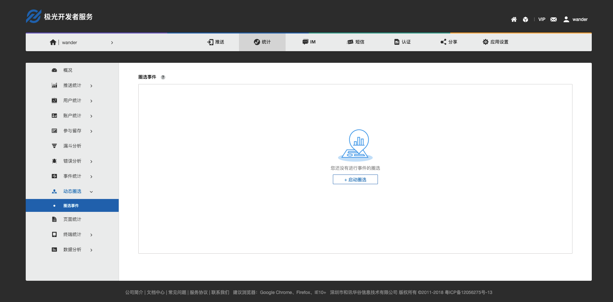
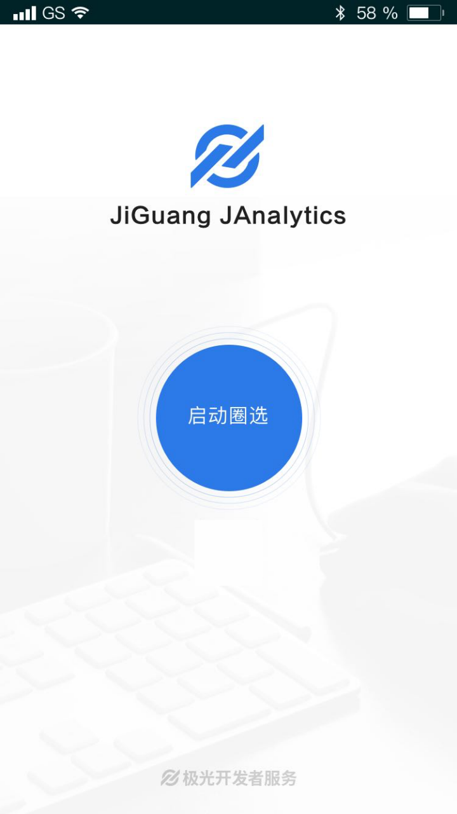
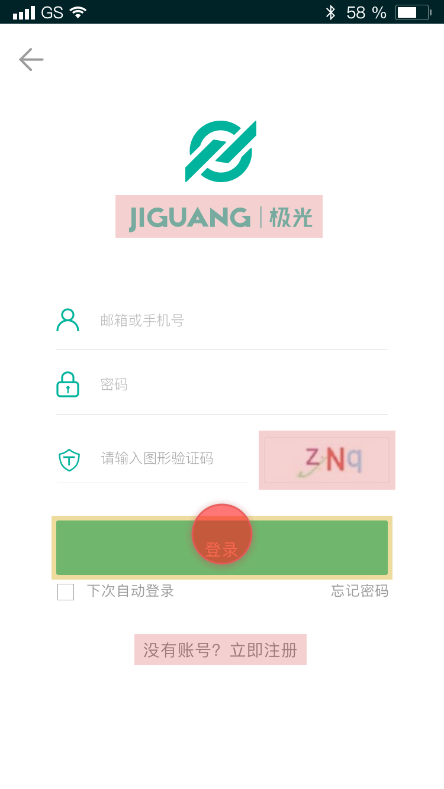
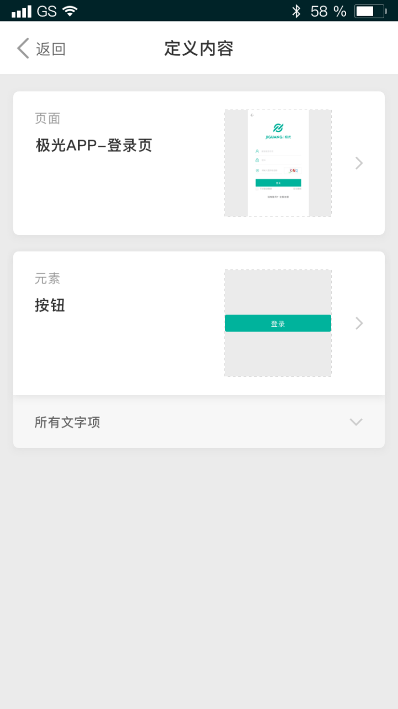
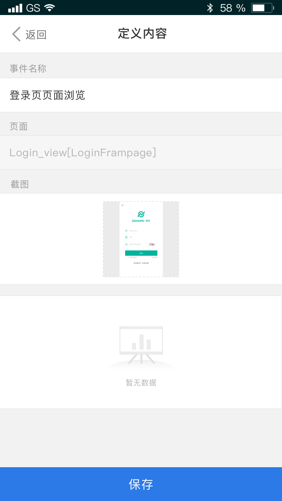
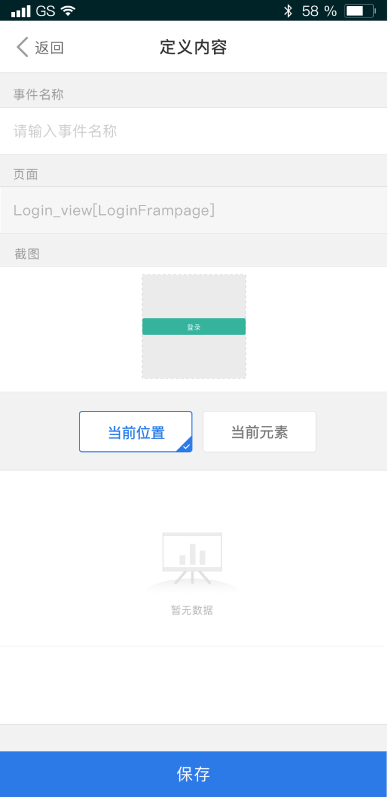
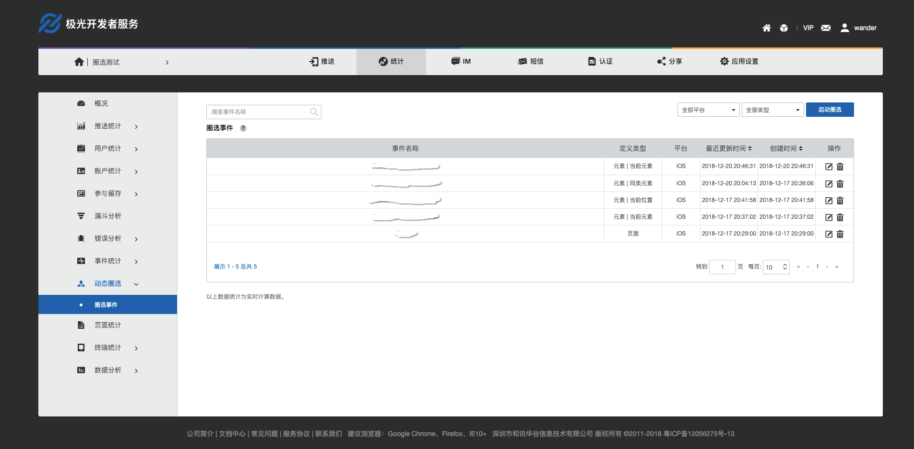
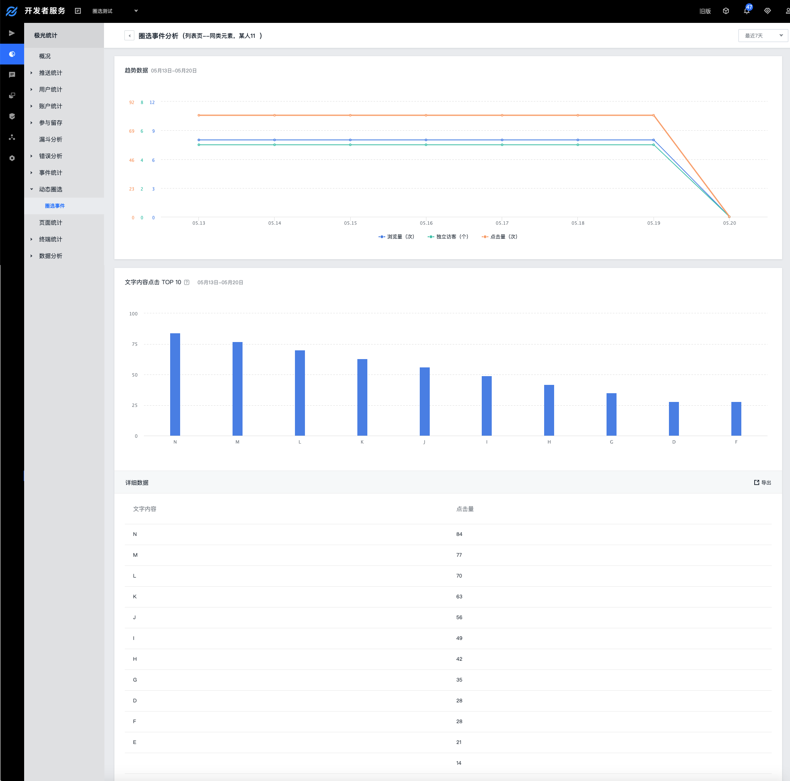

# 动态圈选（Beta）


##概述
极光统计的动态圈选功能，颠覆传统应用统计使用方式，无需对数据追踪点添加任何代码，您只需对自己的应用界面进行圈圈点点，添加可视化的追踪点事件，便可收集到对应的统计数据。

此功能目前为Beta版，欢迎在体验和使用中给我们提出各种反馈和改进建议。


##使用说明
+ 在使用动态圈选功能之前，请先集成我们最新的统计SDK，并确保使用已发布的最新版本的APP进行圈选操作；
+ 您可在极光统计文档[资源下载](https://docs.jiguang.cn/janalytics/resources/)中获取最新的SDK，并按照其集成指南（[ios](https://docs.jiguang.cn/janalytics/client/ios_guide/) 、[android](https://docs.jiguang.cn/janalytics/client/android_guide/)）进行集成。


##功能介绍
### 建立圈选事件

进入极光管理控制台-统计-动态圈选，若您还没有创建过圈选事件，点击【圈选事件】，进入初始化【启动圈选】的页面。



点击【启动圈选】，弹出二维码页面，手机端通过扫码唤起手机端【启动圈选】页面（如微信、QQ、钉钉扫码等需要在浏览器中打开。）





手机端点击【启动圈选】进入目标APP的初始界面。拖动红圈点进行圈选操作。松开进入圈选-定义内容页面。红色框标识的元素表明该元素已被定义。

```
友情提示：目前仅ios支持已定义红框显示。
``` 



选择您想要定义事件，可以在【定义内容】中选择进入页面或者任一元素或者文字项。




选择【页面】，进入【页面事件】定义页面。定义好事件名称，点击「保存」，页面事件创建成功，便可收集该页面对应的浏览量、点击量数据。页面事件默认定义的范围是当前位置。



选择【元素】，进入【元素事件】定义页面。可选择该元素的定义范围：当前位置或者当前元素。



选择文字项，进入列表型控件的文字专属定义页面。可针对性的选择当前位置、当前元素、同类元素中的任一一个类型范围。


定义内容中相关字段解释如下：

| 名称 | 描述 |
|:-----------|:--------------|
| 事件名称 | 您可以对圈选的页面或者元素的事件进行命名。 |
| 页面 | 自动带出定义的页面或者元素所在的页面路径，供使用者参考。|  
| 截图 |  自动截取具体定义页面或者元素的截图，供使用者参考。| 
| 类型范围 | 分当前位置、当前元素、同类元素；定义时仅能选择一种类型范围。有关类型范围的说明请具体详见如下「圈选事件类型范围说明 」。| 
| 数据报表 |  创建圈选事件后会对应展示「最近7天」的数据。包含页面/元素的浏览、独立访客、点击量等数据。 | 


### 场景举例
+ 如果您想要在刚刚埋好点的页面测试埋点数据，需要重新进入该页面；
+ 如果您想要在另一台设备上测试埋点数据，需要重新启动应用以获取最新的埋点列表数据。


### 圈选事件管理
创建成功圈选事件后，您可在极光管理控制台-统计-动态圈选的【圈选事件】中查看和管理具体的事件列表及事件数据。

点击【圈选事件】，进入历史事件列表，支持平台、定义内容、事件名称查询。

点击【启动圈选】可以创建新的圈选事件。



点击【事件名称】进入【事件分析】详情页面。可以查看具体的浏览、独立访客和点击量数据。

```
友情提示：若有对列表型控件进行「同类元素」的定义，则可以查看其点击量TOP10的文字内容项的柱状图以及所有文字项的详细数据列表。
```





## 圈选事件类型范围说明
定义事件时可对目标APP的页面及元素（如按钮、列表型控件之类）进行圈选操作。

圈选事件三种类型范围的定义：

+ 选择“当前位置”，表明此元素（控件）所定义的位置的浏览、点击进行数据统计，即红圈点覆盖的位置才统计，不管选中元素的文字有没有发生变化。
+ 选择“当前元素”，表明此元素（控件）位置和内容的浏览、点击进行数据统计，若文字出现变化，则不再统计。
+ 选择“同类元素”，表明此元素（控件）相关层级的位置和文字内容均将会被统计，如定义的是列表型控件，选择同类元素，整个列表中每个按钮里的文字都会被统计下来，且会单独展示每项文字内容的柱状图和具体点击数据。

```
友情提示：同类元素目前仅监控「列表型控件」的文字项。
``` 


## 圈选控件事件监听说明
JAnalytics SDK V2.0.0（ios，android）功能目前支持常见的控件类型的浏览事件、点击事件的上报，并且有些控件需要开发者有设置监听事件才能统计到点击数据。

### android
+ 目前支持浏览事件的控件有：
位于Activity或Fragment内的View、TextView、EditText、Button、ImageView、CheckBox、RadioButton、Switch、SeekBar、RatingBar、RecyclerView、ListView、Dialog、Popmenu。
+ 以上所述控件如果开发者设置了监听事件（例如setOnClickListener），通过圈选可以获取统计到点击数据。
+ 对于列表类型的控件，如RecyclerView、ListView、GridView、ViewPager这类可复用Item的控件，圈选时可以选择整个Item。
+ Ratingbar、ProgressBar这种评分、进度条控件，支持细化到可监听值变化。

### ios	
+ 目前支持大部分常见控件的圈选，如UILabel、UIButton、UISegmentedControl、UITextField、UISearchBar、UISlider、UISwitch、UIActivityIndicatorView、UIProgressView、UIPageControl、UIStepper、UITableView、UICollectionView等。
+ 针对列表型控件，统计点击和浏览的数据，需要开发者自己实现对应的方法，如统计UITableViewCell的点击事件，需要实现UITableView的delegate中tableView:didSelectRowAtIndexPath:方法。要统计UITableViewCell的滑动浏览事件，需要实现UITableView的delegate中tableView:didEndDisplayingCell:forRowAtIndexPath:方法

## FAQ

###动态圈选事件数量有上限吗？

有，每个应用最多可创建1000个圈选事件。

###圈选功能适用于？

目前仅支持手机端扫码进行圈选。

###圈选事件可以重复定义吗？

不可以。

###圈选事件名称可以重名吗？

同一应用的圈选事件的名称不可以重名。

###准备启动圈选，扫码后却展示空白页面？
您清空浏览器缓存再试或者更换其他浏览器尝试。

###Android手机在集成SDK后，扫码后点击“启动圈选”按钮并成功跳转到目标应用，圈选操作红点却没有弹出来？
您可能没有开启应用的悬浮窗权限，可以在手机的设置->应用权限->更多/高级 或类似“手机管理”、“安全中心”的高级设置中开启权限。

