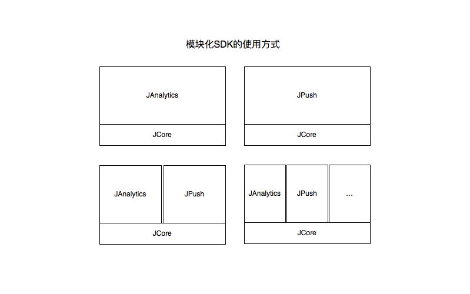

# Android SDK 概述

## JAnalytics Android
### 模块化的极光开发者SDK
极光开发者服务SDK采用了模块化的使用模式，即一个核心（JCore）+N种服务（JPush，JAnalytics，...）的使用方式，方便开发者使用某一项服务或多项服务，极大的优化了多模块同时使用时功能模块重复的问题。如下图：  

## 上报策略
JAnalytics Android SDK采用了数据记录与数据上报分离的策略，数据实时记录，按照上报策略上报数据。

+ 打开应用上报
+ 关闭应用上报

备注：如遇到极端情况导致数据上报不成功，数据不会被清除，等待下一次上报策略触发再上报。

## 压缩包说明
供下载的 JPush Android SDK 压缩包，一般包含以下几个部分：

+ AndroidManifest.xml
	+ 客户端嵌入SDK参考的配置文件
+ libs/jcore-android_1.x.x.jar
	+ sdk 核心包
+ libs/xxx/xx.so
	+ sdk需要用的so文件
+ libs/janalytics-android-sdk_1.x.x.jar
	+ SDK analysis 开发包
+ example
	+ 是一个完整的 Android 项目，通过这个演示了 JAnalysis SDK 的基本用法，可以用来做参考。

## 集成方式
目前SDK只支持Android 2.3或以上版本的手机系统。  
参考：[JAnalytics Android SDK 集成指南](android_guide)

## 接口说明
参考：[JAnalytics Android API](android_api)

## 技术支持

当出现问题时：

+ 请仔细阅读文档，查看是否有遗漏。
+ 给我们的support发邮件：<support@jpush.cn>

为了更快速的解决问题，在寻求帮助时，请提供下列信息：

+ 提供appkey
+ 如果是 SDK 问题请提供对应的 SDK 版本和完整的日志记录

