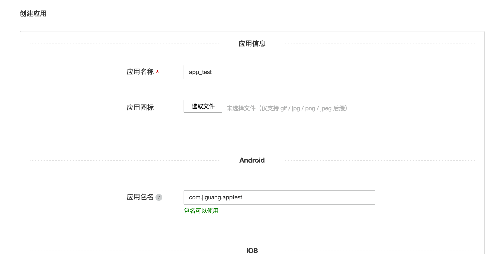

# 极光统计 MiniProgram SDK 集成指南

## 使用提示

本文是 JAnalytics 微信小程序 SDK 标准的集成指南文档。

匹配的 SDK 版本为：v1.0.0 及以后版本。

+ 如果您想要快速地测试、请参考本文在几分钟内跑通 Demo。
+ 极光推送文档网站上，有相关的所有指南、API、教程等全部的文档。包括本文档的更新版本，都会及时地发布到该网站上。

## 产品说明

利用事件模板统计 App 用户的行为事件并上报给极光服务器，极光提供加工过的数据通过 WebPortal 展示给开发者，让开发者更加了解自己的应用在用户手中的使用情况。

### 主要场景：

	1.统计自定义事件

### janalytics-m-1.x.y-release.zip 集成压缩包内容

+ libs/janalytics-m-1.x.x.js
	+ SDK analysis 开发包
+ libs/janalytics-conf.js
	+ SDK analysis 配置文件
+ example
	+ 是一个完整的小程序项目，通过这个演示了 JAnalysis SDK 的基本用法，可以用来做参考。


## 创建应用

### 创建极光开发者帐号

请访问[极光官方网站](https://www.jiguang.cn/accounts/register) 注册您的极光账号。


### Portal上创建应用

使用注册账号登陆，进入极光控制台-应用管理，点击「创建应用」按钮，进入创建应用的界面。输入应用名称和上传好应用图标（非必填），点击「确认」即可创建应用。





### 查看应用信息

创建好应用后，如果想要查看该应用的详细信息，可点击应用条目右侧的「设置」按钮进入【应用信息】页面。


## 本地工程配置

+ 解压压缩包，将 libs 下文件放置入项目中，目录自定义，例复制到工程的 utils 下面.
	+ janalytisc-m-1.x.x.js
	+ janalytics-conf.js

## 配置 janalytics-conf.js

需要在janalytics-conf.js 配置 SDK 所需的集成信息和开启应用日志。示例如下：

```
exports.appKey = ""; // 官网中创建应用后分配的 appkey，必填
exports.appid = ""; // 微信管理后台分配的 appid，必填
exports.channel = "default-channel"; // 渠道名称，默认值为:default-channel
exports.debugMode = true; // true 表示打开调试模式，可看到 sdk 的日志
```

## 配置 request 合法域名

需要在[微信公众平台](https://mp.weixin.qq.com/)开发设置中,添加以下为 request 合法域名：

 - https://user.jpush.cn
 - https://mini-stats.jpush.cn

## SDK 初始化

+ 在 app.js 中导入 SDK 并使用调用初始化:

```
var JAnalyticsInterface = require('./utils/janalytics-m-1.0.0.js') 

App({
  onLaunch: function () {
	  ···
	   //在 app onLaunch 调用初始化
	  JAnalyticsInterface.init(this)
  }	
  ···
})
```
ps:在 app.js onLaunch 调用初始化后可供每个页面使用，无需重复导入，需要时使用 app.JAnalyticsInterface 调用 SDK 相关方法。

### 更多 API

其他 API 的使用方法请参考接口文档：[MiniProgram SDK API](./miniprogram_api)

### 运行 demo

压缩包附带的 example 是一个 API 演示例子。你可以直接运行起来测试。运行可参考[小程序官方文档](https://developers.weixin.qq.com/miniprogram/dev/)


## 技术支持

邮件联系：[support&#64;jiguang.cn](mailto:support&#64;jiguang.cn)
