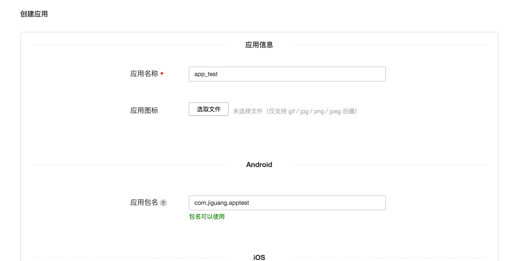

# 极光统计 QuickApp SDK 集成指南

##使用提示

本文是JAnalytics QuickApp SDK 标准的集成指南文档。

匹配的 SDK 版本为：v1.0.0及以后版本。

+ 如果您想要快速地测试、请参考本文在几分钟内跑通Demo。
+ 极光推送文档网站上，有相关的所有指南、API、教程等全部的文档。包括本文档的更新版本，都会及时地发布到该网站上。

##产品说明
利用事件模板统计App用户的行为事件并上报给极光服务器，极光提供加工过的数据通过WebPortal展示给开发者，让开发者更加了解自己的应用在用户手中的使用情况。
###主要场景：

	1.统计页面流
	2.统计自定义计数事件
	3.统计自定义计算事件

###janalytics-quick-app-release-1.x.y.zip 集成压缩包内容

+ libs/janalytics-quickapp-1.x.x.js
	+ SDK analysis 开发包
+ example
	+ 是一个完整的 Quick App 项目，通过这个演示了 JAnalysis SDK 的基本用法，可以用来做参考。

###Quick App 平台版本
SDK支持在快应用平台v1000及以后版本上使用。

##创建应用

###创建极光开发者帐号

请访问[极光官方网站](https://www.jiguang.cn/accounts/register) 注册您的极光账号。


###Portal上创建应用

使用注册账号登陆，进入极光控制台-应用管理，点击「创建应用」按钮，进入创建应用的界面。输入应用名称和上传好应用图标（非必填），点击「确认」即可创建应用。




###查看应用信息

创建应用之后返回用户主页面可以看到应用清单，点选你刚才创建的应用来查看应用信息。


##本地工程配置

+ 解压压缩包，将libs下的文件复制到工程的libs下面.
	+ janalytisc-quickapp-1.x.x.js。

##配置manifest.json
需要在在manifest.json 配置SDK所需的快应用平台依赖库和开启开应用日志。示例如下：

	"features": [
    	{ "name": "system.prompt" },
    	{ "name": "system.router" },
    	{ "name": "system.shortcut" },
    	{ "name": "system.device" },
    	{ "name": "system.app" },
    	{ "name": "system.fetch" },
    	{ "name": "system.storage" },
    	{ "name": "system.cipher" },
    	{ "name": "system.network" }
    ],
    "config": {
    	"logLevel": "debug"
    },
 
	

##添加SDK的Nodejs依赖库
该统计sdk需要依赖nodejs库。依赖方式及说明如下(如已经依赖相关模块则跳过)：

###npm install uuid --save
	生成uuid
###npm install lodash.clonedeep --save
	使用对象复制
###npm install pako --save
	使用数据压缩，减小流量
###npm install crypto-js --save
	使用数据加密，增加安全性


##SDK 初始化

+ 设置调试模式：参数为 true 表示打开调试模式，可看到 sdk 的日志。

```
	JAnalyticsInterface.setDebugMode(boolean isDebugMode);
```

+ 在 app.ux 中导入 SDK 并使用 AppKey 初始化:

	
```
	JAnalyticsInterface.init(context,appkey,channel);
	import { JAnalyticsInterface } from './libs/janalytics-quickapp-1.0.0'
	     export default {
    	 showMenu: util.showMenu,
    	 createShortcut: util.createShortcut,
		 onCreate(){
		 	JAnalyticsInterface.setDebugMode(true);
		 	this.JAnalyticsInterface = JAnalyticsInterface.init(this, "your appkey", "test-channel")
		 }
	}

```


ps:建议将JAnalyticsInterface对象设置为全局的方法，暴露给每个页面使用，无需重复导入，需要时使用 this.$app.JAnalyticsInterface 调用 SDK 相关方法。

### 更多 API

其他 API 的使用方法请参考接口文档：[QuickApp SDK API](./quickapp_api)

### 运行 demo

压缩包附带的 example 是一个 API 演示例子。你可以直接运行起来测试。运行可参考[Quick App官方文档](https://doc.quickapp.cn/)


## 技术支持

邮件联系：[support&#64;jiguang.cn](mailto:support&#64;jiguang.cn)
