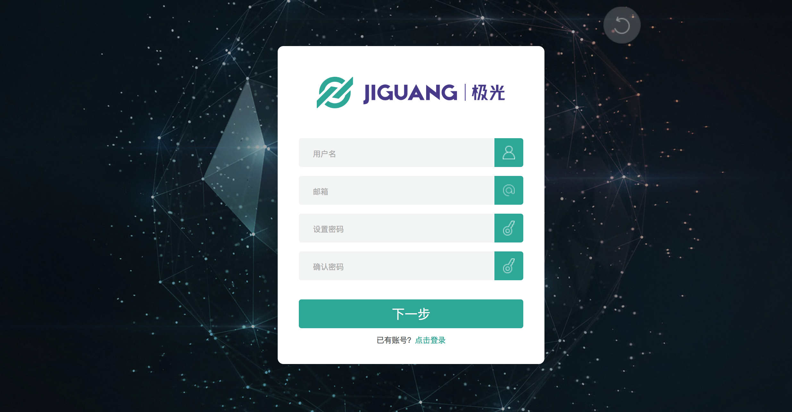

# 极光统计 QuickApp SDK 集成指南

##使用提示

本文是JAnalytics QuickApp SDK 标准的集成指南文档。

匹配的 SDK 版本为：v1.0.0及以后版本。

+ 如果您想要快速地测试、请参考本文在几分钟内跑通Demo。
+ 极光推送文档网站上，有相关的所有指南、API、教程等全部的文档。包括本文档的更新版本，都会及时地发布到该网站上。

##产品说明
利用事件模板统计App用户的行为事件并上报给极光服务器，极光提供加工过的数据通过WebPortal展示给开发者，让开发者更加了解自己的应用在用户手中的使用情况。
###主要场景：

	1.统计页面流
	2.统计自定义计数事件
	3.统计自定义计算事件

###janalytics-quick-app-release-1.x.y.zip 集成压缩包内容

+ libs/janalytisc-quickapp_v1.x.x.js
	+ SDK analysis 开发包
+ example
	+ 是一个完整的 Quick App 项目，通过这个演示了 JAnalysis SDK 的基本用法，可以用来做参考。

###Quick App 平台版本
目前SDK只支持1000或以上版本的手机系统.

##创建应用

###创建极光开发者帐号

请访问[极光官方网站](https://www.jiguang.cn/accounts/register) 注册您的极光账号。

###Portal上创建应用

使用注册账号登陆，进入极光控制台后，点击“创建应用”按钮，进入创建应用的界面。填上你的应用程序的名称以及应用包名这二项就可以了，最后点击最下方的 “创建我的应用”按钮，创建应用完毕。

###查看应用信息

创建应用之后返回用户主页面可以看到应用清单，点选你刚才创建的应用来查看应用信息。

##本地工程配置

+ 解压压缩包，将libs下的文件复制到工程的libs下面.
	+ janalytisc-quickapp_v1.x.x.js。

##工程依赖
该统计sdk需要依赖nodejs库。依赖方式及说明如下(如已经依赖相关模块则跳过)：

###npm install uuid --save
	生成uuid
###npm install lodash.clonedeep --save
	使用对象复制
###npm install pako --save
	使用数据压缩，减小流量
###npm install crypto-js --save
	使用数据加密，增加安全性

##添加代码

### 基础 API

+ 初始化 sdk ： 传入 appkey 来初始化 sdk 。

		JAnalyticsInterface.init(appkey,channel);

+ 设置调试模式：参数为 true 表示打开调试模式，可看到 sdk 的日志。

		JAnalyticsInterface.setDebugMode(boolean isDebugMode);

### 更多 API

其他 API 的使用方法请参考接口文档：[QuickApp SDK API](./quickapp_api)

### 运行 demo

压缩包附带的 example 是一个 API 演示例子。你可以直接运行起来测试。运行可参考 [Quick App官方文档](https://doc.quickapp.cn/)

## 技术支持

邮件联系：[support&#64;jpush.cn](mailto:support&#64;jpush.cn)
