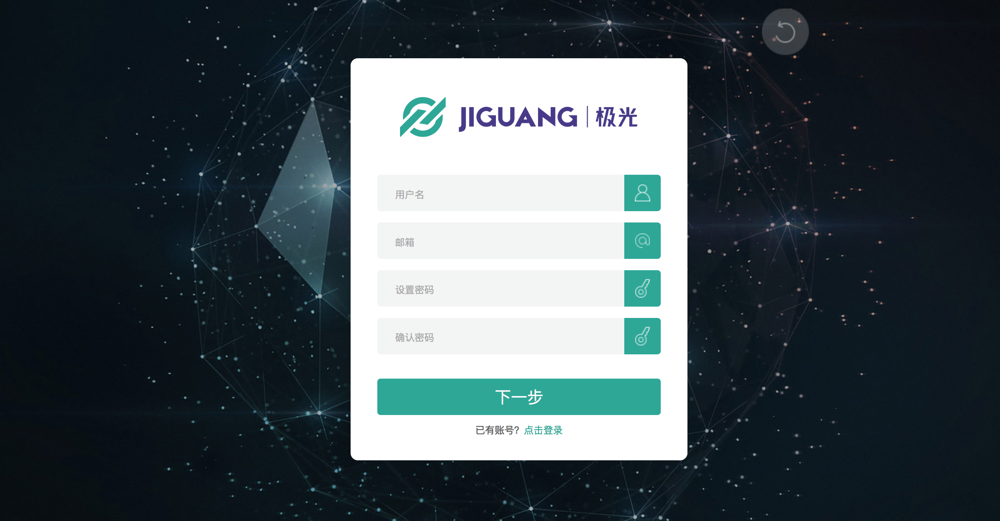
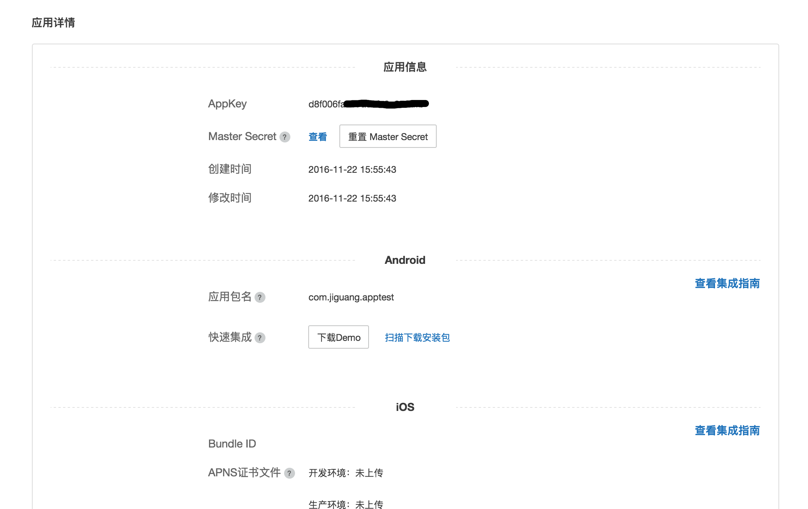

# 极光统计 Web SDK 集成指南

## 使用提示

本文是 JAnalytics Web SDK 标准的集成指南文档。

+ 如果您想要快速地测试、请参考本文在几分钟内跑通 Demo。
+ 极光推送文档网站上，有相关的所有指南、API、教程等全部的文档。包括本文档的更新版本，都会及时地发布到该网站上。

## 产品说明

利用事件模板统计 App 用户的行为事件并上报给极光服务器，极光提供加工过的数据通过 WebPortal 展示给开发者，让开发者更加了解自己的应用在用户手中的使用情况。

### 主要场景：

	1.统计自定义事件

### janalytics-web-example.zip 集成压缩包内容

+ example
	+ 是一个 web 页面，通过这个演示了 JAnalysis SDK 的基本用法，可以用来做参考。


## 创建应用

### 创建极光开发者帐号

请访问[极光官方网站](https://www.jiguang.cn/accounts/register) 注册您的极光账号。



### Portal上创建应用

使用注册账号登陆，进入极光控制台后，点击“创建应用”按钮，进入创建应用的界面。填上你的应用程序的名称就可以了，最后点击最下方的 “创建我的应用”按钮，创建应用完毕。


### 查看应用信息

创建应用之后返回用户主页面可以看到应用清单，点选你刚才创建的应用来查看应用信息。




## SDK 接入

每个页面接入下面 js

```
<script type="text/javascript" src="https://web-stat.jiguang.cn/web-janalytics/scripts/janalytics-web.min.js"></script>
```
引入该 JS 后，就可以使用 Window 上的全局对象 JAnalyticsInterface

特别提示：请直接使用此链接, 不要将此文件下载到您项目中, 否则, 我们在更新数据结构或API接口后有可能会导致统计失效。


## SDK 初始化

+ 调用初始化时会在页面接入极光 iframe，所以需要在每个页面 DOM 加载完毕后，或者在收到页面事件 onload 后调用初始化:

```
window.JAnalyticsInterface.init({
    appkey: "", // 极光官网中创建应用后分配的 appkey，必填
    debugMode: true, // 设置是否开启 debug 模式。true 则会打印更多的日志信息。设置 false 则只会输出 w、e 级别的日志。
    channel: "default-channel", // 渠道名称，默认值为:default-channel
    loc: true, //设置是否尝试获取位置信息上报，默认为 true
    singlePage:false //设置是否为单页面，默认为 false
  });
```


### 更多 API

其他 API 的使用方法请参考接口文档：[Web SDK API](./web_api)

### 运行 demo

压缩包附带的 example 是一个 API 演示例子。你可以直接在浏览器运行测试。


## 技术支持

邮件联系：[support&#64;jiguang.cn](mailto:support&#64;jiguang.cn)
