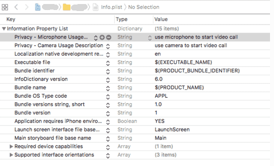
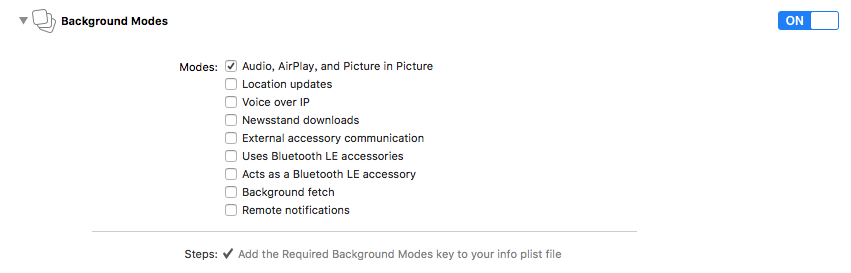
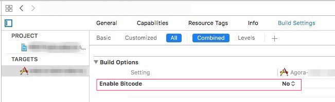

<h1>iOS JMRTC SDK 实时音视频</h1>


## 概述

极光 IM 为开发者提供稳定可靠的实时音视频开发框架（简称 JMRTC），开发者可集成 JMRTC SDK，快速实现实时音视频通讯功能，支持1对1语音/视频私聊，多人语音视频聊天。

### JMRTC 集成文档

#### 集成说明

+ JMRTC 是基于 JMessage 开发的，所以必须先集成[JMessage SDK](../resources.md) ，IM SDK 从 3.6.2 才开始支持JMRTC。
+ 如果您看到本文档，但还未下载 JMRTC SDK，请访问[SDK下载页面](../resources)下载。
+ 音视频服务需[付费开通](../guideline/faq/#open)或[申请试用](../guideline/faq/#_15)后才能使用，详细价格方案见：[计费说明](../guideline/faq/#_5)

#### 集成步骤
##### 步骤 1：准备环境
+ 请确保满足以下开发环境要求:
	+ Apple XCode 6.0 或以上版本
	+ iOS 7.0 或以上版本
	+ 支持语音和视频功能的真机设备

##### 步骤 2：添加必须 SDK
+ 自动导入

	+ 安装 CocoaPods ：`sudo gem install cocoapods`  
	+ 更新本地的索引库 ：`pod repo update `
	+ 在 Podfile 里添加引用:  
	`pod 'JMessage'`  
	`pod 'AgoraRtcEngine_iOS', '2.2.1'`  
	+ 导入依赖库：`pod install`
	
+ 手动导入	
	+ 下载最新的 [JMRTC.framework 、JMessage.framework](../resources.md)
	+ 添加指定版本的 [Agora SDK v2.2.1](https://docs.agora.io/cn/2.2.1/download)
 
##### 步骤 3: 添加系统库
+ libc++.tbd
+ libresolv.tbd
+ libsqlite3.0.dylib
+ AVFoundation.framework
+ AudioToolbox.framework
+ VideoToolbox.framework
+ CoreMotion.framework
+ CoreMedia.framework
+ CoreAudio.framework
+ CoreTelephony.framework
+ CoreGraphics.framework
+ CFNetwork.framework
+ Security.framework
+ MobileCoreServices.framework
+ SystemConfiguration.framework

##### 步骤 4: 授权使用音视频 SDK
+ 摄像头、麦克风
+ 在 info.plist 进行授权操作:

```
将 Privacy - Camera Usage Description 设置为 use camera to start video call  
将 Privacy - Microphone Usage Description 设置为 use microphone to start video call
```

##### 步骤 5：其他设置
+ 在项目配置，Build Settings，Other Linker Flags 里增加如下 1 项：

	```	
	-ObjC
	```	
	
+ 设置后台模式。在 Background Modes 里选择 Audio, AirPlay, and Picture in Picture 

__注意__：APP 支持后台运行的具体实现，需要开发者自己完成开发。

+ 选择当前 Target, 并按照下图禁用 bitcode , 因为 Agora SDK 不支持 bitcode 。


### JMRTC 开发文档

#### 1、初始化音视频引擎

在发起音视频通话之前，必须先初始化引擎，如果没有初始化或初始化失败，则无法使用所有音视频功能。

```
/*!
 * @abstract 初始化音视频引擎。
 *
 * @param handler  初始话回调，error = nil 表示初始化成功
 *
 * @discussion 在使用其他接口之前，必须先调用此接口初始化引擎。
 */
+ (void)initializeEngine:(JMRTCCompletionHandler _Nullable)handler;
```

在挂断或不使用音视频功能时，建议释放引擎，以免占用系统内存。

```
/*!
 * @abstract 释放音视频引擎
 *
 * @discussion 挂断后建议释放引擎，释放之后如果需要再次使用音视频服务，需要重新调用初始化接口来重新初始化音视频引擎。
 */
+ (void)releaseEngine;
```

#### 2、添加监听代理

您需要设置 `JMRTCClient ` 的全局通话监听，来监听通话呼入、通话状态等。
建议在需要使用音视频的界面，最初始先添加监听代理，以免遗漏回调信息。  

调用 `JMRTCClient ` 类一下接口，添加代理监听

```
/*!
 * @abstract 添加音视频监听
 *
 * @param delegate 需要监听的 Delegate Protocol
 *
 * @discussion 建议在 didFinishLaunchingWithOptions 方法中添加全局监听，避免遗漏监听
 */
+ (void)addDelegate:(id<JMRTCDelegate>_Nonnull)delegate;
```

通话状态发生变化时会通过您传入的 delegate 进行回调，您可以监听到所有回调信息。

#### 3、发起通话

您可以调用 `JMRTCClient` 类以下接口，发起通话

```
/*!
 * @abstract 发起一个通话
 *
 * @param users            邀请的用户列表
 * @param type             发起的通话媒体类型
 * @param handler          回调，error = nil 表示成功，result 为 JMRTCSession 对象
 *
 * @discussion 在此接口成功之后，可以设置会话中用户展示视图、摄像头、扩音器等属性;
 * 如果被邀请人中包含未登录用户只会向已登录用户发起邀请。
 */
+ (void)startCallUsers:(NSArray <__kindof JMSGUser *>*_Nonnull)users
             mediaType:(JMRTCMediaType)type
               handler:(JMRTCCompletionHandler _Nullable)handler;
```
	
其中，您可以通过返回的通话实体，操控通话和获取通话相关信息。
	
#### 4、获取当前通话实体
	
您可以通过 `JMRTCClient ` 的以下接口，直接查询当前的通话实体。

```
/*!
 * @abstract 当前的通话会话实体
 */
+ (JMRTCSession *_Nullable)currentCallSession;
```

#### 5、通话实体
	
通话实体 `JMRTCSession` 包含当前通话的所有信息，您可以通过其中的接口，操控当前通话，如：接听、挂断、邀请等；也可获取相关信息，如：通话类型、当前被邀请列表等。

##### 接听当前来电。	

```
/*!
 * @abstract 接听来电
 *
 * ### 此接口只能在收到通话邀请回调 [JMRTCDelegate onCallReceiveInvite:] 之后才能调用；
 *
 * ### 调用成功后，双方都会触发 [JMRTCDelegate onCallConnected:] 回调，通知上层通话连接已建立；
 *
 * ### 并且 SDK 会触发 [JMRTCDelegate onCallMemberJoin:] 通知当前已经在通话频道内的用户有新用户加入。
 */
- (void)accept:(JMRTCCompletionHandler _Nullable)handler;
```

##### 挂断当前通话

```
/*!
 * @abstract 挂断通话
 *
 * ### 调用成功后，挂断方会触发 [JMRTCDelegate onCallDisconnect::disconnectReason:]通知上层连接断开，通话结束；
 *
 * ### 其他用户会触发 [JMRTCDelegate onCallMemberLeave:reason:]通知上层有用户离开.
 *
 * @discussion 注意：SDK 一般情况不会主动调用 hangup，挂断通话操作由上层决定。此接口可以在邀请阶段以及通话阶段由任意通话中用户发起
 */
- (void)hangup:(JMRTCCompletionHandler _Nullable)handler;
```

##### 拒绝通话邀请

```
/*!
 * @abstract 拒绝通话邀请
 *
 * ### 此接口只能在收到通话邀请回调 [JMRTCDelegate onCallReceiveInvite:] 之后才能调用；
 *
 * ### 调用成功后，拒绝方会触发 [JMRTCDelegate onCallDisconnect:disconnectReason:]通知上层连接断开，通话结束；
 *
 * ### 其他用户会触发 [JMRTCDelegate onCallMemberLeave:reason:]通知上层有用户离开.
 *
 * @discussion 此接口可以在邀请阶段以及通话阶段由任意通话中用户发起
 */
- (void)refuse:(JMRTCCompletionHandler _Nullable)handler;
```

##### 邀请用户加入当前通话

```
/*!
 * @abstract 邀请用户加入通话
 *
 * ### 被邀请方收到邀请时，会触发 [JMRTCDelegate onCallReceiveInvite:] 回调；
 *
 * ### 通话中的其他用户，会触发 [JMRTCDelegate onCallOtherUserInvited:fromUser:] 回调
 *
 * @param users      用户列表
 * @param handler    回调,error=nil 时表示操作成功
 *
 * @discussion 在通话已经建立的前提下，再邀请其他用户加入当前通话.
 * 如果被邀请人中包含未登录用户只会向已登录用户发起邀请.
 */
- (void)inviteUsers:(NSArray <__kindof JMSGUser *>*_Nonnull )users
            handler:(JMRTCCompletionHandler _Nullable)handler;
```

##### 设置视频通话中某个用户的显示 View

```
/*!
 * @abstract 设置用户视频展示 View
 *
 * @param view   视频的View
 * @param user    用户（自己或他人）
 *
 * @discussion 在发起通话邀请之后，设置视频的展示 view
 */
- (void)setVideoView:(UIView *_Nonnull)view user:(JMSGUser *_Nonnull)user;
```

##### 设置静音

```
/*!
 * @abstract设置静音状态
 *
 * @param muted 是否静音
 */
- (BOOL)setMuted:(BOOL)muted;
```

##### 设置扬声器状态

```
/*!
 * @abstract 设置扬声器状态
 *
 * @param enabled  是否开启扬声器，音频通话默:NO，视频通话默认:YES
 *
 * @discussion 只在视频或语音通话连接建立之后调用有效
 */
- (BOOL)setSpeakerEnabled:(BOOL)enabled;
```

##### 设置视频流状态

```
/*!
 * @abstract 设置视频流状态
 *
 * @param enabled  开启/关闭，音频通话默:NO，视频通话默认:YES
 *
 * @discussion 该方法不影响本地视频流获取，没有禁用摄像头，只是暂停发送本地视频流，只在视频通话连接建立之后调用有效。
 *
 * 通话中的其他用户，会触发 [JMRTCDelegate onCallUserVideoStreamEnabled:byUser:] 回调
 */
- (BOOL)setVideoStreamEnabled:(BOOL)enabled;
```

##### 切换前后摄像头

```
/*!
 * @abstract 切换前后摄像头
 */
- (BOOL)switchCameraMode;
```

#### 6、获取通话实体相关信息

```
/// 当前通话的频道id
@property(nonatomic, assign, readonly) SInt64 channelId;
	
/// 当前用户使用的媒体类型
@property(nonatomic, assign, readonly) JMTRCMediaType mediaType;
	
/// 邀请当前用户加入通话的邀请者
@property(nonatomic, strong, readonly) JMSGUser *_Nullable inviter;
	
/// 正在邀请中的用户
@property(nonatomic, strong, readonly) NSArray <__kindof JMSGUser *>*_Nullable invitingMembers;
	
/// 已经加入通话的用户
@property(nonatomic, strong, readonly) NSArray <__kindof JMSGUser *>*_Nullable joinedMembers;
	
/// 连接建立时间
@property(nonatomic, assign, readonly) long long startTime;
```
	

#### 7、通话相关回调

如果您未实现并设置了 `JMRTCDelegate`，请通话如下方法添加代理：
	
`+ (void)addDelegate:(id<JMRTCDelegate>_Nullable)delegate;`
	
当通话状态发生变化的时候，如通话呼出、接通、结束、有人加入通话、有人挂断、发生错误等都会进行回调。
	
##### 通话邀请已发出

```
/*!
 * @abstract 通话邀请已发出
 *
 * @param callSession 通话实体对象
 *
 * @discussion 在成功调用 [JMRTCClient startCallUsers:mediaType:handler:] 接口之后，会触发这个回调
 */
- (void)onCallOutgoing:(JMRTCSession *)callSession;
```

##### 收到通话邀请
	
```
/*!
 * @abstract 收到通话邀请
 *
 * @param callSession 通话实体对象
 *
 * @discussion 被邀请者收到通话邀请，会触发此回调
 */
- (void)onCallReceiveInvite:(JMRTCSession *)callSession;
```

##### 通话正在连接

```
/*!
 * @abstract 通话正在连接
 *
 * @param callSession 通话实体对象
 *
 * @discussion 被邀请方调用 [JMRTCSession accept:] 接口之后，会触发此回调
 */
- (void)onCallConnecting:(JMRTCSession *)callSession;
```	

##### 通话连接已建立

```
/*!
 * @abstract 通话连接已建立
 *
 * @param callSession 通话实体对象
 *
 * @discussion 当被邀请方有任意一方成功调用 [JMRTCSession accept:] 接受邀请后，邀请方和接受方都会触发此回调通知上层通信连接已建立
 */
- (void)onCallConnected:(JMRTCSession *)callSession;
```

##### 有用户加入通话

```
/*!
 * @abstract 有用户加入通话
 *
 * @param joinUser  加入的用户的用户信息
 */
- (void)onCallMemberJoin:(JMSGUser *)joinUser;
```

##### 通话断开

```
/*!
 * @abstract 通话断开
 *
 * @param callSession 通话实体对象
 * @param reason      断开原因
 *
 * @discussion 连接主动断开或异常断开时会触发此回调，断开原因请查看的 JMRTCDisconnectReason
 */
- (void)onCallDisconnect:(JMRTCSession *)callSession disconnectReason:(JMRTCDisconnectReason)reason;
```

##### 有用户离开

```
/*!
 * @abstract 有用户离开
 *
 * @param leaveUser   退出通话的用户的用户信息
 * @param reason      退出原因
 *
 * @discussion 不管是正在被邀请的用户离开，还是已经加入通话的用户离开，都会触发这个回调
 */
- (void)onCallMemberLeave:(JMSGUser *)leaveUser reason:(JMRTCDisconnectReason)reason;
```

##### 通话过程中，有其他用户被邀请

```
/*!
 * @abstract 通话过程中，有其他用户被邀请
 *
 * @param fromUser      邀请发起方用户信息
 * @param invitedUsers  被邀请方用户信息集合
 */
- (void)onCallOtherUserInvited:(NSArray <__kindof JMSGUser *>*)invitedUsers fromUser:(JMSGUser *)fromUser;
```

##### 通话过程中发生错误

```
/*!
 * @abstract 通话过程中发生错误
 *
 * @param error 错误信息
 *
 * @discussion 错误具体情况请查看 error 的错误码和描述信息
 */
- (void)onCallError:(NSError *)error;
```

##### 远端用户开启/关闭视频流

```
/*!
 * @abstract 远端用户开启/关闭视频流
 *
 * @param enabled  开启/关闭
 * @param user     远端用户
 */
- (void)onCallUserVideoStreamEnabled:(BOOL)enabled byUser:(JMSGUser *)user;
```

### 错误码定义

参考文档：[JMRTC iOS SDK 错误码列表](./im_errorcode_ios/#jmrtc-ios)


