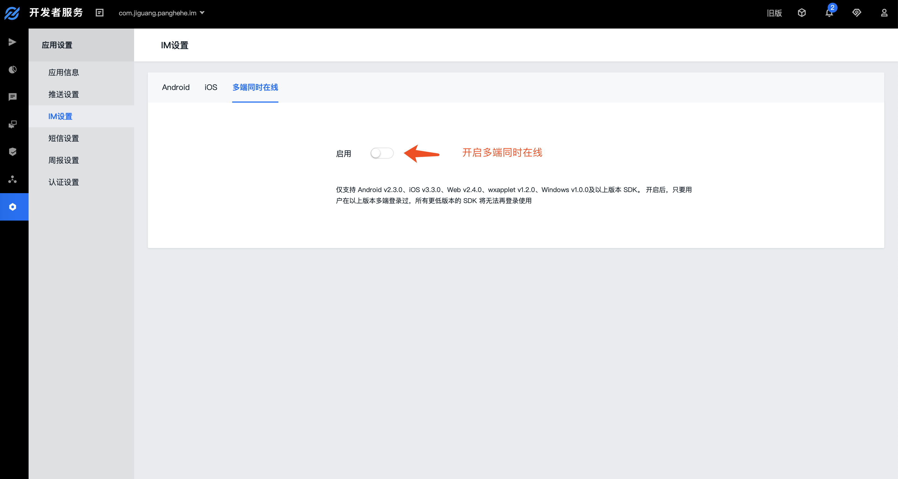

# 常见问题

## 离线消息保存时间和条数是多少？
免费版本：每个会话保存100条离线消息，保存15天。    
付费版本：每个会话保存300条离线消息，保存30天。

 
## API使用频率的限制是多少？
免费版本：每个Appkey的最高调用频率为600次/分钟。  
付费版本：可享有更高的调用频率，最高调用频率为20万次/分钟。

 
## 每个appkey下的用户数量有限制吗？
总用户数没有限制

 
## 群成员上限是多少，群数量上限是多少？
默认每个群最多500个成员，每个appkey的群总数无上限，单个用户最多加入500个群，对于特殊需求我们目前最高支持每个群容纳2000人。

 
## 消息历史记录可以保存多久，如何获取？
极光服务端可为您保存近60天的历史记录。SDK会在本地保存一份消息历史记录，可永久保存，同时提供删除和查询的接口，您可自行管理。

可使用免费的[IM REST Report](https://docs.jiguang.cn/jmessage/server/rest_api_im_report_v2/)拉取保存在服务端的历史消息，如果需要在APP自己的服务端实时保存聊天历史，可联系客服开通实时消息路由功能。

 
## 多端同时在线功能如何开启？具体规则是什么？
多端同时在线功能可在[极光控制台](https://www.jiguang.cn/accounts/login/form)开启，选择“应用设置”中的 “IM 设置”，点击启用按钮进行开启。需要注意的是此功能开启后不支持关闭。

功能说明：支持移动端（ Android 、 iOS ），PC端，Web端（JS、微信小程序），多端同时在线，端内平台之间互踢。    
版本说明：仅支持 Android v2.3.0、iOS v3.3.0、Web v2.4.0、wxapplet v1.2.0、Windows v1.0.0及以上版本 SDK。开启后，只要用户在以上版本多端登录过，所有更低版本的 SDK 将无法再登录使用。     
例如：用户 A 使用以上版本的 SDK 同时登录了 Android 和 Web 端，之后他再用更低版本的 SDK 登录 Android、iOS、微信小程序或Web端，都无法登录。

 
## 可以实现跨应用聊天吗？
只要是同一开发者账号下创建的应用，都可以相互聊天，以满足开发者对于不同appKey下应用相互通信的需求。

 
## 已经集成了JPush还能集成JMessage吗？
JMessage 以 JPush 技术作为基础，共享JPush的网络长连接，兼容JPush的全部功能，可以同时集成JPush SDK和JMessage SDK。

 
## 有相关数据统计报表吗？
有的，开发者控制台提供新增用户、活跃用户；新增群组、活跃群组；消息送达统计、消息类型统计分析等统计图表。

 
## 目前支持哪些平台？
已支持Android、iOS、web

 
## 能不能发送表情？
JMessage SDK 支持 emoji 表情发送。

 
## Demo的UI可以修改吗？
可以修改，JMessage提供的是SDK和接口层的功能，界面可以任意自由实现，Demo  UI 仅供参考并支持修改和重新设计。

