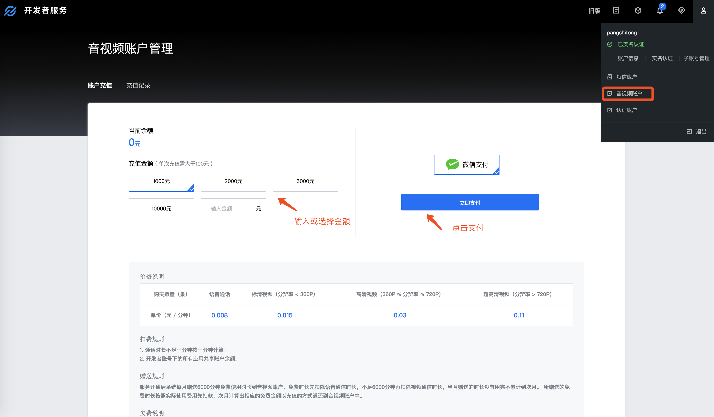
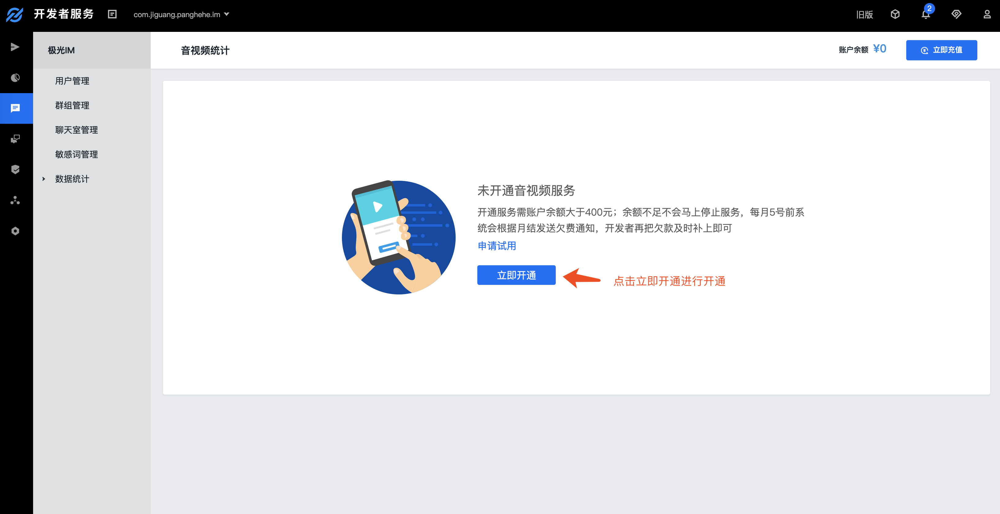
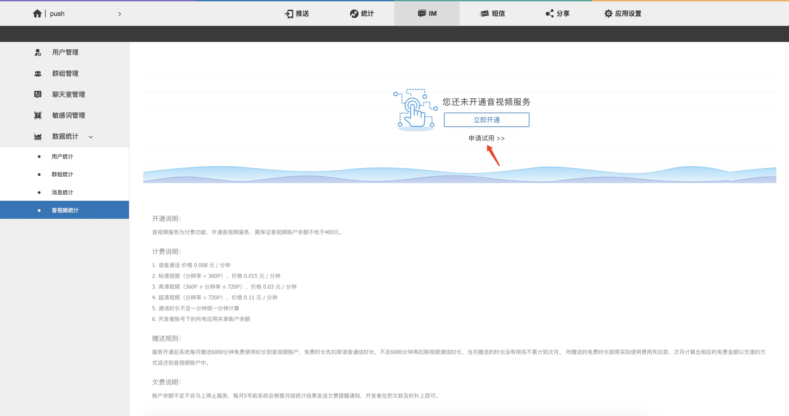
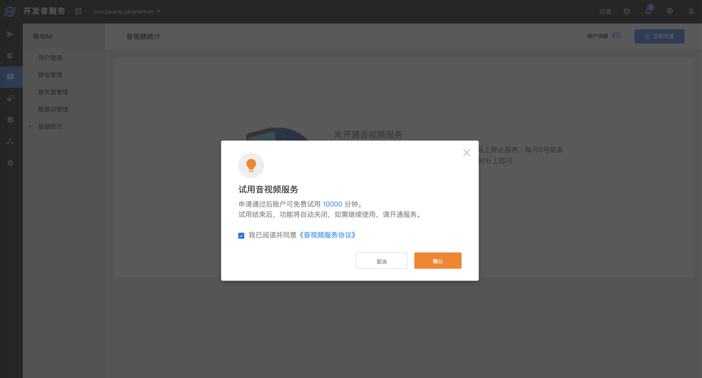

# 常见问题

## 离线消息保存时间和条数是多少？
免费版本：每个会话保存100条离线消息，保存15天。    
付费版本：每个会话保存300条离线消息，保存30天。

 
## REST API使用频率的限制是多少？
免费版本：每个Appkey的最高调用频率为600次/分钟。  
付费版本：可享有更高的调用频率，最高调用频率为20万次/分钟。

 
## 每个appkey下的用户数量有限制吗？
总用户数没有限制

 
## 群成员上限是多少，群数量上限是多少？
默认每个群最多500个成员，每个appkey的群总数无上限，单个用户最多加入500个群，对于特殊需求我们目前最高支持每个群容纳2000人。

 
## 聊天室支持多少人？和群组有什么区别？
一个聊天室支持100万人。
聊天室和群组最大的区别在于，聊天室的消息没有推送通知和离线保存，也没有常驻成员的概念，只要进入聊天室即可接收消息，开始聊天， 一旦退出聊天室，不再会接收到任何消息、通知和提醒。
注意：进入聊天室会自动获取最近50条消息，客户端目前不支持创建聊天室

 
## 实时音视频怎么收费？如何开通服务？

### 价格说明
+ 语音通话，价格 0.008 元 / 分钟 
+ 标清视频（分辨率 < 360P），价格 0.015 元 / 分钟 
+ 高清视频（360P ≤ 分辨率 ≤ 720P），价格 0.03 元 / 分钟
+ 超清视频（分辨率 > 720P），价格 0.11 元 / 分钟

赠送规则：服务开通后系统每月赠送 6000 分钟免费使用时长到开发者账户，免费时长先扣除语音通信时长，不足6000 分钟再扣除视频通信时长，当月赠送的时长没有用完不累计到次月。所赠送的免费时长按照实际使用费用先扣款，次月计算出相应的免费金额以充值的方式返还到音视频账户中。

### 计费方式

#### 语音通话
语音通信按照分钟数和人数进行收费。
通话费用=语音单价 x 总通话分钟数

##### 示例
| 用户   | 通话分钟数                             | 
| ------ | ---------------------------------------- | 
| A      | 20                            | 
| B      | 40                            |
| C      | 15                            | 

通话费用 = 语音单价 x (20 + 40 + 15) 分钟

#### 视频通话
视频通话按照分钟数，人数，以及视频分辨率进行收费。

| 场景   | 总费用                             | 
| ------ | ---------------------------------------- | 
|  所有用户集合分辨率位于同一档     | 通话费用=该档单价 x 总通话分钟数                     | 
| 不是所有用户集合分辨率位于同一档      | 通话费用=Σ(用户对应档单价 x 通话对应分钟数)                         |

**注：1、每位用户计费的单价由该用户的 通话集合分辨率 而定。2、Σ 为数学符号，表示求和运算。**

##### 计算集合分辨率
假设通话中有 A, B, C, D 四个用户，对于 A 来说集合分辨率为：B, C, D 分辨率(宽x高)的面积之和。例如:
+ B 面积 = 640x360 = 230400
+ C 面积 = 240x180 = 43200
+ D 面积 = 640x360 = 230400

则 A 的集合分辨率= B 面积 + C 面积 + D 面积 = 504000
因 640x360<504000<1280x720, 故 A 用户位于高清视频档。

##### 示例 1：所有用户都使用同一档位

| 用户   | 通信分钟数            | 分辨率         | 集合分辨率               | 档位           |
| ------ | -------------------------- | ---------------- | -------------------------- | --------------- | 
| A      | 15                            |  240x180      |  129600<640x360  |  标清            |
| B      | 30                            |  240x180      |  129600<640x360  |  标清            |
| C      | 20                            |  240x180      |  129600<640x360  |  标清            |
| D      | 40                            |  240x180      |  129600<640x360  |  标清            |

通话费用 = 标清档单价 x (15 + 30 + 20 + 40) 分钟

##### 示例 2：多种档位

| 用户   | 通信分钟数            | 分辨率       | 集合分辨率              | 档位      |
| ------ | -------------------------- | ---------------- | ----------------------------- | ---------------- | 
| A      | 30                            |  640x360      |  1612800>1280x720  |  超清            |
| B      | 20                            |  640x360      |  1612800>1280x720  |  超清            |
| C      | 15                            |  1280x720    |  921600=1280x720    |  高清            |
| D      | 40                            |  640x360      |  1612800>1280x720  |  超清            |

通话费用 =  超清档单价 x (30 + 20 + 40) 分钟 + 高清档单价 x 15 分钟

##### 示例 3：音视频混合

| 用户   | 通信分钟数            | 分辨率       | 集合分辨率              | 档位      |
| ------ | -------------------------- | ---------------- | ----------------------------- | ---------------- | 
| A      | 30                            |  640x360      |  关闭其他视频，仅使用语音  |  按语音通话计费          |
| B      | 40                            |  640x360      |  1612800>1280x720  |  超清            |
| C      | 15                            |  1280x720    |  921600=1280x720    |  高清            |
| D      | 20                            |  640x360      |  1612800>1280x720  |  超清            |

通话费用 =  语音单价 x 30 分钟 + 高清档单价 x 15 分钟 + 超清档单价  x (40 + 20) 分钟

 

### 开通方法
音视频服务为付费功能，开通音视频服务，需保证音视频账户余额不低于400.00元。

#### 充值方式
登录[极光开发者服务后台](https://www.jiguang.cn/accounts/login/form)，进入业务设置 - 账户充值，可用微信进行账户充值

#### 开通服务
在音视频统计页面中点击“立即开通”按钮，确认开通音视频服务

 
## 怎么免费试用实时音视频服务？
我们为每个账户提供10000分钟的免费使用时长，在试用期间不收取任何费用，试用时间结束将停止服务，如果需要继续使用需要正式开通服务。
开通方式：点击“申请试用”按钮，申请成功后即可开始试用音视频服务

 
## 消息历史记录可以保存多久，如何获取？
极光服务端可为您保存近60天的历史记录。SDK会在本地保存一份消息历史记录，可永久保存，同时提供删除和查询的接口，您可自行管理。

可使用免费的[IM REST Report](https://docs.jiguang.cn/jmessage/server/rest_api_im_report_v2/)拉取保存在服务端的历史消息，如果需要在APP自己的服务端实时保存聊天历史，可联系客服开通实时消息路由功能。

 
## 多端同时在线功能如何开启？具体规则是什么？
多端同时在线功能可在[极光控制台](https://www.jiguang.cn/accounts/login/form)开启，选择“应用设置”中的 “IM 设置”，点击启用按钮进行开启。需要注意的是此功能开启后不支持关闭。

功能说明：支持移动端（ Android 、 iOS ），PC端，Web端（JS、微信小程序），多端同时在线，端内平台之间互踢。    
版本说明：仅支持 Android v2.3.0、iOS v3.3.0、Web v2.4.0、wxapplet v1.2.0、Windows v1.0.0及以上版本 SDK。开启后，只要用户在以上版本多端登录过，所有更低版本的 SDK 将无法再登录使用。     
例如：用户 A 使用以上版本的 SDK 同时登录了 Android 和 Web 端，之后他再用更低版本的 SDK 登录 Android、iOS、微信小程序或Web端，都无法登录。

 
## 可以实现跨应用聊天吗？
只要是同一开发者账号下创建的应用，都可以相互聊天，以满足开发者对于不同appKey下应用相互通信的需求。

 
## 已经集成了JPush还能集成JMessage吗？
JMessage 以 JPush 技术作为基础，共享JPush的网络长连接，兼容JPush的全部功能，可以同时集成JPush SDK和JMessage SDK。

 
## 有相关数据统计报表吗？
有的，开发者控制台提供新增用户、活跃用户；新增群组、活跃群组；消息送达统计、消息类型统计分析等统计图表。

 
## 目前支持哪些平台？
已支持Android、iOS、web、PC（包括 Windows 和 macOS）

 
## 能不能发送表情？
JMessage SDK 支持 emoji 表情发送。

 
## Demo的UI可以修改吗？
可以修改，JMessage提供的是SDK和接口层的功能，界面可以任意自由实现，Demo  UI 仅供参考并支持修改和重新设计。

