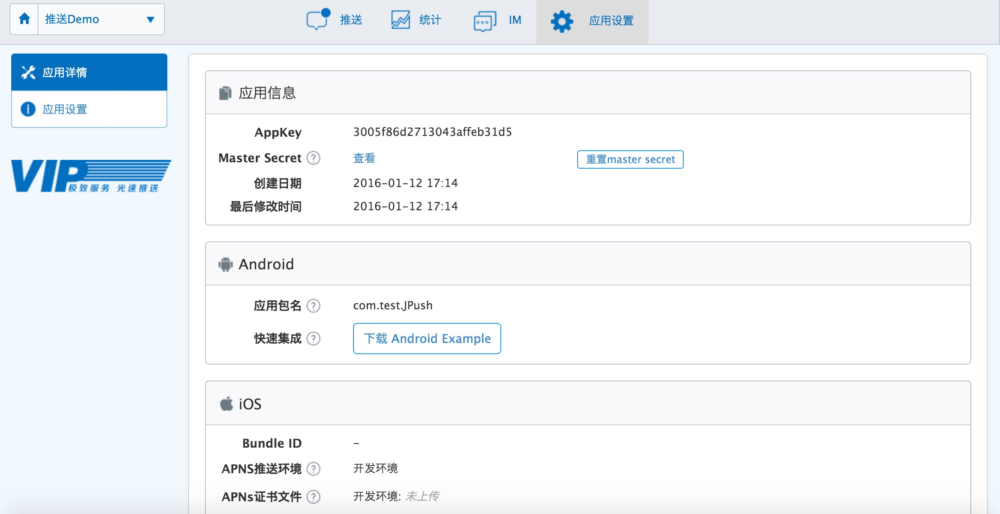
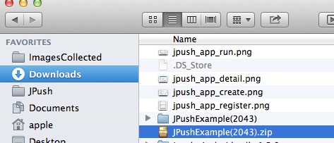
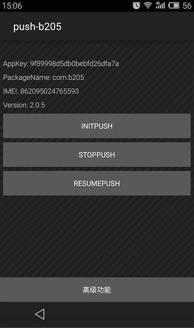
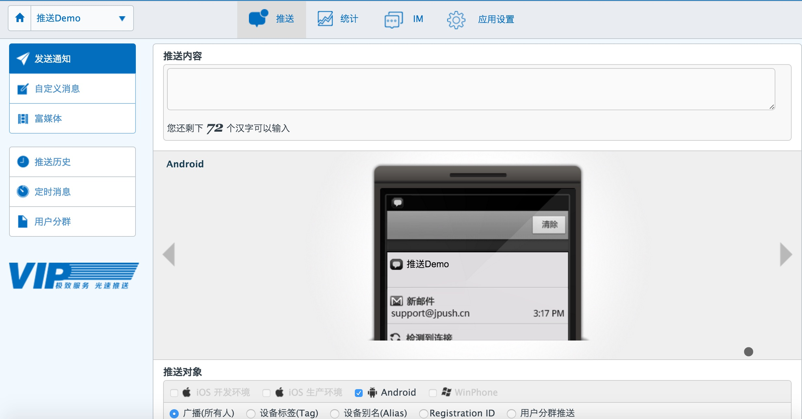
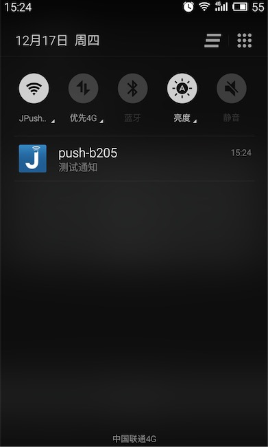
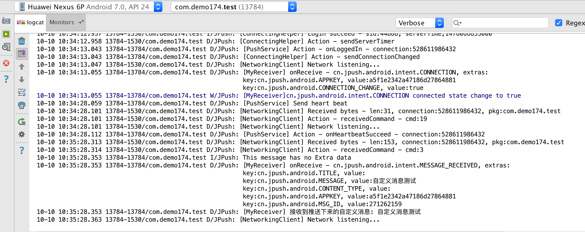

# 3 分钟快速使用 JPush Android Demo

本文目的在于，指导新接触极光推送的开发者，在短短几分钟时间内把极光推送跑起来：

+ 安装 Demo 客户端到手机
 
+ 在 Portal 上推送通知

+ 客户端收到推送并显示在状态栏 pi

### 创建极光推送开发者帐号
要创建极光推送开发者帐号，请访问[极光推送官方网站 https://www.jiguang.cn/push](https://www.jiguang.cn/push)

 
### Portal 上创建应用
使用注册账号登陆，进入极光控制台后，点击“创建应用”按钮，填写应用名称即可创建应用成功。点击“推送设置”，在 Android 版块填上你的应用包名，选择保存即可。

### 下载应用 Example
点击“下载 Demo” 下载资源文件或“扫描下载安装包”直接下载 apk 到手机安装。

你将下载到一个 .zip 压缩文件。解压后，即看到一个同名目录。这个目录下，是一个 Android 项目里的所有文件。

### 把 Example 导入 Android Studio 里
在 Android Studio 中，新建一个项目。
通过 import module 导入 JPush Example

### 运行 Example 这个应用

导入 module 后在 Android studio 内运行到指定设备上。

如果你的 Android 手机接在电脑上了，则这个 JPush Example 应用就可以安装上，并运行起来了。  
做下一步动作之前，请确保你的手机上的网络是可用的。

### Portal 上推送通知

### 手机上收到通知
在上述步骤安装 JPush Example 的手机上，你就可以收到推送的通知了。

### Portal 上推送消息

具体详情请查看[控制台使用](../../console/Instructions)

### 在 LogCat 中查看收到的自定义消息
自定义消息可以在 LogCat 日志中查看，开发者根据自己需要做展现处理，JPush 不做干预.

