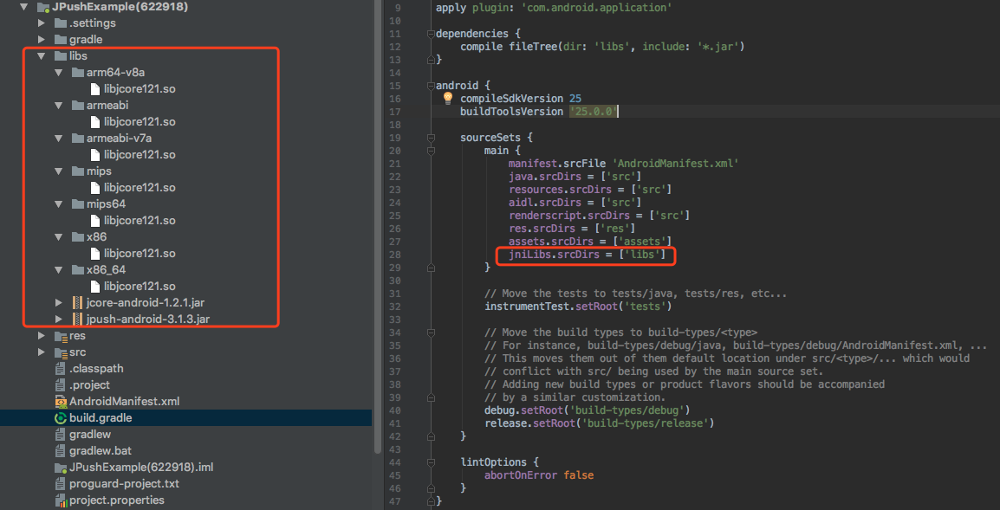
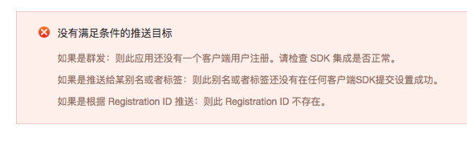

# Android SDK FAQ


## 为什么应用程序无法收到 Push 消息（Android）？

+ 确认 appKey（在 Portal 上生成的）已经正确的写入 Androidmanifest.xml
+ 确认测试手机（或者模拟器）已成功连入网络
+ 确认有客户端 "Login succeed" 日志


## 日志：Java.lang.UnsatisfiedLinkError

```
E/art: No implementation found for int cn.jiguang.service.Protocol.GetSdkVersion() (tried Java_cn_jiguang_service_Protocol_GetSdkVersion and Java_cn_jiguang_service_Protocol_GetSdkVersion__)
E/JIGUANG-JCore: [JCoreGlobal] Get sdk version fail![获取sdk版本失败!]
W/System.err: java.lang.UnsatisfiedLinkError: No implementation found for int cn.jiguang.service.Protocol.GetSdkVersion() (tried Java_cn_jiguang_service_Protocol_GetSdkVersion and Java_cn_jiguang_service_Protocol_GetSdkVersion__)
W/System.err:     at cn.jiguang.service.Protocol.GetSdkVersion(Native Method)
W/System.err:     at cn.jiguang.d.a.a(Unknown Source)
W/System.err:     at cn.jiguang.d.a.d(Unknown Source)
W/System.err:     at cn.jiguang.d.a.b(Unknown Source)
W/System.err:     at cn.jiguang.api.JCoreInterface.init(Unknown Source)
W/System.err:     at cn.jiguang.d.d.j.b(Unknown Source)
W/System.err:     at cn.jiguang.api.JCoreInterface.triggerSceneCheck(Unknown Source)
W/System.err:     at cn.jiguang.a.a.d.a.onActivityStarted(Unknown Source)
E/JIGUANG-JCore: [JCoreGlobal] JCore .so file do not match JCore .jar file in the project, Failed to init JCore
W/JIGUANG-JCore: [JCoreInterface] JCore init failed
```
<br />
此错误是由于没有正确的加载 libjcore.so 文件，请检查 libjcore.so 是否在正确的位置(libs–>armeabi–>libjcore.so)

JPush SDK 迁移到 Android Studio 需要添加 .so 文件打包到 APK 的 lib 文件夹中，可以编辑 build.gradle 脚本，自定义 *.so 目录，参考 Demo：


<br />

## 日志：The permission should be defined


```
E/JIGUANG-JCore: [AndroidUtil] The permissoin is required - com.jpush.test.permission.JPUSH_MESSAGE
E/JIGUANG-JCore: [AndroidUtil] The permission should be defined - com.jpush.test.permission.JPUSH_MESSAGE
W/JIGUANG-JCore: [JCoreInterface] JCore init failed
```

此错误是没有正确的定义 permision，请添加权限：

```
    <permission
        android:name="您应用的包名.permission.JPUSH_MESSAGE"
        android:protectionLevel="signature" />
  
    <uses-permission android:name="您应用的包名.permission.JPUSH_MESSAGE" />
```

<br />

## 如何在代码时混淆忽略 jpush-sdk-release.jar

+ 请下载 4.x 及以上版本的 [proguard.jar](http://sourceforge.net/projects/proguard/files/proguard/)， 并替换你 Android SDK "tools\proguard\lib\proguard.jar"

+ 开发工具使用 Eclipse 或者 Android Studio，请在工程的 project.properties 中配置好 proguard-android.txt，并且在 proguard-android.txt 配置：

		-dontoptimize
		-dontpreverify

		-dontwarn cn.jpush.**
		-keep class cn.jpush.** { *; }

+ 请使用 SDK1.3.X 及以后的版本

+ v2.0.5 及以上的版本由于引入了 protobuf ，在上面基础之上增加排出混淆的配置。


		#==================gson==========================
		-dontwarn com.google.**
		-keep class com.google.gson.** {*;}

		#==================protobuf======================
		-dontwarn com.google.**
		-keep class com.google.protobuf.** {*;}

<br />

## 推送成功了，为什么有部分客户端收不到推送？

请检查收不到通知的手机：

+ 请在 logcat 查看日志，确定客户端的 jpush 是否集成成功，网络是否有问题
+ 请看日志或使用接口 isPushStopped 来检查是否调用了 stoppush
+ 检查手机的 JPush 高级设置中是否设置了“允许推送时间”
+ 手机的应用中是否勾选了“显示通知”

<br />


## 什么是通道共享功能？需要怎么使用？
极光的通道共享功能是利用极光 SDK 的高覆盖率，将各个应用中的长连接通道共享化，主要是解决在APP（均需要集成极光 SDK ）进程间交互有效的情况下，针对应用被杀死之后，极光也能通过共享通道将消息有效的下发到设备端并将该应用拉起。以及应用处于后台时被如果被系统关闭网络后无法收到消息时消息可以从共享通道正常接收并处理。集成好极光的 SDK （SDK 版本 3.1.6 及以后版本）以后，即可使用通道共享功能。

<br />

## 第三方系统收不到推送的消息

由于第三方 ROM 的管理软件需要用户手动操作

+ 小米【 MIUI 】
	+ 自启动管理：需要把应用加到【自启动管理】列表，否则杀进程或重新开机后进程无法开启
	+ 通知栏设置：应用默认都是显示通知栏通知，如果关闭，则收到通知也不会提示
	+ 网络助手：可以手动禁止已安装的第三方程序访问 2G/3G 和 WIFI 的网络和设置以后新安装程序是否允许访问 2G/3G 和 WIFI 的网络
	+ MIUI 7 神隐模式： 允许应用进行自定义配置模式，应用在后台保持联网可用，否则应用进入后台时，应用无法正常接收消息。【设置】下电量和性能中【神隐模式】

+ 华为【 Emotion 】
	+ 自启动管理：需要把应用加到【自启动管理】列表，否则杀进程或重新开机后进程不会开启，只能手动开启应用
	+ 后台应用保护：需要手动把应用加到此列表，否则设备进入睡眠后会自动杀掉应用进程，只有手动开启应用才能恢复运行
	+ 通知管理：应用状态有三种：提示、允许、禁止。禁止应用则通知栏不会有任何提醒

+ 魅族【 Flyme 】
	+ 自启动管理：需要把应用加到【自启动管理】列表，否则杀进程或重新开机后进程无法开启
	+ 通知栏推送：关闭应用通知则收到消息不会有任何展示
	+ 省电管理： 安全中心里设置省电模式，在【待机耗电管理】中允许应用待机时，保持允许，否则手机休眠或者应用闲置一段时间，无法正常接收消息。

+ VIVO【 Funtouch OS 】
	+ 内存一键清理：需要将应用加入【白名单】列表，否则系统自带的“一键加速”，会杀掉进程
	+ 自启动管理：需要将应用加入 “i 管家”中的【自启动管理】列表，否则重启手机后进程不会自启。但强制手动杀进程，即使加了这个列表中，后续进程也无法自启动。

+ OPPO【 ColorOS 】
	+ 冻结应用管理：需要将应用加入纯净后台，否则锁屏状态下无法及时收到消息
	+ 自启动管理：将应用加入【自启动管理】列表的同时，还需要到设置-应用程序-正在运行里锁定应用进程，否则杀进程或者开机后进程不会开启，只能手动开启应用
+ 三星
	+ 内存一键优化：需要将应用加入【白名单】列表，否则系统内存优化后，会杀掉应用进程


<br />

## Android 5.0 系统报错：INSTALL_FAILED_DUPLICATE_PERMISSION

与 5.0 的多账户系统有关，其中一个账号安装一个应用，其他账号也会自动安装了这个应用；如果其中一个账号卸载了这个应用，那其他账号是不受影响的（其他账号仍有这个应用），所以如果在某个账号下卸载了应用，安装一个同包名但是签名不一致的包，就会安装失败了。

解决办法：在各个账户上的安装这个程序的应用卸载，然后重新安装即可解决这个问题。

<br />

## AsyncTask 就没办法执行到 onPostExecute() 方法

这是 Android 旧系统带有的问题，解决办法如下：

在 application 里 onCreate 方法加上：

```
try {
            Class.forName("android.os.AsyncTask");
        } catch (ClassNotFoundException e) {
            e.printStackTrace();
        }
```

详情请看链接：[https://code.google.com/p/android/issues/detail?id=20915](https://code.google.com/p/android/issues/detail?id=20915)


<br />

## Tag、Alias、Registration ID 需要每次初始化时都重新设置吗，会变化吗？

+ tag、alias 可以参考[别名与标签 API ](./android_api/#api_3)进行设置，3.0.7 版本以前的接口每次设置是覆盖设置，而不是增量设置；从 3.0.7 版本开始，对别名标签提供增删改查接口。Tag 和 alias 一经设置成功，除非取消或覆盖，是不会变化的。设置好的 tag、alias 与客户端的对应关系保存在 JPush 服务器，目前没有从 JPush 服务器查询这个对应关系的接口，所以需要客户将对应关系保存在 APP 应用服务器。

+ Registration ID 是客户端 SDK 第一次成功连接到 JPush 服务器时，JPush 服务器给分配的。可以通过[获取 RegistrationID](./android_api/#registrationid-api) API 来获取 Registration ID 进行推送。Registration ID 对应一个应用的一个客户端，Android 的 registration ID 一般不会改变。

<br />

## 没有沙箱 API 怎么测试？

 直接用 JPush 的 API 测试就行。

<br />

## 其他国家能否使用极光推送（局域网能否使用极光推送）？

只要能连网到 JPush 服务器都可以。判断能否联网到 JPush 服务器的方法：ping 通 api.jpush.cn 443

<br />

## 为什么发送推送提示没有任何设备或调用 API 返回 1011



这可能有如下几种情况：

+ SDK 没有集成成功，客户端有 "Login succeed" 日志、获取到了 registration ID 才表示 SDK 集成成功。
+ 广播推送有 10 分钟延迟，在第一个设备初始化成功后立即进行广播推送会报错。
+ 设置别名或标签失败，请注意查看设置别名标签的回调结果，从 3.0.7 版本开始，新接口是异步回调，需要在 Androidmanifest 里面配置自定义广播接收器，参考[错误码定义](https://docs.jiguang.cn/jpush/client/Android/android_api/#_153)来修改直到设置成功返回 0。
+ 所传的 registration ID 对应的客户端所配的 Appkey 与推送使用的 Appkey 不一致。

<br />

## 可以打开 www.jiguang.cn，但打不开 docs，提示无法找到 docs.jiguang.cn

+ 换个浏览器试试
+ 如果还是不行，执行下面的命令反馈结果排查一下问题
	+ ping docs.jiguang.cn
	+ nslookup docs.jiguang.cn
	+ telnet docs.jiguang.cn
	+ 检查一下自己机器访问外网其他网站是否正常

<br />

## appkey 是怎么对应的？

一个 Appkey 只允许配置一个包名，Appkey 和包名在极光唯一确定一个应用。

<br />

## 内网使用极光推送应该怎么设置？

内网使用极光推送需要服务器开放下列端口限制，用于 JPush 的登录注册及保持推送长链接：

+ 19000
+ 3000-3020
+ 7000-7020
+ 8000-8020

<br />


