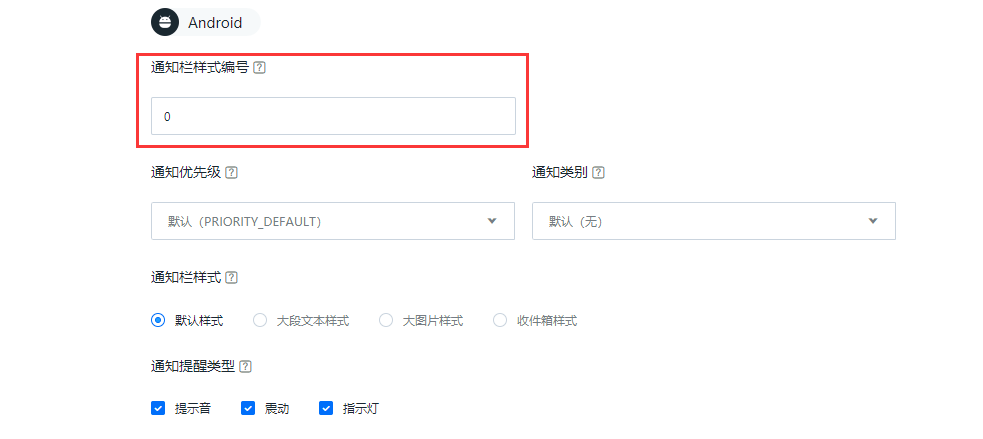

# Android SDK 进阶教程

## 别名与标签使用教程

### 为什么需要别名与标签

推送消息时，要指定推送的对象：全部，某一个人，或者某一群人。

全部很好办，针对某应用“群发”就好了。Portal 与 API 都支持向指定的 AppKey 群发消息。

要指定向某一个特定的人，或者某一群特定的人，则相对复杂。因为对于 JPush 来说，某一个人就是一个注册 ID，这个注册 ID 与开发者 App 没有任何关系，或者说对开发者 App 是没有意义的。

如果要对开发者 App 有意义的某个特定的用户推送消息，则需要：把 JPush 注册用户与开发者 App 用户绑定起来。

这个绑定有两个基本思路：

+ 把绑定关系保存到 JPush 服务器端
+ 把绑定关系保存到开发者应用服务器中

前者，就是这里要说到的：别名与标签的功能。这个机制简单易用，适用于大多数开发者。

后者，则是 JPush 提供的另外一套 RegistrationID 机制。这套机制开发者需要有应用服务器来维护绑定关系，不适用于普通开发者。Android SDK 1.6.0 版本开始支持。

### 使用方式

别名与标签的机制，其工作方式是：

+ 客户端开发者 App 调用 setAlias 或者 setTags API 来设置关系
+ JPush SDK 把该关系设置保存到 JPush Server 上
+ 在服务器端推送消息时，指定向之前设置过的别名或者标签推送

SDK 支持的 Alias 与 Tags 接口请参考相应的文档：[别名与标签 API](android_api/#api_3)

使用过程中有几个点做特别说明：

+ 1.5.0 版本开始提供的旧版 tag、alias 设置接口已不再维护，建议开发者使用 3.0.7 版本开始提供的新的 tag、alias 接口，支持对别名标签进行增删改查。

	+ 在 callback 返回结果中如果返回 6002 （超时）或 6014（服务繁忙）则建议重试，具体错误码定义请参考[错误码定义](https://docs.jiguang.cn/jpush/client/Android/android_api/#_153)。

+ Portal 上推送或者 API 调用向别名或者标签推送时，可能会报错：不存在推送目标用户。该报错表明，JPush Server 上还没有针对你所推送的别名或者标签的用户绑定关系，所以没有推送目标。这时请开发者检查确认，开发者 App 是否正确地调用了 alias 和 tags API，以及调用时是否网络不好，JPush SDK 暂时未能保存成功。

### 使用别名

用于给某特定用户推送消息。别名，可以近似地被认为，是用户帐号里的昵称。


### 使用标签

用于给某一群人推送消息。

标签类似于博客里为文章打上 tag ，即为某资源分类。

#### 动态标签

JPush 提供的设置标签的 API 是在客户端的。开发者如何做到在自己的服务器端动态去设置分组呢？ 比如一个企业 OA 系统，经常需要去变更部门人员分组。以下是大概的思路：

+ 设计一种自定义消息格式（业务协议），App 解析后可以调用 JPush SDK setTags API 来重新设置标签（分组），从 3.0.7 版本开始支持对标签进行增删改查，更便于对标签进行更新操作。
	+ 例：{"action":"resetTags", "newTags":["dep_level_1":"A公司", "dep_level_2":"技术部", "dep_level_3":"Android开发组", "address":"深圳", "lang":"zh"]}
+ 要动态设置分组时，推送这条自定义消息给指定的用户
	+ 使用别名的机制，推送到指定的用户。
+ 客户端 App 调用 JPush SDK API 来设置新的标签


## 别名与标签设置异常处理

由于网络连接不稳定的原因，有一定的概率 JPush SDK 设置别名与标签会失败。
App 开发者合理地处理设置失败，则偶尔失败对应用的正常使用 JPush 影响是有限的。

以下以 Android SDK 作为示例,更为详细的请参考 example。

基本思路：

+ 设置成功时，往 SharePreference 里写状态，以后不必再设置
+ 遇到 6002 超时，则稍延迟重试。


		// 这是来自 JPush Example 的设置别名的 Activity 里的代码，更详细的示例请参考 JPush Example。一般 App 的设置的调用入口，在任何方便的地方调用都可以。
		private void handleAction(int sequence,TagAliasBean tagAliasBean) {
		    if(tagAliasBean == null){
                Log.w(TAG,"tagAliasBean was null");
                return;
            }
            if(tagAliasBean.isAliasAction){
                switch (tagAliasBean.action){
                    case ACTION_GET:
                        JPushInterface.getAlias(getApplicationContext(),sequence);
                        break;
                    case ACTION_DELETE:
                        JPushInterface.deleteAlias(getApplicationContext(),sequence);
                        break;
                    case ACTION_SET:
                        JPushInterface.setAlias(getApplicationContext(),sequence,tagAliasBean.alias);
                        break;
                    default:
                        Log.w(TAG,"unsupport alias action type");
                        return;
                }
            }else {
            //tag operation
            }
		}


## 自定义通知栏样式教程

### 关于自定义通知栏样式

JPush 通知推送到客户端时，默认使用手机的默认设置来显示通知栏，包括铃声、震动等效果。

如果开发者想要达到如下的效果，则需要使用“自定义通知栏样式”功能：

+ 通知栏样式使用与默认不一样的设置，比如想要控制：
	+ 铃声、震动
	+ 显示图标
	+ 替换默认的通知栏样式。

### 推送消息指定通知栏样式编号

通知栏样式在服务器端向下推送时，只体现为一个编号（数字）。

<div style="font-size:13px;background: #E0EFFE;border: 1px solid #ACBFD7;border-radius: 3px;padding: 8px 16px; padding-bottom: 0;margin-bottom: 0;">
<p> 推送通知的样式编号，应该是在客户端做了自定义通知栏样式设置的。
<br>
<p>如果通知上的样式编号，在客户端检查不存在，则使用默认的通知栏样式。
</div>

<br>
不使用自定义通知栏样式时，此编号默认为 0。如需使用自定义的通知栏样式，编号应大于 0 小于 1000。先在客户端调 API 设置通知栏样式，推送设置 Builder ID 值即可在收到消息时得到对应的样式效果。   

调 API 进行推送时，在 Notification - Android 属性下设置 [builder_id 值](https://docs.jiguang.cn/jpush/server/push/rest_api_v3_push/#notification)    

在 Portal 上发送通知时，首先选择推送平台为 Android，然后展开“可选设置”，开发者可指定当前要推送的通知的样式编号。如下图所示：



### 客户端设置通知栏样式

自定义的通知栏样式，是在客户端进行设置的。请参考 [通知栏样式定制 API](android_api/#api_8) 来看所支持的功能。

#### 自定义通知栏样式设计

+ 有个 PushNotificationBuilder 概念，开发者使用 setPushNotificationBuilder 方法为某种类型的 PushNotificationBuilder 指定编号。
+ setPushNotificationBuilder 可以在 JPushInterface.init() 之后任何地方调用，可以是开发者应用的逻辑来触发调用，或者初始化时调用。
+ 只需要设置一次，JPush SDK 会记住这个设置。在下次收到推送通知时，就根据通知里指定的编号来找到 PushNotificationBuilder 来展现、执行。

#### API - setDefaultPushNotificationBuilder 设置默认

此 API 改变默认的编号为 0 的通知栏样式。


#### API - setPushNotificationBuilder 指定编号

此 API 为开发者指定的编号，设置一个自定义的 PushNotificationBuilder（通知样式构建器）。

#### Example - 基础的 PushNotificationBuilder

定制声音、震动、闪灯等 Notification 样式。

	BasicPushNotificationBuilder builder = new BasicPushNotificationBuilder(MainActivity.this);
	builder.statusBarDrawable = R.drawable.jpush_notification_icon;
	builder.notificationFlags = Notification.FLAG_AUTO_CANCEL
			| Notification.FLAG_SHOW_LIGHTS;  //设置为自动消失和呼吸灯闪烁
	builder.notificationDefaults = Notification.DEFAULT_SOUND
			| Notification.DEFAULT_VIBRATE
			| Notification.DEFAULT_LIGHTS;  // 设置为铃声、震动、呼吸灯闪烁都要
	JPushInterface.setPushNotificationBuilder(1, builder);
	
定制带按钮的 Notification 样式（3.0.0 及以上版本 sdk 才支持该样式，且该样式在某些与 Android 原生系统有差异的机型上无法正常显示）。

	MultiActionsNotificationBuilder builder = new MultiActionsNotificationBuilder(PushSetActivity.this);
	//添加按钮，参数（按钮图片、按钮文字、扩展数据）
	builder.addJPushAction(R.drawable.jpush_ic_richpush_actionbar_back, "first", "my_extra1");
	builder.addJPushAction(R.drawable.jpush_ic_richpush_actionbar_back, "second", "my_extra2");
	builder.addJPushAction(R.drawable.jpush_ic_richpush_actionbar_back, "third", "my_extra3");
	JPushInterface.setPushNotificationBuilder(2, builder);


#### Example - 高级自定义的 PushNotificationBuilder

基于基础的 PushNotificationBuilder，可进一步地定制 Notification 的 Layout。

<div style="font-size:13px;background: #E0EFFE;border: 1px solid #ACBFD7;border-radius: 3px;padding: 8px 16px; padding-bottom: 0;margin-bottom: 0;">
<p>这里作为 example 的 customer_notitfication_layout 在我们的 example 项目的 /res/layout/ 下可以找到。你完全可以用自己的 layout。</p>
</div>
<br>

```
	CustomPushNotificationBuilder builder = new
	CustomPushNotificationBuilder(MainActivity.this,
	                          R.layout.customer_notitfication_layout,
	                          R.id.icon,
	                          R.id.title,
	                          R.id.text,
	                          R.id.time); 
	                         // 指定定制的 Notification Layout
	builder.statusBarDrawable = R.drawable.your_notification_icon;     
	// 指定最顶层状态栏小图标
	builder.layoutIconDrawable = R.drawable.your_2_notification_icon;  
	// 指定下拉状态栏时显示的通知图标
	JPushInterface.setPushNotificationBuilder(2, builder);
```

#### 通知栏样式定义不符合要求？

以上提供的自定义通知栏样式的功能是有限的。比如：Android SDK 4.0 以后的 [Notification](http://developer.android.com/reference/android/app/Notification.html) 支持指定 Style ，而这种复杂的通知样式定义 JPush SDK 还未有支持。

或者你想要自定义的复杂的通知样式，但不愿意使用上述高级的自定义通知栏定制功能。

建议不要使用 JPush 提供的通知功能，而使用自定义消息功能。

即：推送自定义消息到客户端后，App 取到自定义消息全部内容，然后 App 自己来写代码做通知的展示。请参考文档：通知 vs. 自定义消息。


<a name="vs"></a>
## 通知 vs 自定义消息


极光推送包含有通知与自定义消息两种类型的推送。本文描述他们的区别，以及建议的应用场景。


### 两者的区别 - 功能角度

#### 通知

通知（Notification），指在手机的通知栏（状态栏）上会显示的一条通知信息。这是 Android / iOS 的基本功能。

通知主要用于提示用户。一条通知，简单的填写纯文本的通知内容即可。

应用加上通知功能，有利于提高应用的活跃度。


#### 自定义消息

自定义消息不是通知，默认不会被 SDK 展示到通知栏上，极光推送仅负责透传给 SDK。其内容和展示形式完全由开发者自己定义。

自定义消息主要用于应用的内部业务逻辑和特殊展示需求。


### 两者的区别 - 开发者使用角度

#### 通知

简单场景下的通知，用户可以不写一行代码，而完全由 SDK 来负责默认的效果展示，以及默认用户点击时打开应用的主界面。

JPush Android SDK 提供了 API 让开发者来定制通知栏的效果，请参考：自定义通知栏样式教程；也提供了接收推送消息 Receiver 让你来定制在收到通知时与用户点击通知时的不同行为。


#### 自定义消息

SDK 不会把自定义消息展示到通知栏。所以调试时，需要到日志里才可以看到服务器端推送的自定义消息。

自定义消息一定要由开发者写[接收推送消息 Receiver](android_api/#receiver) 来处理收到的消息。

<div style="font-size:13px;background: #E0EFFE;border: 1px solid #ACBFD7;border-radius: 3px;padding: 8px 16px; padding-bottom: 0;margin-bottom: 0;">
<p>注意：
	<p>当自定义消息内容 msg_content 为空时，SDK 不会对消息进行广播，使得 App 无法接收到推送的消息，因此建议在使用自定义消息推送时添加内容。
</div>

### 使用通知  

请参考以下示例代码。

```
public class MyReceiver extends BroadcastReceiver {
    private static final String TAG = "MyReceiver";
     
    private NotificationManager nm;
     
    @Override
    public void onReceive(Context context, Intent intent) {
        if (null == nm) {
            nm = (NotificationManager) context.getSystemService(Context.NOTIFICATION_SERVICE);
        }
         
        Bundle bundle = intent.getExtras();
        Logger.d(TAG, "onReceive - " + intent.getAction() + ", extras: " + AndroidUtil.printBundle(bundle));
         
        if (JPushInterface.ACTION_REGISTRATION_ID.equals(intent.getAction())) {
            Logger.d(TAG, "JPush 用户注册成功");
             
        } else if (JPushInterface.ACTION_MESSAGE_RECEIVED.equals(intent.getAction())) {
            Logger.d(TAG, "接受到推送下来的自定义消息");
                     
        } else if (JPushInterface.ACTION_NOTIFICATION_RECEIVED.equals(intent.getAction())) {
            Logger.d(TAG, "接受到推送下来的通知");
     
            receivingNotification(context,bundle);
 
        } else if (JPushInterface.ACTION_NOTIFICATION_OPENED.equals(intent.getAction())) {
            Logger.d(TAG, "用户点击打开了通知");
        
           openNotification(context,bundle);
 
        } else {
            Logger.d(TAG, "Unhandled intent - " + intent.getAction());
        }
    }
 
   private void receivingNotification(Context context, Bundle bundle){
        String title = bundle.getString(JPushInterface.EXTRA_NOTIFICATION_TITLE);
        Logger.d(TAG, " title : " + title);
        String message = bundle.getString(JPushInterface.EXTRA_ALERT);
        Logger.d(TAG, "message : " + message);
        String extras = bundle.getString(JPushInterface.EXTRA_EXTRA);
        Logger.d(TAG, "extras : " + extras);
    }
 
   private void openNotification(Context context, Bundle bundle){
        String extras = bundle.getString(JPushInterface.EXTRA_EXTRA);
        String myValue = "";
        try {
            JSONObject extrasJson = new JSONObject(extras);
            myValue = extrasJson.optString("myKey");
        } catch (Exception e) {
            Logger.w(TAG, "Unexpected: extras is not a valid json", e);
            return;
        }
        if (TYPE_THIS.equals(myValue)) {
            Intent mIntent = new Intent(context, ThisActivity.class);
            mIntent.putExtras(bundle);
            mIntent.setFlags(Intent.FLAG_ACTIVITY_NEW_TASK);
            context.startActivity(mIntent);
        } else if (TYPE_ANOTHER.equals(myValue)){
            Intent mIntent = new Intent(context, AnotherActivity.class);
            mIntent.putExtras(bundle);
            mIntent.setFlags(Intent.FLAG_ACTIVITY_NEW_TASK);
            context.startActivity(mIntent);
        }
    }
}
```


### 使用自定义消息

使用自定义消息，在客户端 App 里一定要写代码，去接受 JPush SDK 的广播，从而取得推送下来的消息内容。具体请参考文档：[接收推送消息 Receiver](android_api/#receiver)。

以下代码来自于推聊。

```
public class TalkReceiver extends BroadcastReceiver {
    private static final String TAG = "TalkReceiver";
     
    private NotificationManager nm;
     
    @Override
    public void onReceive(Context context, Intent intent) {
        if (null == nm) {
            nm = (NotificationManager) context.getSystemService(Context.NOTIFICATION_SERVICE);
        }
         
        Bundle bundle = intent.getExtras();
        Logger.d(TAG, "onReceive - " + intent.getAction() + ", extras: " + AndroidUtil.printBundle(bundle));
         
        if (JPushInterface.ACTION_REGISTRATION_ID.equals(intent.getAction())) {
            Logger.d(TAG, "JPush 用户注册成功");
             
        } else if (JPushInterface.ACTION_MESSAGE_RECEIVED.equals(intent.getAction())) {
            Logger.d(TAG, "接受到推送下来的自定义消息");
             
            // Push Talk messages are push down by custom message format
            processCustomMessage(context, bundle);
         
        } else if (JPushInterface.ACTION_NOTIFICATION_RECEIVED.equals(intent.getAction())) {
            Logger.d(TAG, "接受到推送下来的通知");
     
            receivingNotification(context,bundle);
 
        } else if (JPushInterface.ACTION_NOTIFICATION_OPENED.equals(intent.getAction())) {
            Logger.d(TAG, "用户点击打开了通知");
        
           openNotification(context,bundle);
 
        } else {
            Logger.d(TAG, "Unhandled intent - " + intent.getAction());
        }
    }
     
    private void processCustomMessage(Context context, Bundle bundle) {
        String title = bundle.getString(JPushInterface.EXTRA_TITLE);
        String message = bundle.getString(JPushInterface.EXTRA_MESSAGE);
        if (StringUtils.isEmpty(title)) {
            Logger.w(TAG, "Unexpected: empty title (friend). Give up");
            return;
        }
         
        boolean needIncreaseUnread = true;
         
        if (title.equalsIgnoreCase(Config.myName)) {
            Logger.d(TAG, "Message from myself. Give up");
            needIncreaseUnread = false;
            if (!Config.IS_TEST_MODE) {
                return;
            }
        }
         
        String channel = null;
        String extras = bundle.getString(JPushInterface.EXTRA_EXTRA);
        try {
            JSONObject extrasJson = new JSONObject(extras);
            channel = extrasJson.optString(Constants.KEY_CHANNEL);
        } catch (Exception e) {
            Logger.w(TAG, "Unexpected: extras is not a valid json", e);
        }
         
        // Send message to UI (Webview) only when UI is up
        if (!Config.isBackground) {
            Intent msgIntent = new Intent(MainActivity.MESSAGE_RECEIVED_ACTION);
            msgIntent.putExtra(Constants.KEY_MESSAGE, message);
            msgIntent.putExtra(Constants.KEY_TITLE, title);
            if (null != channel) {
                msgIntent.putExtra(Constants.KEY_CHANNEL, channel);
            }
             
            JSONObject all = new JSONObject();
            try {
                all.put(Constants.KEY_TITLE, title);
                all.put(Constants.KEY_MESSAGE, message);
                all.put(Constants.KEY_EXTRAS, new JSONObject(extras));
            } catch (JSONException e) {
            }
            msgIntent.putExtra("all", all.toString());
             
            context.sendBroadcast(msgIntent);
        }
         
        String chatting = title;
        if (!StringUtils.isEmpty(channel)) {
            chatting = channel;
        }
         
        String currentChatting = MyPreferenceManager.getString(Constants.PREF_CURRENT_CHATTING, null);
        if (chatting.equalsIgnoreCase(currentChatting)) {
            Logger.d(TAG, "Is now chatting with - " + chatting + ". Dont show notificaiton.");
            needIncreaseUnread = false;
            if (!Config.IS_TEST_MODE) {
                return;
            }
        }
         
        if (needIncreaseUnread) {
            unreadMessage(title, channel);
        }
         
        NotificationHelper.showMessageNotification(context, nm, title, message, channel);
    }
     
    // When received message, increase unread number for Recent Chat
    private void unreadMessage(final String friend, final String channel) {
        new Thread() {
            public void run() {
                String chattingFriend = null;
                if (StringUtils.isEmpty(channel)) {
                    chattingFriend = friend;
                }
                 
                Map<String, String> params = new HashMap<String, String>();
                params.put("udid", Config.udid);
                params.put("friend", chattingFriend);
                params.put("channel_name", channel);
                 
                try {
                    HttpHelper.post(Constants.PATH_UNREAD, params);
                } catch (Exception e) {
                    Logger.e(TAG, "Call pushtalk api to report unread error", e);
                }
            }
        }.start();
    }
}
```

<br />


