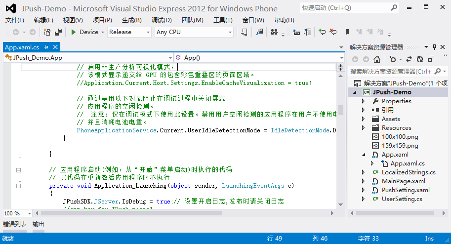

# Windows Phone 3 分钟快速 demo

本文的目的在于，指导新接触极光推送的开发者，在短短几分钟内把极光推送跑起来

+ 安装 Demo 客户端到手机
+ 在 Portal 上推送通知

### 创建极光推送开发者账号
要创建极光推送开发者帐号，请访问[极光推送官方网站（http://www.jiguang.cn）](http://www.jiguang.cn)

填写注册信息，勾选协议，点击“同意协议并提交”。

### Portal 上创建应用
创建帐号进入极光推送后，首先显示的是创建应用的界面。填上你的应用程序的名称，保存后在推送设置页面展开 WinPhone 设置，选择启动 WinPhone。

### 下载应用 Example

首先下载 [windows phone sdk](../../resources)

点击 ”下载“后，你将下载到一个 .zip 压缩文件。解压后，即看到一个同名目录。这个目录的 “example” 文件夹下，是一个 Windows phone 项目里的所有文件。

### 修改 Example（ Windows Phone 项目）app_key 和 channel
打开 example 项目

打开后如下图

打开 App.xaml.cs 文件，在 Application_Launching 函数中，将 JPushSDK.JServer.Setup 函数的 “app_key” 修改为 Portal 中创建的应用的 App_key,“channel” 修改为需要的渠道

### 运行 Example 这个应用

上步骤导入这个 Windows phone 项目后，你就马上可以按 F5, 运行把这个 Windows phone 应用跑起来了

如果你的 Windows phone 手机接在电脑上了，则这个 JPush Example 应用就可以安装上，并运行起来了。

做下一步动作之前，请确保你的手机上的网络是可用的。

### Portal 上推送通知

发送消息时，选中需要的平台（Windows phone）

在上述步骤安装 JPush Example 的手机上，你就可以收到推送的通知了

