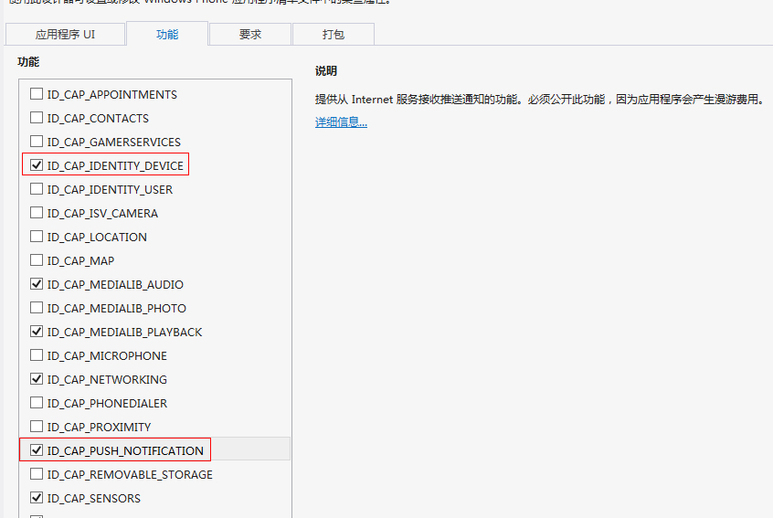

# Windows Phone SDK 集成指南
## 使用提示

本文匹配的 SDK 版本 r1.0.0 以后。

## 产品功能说明

极光推送（JPush）是一个端到端的推送服务，使得服务器的消息能够及时地推送到终端用户手机上，让开发者积极地保持与用户的连接，从而提高用户的活跃度、提高应用的留存率。极光推送客户端支持 Android、iOS 和 Windows Phone 三个平台。

本 Windows Phone SDK 方便开发者基于 JPush 来快捷的为 Windows Phone SDK 增加推送功能，减少集成 WPNs 所需要的工作量，开发的复杂度。

### 主要功能

+ 为 JPush Server 上报 ChannelUri，免除开发者管理 ChannelUri 的麻烦

### 主要特点

+ 集成简单
+ Windows Phone SDK 集成后，服务器向 Windows Phone 端推送消息更加简单

### 集成压缩包内容

+ JPushSDK-v1.0.0.dll：支持的 Windows Phone 的版本为 8.0 及以上
+ pdf 文件：WinPhone SDK 集成指南
+ example 文件夹：开发示例

## SDK 集成步骤
### 在 JPush Portal 上创建应用

+ [在 JPush 的管理 Portal ](https://www.jiguang.cn)上创建应用
+ 创建成功后自动生成 AppKey 用以标识该应用

### 导入 API 开发包到应用程序项目

将 SDK 包解压，在 vs2012 工程目录中的 “Reference” 上单击右键，在弹出菜单的右下角选择 "Browse",在资源管理器的文件夹中选中 SDK 目录下的 JPushSDK-v1.0.0.dll。

### 配置 WMAppManifest.xml

在工程目录下，单击 Properties 右侧三角块，在展开内容处双击 WMAppManifest.xml

选择下图红色矩形内的两项

### 添加代码

#### 调用接口

文件 App.xaml.cs 中监听系统事件，相应地调用 JPush SDK 提供的 API 来实现功能。

以下 ３ 个事件监听与调用 JPush SDK API 都是必须的。请直接复制如下代码块里，注释为 "Required" 的行，到你的应用程序代理类里相应的监听方法里。

请注意：由于微软商店的上架需求，请在第一次调用 RegisterNotification 函数前，弹出一个提示让用户确认是否推送,具体请参见 example 中的示例代码

	private void Application_Launching(object sender, LaunchingEventArgs e)
	{
		//Required
		//setup 第一个参数替换成您在 JPush Portal 中的 app_key
		//setup 第二个参数替换成您定义的渠道名称
		//setup 第二个参数是一个获取 RegisrtationID 的委托，不需要时可以填 null
		JPushSDK.JServer.Setup("your app_key", "your channel",null);
		JPushSDK.JServer.RegisterNotification();
	}
	private void Application_Activated(object sender, ActivatedEventArgs e)
	{
		//Required
		JPushSDK.JServer.Activated();

	}
	private void Application_Deactivated(object sender, DeactivatedEventArgs e)
	{
		//Required
		JPushSDK.JServer.Deactivated();
	}
#### 添加统计代码

toast 通知点击提示

添加在您要启动的页面之下，如果在推送通知内没添加该选项，则需要加在 MainPage 页面内

	protected override void OnNavigatedTo(NavigationEventArgs e)
	{
		JPushSDK.JServer.HandleToastNotification(NavigationContext.QueryString);
		base.OnNavigatedFrom(e);

	}
添加统计页面

	protected override void OnNavigatedTo(NavigationEventArgs e)
	{
		JPushSDK.JServer.TrackPageInto("your page name");
		base.OnNavigatedFrom(e);
	}
	protected override void OnNavigatedFrom(NavigationEventArgs e)
	{
		JPushSDK.JServer.TrackPageOut("your page name");
		base.OnNavigatedTo(e);
	}
#### 打印日志

查看消息是否发送到 JPush 服务器，以及集成过程中出错的原因

请注意：发布到商店前，一定关闭要 JPush SDK 调试模式。

	JPushSDK.JServer.IsDebug = true;

## 高级功能
请参考：

[winphone API](winphone_api)

## 技术支持

邮件联系：[support&#64;jpush.cn](mailto:support&#64;jpush.cn)
