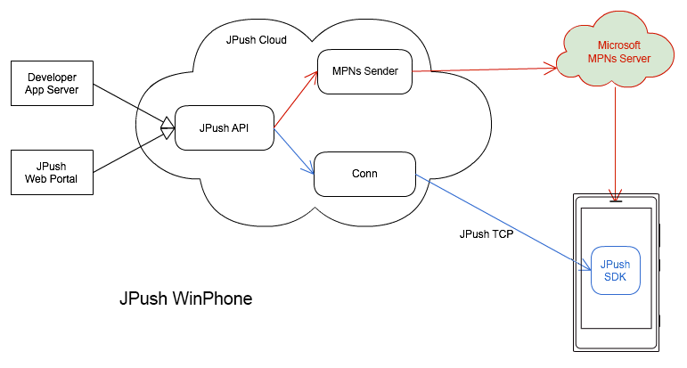

#Windows Phone SDK

+ [WinPhone 客户端 SDK 下载](../../resources/#wp-sdk)



JPush WP Push 包括 1个部分，MPNs 推送（代理）。

红色部分是 MPNs 推送，JPush 代理开发者的应用，向微软 MPNs 服务器推送。由 Microsoft MPNs Server 推送到 WP 设备上。

蓝色部分是 JPush 应用内推送部分，但目前暂不支持应用内消息。

### Windows Phone 平台上的通知

该通知由 JPush 服务器代理向微软的 MPNs 服务器发送，并在 Windows Phone 客户端的系统通知栏上展示。

该通知满足 MPNs 的相关规范。当前 JPush 仅支持 toast 类型。

```
Windows Phone 平台上，暂时不支持应用内消息。
```

### Windows Phone SDK 集成

请参考以下文档与教程，来集成 WinPhone SDK。

+ [3分钟快速Demo(Winphone)](winphone_3m)
+ [WinPhone 集成指南](winphone_guide)
+ [WinPhone API](winphone_api)
