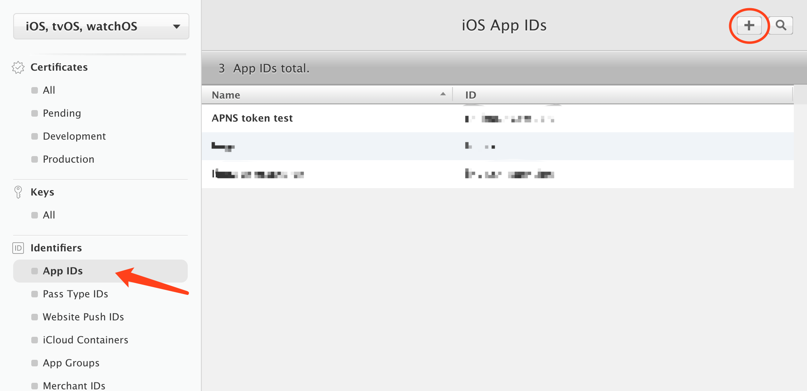
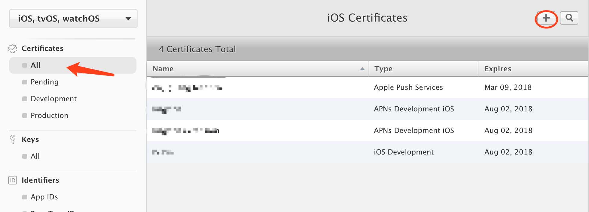
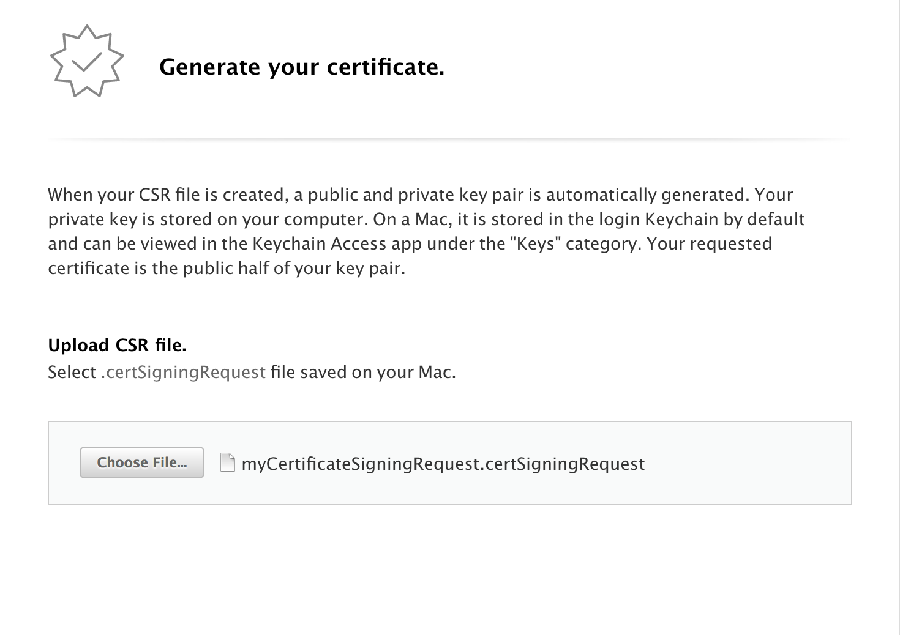
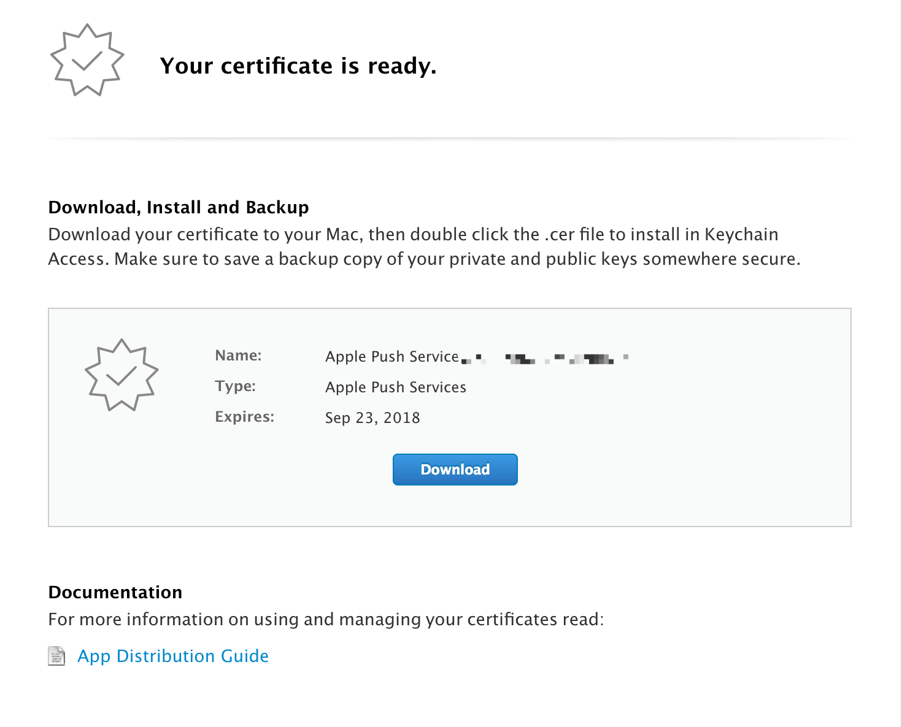
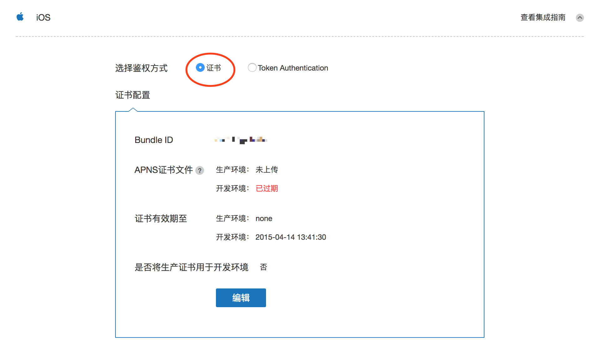
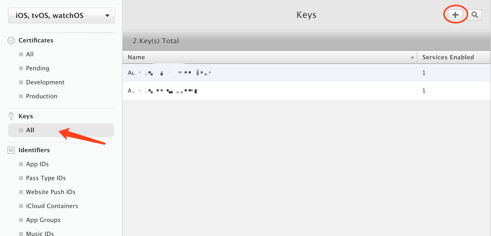
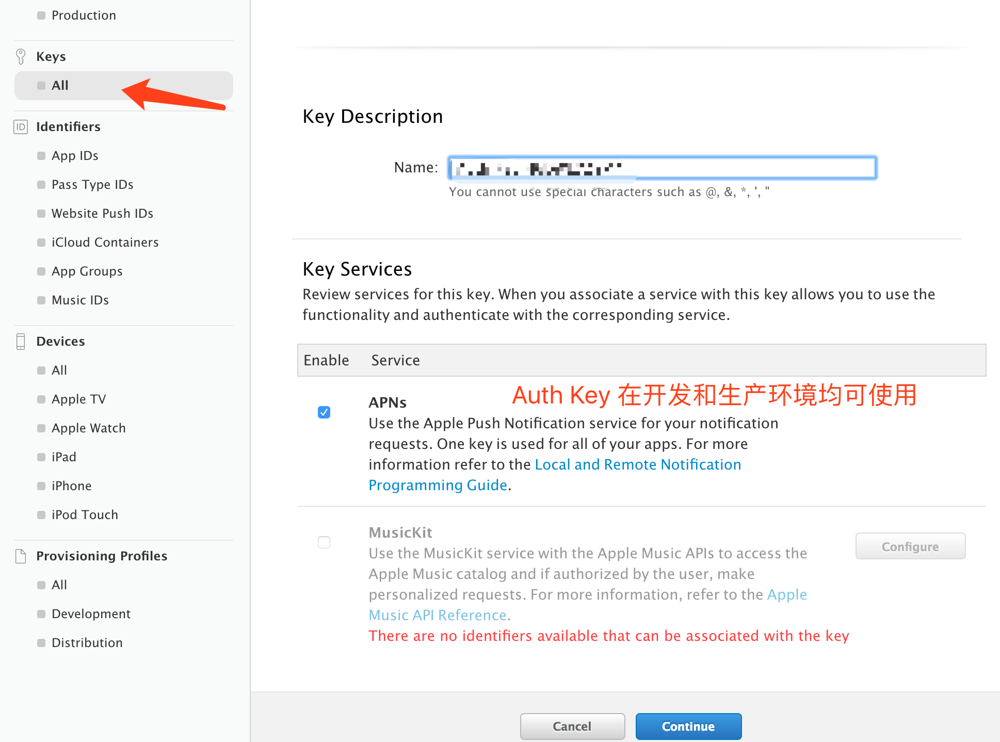
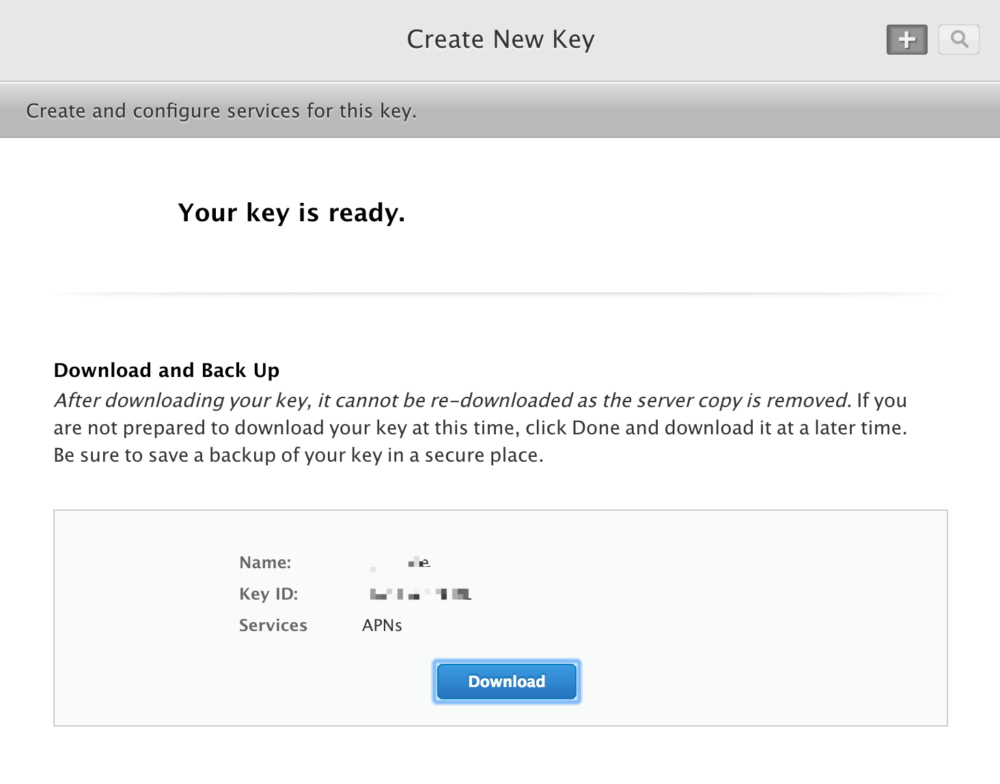
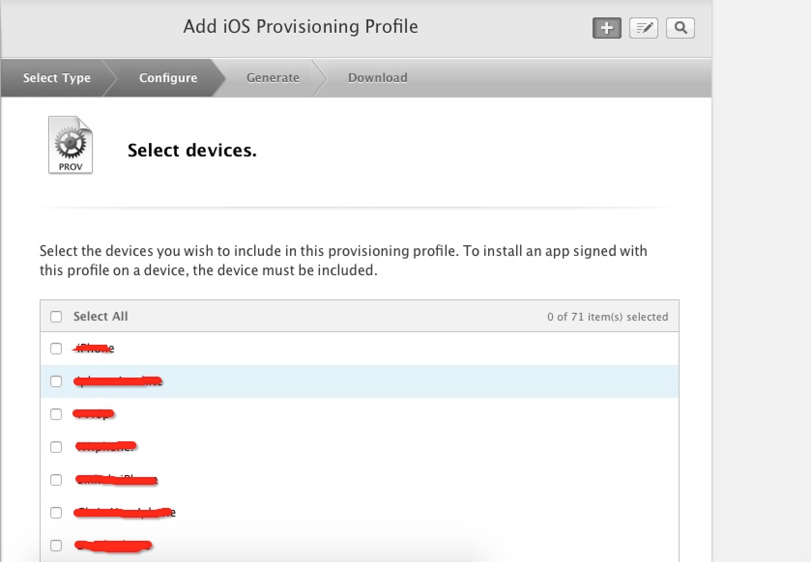
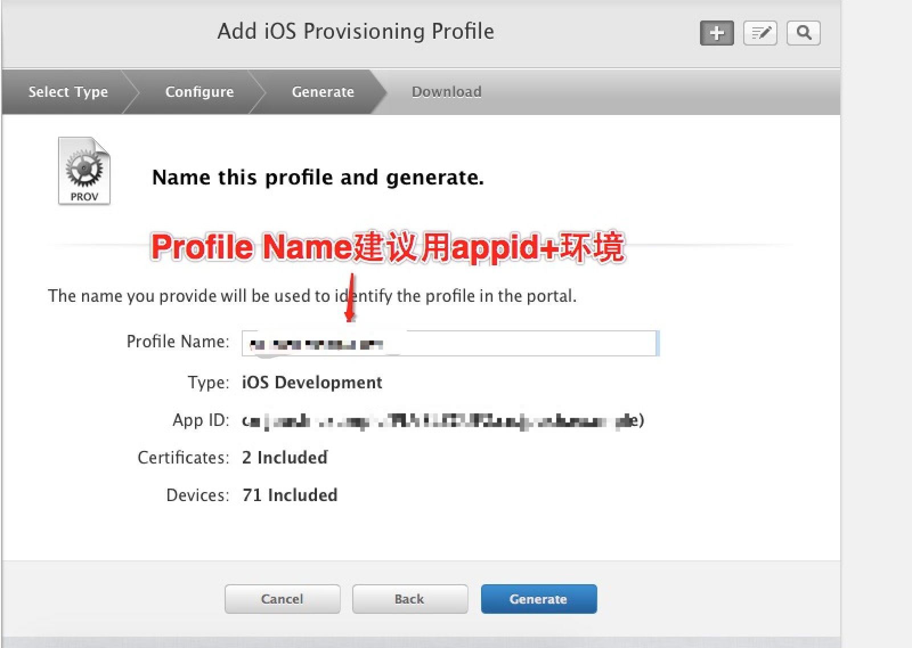

# iOS 证书设置指南

## 创建应用程序 ID

+ 登陆 [苹果开发者网站](https://developer.apple.com/) 进入开发者账户。

+ 从开发者账户页面左侧入口进入 “Certificates, IDs & Profiles” 页面。

+ 创建 App ID，填写 App ID 的 NAME 和 Bundle ID（如果 ID 已经存在可以直接跳过此步骤）。

~~~
	注: 此处需要指定具体的 Bundle ID 不要使用通配符。
~~~

+ 为 App 开启 Push Notification 功能。如果是已经创建的 App ID 也可以通过设置开启 Push Notification 功能。

+ 填写好以上属性后，点击 “Continue”，确认 AppId 属性的正确性，点击 “Register”，注册 AppId 成功。

## 两种鉴权方式的配置

极光官网应用的鉴权信息一旦配置，只能用相同 bundleID 的鉴权信息进行更新，无法修改为其他的 bundleID，请在配置前仔细检查 bundleID 是否正确，若因特殊原因需要修改，请联系 support@jpush.cn

### 方式一：通过 .p12 证书鉴权

+ 如果你之前没有创建过 Push 证书或者是要重新创建一个新的，请在证书列表下面新建。

+ 新建证书需要注意选择 APNs 证书种类。如图 APNs 证书有开发（Development）和生产（Production）两种。

~~~
	注：开发证书用于开发调试使用；生产证书既能用于开发调试，也可用于产品发布。此处我们选择生产证书为例。
~~~
	

+ 点击 "Continue", 之后选择该证书准备绑定的 AppID。

+ 点击 “Continue”，会进入 CSR 说明界面。

+ 再点 “Continue” 会让你上传 CSR 文件。（ CSR 文件会在下一步创建）

+ 打开系统自带的 KeychainAccess 创建 Certificate Signing Request。如下图操作：

+ 填写“用户邮箱”和“常用名称” ，并选择“存储到磁盘”，证书文件后缀为 .certSigningRequest 。

+ 回到浏览器中 CSR 上传页面，上传刚刚生成的后缀为 .certSigningRequest 的文件。
+ 生成证书成功后，点击 “Download” 按钮把证书下载下来，是后缀为 .cer 的文件。

+ 双击证书后，会在 “KeychainAccess” 中打开，选择左侧“钥匙串”列表中“登录”，以及“种类”列表中“我的证书”，找到刚才下载的证书，并导出为 .p12 文件。如下图：

+ 在极光控制台上，进入你应用的应用设置中 iOS 的鉴权方式选择 “证书”，上传刚才导出的 .p12 证书。极光会在后台为你的应用进行鉴权。
+ Apple 的生产推送证书允许用于开发环境的推送，勾选将生产证书用于开发环境，开发者可以仅上传生产证书，即可在官网推送平台处选择开发环境做推送，不用再生成和上传开发证书。

### 方式二：通过 APNs Auth Key 鉴权

+ 点击左侧列表 “Keys” 中的 “All”，看账户中是否已有 auth key，没有则点击 “+” 新建。

+ 填写该 key 的描述并选择服务，如下图。 （注：在开发和生产环境均可使用，且不会过期。）

+ 点击 “Continue” 让你确认信息，再点击 “confirm”，就可以下载该 key 了。（注意：记下 key id，而且只可以下载一次，请妥善保存。）

+ 获取你之前创建过的应用的 Bundle ID

+ 在开发者账户的 “Membership” 页面获取 Team ID

+ 在极光控制台上，进入你应用的应用设置中 iOS 的鉴权方式选择 “Token Authentication”，上传 auth key 文件，并填写你的 KEY ID，TeamID，和指定应用的 BundleID。极光会在后台为你的应用进行鉴权。

## Provisioning Profile的创建

+ 创建 Provisioning Profile 的前提，已在 Apple Developer 网站创建待发布应用所使用的 Bundle ID 的 App ID，且为该 App ID 创建了 iOS Development 证书。

+ 在[苹果开发者账号的 Provisioning Profile ](https://developer.apple.com/account/ios/profile/)页面点击下图按钮，创建 Provisioning Profile

+ 选择此 Provisioning Profile 的环境后点击 [Continue]：

+ 选择要创建 Provisioning Profile 的 App ID 后点击 [Continue]：

+ 选择所属的开发者证书，（这里创建了多个开发者证书，建议只创建一个，方便管理）为了方便，选择了 [Select All]，再点击 [Continue] 进入下一步：

+ 为该 Provisioning Profile 选择将要安装的设备（一般选择 [Select All]），点击 [Continue]:

+ 给该 Provisioning Profile 填写 Profile Name，点击 [generate] 完成创建。

+ 填写完 Profile Name 后点击 [generate] 完成创建，之后点击 [DownLoad] 下载 Provisioning Profile

+ 双击下载下来的 Provisioning Profile，添加到 xcode。

## XCode的证书配置教程

参照[iOS SDK 集成指南](ios_guide_new/)集成 JPush SDK 和上传了推送用到的 p12 证书后在编译运行前需要先配置一下证书，步骤如下：

+ 打开 xxx-info.plist 的 Bundle identifier 项把上传到 JPush 控制台的 bundle id 填写进去：

+ 点击项目，选择目标 TARGETS 后进入 Build Setting 界面，搜索 “Code signing”，按照下图配置

