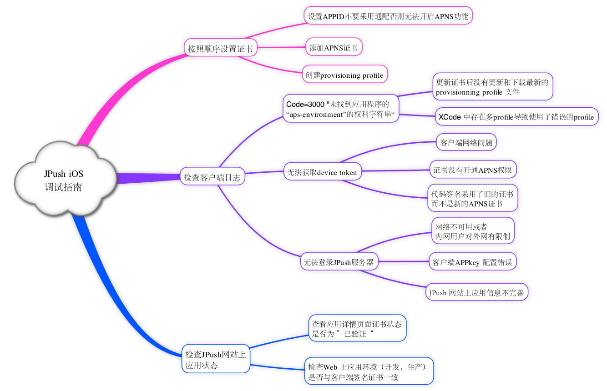
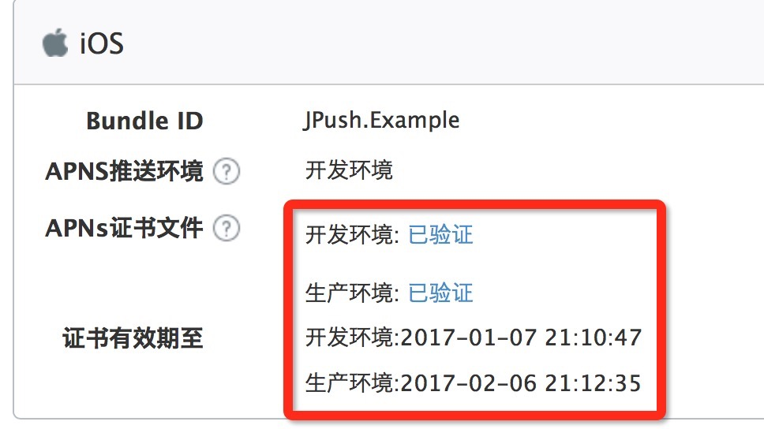

# iOS SDK 调试指南

## iOS 调试思维导图

## 确认证书

请到“应用详情页面”确认证书可用性：

+ 若证书状态显示已注销，则代表你们 revoke 了证书，请重新生成有效证书上传。
+ 证书有效期为 1 年，请注意在过期前及时更新证书，更新官网证书后需等待 5 分钟方会生效。

## 开发环境测试

在对  JPush iOS 开发环境进行测试前，请确保 3 个统一：

+ App 是开发环境打包（开发证书 Development ）
+ 上传了开发证书并验证通过（现支持上传生产证书后勾选“将生产证书用于开发环境”，即可不用上传开发证书）

## 发布环境测试

在对  JPush iOS 生产环境进行测试前，请确保 3 个统一：

+ App 是 ad-hoc 打包或者 App Store 版本（发布证书 Production），不可使用 Xcode 直接运行。
+ 上传了发布证书并验证通过

## 可能存在的其他问题

### 收到消息不够稳定

JPush iOS 是对原生官方 APNs 推送的一个补充，是对其的封装，以帮助开发人员更轻松地使用 APNs。

由于 APNs 本身不承诺保证消息到达，客户端网络与服务器端的连通性，对 APNs 是否及时接收到消息具有很大的影响。
