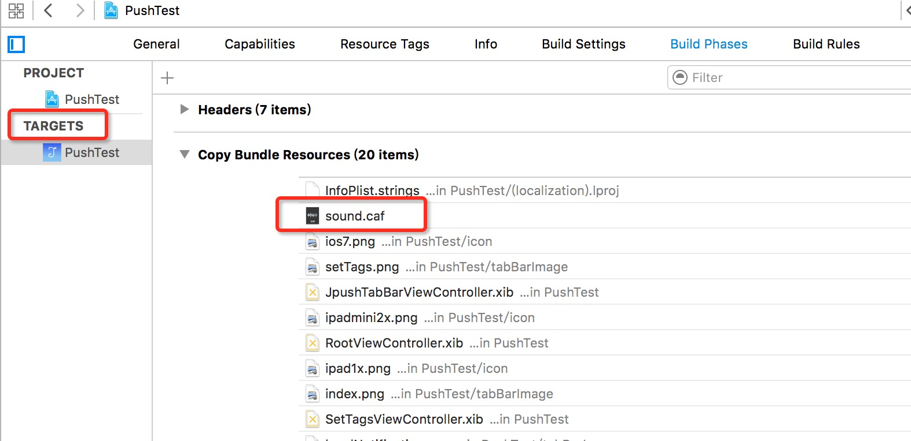

# iOS SDK 常见问题

<style>
img[alt=jpush_ios] { width: 800px; }
img[alt=jpush_ios_5] { width: 500px; }## 
</style>

## iOS 9 集成 

### iOS 9 变动影响 SDK 部分:

+ 增加了 bitCode 编码格式，当 SDK 不支持 bitCode 时，用户集成时无法开启 bitCode 选项。
	+ 现象：用户集成 SDK 后无法编译通过，错误日志里包含了 bitCode 的相关错误信息
+ 默认使用 https 连接，如果请求为 http，需要手动配置 plist 来支持 http 服务，当前我们的服务器请求都走 http 服务。
	+ 现象：用户集成 SDK 后，所有 JPush 相关的 http 服务都提示连接错误或者连接超时，可能是此问题。

### bitCode 解决方式

JPush iOS SDK v1.8.7 及以上版本的SDK,已经增加对 iOS 9 新特性 bitCode 的支持。JMessage iOS SDK v2.0.0 及以上版本支持 bitCode。

### Https 解决方式

SDK 未提供 https 地址版本时

+ 需要用户主动在当前项目的 Info.plist 中添加 NSAppTransportSecurity 类型 Dictionary。
+ 在 NSAppTransportSecurity 下添加 NSAllowsArbitraryLoads 类型 Boolean，值设为 YES


## iOS 如何推送自定义声音

客户端需要将声音文件导入工程里，选中工程 Target -> Build Phrases -> Copy Bundle Resources


服务端推送时，需要指定 iOS 平台下的 sound 参数，具体传入的值是声音文件名＋后缀。


## 为什么 iOS 收不到推送消息？

如果你确认 AppKey 在 SDK 客户端与 Portal 上设置是一致，其他环节也按照文档正确地操作。但还是收不到推送消息。那么，有一定的可能性，是你在 Portal 上上传的证书，不是 APNs (Push) 证书。推送时指定的 iOS 推送环境需要和应用证书是同一个环境。

请参考 [iOS 证书设置指南](ios_cer_guide)再次检查证书选择是否正确。    

请注意：iOS 能接受消息的必要条件是：应用程序的证书要和你上传到 jpush portal 上的证书对应，如果你的程序是直接在 xcode 上运行的，你的应用部署环境必须是开发状态才能收到 APNS 消息。    

>温馨提示：目前 api 推送的时候可以通过[参数 apns_production ](https://docs.jiguang.cn/jpush/server/push/rest_api_v3_push/#options)可以指定推送环境，false 为开发环境，true 为生产环境。直接调 V3 api 不带此参数则默认为生产环境，使用封装 V3 api 的极光官方 sdk 在不带此参数时默认为开发环境。如果 api 有传 apns_production 则以此值为准。    


## 为什么启动的时候出现 Did Fail To Register For Remote Notifications With Error 的错误

程序运行的时候出现下面的错误信息：

	did Fail To Register For Remote Notifications With Error: Error Domain=NSCocoaErrorDomain Code=3000 "未找到应用程序的“aps-environment”的权利字符串" UserInfo=0x1c55e000 {NSLocalizedDescription=未找到应用程序的“aps-environment”的权利字符串}
	
这个是由于你的 Provisioning Profile 文件，不具备 APNS 功能导致的。请登陆 Apple Developer 网站设置好证书，更新 Provisioning Profile，重新导入 Xcode。

或参考：[http://blog.csdn.net/stefzeus/article/details/7418552](http://blog.csdn.net/stefzeus/article/details/7418552)


## 如何在接收到 APN 的时候获取 APN 消息内容并进行跳转或做出响应处理？

[获取 APNs 推送内容](ios_api/#apns)


## 如何关闭 APN  推送？

可通过调用如下代码，进入您的应用的设置页面，点击“通知设置”，用户手可以动变更“允许通知”的状态。

```
// iOS 8 以上可用此方法
[[UIApplication sharedApplication] openURL:[NSURL URLWithString:UIApplicationOpenSettingsURLString]] 
```

或调用反注册代码直接关闭 APNS 功能
```
[[UIApplication sharedApplication] unregisterForRemoteNotifications]；
```
>注意：iOS 9 设备使用此代码反注册 APNs ，再调用初始化代码恢复注册 APNs ，需要杀死应用后，再重新开启应用才会有 APNs 提示（这里可能与系统本身 bug 有关）。

## App badge number（角标）如何更改与清空？

JPush 网站上推送 iOS 通知时，可在［可选设置］里面指定 badge 参数的值，如：1 或 "+1"。  
api 上指定 badge 的参数请看：[Push API](../../server/push/rest_api_v3_push/#notification)  
客户端上报 badge 到 JPush 服务器的接口请看：[设置 badge](ios_api/#badge)

关于 badge ＋1 的介绍，请看 [APNs Notification badge](http://blog.jiguang.cn/ios_apns_badge_plus/)


## Icon Badge number 的清空方法：

+ APN 推送内容指定 badge number 为 0；
+ 在客户端代码中使用如下代码清空本地 badge number：  [[UIApplication sharedApplication] setApplicationIconBadgeNumber:0];

**注意**：

badge 累加只能通过 v3 api 推送，且只有 1.7.4 版本以上才能支持。

<br />

## 为何推送一条 APN 后，点击通知中心的 APN 通知打开 App，可是 APN 通知在通知中心依然存在而未被删除？

如果推送 APN 时，Badge number 被指定为 0 ，则可能出现 APN 消息在通知中心被点击后，尽管调用了   [[UIApplication sharedApplication] setApplicationIconBadgeNumber:0]; 但 APN 消息在通知中心不会被删除的情况。 这种情况可以按如下代码调用以清除通知中心的 APN 通知。

	[[UIApplication sharedApplication] setApplicationIconBadgeNumber:1];
	[[UIApplication sharedApplication] setApplicationIconBadgeNumber:0];

如果仍有其他消息，则考虑清除 local notification 通知。（ [[UIApplication sharedApplication] cancelAllLocalNotifications] ）


## 出现 Not get deviceToken yet. Maybe: your certificate not configured APNs?...错误日志时如何排除问题?

如果出现上述日志，则说明一段时间内都无法获取 device token，那么：

+ 确认你的 app 配置了apns 权限，如果未配置 apns 权限，则应该会出现此错误提示。
+ 确认你的 app 运行在 ios 真机而非模拟器上，且通知中心中对应 app 的通知权限没有完全关闭（ alert/sound/badge 至少有一个权限是打开的）。
+ 确认你的网络状况，与 apple 的服务器的连接是通过 tcp 的 5223 端口连接，确认你网络的对应端口是否可用，可通过下列命令来确认这点：

		telnet 1-courier.push.apple.com 5223

+ 在代码中可在以下两个函数中断点以确认 device token 的获取状态。

		- (void)application:(UIApplication *)application didRegisterForRemoteNotificationsWithDeviceToken:(NSData *)deviceToken;
		- (void)application:(UIApplication *)application didFailToRegisterForRemoteNotificationsWithError:(NSError *)error;


	如果 app 运行进入 didFailToRegisterForRemoteNotificationsWithError 则说明 app 的 APNS 权限问题或者 app 运行在模拟器，参考[证书设置文档](https://docs.jiguang.cn/jpush/client/iOS/ios_cer_guide/)。

	如果 app 运行进入 didRegisterForRemoteNotificationsWithDeviceToken 则说明运行正常，请确认你在此函数中的代码中有将 token 传递给 jpush 的调用：

		[JPUSHService registerDeviceToken:deviceToken];

+ 如果以上两个 registerRemoteNotification 的函数都未进入， 请确认你的代码中有注册申请 apns 的函数调用：

		[JPUSHService registerForRemoteNotificationTypes:];
		
+ 如果上述情况都已确认且未进入第 4 步的任意回调函数，则可以判断无法获取 token 的原因在于设备与 apple 的网络连通性问题（注：一个设备只有在未申请过 token 的情况下才会需要与 apple 的网络交互来获取 token，已经获取过某一环境 token 的设备在无网络的情况下也能获取到对应环境的 token（环境分为 开发/生产）），这种情况下切换网络能够在大部分情况下解决此问题。

+ 如果仍然有问题，请将上述步骤的结果以邮件附件的形式发送到 JPush 支持邮箱 support@jpush.cn，我们将协助你解决此问题。


## 上传到 appStore 的版本为什么收不到推送？

+ 请确认 xcode 选择的生产证书和上传的证书的 bundleid 一致；
+ 如果是在 jpush 网站上推送，请确认新建通知时推送对象是否选择了生产环境；
+ 如果是 v3 api 推送，请确认是否使用了 apns_production 参数，值是否为：true。


## iOS 平台上传证书一直为未通过状态

证书上传未通过的原因一般有：

+ 密码错误；
+ 上传的 apns 证书环境不一致；
+ 上传到控制台必须是 apns 证书，非 apns 证书会带来错误，还有其他的原因可能是开发者证书也可能是 apns 证书那里导出来的私钥

具体请看上传后显示的错误输出内容。


## 为什么日志里面会打印：you still need to add "remote-notification" to the list of your supported UIBackgroundModes in your Info.plist.
```
You've implemented -[ <UIApplicationDelegate\> application:didReceiveRemoteNotification:fetchCompletionHandler:], 
but you still need to add "remote-notification" to the list of your supported UIBackgroundModes in your Info.plist.
```

这个主要是提示开发者如果要支持 UIBackgroundModes，需要开启 Remote notifications，具体操作可以看：[iOS 7 Background Remote Notification](ios_new_fetures/#ios-7-background-remote-notification)


