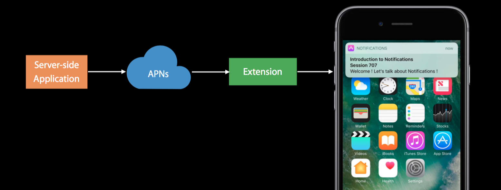
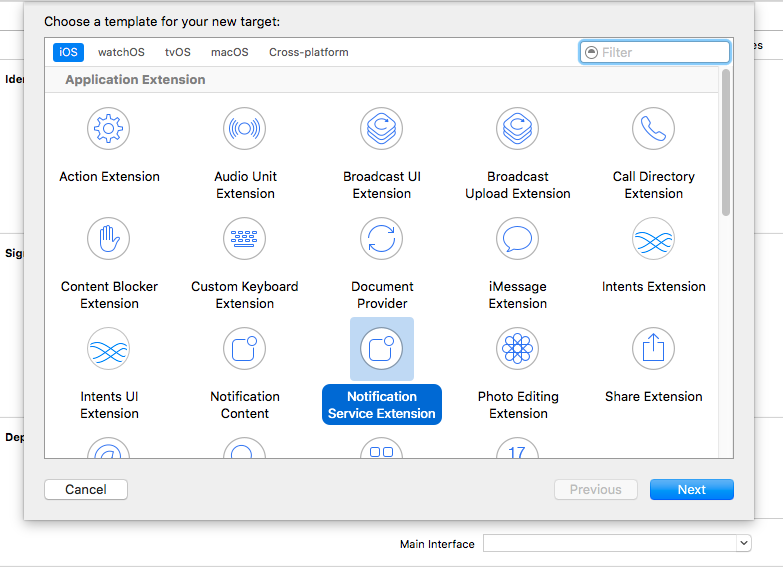
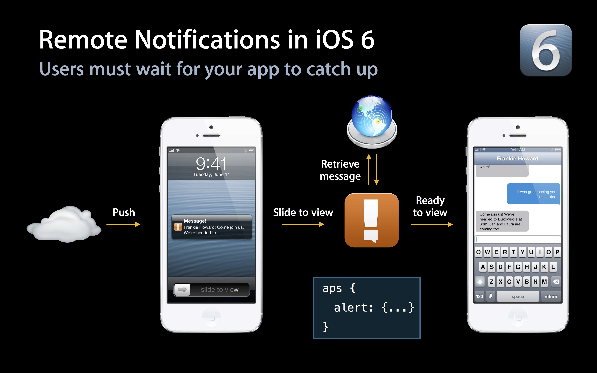
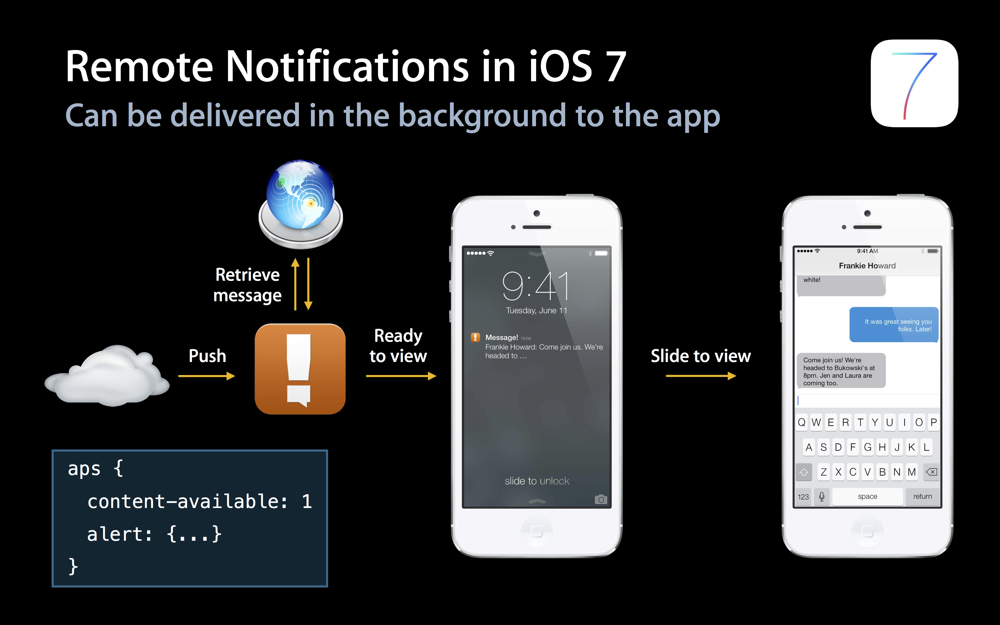
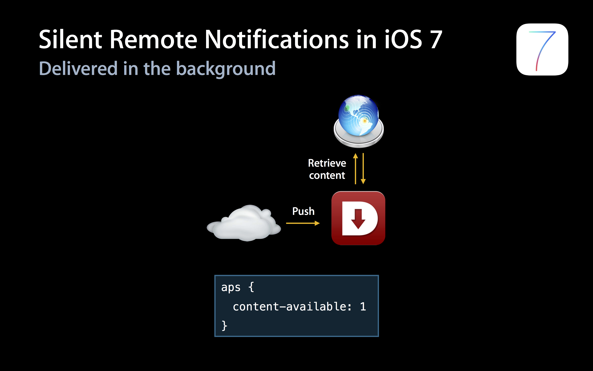
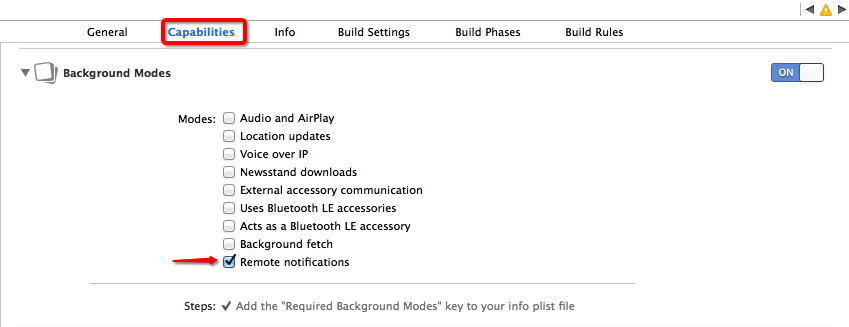
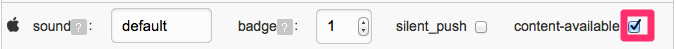

# iOS 新特性更新汇总

## iOS 10 New Features

### 说明
iOS 10 新增了大量关于通知的新特性，详情参照极光官方的 Blog。  
请跳转至：[iOS 10 新特性](http://blog.jiguang.cn/newfeture_notification_ios10/)

## iOS 10 Service Extension

### 说明
iOS 10 新增了 Service Extension  
官方给出的说明图如下  
  
这意味着在 APNs 到达我们的设备之前，还会经过一层允许用户自主设置的 Extension 服务进行处理，为 APNs 增加了多样性。

### 使用方法
Service Extension 使用起来很容易上手，首先我们需要创建一个 Service Extension 服务，如下图  
  

然后这里需要注意几个点

+ Service Extension 的 Bundle Identifier 不能和 Main Target（也就是你自己的 App Target）的 Bundle Identifier 相同，否则会报 BundeID 重复的错误。
+ Service Extension 的 Bundle Identifier 需要在 Main Target 的命名空间下，比如说 Main Target 的 BundleID 为 io.jpush.xxx，那么 Service Extension 的 BundleID 应该类似与 io.jpush.xxx.yyy 这样的格式。如果不这么做，你可能会遇到一个错误。

那么现在你的 Service Extension 服务已经创建成功了，此时你已经成功的使用了 Service Extension，但是好像我们还没有对它做什么操作，看看你的项目，你得到了一个类，这个类中包含两个方法。

+ didReceiveNotificationRequest:(UNNotificationRequest \*)request withContentHandler:(void (^)(UNNotificationContent *contentToDeliver))contentHandler
+ serviceExtensionTimeWillExpire

我们来看一下第一个方法的官方解释：Call contentHandler with the modified notification content to deliver. If the handler is not called before the service's time expires then the unmodified notification will be delivered。
简单解释一下，APNs 到来的时候会调用这个方法，此时你可以对推送过来的内容进行处理，然后使用 contentHandler 完成这次处理。但是如果时间太长了，APNs 就会原样显示出来。
也就是说，我们可以在这个方法中处理我们的通知，个性化展示给用户。
而第二个方法，是对第一个方法的补救。第二个方法会在过期之前进行回调，此时你可以对你的 APNs 消息进行一下紧急处理。


## iOS 9 集成

### iOS 9 变动影响 SDK 部分:

+ 增加了 bitCode 编码格式，当 SDK 不支持 bitCode 时，用户集成时无法开启 bitCode 选项。
	+ 现象：用户集成 SDK 后无法编译通过，错误日志里包含了 bitCode 的相关错误信息
+ 默认使用 https 连接，如果请求为 http，需要手动配置 plist 来支持 http 服务，当前我们的服务器请求都走 http 服务。
	+ 现象：用户集成 SDK 后，所有 JPush 相关的 http 服务都提示连接错误或者连接超时，可能是此问题。

### bitCode 解决方式

+ JPush iOS SDK v1.8.7 及以上版本的 SDK，已经增加对 iOS 9 新特性 bitCode 的支持。JMessage iOS SDK v2.0.0 及以上版本支持 bitCode。

### Https 解决方式

JPush 2.1.9 及以上的版本则不需要配置此步骤 

+ 需要用户主动在当前项目的 Info.plist 中添加 NSAppTransportSecurity 类型 Dictionary。
+ 在 NSAppTransportSecurity 下添加 NSAllowsArbitraryLoads 类型 Boolean，值设为 YES。


## iOS 9 UIUserNotificationActionBehaviorTextInput

### 支持版本
v1.8.0 版本开始

1. 本次 iOS 9 在推送方面最大的变化就是修改了推送 Category 的类型，在原本的推送 categories 的基础上，增加了一个 text Action 类型，这个参数的目的是用来注册通过通知快捷文字输入的事项。
2. 这个 categories 由一系列的 UIUserNotificationCategory 组成。每个 UIUserNotificationCategory 对象允许添加一组 UIMutableUserNotificationAction 类型的参数来增加通知栏上的项目。如今 iOS 9 在原有的 UIMutableUserNotificationAction 类型增加了 Text 输入类型 (UIUserNotificationActionBehaviorTextInput)，通过 behavior 来设置(只有 iOS 9 才拥有的属性)。
3. 回调的方法 iOS 9 使用了两个新的回调方法来处理点击按钮的事件：

```
- (void)application:(UIApplication *)application handleActionWithIdentifier:(nullableNSString *)identifier forLocalNotification:(UILocalNotification *)notification withResponseInfo:(NSDictionary *)responseInfo completionHandler:(void(^)())completionHandler NS_AVAILABLE_IOS(9_0)

- (void)application:(UIApplication *)application handleActionWithIdentifier:(nullableNSString *)identifier forRemoteNotification:(NSDictionary *)userInfo withResponseInfo:(NSDictionary *)responseInfo completionHandler:(void(^)())completionHandler NS_AVAILABLE_IOS(9_0)
```

**说明**:

+ 当 Action 为 UIUserNotificationActionBehaviorTextInput 时，需要通过 responseInfo 的UIUserNotificationActionResponseTypedTextKey 来获取输入的文字内容，UIUserNotificationTextInputActionButtonTitleKey 获取点击的按钮类型。

+ 当 Action 为 UIUserNotificationActionBehaviorDefault 时，responseInfo 为 nil，通过 identifier 来区分点击按钮分别是什么来做处理。

### 客户端设置

**设置带有快速回复内容的通知**

```
#ifdef __IPHONE_9_0 
 UIMutableUserNotificationAction *replyAction = [[UIMutableUserNotificationAction alloc]init];
 replyAction.title = @"Reply";
 replyAction.identifier = @"comment-reply";
 replyAction.activationMode = UIUserNotificationActivationModeBackground;
 replyAction.behavior = UIUserNotificationActionBehaviorTextInput;
  
 UIMutableUserNotificationCategory *category = [[UIMutableUserNotificationCategory alloc]init];
 category.identifier = @"reply";
 [category setActions:@[replyAction] forContext:UIUserNotificationActionContextDefault];
#endif
```

**使用回调函数**

```
- (void)application:(UIApplication *)application handleActionWithIdentifier:(nullable NSString *)identifier forRemoteNotification:(NSDictionary *)userInfo withResponseInfo:(NSDictionary *)responseInfo completionHandler:(void(^)())completionHandler NS_AVAILABLE_IOS(9_0) {
 if ([identifier isEqualToString:@"comment-reply"]) {
 NSString *response = responseInfo[UIUserNotificationActionResponseTypedTextKey];
 //对输入的文字作处理
 }
 completionHandler();
 }
```

### 服务端设置

服务端 payload 格式：aps 增加 category 字段，当该字段与客户端 UIMutableUserNotificationCategory 的 identifier 匹配时，触发设定的 action 和 button 显示。

```
payload example:
{"aps":{"alert":"example", "sound":"default", "badge": 1, "category":"reply"}}
```

## iOS 8 UILocalNotification


本次 iOS 8 UILocalNotification 增加了三个参数: region、regionTriggersOnce、category。

+ region: 用于控制当用户进入或者离开某一个地理位置时候，触发通知。使用此功能，用户需要拥有CoreLocation 的 "when-in-use" 权限。
+ regionTriggersOnce(BOOL)：当为 YES 时，通知只会触发一次，当为 NO 时，通知将会在每一次进入或者离开时都触发。
+ category：如果 localNotification 通过 +[UIUserNotificationSettings settingsForUserNotificationTypes:userNotificationActionSettings:] 注册了，通过该 category 可以获取该通知的注册 category。

### 客户端设置

#### 使用 UILocalNotification

```
// set localNotification
  CLLocationCoordinate2D coordinate2D;
  coordinate2D.latitude = 100.0;
  coordinate2D.longitude = 100.0;
  CLRegion *currentRegion =
      [[CLCircularRegion alloc] initWithCenter:coordinate2D
                                        radius:CLLocationDistanceMax
                                    identifier:@"test"];
 
  [APService setLocalNotification:[NSDate dateWithTimeIntervalSinceNow:120]
                        alertBody:@"test ios8 notification"
                            badge:0
                      alertAction:@"取消"
                    identifierKey:@"1"
                         userInfo:nil
                        soundName:nil
                           region:currentRegion
               regionTriggersOnce:YES
                         category:@"test"];
```
</br>


## iOS 8 UIUserNotificationSettings

### 支持版本
v1.8.0 版本开始。

+ 本次 iOS 8 在推送方面最大的变化就是修改了推送的注册接口，在原本的推送 type 的基础上，增加了一个categories 参数，这个参数的目的是用来注册一组和通知关联起来的 button 的事件。
+ 这个 categories 由一系列的 UIUserNotificationCategory 组成。每个 UIUserNotificationCategory 对象包含你的 app 用来响应本地或者远程通知的信息。每一个对象的 title 作为通知上每一个 button 的 title 展示给用户。当用户点击了某一个 button，系统将会调用应用内的回调函数[application:handleActionWithIdentifier:forRemoteNotification:completionHandler:](https://developer.apple.com/library/prerelease/ios/documentation/UIKit/Reference/UIApplicationDelegate_Protocol/index.html#//apple_ref/occ/intfm/UIApplicationDelegate/application:handleActionWithIdentifier:forRemoteNotification:completionHandler:)或者[application:handleActionWithIdentifier:forLocalNotification:completionHandler:](https://developer.apple.com/library/prerelease/ios/documentation/UIKit/Reference/UIApplicationDelegate_Protocol/index.html#//apple_ref/occ/intfm/UIApplicationDelegate/application:handleActionWithIdentifier:forLocalNotification:completionHandler:)。

### 客户端设置

#### 使用 UIUserNotificationCategory

```
if ([[UIDevice currentDevice].systemVersion floatValue] >= 8.0) {
 
 NSMutableSet *categories = [NSMutableSet set];
 
 UIMutableUserNotificationCategory *category = [[UIMutableUserNotificationCategory alloc] init];
 
 category.identifier = @"identifier";
 
 UIMutableUserNotificationAction *action = [[UIMutableUserNotificationAction alloc] init];
 
 action.identifier = @"test2";
 
 action.title = @"test";
 
 action.activationMode = UIUserNotificationActivationModeBackground;
 
 action.authenticationRequired = YES;
 
 //YES 显示为红色，NO 显示为蓝色
 action.destructive = NO;
 
 NSArray *actions = @[ action ];
 
 [category setActions:actions forContext:UIUserNotificationActionContextMinimal];
 
 [categories addObject:category];
}
```

#### 使用 UIUserNotificationType

```
if ([[UIDevice currentDevice].systemVersion floatValue] >= 8.0) {
[APService registerForRemoteNotificationTypes:(UIUserNotificationTypeBadge | UIUserNotificationTypeSound | UIUserNotificationTypeAlert)                      categories:categories];
}else{
[APService registerForRemoteNotificationTypes:(UIUserNotificationTypeBadge | UIUserNotificationTypeSound | UIUserNotificationTypeAlert)                      categories:nil];
}
```

#### 使用回调函数

```
// Called when your app has been activated by the user selecting an action from
// a remote notification.
// A nil action identifier indicates the default action.
// You should call the completion handler as soon as you've finished handling
// the action.
- (void)application:(UIApplication *)application handleActionWithIdentifier:(NSString *)identifier forRemoteNotification:(NSDictionary *)userInfo
  completionHandler:(void (^)())completionHandler {
}
```

### 服务端设置

服务端 payload 格式：aps 增加 category 字段，当该字段与客户端 UIMutableUserNotificationCategory 的 identifier 匹配时，触发设定的 action 和 button 显示。

```
payload example:
{"aps":{"alert":"example", "sound":"default", "badge": 1, "category":"identifier"}}
```


## iOS 7 Background Remote Notification


本次 iOS 7 在推送方面最大的变化就是允许，应用收到通知后在后台（background）状态下运行一段代码，可用于从服务器获取内容更新。功能使用场景：（多媒体）聊天，Email 更新，基于通知的订阅内容同步等功能，提升了终端用户的体验。

Remote Notifications 与之前版本的对比可以参考下面两张 Apple 官方的图片便可一目了然。





如果只携带 content-available: 1 不携带任何 badge，sound 和消息内容等参数，则可以不打扰用户的情况下进行内容更新等操作即为 “Silent Remote Notifications”。




### 客户端设置

#### 开启 Remote notifications

需要在 Xcode 中修改应用的 Capabilities 开启 Remote notifications，请参考下图：



#### 修改通知处理函数

当注册了 Backgroud Modes -> Remote notifications 后，notification 处理函数一律切换到下面函数，后台推送代码也在此函数中调用。

	- (void)application:(UIApplication *)application didReceiveRemoteNotification:(NSDictionary *)userInfo fetchCompletionHandler:(void (^)(UIBackgroundFetchResult))completionHandler；

### 服务端推送设置

推送消息携带 content-available: true 是 Background 运行的必须参数，如果不携带此字段则与 iOS 7 之前版本的普通推送一样。

#### 使用 Web Portal 推送

选择一个 iOS 目标平台后，展开“可选设置”，勾选对应的参数。



#### 使用 API 推送

只需在 [Push API v3](../../server/push/rest_api_v3_push/#notification) 的 ios 内附加 content-available": true 字段即可

### 限制与注意

+ “Silent Remote Notifications” 是在 Apple 的限制下有一定的频率控制，但具体频率不详。所以并不是所有的 “Silent Remote Notifications” 都能按照预期到达客户端触发函数。
+ “Background” 下提供给应用的运行时间窗是有限制的，如果需要下载较大的文件请参考 Apple 的 NSURLSession 的介绍。
+ “Background Remote Notification”  的前提是要求客户端处于 Background 或 Suspended 状态，如果用户通过 App Switcher 将应用从后台 Kill 掉应用将不会唤醒应用处理 background 代码。

更详细的说明资料请查阅 Apple 官方的 iOS 开发文档。

- [Local and Remote Notifications Overview](https://developer.apple.com/library/content/documentation/NetworkingInternet/Conceptual/RemoteNotificationsPG/index.html#//apple_ref/doc/uid/TP40008194-CH3-SW1)

[1]:https://github.com/ylechelle/OpenUDID


