# Web 推送

## 创建应用

### **创建应用步骤**:

#### 创建应用 :  
点击［创建应用］按钮即可;  


#### 配置应用信息：  
Step1： 基本信息：输入应用名称 (必填), 上传一个图标；  


Step2： 配置 Android 平台信息：填写应用包名, JPush 系统会在后台根据你输入的包名生成的推送的 Android 应用 Demo, 该 Demo 包含了该配置的信息;  
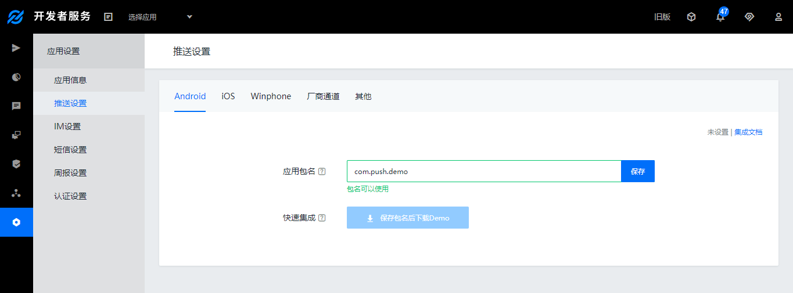

Step3： 配置 iOS 平台信息：上传相关环境的推送证书，并填写和证书配套的密码；  


Step4： 配置 WinPhone 平台信息：选择是否开启即可；


```
注意：Android 的包名和 iOS 的证书一旦配置，不允许修改；
如果测试应用配置有误，可删除应用重新创建（应用信息 - 编辑 - 删除）；
如果是线上应用的某一个平台配置有误需要更改，可联系 support@jpush.cn 处理。
```  
 
Step5： 信息配置完成后，查看应用信息如下：  
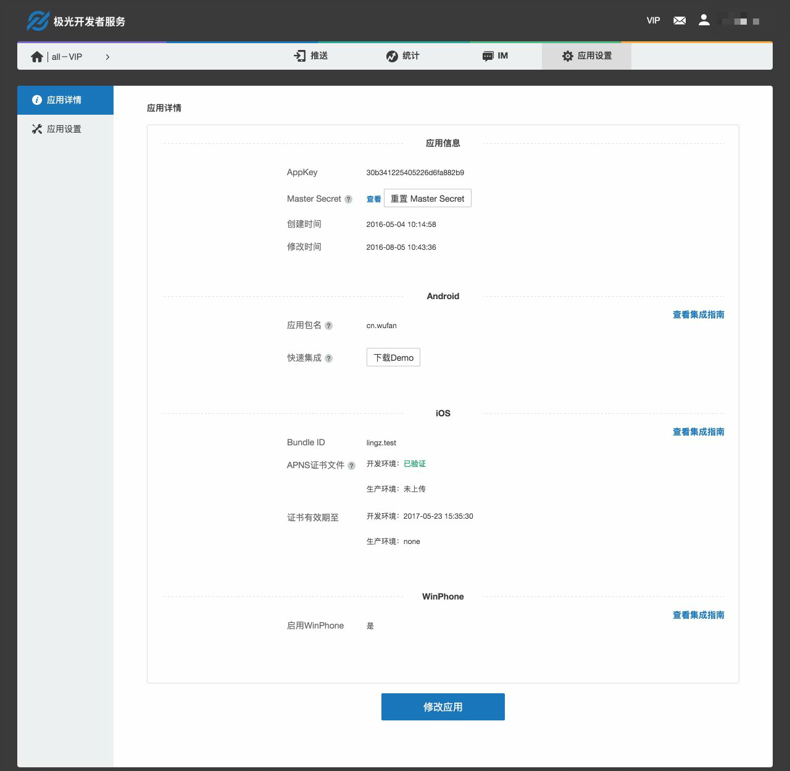


## 应用管理

点击［应用管理］回到首页，可浏览所有应用的信息，点击应用名称或设置可查看应用详情，点击推送可去到发送通知页，编辑并推送通知，点击统计，可查看该应用的所有统计数据；  
  

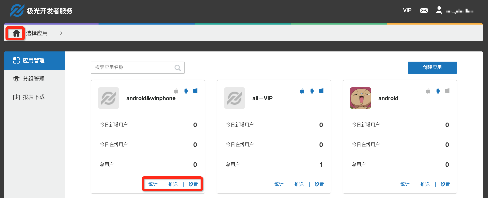  

应用详情如下  
 
 
应用设置如下  
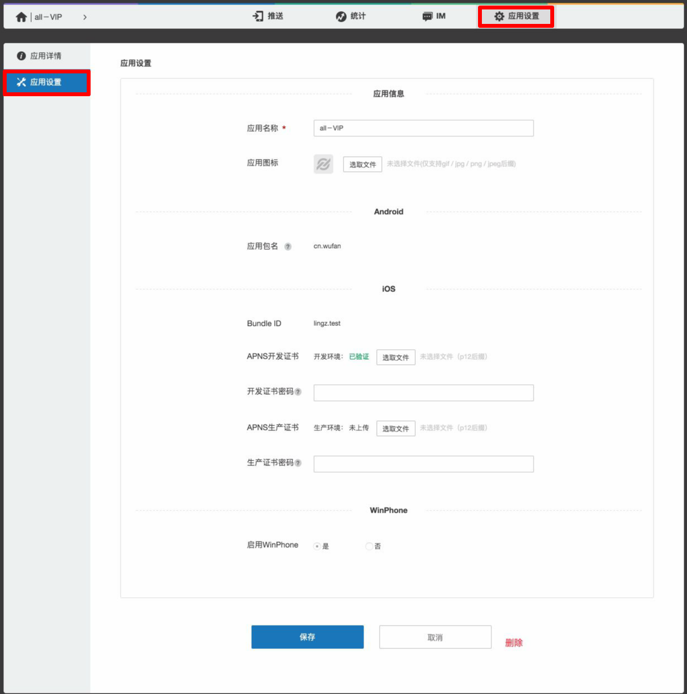

## 分组管理

点击［应用管理］回到首页后，在导航中点击［分组管理］，可浏览应用的分组管理信息并创建新分组，你可以将几个 App 分为一组，选择分组推送即可同时推送给组内所有的 App；  
  
 
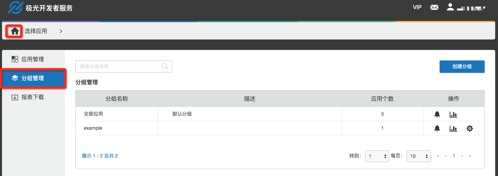

## 报表下载

点击［应用管理］回到首页后，在导航中点［报表下载］，可以根据时间对报表进行下载； 
  
 
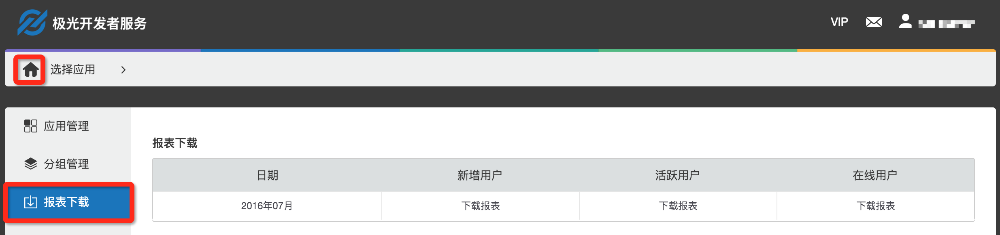

## 发送通知

路径：选择应用－>推送－>发送通知  
填写推送内容后点击页面最下方的［发送预览］按钮即可；  
该功能对应 Rest API - Push - [Notification](https://docs.jiguang.cn/jpush/server/push/rest_api_v3_push/#notification)

```
注意：如果选择别名、标签、registrationID 推送，在输入一个值后需要回车确认。
```

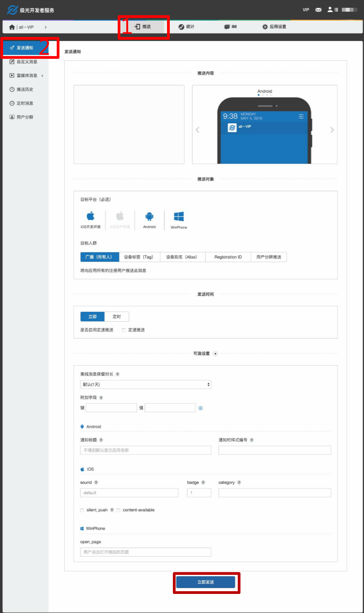

Web 界面会弹出发送预览页面, 选［确认］即可;  
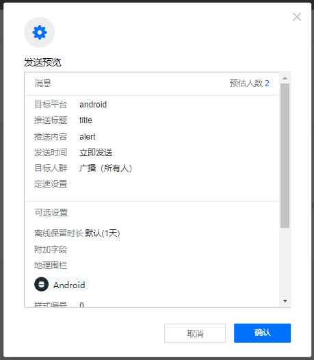

推送成果后，弹出对话框，点击［去看看］即可查看推送结果;  
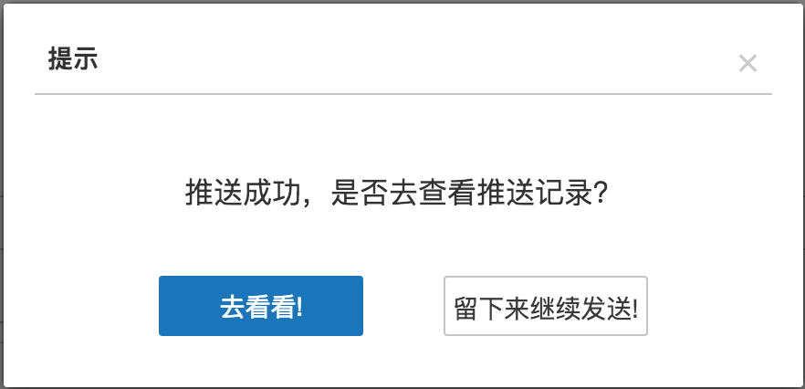

## 自定义消息

路径：选择应用－>推送－>自定义消息     
填写推送内容后点击页面最下方的［发送预览］按钮即可；  
该功能对应 Rest API - Push - [Message](https://docs.jiguang.cn/jpush/server/push/rest_api_v3_push/#message)
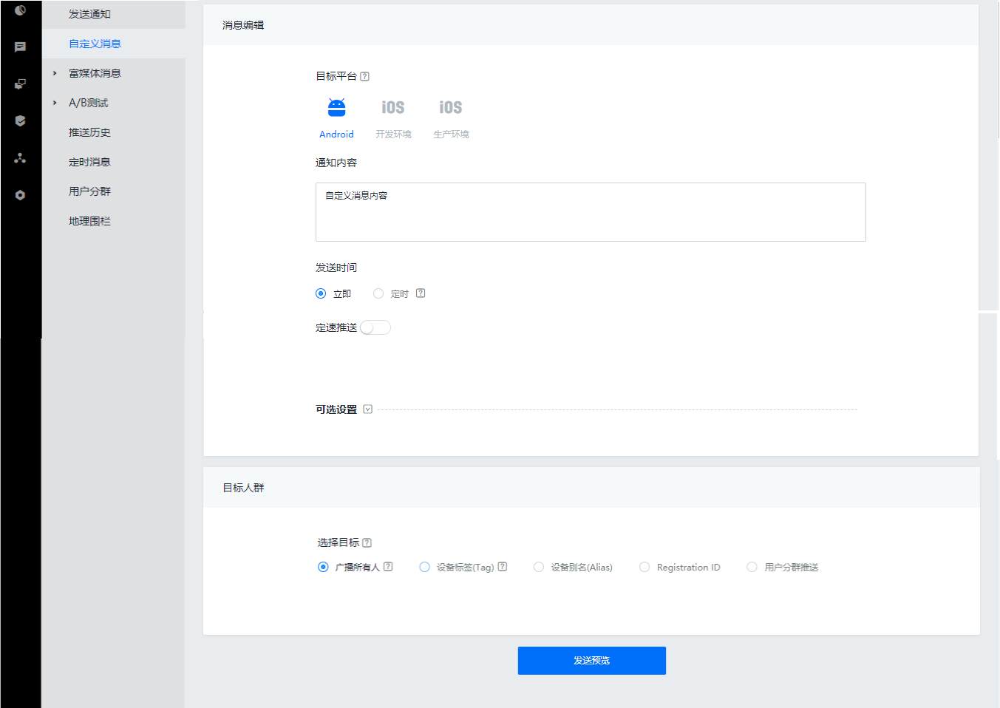

## 富媒体消息

路径：选择应用－>推送－>富媒体消息；  
可通过模板发送 landing page、弹窗、信息流等形式的富媒体消息，或者直接通过URL发送预先编辑好的页面；      
该功能不支持调 API 推送，仅支持官网控制台推送

### 通过全屏式模板发送

* Step1：路径：选择应用－>推送－>富媒体消息－>模版－>全屏式模板；  
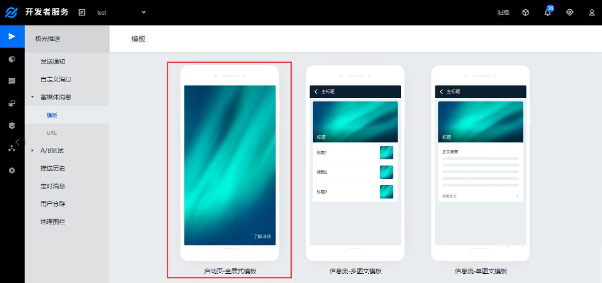

* Step2：进入模板内容编辑页面，填写所有内容，右侧可预览内容的展示效果，单击［下一步］；  
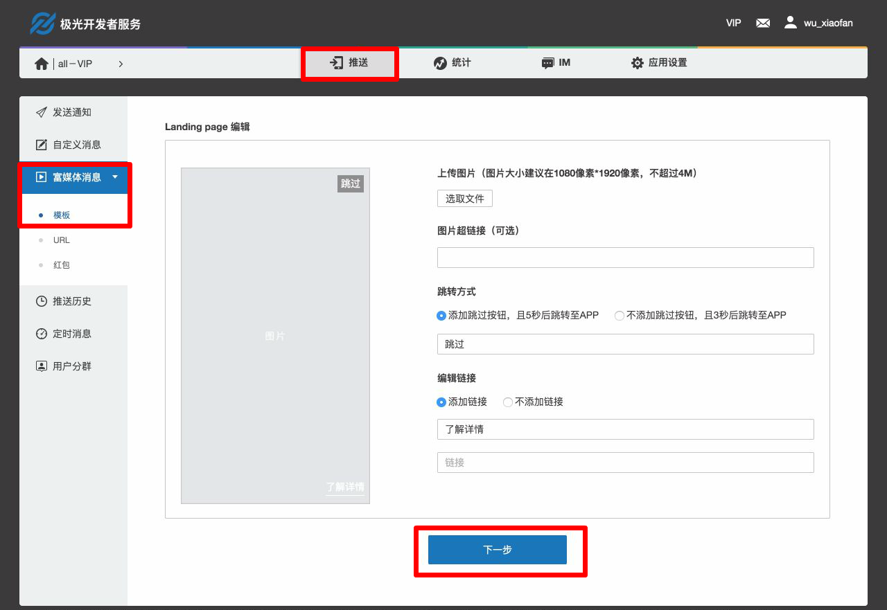

* Step3：单击［预览富媒体页面］，可预览刚刚编辑完成的全屏式富媒体模板；单击页面最下方的［发送预览］按钮，按照提示操作，即可完成该全屏式富媒体的推送；  
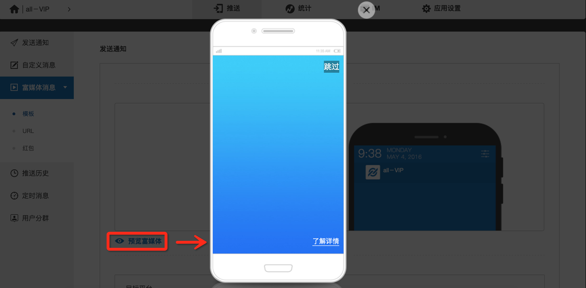

### 通过弹窗模板发送

* Step1：选择应用－>推送－>富媒体消息－>模版－>弹窗，挑选适合的模板；  
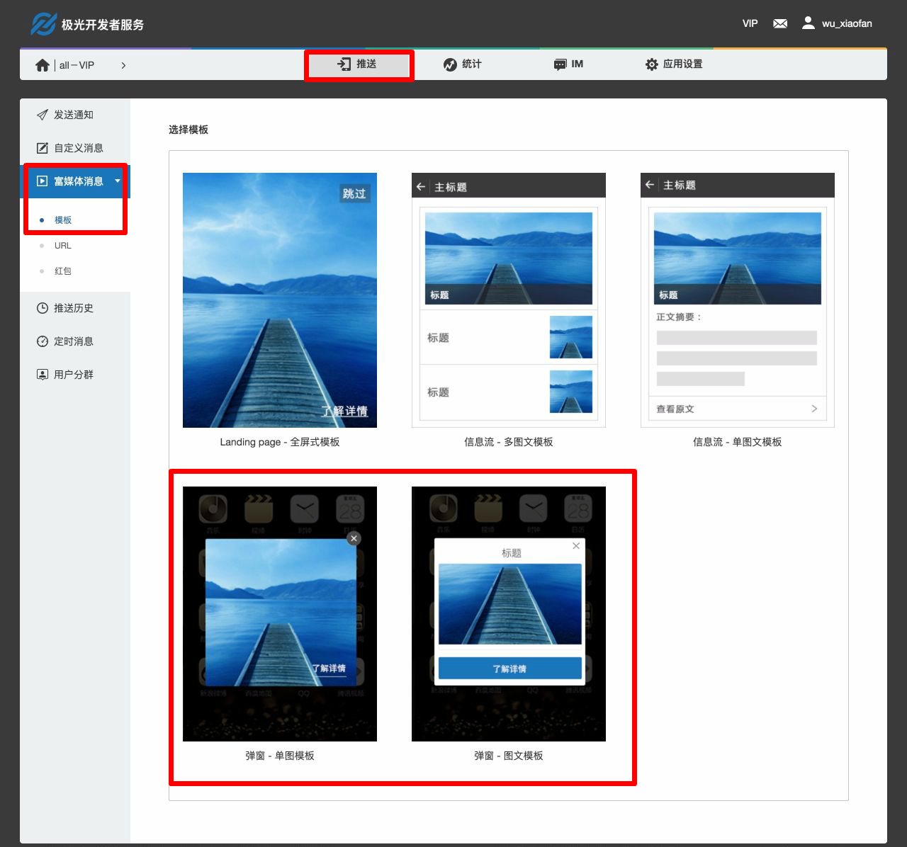

* Step2：进入模板内容编辑页面，填写所有内容，右侧可预览内容的展示效果，单击下一步；  
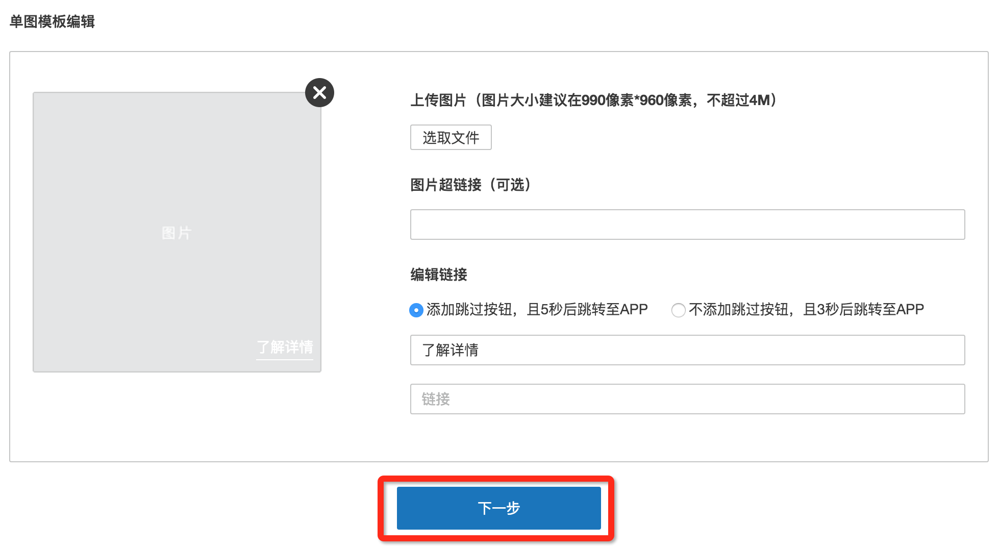

* Step3：单击［预览富媒体页面］，可以预览刚刚编辑完成的弹窗模板，单击页面最下方的［发送预览］按钮，按照提示操作，即可完成该弹窗的推送；  
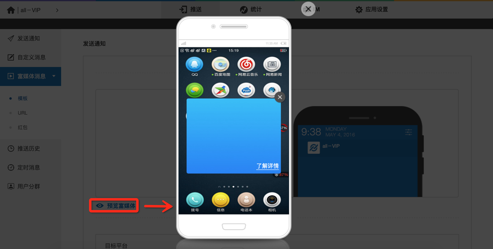

### 通过信息流模板发送

* Step1：路径：选择应用－>推送－>富媒体消息－>模版－>信息流，挑选适合的模板；  
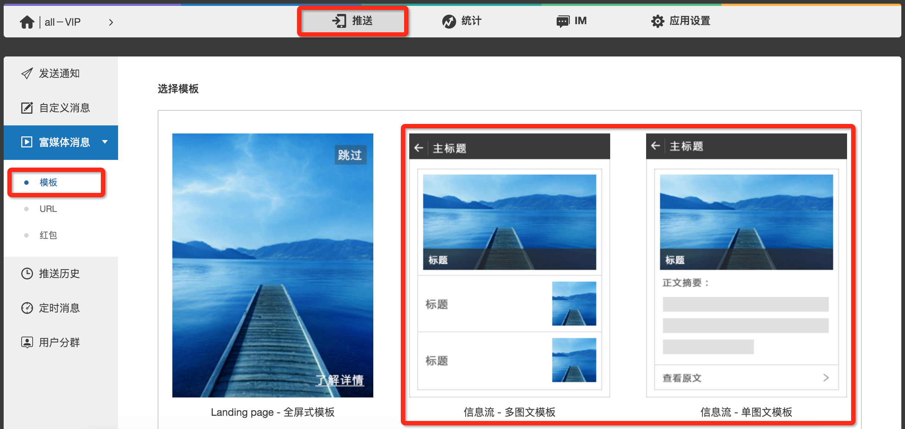

* Step2：进入模板内容编辑页面，填写所有内容，右侧可预览内容的展示效果，单击下一步；  


* Step3：单击［预览富媒体页面］，可以预览刚刚编辑完成的弹窗模板，单击页面最下方的［发送预览］按钮，按照提示操作，即可完成该信息流的推送；  
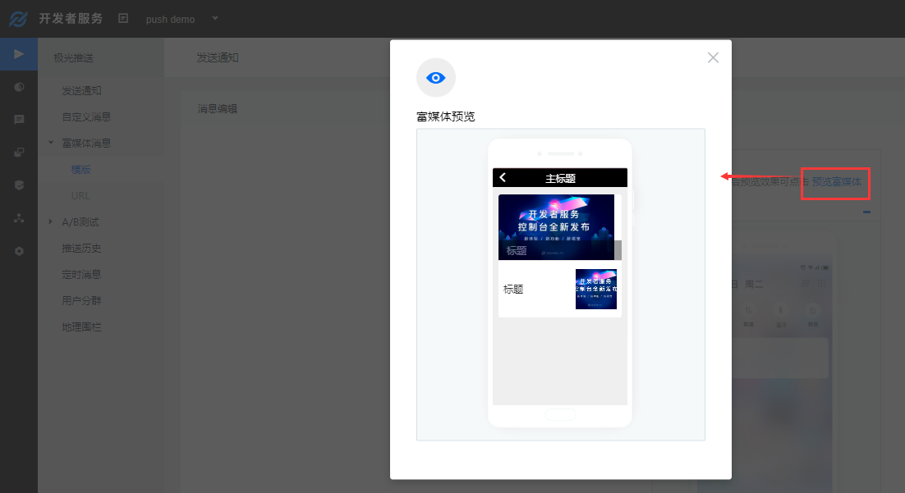

### 通过URL发送通知

* Step1：路径：选择应用－>推送－>富媒体消息－>URL，单击［下一步］按钮，由于通知的大小有限制，URL不可过长，若URL超过限制长度，请自行转成短地址再输入； 
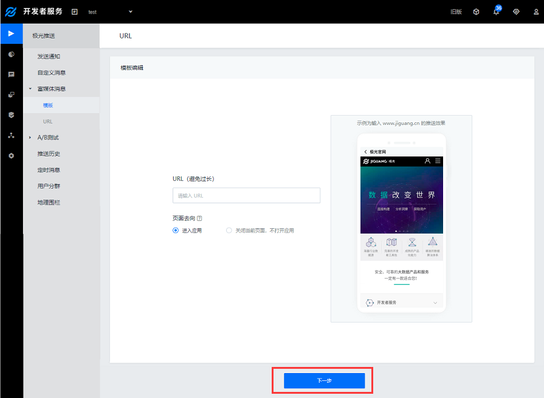

* Step2：URL不提供页面预览功能，请确保输入正确的URL，在发送通知页面填写通知内容（该内容将展示到通知栏上，不填写则不展示），单击页面最下方的［发送预览］按钮，按照提示操作，即可完成URL推送；  
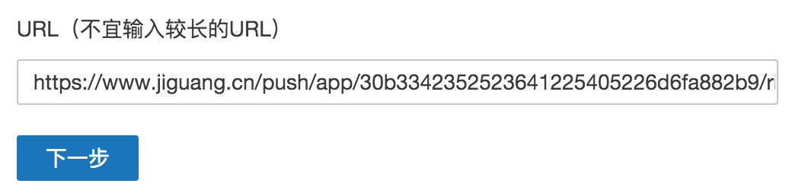

## 推送历史

路径：选择应用－>推送－>推送历史  
在右边可以浏览推送的历史数据，包含推送时间，内容，类型，IOS 目标|成功，Android 目标|成功，Winphone 目标|成功，操作；
点开操作中的[详情]，可以展开消息详情，查看详细的推送内容。

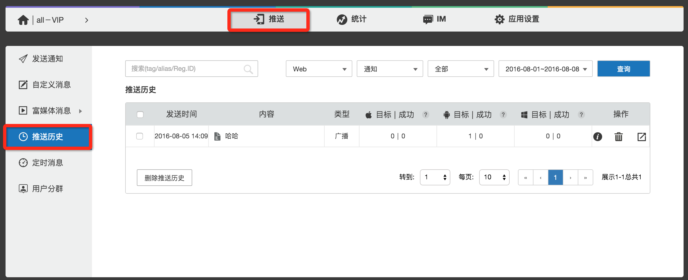

**说明**

+ 类型包括：广播、tag、alias、Registration ID、segment
+ 操作包括：转发、详情、删除

**注意**

推送历史数据只保留一个月的统计信息。

详情如下：  
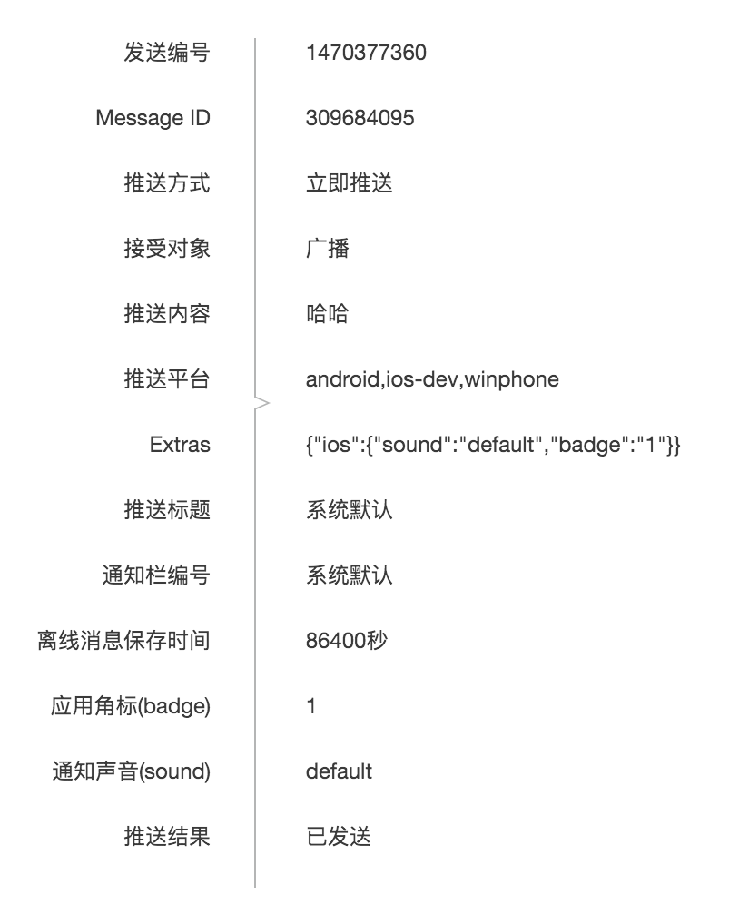

统计示例：  
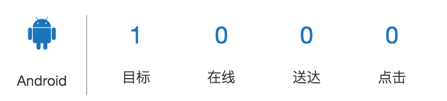

## 定时推送

路径：选择应用－>推送－>定时消息  
右边的下拉菜单中可以选择［通知］还是［自定义消息］的定时推送消息；   
该功能对应 Rest API - Schedule - [创建定时任务](https://docs.jiguang.cn/jpush/server/push/rest_api_push_schedule/#_4)。
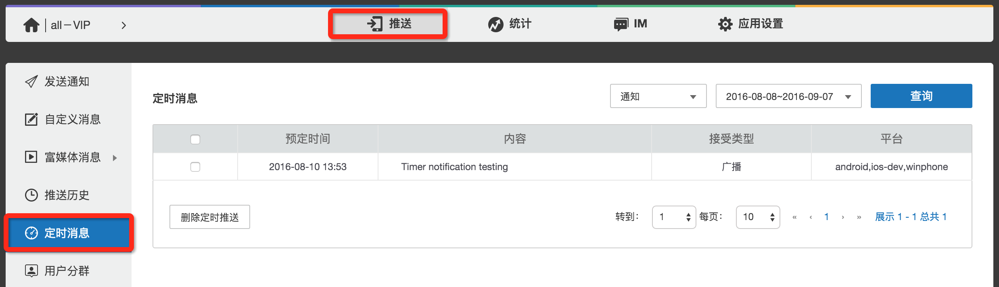

### 定速推送

定速推送时长(分钟)，在应用的“推送”模块，点击定速推送    
该功能对应 Rest API - Push - options 可选参数 - [big_push_duration 字段](https://docs.jiguang.cn/jpush/server/push/rest_api_v3_push/#options)
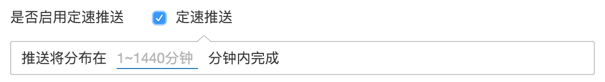

## 用户分群

路径：选择应用－>推送－>用户分群－>创建用户分群  
用户分群可设置：标签、地理位置、活跃用户、系统版本、智能标签中的一个或多个条件；  
用户分群的名称为必填项，在控制台向用户分群发送时使用名称；  
用户分群的 ID 是在创建之后生成的，调用 API 时可在 [Audience](https://docs.jiguang.cn/jpush/server/push/rest_api_v3_push/#audience) 中指定该 ID 进行推送；  
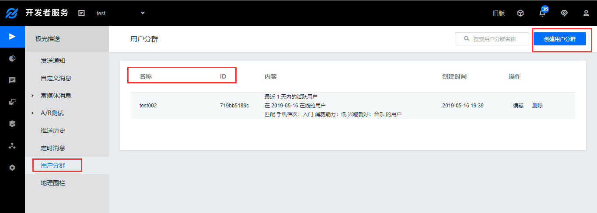
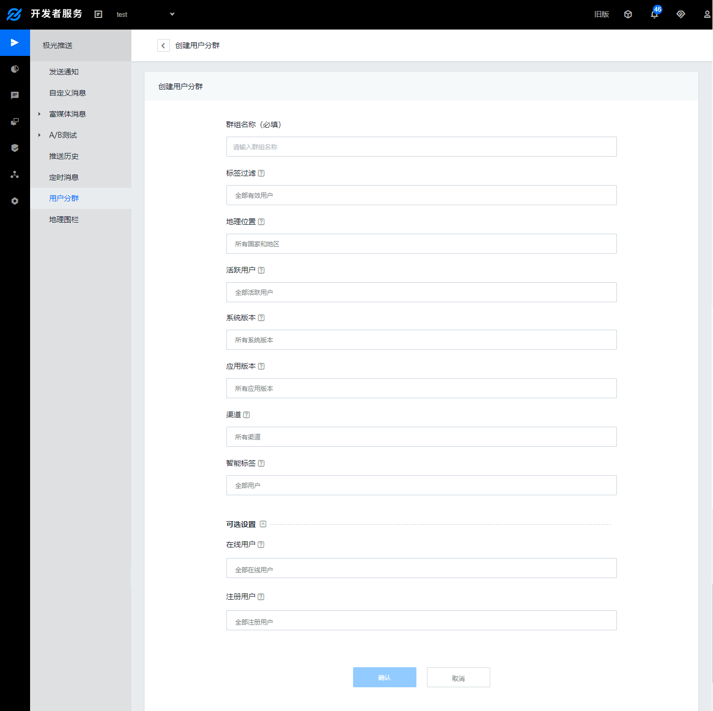

## 统计与报表说明

### 查看报表  
JPush 的 Web 上提供了多种应用级别的统计数据。如下图所示，用户在登录 JPush 帐号，并选择了具体的应用后，可以在顶部导航条内选择“统计”

#### 选择报表类型  
JPush 统计包括：推送统计、用户统计、API 统计、活跃分析、在线留存率、用户分群统计、设备信息统计、排行统计、地区分布、错误列表、流失分析、回访分析  
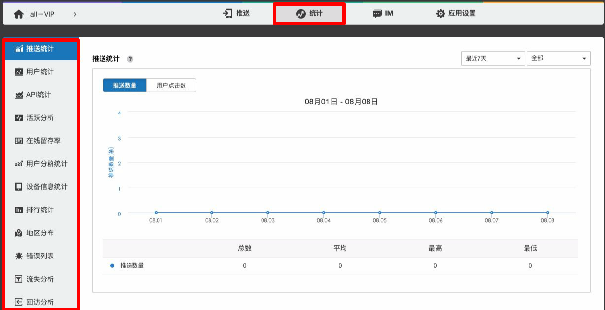

### 选择统计时间  
可以在报表右上角选择统计的时间范围，也可以自定查询范围，具体统计周期如下图所示。单位粒度依次为：小时，天，月。  
例：如果选择“昨天”，那么报表呈现的数据是以小时为单位；如果选择“最近 7 天”，那么报表呈现的数据则是以天为单位。  
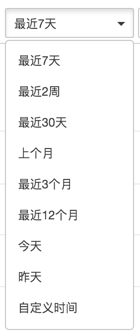

## 统计项说明

### 推送统计  
推送报表呈现“推送数量”和“用户点击”情况,部分统计效果需要实现 [推送效果反馈 API](../client/Android/android_api/#api_4)。

**送达数量**  
Android 用户实际收到推送的数量合计，该数量包括：通过 Portal 发出的，以及通过 API 发出的。包括通知，也包括自定义消息。

```
iOS 与 Window Phone 系统由于原理不同，此曲线显示的为正确送达到 APNS 和 MPNS 的统计。
```

**用户点击数**  
用户通过点击通知栏消息进入应用的次数。

```
对于 Android 应用，需要实现了统计分析 API 才有这个统计数据。
```

### 用户统计

**新增用户**  
“新增用户”是指新增的 JPush 注册用户。当应用第一次启动时，JPush SDK 会向 JPush 发起内部注册。

iOS 系统如果用户在首次使用时选择「禁用推送」：

+ 若使用的 JPush iOS SDK 版本低于 3.0.9 且（iOS 系统版本低于 iOS 10 或获取不到 DeviceToken），则不计入新增用户统计；

+ 若使用的 JPush iOS SDK 版本是 3.0.9 及以上，禁用推送或获取不到 DeviceToken 不影响新增统计，建议升级。


**在线用户**  
“在线用户”是指统计周期与 JPush Server 建立网络连接成功的用户总数。统计时间连接过一次，则计入该统计项目，同一用户多次连接不重复计算。

**活跃用户**  
“活跃用户” 是指统计时间内至少打开一次应用的用户总数。活跃用户与在线用户的区别是，活跃必须是用户打开过应用而在线用户是用户侧有网络与 JPush 保持连接。

```
Android 系统，需要实现推送效果反馈 API 才可以统计到活跃用户。
```

### API 统计

**API 统计**  
统计时长内调用 Push API 的总次数。注：API 次数不同于消息数，一次广播推送与一次别名推送均为 1 次 API 调用。

### 活跃分析

**推送数量**  
定义同上，这里主要用作对比曲线，用来衡量推送后的用户活跃效果

**用户打开次数**  
所有用户打开应用的次数合计。该指标可用于观测，是否随着推送数量的增加，用户打开应用更多了。

```
 Android 系统，需要实现了推送效果反馈 API 才有此统计数据。
```

**用户使用时长（分钟）**  
所有用户使用应用的时长合计。该指标可用于观测，是否随着推送内容的不同，用户使用应用的时间更长。

```
 Android 系统，需要实现了推送效果反馈 API 才有此统计数据。
```
#### 在线留存率  
某段时间内新增的，过了一段时间以后仍然还在与 JPush 服务器有连接的用户，称为留存用户。留存用户占当时新增用户的比例称为留存率。“在线留存率“”可以更真实的反映用户的用户留存情况。

```
注意：JPush 的留存用户定义是在线用户，即与服务器仍然有连接的用户（可以是不打开应用只后台在线）。
此定义不同于其他根据用户活跃统计的“活跃留存率”，由于 iOS 平台机制用户打开应用才可能在线所以此留存约等于“活跃留存”
```

例如：日留存。某一天新增的用户数为 100，在 3 天后这 100 个用户中依然在线的用户数为 50，那么这天新增用户的 3 天留存率为 50%。

[0]: image/report_functions.png
[1]: image/report_functions2.png

## 短信验证码

### 数据概览
路径：选择应用－>短信验证码－>数据概览  
短信余量：剩余可发送的短信条数，这里的余量是该账号下所有应用可发送短信条数的总和；  
短信发送量：今日发送短信量、本月发送短信量、上月发送短信量，这里的发生量是该应用的使用量；

### 发送纪录

路径：选择应用－>短信验证码－>发送纪录；  
当前应用发送的所有短信验证码的纪录，支持手机号、时间查询；