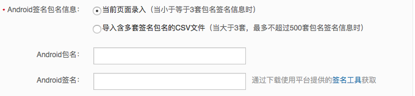
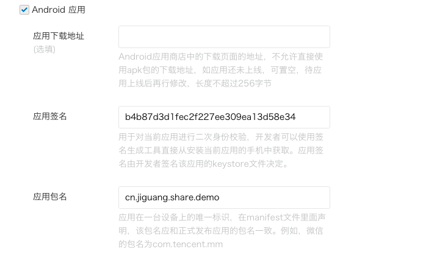

#Android SDK FAQ

##第三方平台的 appkey 和签名，包名怎样对应
由于申请新浪微博和微信的 appkey 和 secret 时，需要填写应用的签名和包名，如下： 
填写新浪微博的签名包名信息：
 
填写微信的签名包名信息
 
所以，SinaWeibo 和 WeChat 的 appkey 是跟包名，签名一一对应的，因此在程序的 build.gradle 文件里配置的签名文件要与 JGShareSDK.xml 里配置的第三方平台 appkey 和程序的包名是一一对应的。 

##微信分享后没有回调？
检查 AndroidMmanifest.xml 文件里配置的 package 包名和微信回调配置；

	
	<!-- Optional 微信分享回调-->
        < activity
            android:name=".wxapi.WXEntryActivity"
            android:exported="true" />
	

微信回调的 name 字段所指的 wxapi 必须在包名（package）目录下；如果 wxapi 所在的路径不在包名（package）目录下，则没有回调。